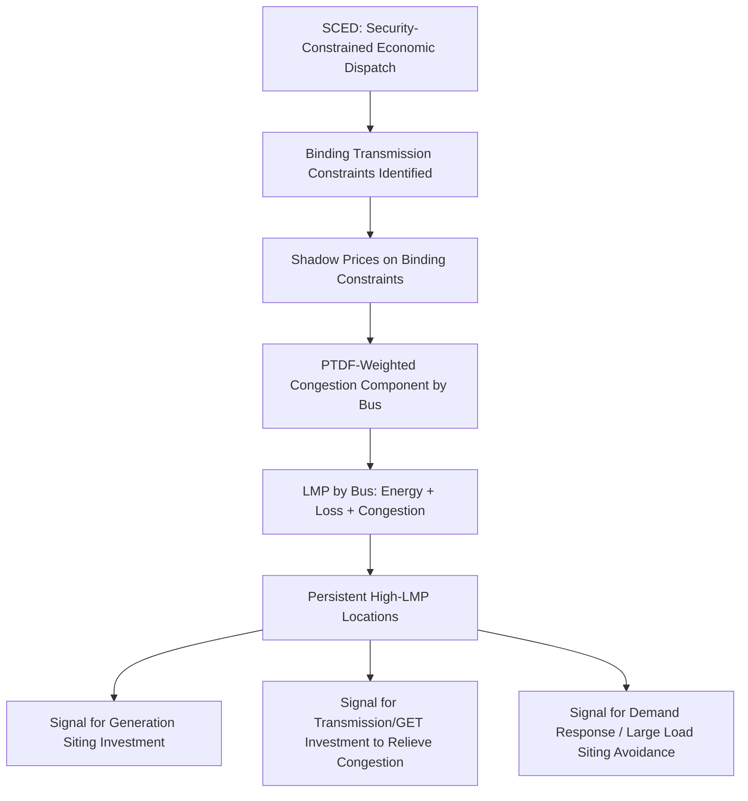

## Locational Marginal Pricing

### Definition and Conceptual Foundation

Locational Marginal Pricing (LMP) is the wholesale electricity pricing methodology used by most organized U.S. electricity markets (as introduced in the Regulated versus Restructured Market Structures entry) in which the market-clearing price of electricity varies by physical location on the grid, rather than clearing at a single uniform system-wide price. Formally, the LMP at a given location is defined as the marginal cost of supplying the next increment of electricity demand at that specific location, given the full set of generation offers, the current system topology, and all binding transmission and operational constraints.

**Key Points**

- LMP is the direct pricing-side counterpart to the physical power flow and congestion concepts introduced in the Transmission Topology Optimization entry earlier in this domain: LMP divergence across locations is the market's price signal reflecting exactly the kind of thermal congestion and loop-flow physics discussed there
- Under uncongested, lossless conditions, LMPs across all locations in a market would converge to a single system-wide marginal price; the decomposition into location-specific prices arises specifically from transmission losses and congestion, making LMP simultaneously a pricing mechanism and a diagnostic signal of where and how severely the transmission system is constrained
- LMP is calculated as an output of the security-constrained economic dispatch (SCED) process introduced in the Regulated versus Restructured Market Structures entry, meaning LMP and dispatch are determined jointly within the same optimization rather than as separate sequential steps

### Mathematical Decomposition

The LMP at bus $i$ is conventionally decomposed into three additive components:

$$LMP_i = MEC + MLC_i + MCC_i$$

where $MEC$ is the Marginal Energy Component (the system-wide marginal cost of energy absent losses or congestion, equal to the offer price of the marginal generator serving system-wide load), $MLC_i$ is the Marginal Loss Component at bus $i$ (reflecting the marginal cost of transmission losses associated with delivering power to that specific location), and $MCC_i$ is the Marginal Congestion Component at bus $i$ (reflecting the shadow price of binding transmission constraints between the marginal generation and that location).

**Marginal Congestion Component Derivation**

The congestion component at bus $i$ is derived from the shadow prices (Lagrange multipliers) of the binding transmission constraints in the underlying optimal power flow formulation, combined with the Power Transfer Distribution Factors (PTDF) introduced in the Transmission Topology Optimization entry:

$$MCC_i = \sum_{k} PTDF_{k,i} \cdot \mu_k$$

where $\mu_k$ is the shadow price (marginal value of relaxing the constraint by one unit) of binding transmission constraint $k$, and $PTDF_{k,i}$ is the sensitivity of flow on constrained element $k$ to a unit injection change at bus $i$. This formulation directly reuses the same PTDF sensitivity factor methodology discussed in the Transmission Topology Optimization entry's security-constrained formulation, here applied to price calculation rather than switching decision screening.

**Key Points**

- When no transmission constraints are binding, all $\mu_k = 0$, all $MCC_i = 0$, and LMP converges to the system-wide marginal energy price everywhere (adjusted only for the smaller loss component) — congestion is what creates locational price divergence
- The sign and magnitude of a given location's congestion component depends on that location's PTDF relationship to the binding constraint: locations whose injection would relieve the constraint (negative PTDF relative to the constraint direction) see a lower LMP, while locations whose injection would worsen the constraint see a higher LMP, which is the economic mechanism by which LMP creates locational price signals that incentivize generation investment and demand response precisely where they would help relieve congestion
- The loss component, while typically smaller in magnitude than the congestion component during binding-constraint conditions, follows an analogous marginal-cost logic based on the incremental transmission losses associated with delivering power to a specific location, which vary with system loading and topology

### Illustrative Example

Consider a simplified two-bus system: Bus A hosts low-cost generation ($30/MWh marginal offer) and Bus B hosts higher-cost generation ($50/MWh marginal offer), connected by a single transmission line with a binding thermal limit that prevents Bus A's cheaper generation from fully serving Bus B's load. Under these congested conditions:

- The marginal energy component reflects the least-cost generation that can serve the *marginal* increment of system load without violating the constraint
- If the Bus A–B line is fully loaded at its thermal limit, serving one additional MW of load at Bus B requires dispatching Bus B's more expensive local generation (since additional power cannot flow across the constrained line from Bus A), making Bus B's LMP $50/MWh
- Simultaneously, Bus A's LMP may settle below $50/MWh (potentially near its own $30/MWh offer, adjusted for any relevant loss component) since Bus A's cheap generation is constrained from fully reaching Bus B and the local marginal cost at Bus A reflects what it would cost to serve one additional MW of load located at Bus A itself
- This price divergence — Bus B paying more than Bus A for the same commodity, purely due to the binding transmission constraint between them — is precisely the situation that Transmission Topology Optimization, HTLS reconductoring, or Ambient-Adjusted/Dynamic Line Ratings (all covered earlier in this curriculum) are deployed specifically to relieve: each of those grid-enhancing technologies works by increasing the effective transfer capability of the constrained path, which would reduce or eliminate the congestion component and converge the two buses' LMPs closer together, directly reducing the total cost of serving system load

### LMP as a Congestion and Infrastructure Investment Signal

**Key Points**

- Persistent, predictable congestion patterns (rather than occasional, weather-driven spikes) at a specific location send an economic signal that can justify targeted infrastructure investment — connecting LMP directly to the economic case for the Transmission Topology Optimization, HTLS Reconductoring, and Ambient-Adjusted/Dynamic Line Rating technologies covered earlier in this curriculum, since the value of relieving a specific congestion pattern can, in principle, be quantified as the reduction in total system production cost (or the convergence of previously divergent LMPs) that the investment would achieve
- LMP also functions as a locational signal for new generation investment (favoring high-LMP, import-constrained locations) and, as discussed in the Large-Load Interconnection content, can factor into large-load siting decisions, since a facility located in a persistently congested, high-LMP area faces structurally higher energy costs than an otherwise-identical facility in a less congested location
- Financial Transmission Rights (FTRs) — a hedging instrument not detailed further here but commonly paired with LMP markets — allow market participants to hedge against the locational price divergence (specifically the congestion component) that LMP produces between two points, providing a market-based mechanism for managing congestion cost risk

### Relationship to Grid-Enhancing Technologies and Large-Load Siting

**Key Points**

- The Grid-Enhancing Technologies covered in this curriculum's transmission chapter (topology optimization, HTLS reconductoring, ambient-adjusted and dynamic line ratings) are, from a market economics perspective, tools for relieving the specific transmission constraints that generate the congestion component of LMP; their economic justification in restructured markets can be evaluated directly in terms of congestion cost reduction, providing a market-based valuation framework that complements the reliability-based justification (avoiding thermal violations) discussed in those earlier entries
- Large-load interconnection and siting decisions, discussed extensively in the prior chapter, interact directly with LMP: a large load's energy cost exposure depends on the LMP at its specific interconnection point, meaning transmission constraint patterns (and the effectiveness of any deployed GETs in relieving them) directly affect a large load's ongoing operating economics, not just its initial interconnection feasibility and timeline
- Behind-the-meter generation and curtailable interconnection arrangements, also discussed in the prior chapter, can be understood partly as large-load customer strategies for managing LMP exposure and volatility risk, alongside their primary role in managing interconnection capacity and timeline constraints

### Risk Considerations and Limitations

- **Zonal versus nodal LMP granularity varies by market**: [Inference] Not all organized markets calculate and settle LMP at full nodal (individual bus) granularity; some markets or specific settlement processes use zonal aggregation for certain purposes, and the specific granularity used for a given market's day-ahead versus real-time settlement, and for specific customer classes, should be verified against that market's current business practice manuals rather than assumed uniform
- **LMP volatility and forecasting difficulty**: Because LMP depends on the joint outcome of generation offers, load, and topology/constraint conditions that can shift rapidly (unplanned outages, weather-driven demand or renewable output swings), locational price signals can be considerably more volatile than a simplified illustrative example suggests, complicating both short-term operational decision-making and longer-term investment signal interpretation
- **Market power and mitigation considerations** [Unverified]: In transmission-constrained areas with few generation owners able to serve local load, LMP-based congestion pricing can create conditions conducive to the exercise of local market power (a generator with a monopoly position within a constrained area pricing above competitive levels); RTOs/ISOs operate market monitoring and mitigation functions specifically to address this risk, and the specific mitigation mechanisms and their current effectiveness are an area of ongoing market design attention that varies by market
- **Congestion cost allocation debates**: The specific mechanism by which total congestion revenue collected by the RTO/ISO (arising from the difference between what load pays and what generation is paid at their respective LMPs) is allocated or refunded to market participants, and how FTR/hedging instrument design interacts with this allocation, involves market design choices that have been subject to ongoing stakeholder debate and are not addressed in the simplified two-bus illustration above

**Next Steps**

- Financial Transmission Rights (FTRs): Structure, Valuation, and Hedging Applications
- Nodal versus Zonal Market Design: Comparative Approaches Across RTOs/ISOs
- Market Power Mitigation Mechanisms in Congested Transmission Areas
- Congestion Revenue Allocation and Auction Revenue Rights Design
- Economic Valuation Methodology for Grid-Enhancing Technology Investment Using LMP Convergence
- Real-Time versus Day-Ahead LMP Divergence and Virtual Bidding