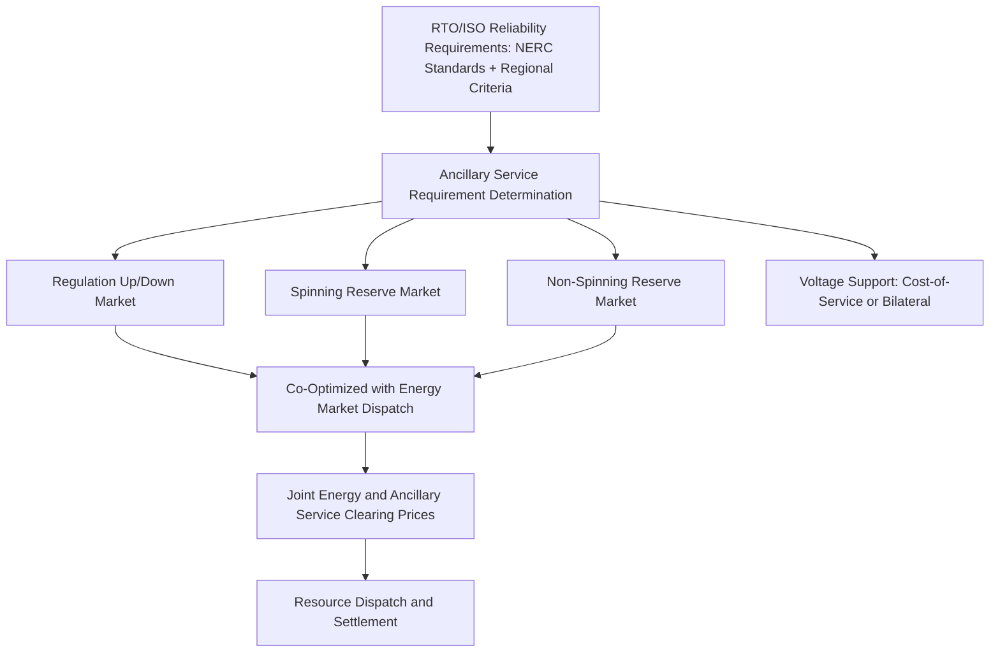

## Ancillary Services Markets

### Conceptual Foundation

Ancillary services are the set of grid support functions, beyond the delivery of bulk energy itself, required to maintain reliable power system operation — most fundamentally, maintaining the continuous real-time balance between generation and load (since electricity cannot be stored economically at scale in most systems, at least not without dedicated storage assets) and preserving system voltage and frequency within acceptable operating bounds. In restructured markets (per the Regulated versus Restructured Market Structures entry), these services are frequently procured through organized, market-based mechanisms operated by the RTO/ISO, in parallel with but distinct from the energy market and LMP-based energy pricing discussed in the Locational Marginal Pricing entry; in vertically integrated regions, the analogous functions are typically provided through the utility's own generation fleet and operating reserves obligations rather than a competitive market.

**Key Points**

- Ancillary services markets exist because energy market participation alone (being paid for MWh delivered) does not, by itself, adequately compensate resources for the distinct capability of being available to rapidly increase or decrease output, or to provide voltage/frequency support, which are operationally necessary but economically distinct products from bulk energy delivery
- The specific ancillary service product definitions, market designs, and even terminology vary meaningfully across RTOs/ISOs, more so than the broadly common SCED/LMP energy market framework discussed in the Locational Marginal Pricing entry; the categories described below represent commonly recognized functional categories rather than a universally standardized product taxonomy
- NERC (the North American Electric Reliability Corporation) reliability standards establish baseline requirements for many of these functions (particularly frequency response and operating reserves) that apply across the interconnection regardless of whether a given region procures the service through an organized market or a vertically integrated utility's internal operations

### Frequency Regulation

**Function**

Frequency regulation addresses the continuous, second-to-second and minute-to-minute mismatches between generation and load that cause system frequency to deviate from its nominal value (60 Hz in North America). Because generation and load must be instantaneously balanced (any imbalance causes a resulting frequency deviation determined by the physical inertia and governor response characteristics of connected rotating generation), regulation resources continuously and automatically adjust output in response to an Automatic Generation Control (AGC) signal issued by the system operator.

- **Regulation Up / Regulation Down**: Resources capable of rapidly increasing (regulation up) or decreasing (regulation down) output in response to the AGC signal, procured as a distinct market product from energy in most organized markets
- **Response speed and accuracy requirements**: Regulation resources must respond within tight timeframes (typically on the order of a few minutes for full range, with continuous fine adjustment throughout) and are increasingly evaluated on a "mileage" or performance-based metric reflecting how accurately and responsively a resource tracks the AGC signal, not merely whether it eventually reaches the requested output level

**Key Points**

- Battery storage resources have become increasingly prominent regulation providers in a number of markets given their very fast, precise response capability relative to traditional thermal generation, whose response is limited by physical ramping constraints of turbines/boilers; this connects to the storage-based flexibility concepts discussed in the V2G entry's frequency regulation discussion in the EV Integration chapter, where aggregated bidirectional EV batteries were noted as a conceptually similar fast-response resource
- Performance-based regulation compensation (paying more for resources that track the AGC signal more accurately, rather than simply for capacity made available) has been an area of market design reform in a number of jurisdictions specifically to better value and incentivize fast, accurate response, though the specific compensation formula and its regulatory history (in the U.S., connected to FERC Order 755 addressing pay-for-performance regulation compensation) varies by market

### Operating Reserves

**Function**

Operating reserves are generation (or increasingly, demand response and storage) capacity held available, but not currently dispatched to serve load, specifically to respond to unexpected system contingencies — most critically, the unplanned loss of a large generator or transmission element — restoring generation-load balance faster than the routine regulation product is designed to handle.

- **Spinning reserve**: Reserve capacity from resources already synchronized to the grid (generators already running, even if below full output) that can increase output within a short timeframe (commonly within 10 minutes, though specific timing requirements vary by market/region) in response to a contingency
- **Non-spinning (supplemental) reserve**: Reserve capacity from resources not currently synchronized to the grid but capable of starting and reaching full output within a somewhat longer timeframe (commonly within 10-30 minutes depending on market definition), providing a second line of contingency response behind spinning reserve
- **Reserve requirement sizing**: Typically sized based on a defined reliability criterion, commonly related to the loss of the single largest in-service generator or transmission element (connecting conceptually to the N-1 contingency criterion discussed extensively in the Transmission Topology Optimization entry's security-constrained formulation), ensuring the system retains sufficient reserve to withstand its most severe credible single contingency without cascading into a broader reliability event

**Key Points**

- Operating reserves and the N-1 security criterion are two expressions of the same underlying reliability philosophy — maintaining sufficient system margin to withstand a defined worst-case credible contingency — applied respectively to generation adequacy (reserves) and transmission thermal/voltage limits (the security-constrained dispatch and topology considerations discussed earlier in this domain)
- The specific reserve product names, quantities, and response-time requirements vary by RTO/ISO, and some markets further subdivide reserves into additional categories (e.g., contingency reserve subdivisions, or reserves specifically procured to address renewable generation forecast uncertainty) beyond the two broad categories described here

### Voltage Support / Reactive Power

**Function**

Maintaining acceptable voltage levels across the transmission and distribution system requires management of reactive power (the component of power flow associated with the magnetic and electric fields in AC systems, distinct from the real power that performs useful work), which is provided by generators (through their excitation systems), dedicated reactive power devices (capacitor banks, reactors, and the FACTS devices referenced in the Transmission Topology Optimization entry's discussion of complementary grid-enhancing technologies), and increasingly by inverter-based resources (solar, wind, battery storage) with reactive power capability built into their power electronics.

- Unlike frequency regulation and operating reserves, voltage support is fundamentally a local/locational service — reactive power does not travel efficiently over long transmission distances, meaning voltage support requirements and the resources capable of providing them are inherently tied to specific locations on the grid, in contrast to frequency regulation which is a system-wide balancing function
- [Inference] Because of this locational characteristic, voltage support is less commonly organized as a competitive, liquid market product compared to frequency regulation and operating reserves, and is more frequently procured through cost-of-service compensation, must-offer/must-run obligations, or bilateral arrangements specific to the generators or devices capable of providing support at a given constrained location; the specific procurement mechanism varies by market and should be verified against current market rules for precise characterization

### Ancillary Services Market Architecture

**Key Points**

- Energy and ancillary service markets in most organized U.S. markets are co-optimized — cleared jointly within the same SCED-based optimization discussed in the Locational Marginal Pricing entry, rather than as fully separate sequential processes — because a generator's capacity is fundamentally shared between the energy and reserve products it might provide (a MW held in reserve is a MW not available to sell as energy), making joint optimization economically necessary to correctly value and allocate resources across both product types
- This co-optimization means ancillary service prices and energy (LMP) prices are jointly determined and can interact: during tight system conditions where reserve requirements bind against available capacity, both energy and reserve prices can rise together, reflecting the shared underlying capacity constraint

### Emerging Resource Participation

Given the increasing prominence of inverter-based and fast-responding resources across multiple contexts discussed in this curriculum, ancillary services markets have seen evolving participation rules and product definitions:

- **Battery storage**: As noted above, particularly well-suited to fast-response regulation given power-electronics-based response speed; storage resources can also provide spinning-reserve-equivalent contingency response, though the duration-limited nature of battery storage (energy capacity, not just power capacity) introduces a distinct constraint not present for traditional thermal spinning reserve, requiring market rules to appropriately account for the resource's limited sustained-output duration
- **Aggregated demand response**: Distributed demand-side resources, aggregated to meet minimum market participation thresholds, participating in reserve and, in some markets, regulation products — conceptually connecting to the aggregated V2G and managed EV charging flexibility resources discussed extensively in the EV Integration chapter, where aggregated bidirectional EV batteries were specifically noted as a candidate ancillary service resource
- **Inverter-based renewable resources**: Modern wind and solar facilities' power electronics increasingly support reactive power and, with appropriate curtailment/headroom management, certain reserve-like and fast-frequency-response capabilities, though [Unverified] the extent to which specific markets have developed participation rules enabling renewable resources to fully monetize these capabilities varies and is an area of ongoing market design development

### Risk Considerations and Limitations

- **Product definitions are market-specific**: As emphasized throughout, the specific names, technical requirements, and market rules for ancillary service products differ meaningfully across RTOs/ISOs; generalized descriptions in this entry should be supplemented with the specific business practice manuals or tariff documents of the relevant market for any application requiring precision
- **Evolving resource mix creates ongoing market design challenges**: [Inference] The increasing participation of inverter-based and storage resources, with fundamentally different technical characteristics (duration limits, different response dynamics) than the traditional thermal generation these markets were originally designed around, has driven and continues to drive substantial market rule evolution across most U.S. markets, meaning current ancillary service market rules in any specific region should be treated as a point-in-time snapshot rather than a stable long-term reference
- **Reliability standard compliance versus market design are related but distinct**: NERC reliability standards establish minimum requirements that apply regardless of market structure, while the specific market mechanism (if any) used to procure and compensate the resources meeting those requirements is a separate regional/market design choice; conflating the two can lead to incorrect assumptions about whether a given reliability function is market-priced or is provided through a different (e.g., cost-of-service or mandatory must-offer) mechanism in a specific region
- **Interaction with large-load and data center demand growth**: [Inference] The load growth pressures discussed extensively in the prior chapter's Large Loads and Data Centers content, combined with the AI training load volatility considerations discussed there, may have implications for future ancillary service requirement sizing (e.g., whether large, potentially volatile loads warrant reconsideration of reserve or regulation requirement calculations), though this is a forward-looking and evolving consideration that should be assessed against current market and reliability-standard developments rather than treated as an established current practice

**Next Steps**

- FERC Order 755 and Performance-Based Regulation Compensation Design
- NERC Reliability Standards Governing Frequency Response and Operating Reserves
- Co-Optimization Algorithm Design for Joint Energy and Ancillary Service Clearing
- Battery Storage Participation Rules and Duration-Limited Resource Accounting in Reserve Markets
- Reactive Power and Voltage Support Procurement Mechanisms Across RTOs/ISOs
- Inverter-Based Resource Ancillary Service Capability and Market Rule Development