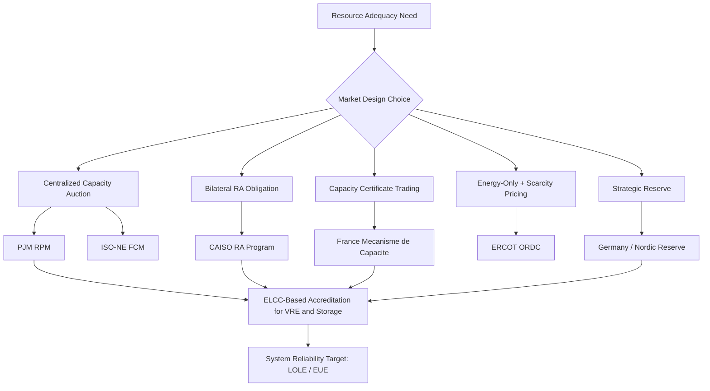

## Capacity Markets and Resource Adequacy Mechanisms

### Overview

Capacity markets and resource adequacy (RA) mechanisms are regulatory and market constructs designed to ensure that sufficient electric generation, demand response, and storage resources exist to reliably meet future peak demand plus a margin for uncertainty. They address a structural weakness of energy-only markets: revenue from selling energy ($/MWh) alone may not provide investors enough certainty or return to justify building or retaining capacity that is only needed during rare peak or contingency events ("missing money problem").

### The Resource Adequacy Problem

**Key Points**

- Electricity cannot be economically stored at scale in most systems (excluding batteries/pumped hydro at limited penetration), so supply must equal demand instantaneously.
- Generation and demand response capacity must be sufficient to cover peak load plus reserve margins for forced outages, forecast error, and extreme weather.
- In an idealized energy-only market, scarcity pricing during tight supply conditions (prices rising to the Value of Lost Load, VOLL) would theoretically provide enough revenue to incentivize adequate investment.
- In practice, regulatory price caps, market power mitigation rules, and political intolerance for extreme price spikes suppress scarcity pricing, causing the "missing money" problem: peaking and flexible resources cannot recover their fixed costs from energy and ancillary service revenues alone.
- This creates a "make-whole" investment gap that capacity markets or equivalent mechanisms attempt to fill.

**Missing Money Problem — Formalization**

The theoretical revenue a generator needs to be economically viable is:

$$\text{Net Revenue} = \sum_{t} (P_t - c_t) \cdot q_t - FC$$

where $P_t$ is the market price at hour $t$, $c_t$ is short-run marginal cost, $q_t$ is output, and $FC$ is annualized fixed cost. Under price caps or conservative operating reserve demand curves, the sum of $(P_t - c_t)$ during scarcity hours (which should approach VOLL) is truncated, leaving:

$$\sum_{t} (P_t - c_t) \cdot q_t < FC$$

This shortfall is the "missing money" that capacity markets are designed to make up through a separate capacity payment, typically expressed in $/kW-year or $/MW-day.

### Resource Adequacy Mechanism Taxonomy

**Key Points — Broad Categories**

1. **Energy-only markets with scarcity pricing** (e.g., ERCOT in Texas) — no explicit capacity market; relies on high price caps (historically up to $9,000/MWh) and an Operating Reserve Demand Curve (ORDC) to signal scarcity value.
2. **Centralized capacity markets** (e.g., PJM's Reliability Pricing Model, ISO-NE's Forward Capacity Market) — an independent system operator (ISO) runs an auction to procure capacity 1–3 years ahead of the delivery year.
3. **Bilateral/decentralized capacity obligations** (e.g., France's Mécanisme de Capacité) — retailers or load-serving entities (LSEs) must individually procure certificates equal to their share of system peak demand, traded in a secondary market.
4. **Resource Adequacy requirements without a formal market** (e.g., CAISO's RA program in California) — LSEs must demonstrate bilateral contracts for qualifying capacity to meet CPUC/CAISO-set requirements; no centralized clearing auction (though a backstop procurement exists).
5. **Strategic reserves** (e.g., some German and Scandinavian designs) — a small, separately contracted reserve of capacity held outside the main market, dispatched only in emergencies, intended to preserve energy-market price signals for the rest of the fleet.

### Centralized Capacity Market Mechanics (PJM RPM Model)

**Key Points**

- **Base Residual Auction (BRA):** Conducted roughly 3 years before the delivery year, procuring the majority of capacity.
- **Incremental Auctions:** Held closer to the delivery year to true-up procurement as load forecasts and generation availability are refined.
- **Variable Resource Requirement (VRR) Curve:** A downward-sloping demand curve (not a fixed vertical demand quantity) representing the ISO's willingness to pay more for capacity as available supply falls below the target reserve margin, and less as it exceeds it. This smooths price volatility relative to a vertical (perfectly inelastic) demand curve.
- **Net Cost of New Entry (Net CONE):** The annualized cost of building a new reference generating unit (often a combustion turbine) minus expected net energy and ancillary service revenue. This anchors the VRR curve's price axis.
- **Installed Reserve Margin (IRM):** The target percentage above expected peak load that the system aims to procure, derived from a target Loss of Load Expectation (LOLE), commonly 0.1 days/year (i.e., "1 day in 10 years").
- **Capacity Performance / Must-Offer obligations:** Resources clearing the auction incur penalties for non-performance during system emergencies, aligning incentives toward actual availability rather than nameplate capacity alone.

**VRR Curve — Conceptual Diagram (svg_diagram)**

<ns0:svg xmlns:ns0="[http://www.w3.org/2000/svg" viewBox="0 0 700 420">](http://www.w3.org/2000/svg%22%3E)

<ns0:text x="350" y="25" text-anchor="middle" font-size="16" font-weight="bold">Variable Resource Requirement Curve (svg_diagram)</ns0:text>

<ns0:line x1="80" y1="370" x2="650" y2="370" stroke="black" stroke-width="2" />

<ns0:line x1="80" y1="370" x2="80" y2="50" stroke="black" stroke-width="2" />

<ns0:text x="360" y="405" text-anchor="middle" font-size="13">Capacity Quantity (MW)</ns0:text>

<ns0:text x="30" y="210" text-anchor="middle" font-size="13" transform="rotate(-90 30 210)">Clearing Price ($/MW-day)</ns0:text>

<ns0:path d="M 120 80 Q 300 100 380 220 Q 460 320 600 350" stroke="#1a5276" stroke-width="3" fill="none" />

<ns0:line x1="380" y1="370" x2="380" y2="50" stroke="#888" stroke-dasharray="4,4" />

<ns0:text x="385" y="65" font-size="11">IRM Target</ns0:text>

<ns0:line x1="80" y1="220" x2="380" y2="220" stroke="#888" stroke-dasharray="4,4" />

<ns0:text x="90" y="215" font-size="11">Net CONE</ns0:text>

<ns0:circle cx="380" cy="220" r="5" fill="#c0392b" />

<ns0:text x="150" y="120" font-size="11">Higher price when</ns0:text>

<ns0:text x="150" y="135" font-size="11">supply is scarce</ns0:text>

<ns0:text x="470" y="330" font-size="11">Price falls as surplus</ns0:text>

<ns0:text x="470" y="345" font-size="11">capacity increases</ns0:text>

</ns0:svg>

### Resource Adequacy Metrics and Probabilistic Reliability

**Key Points**

- **Loss of Load Expectation (LOLE):** The expected number of days per year (or hours per year, LOLH) in which available generation is insufficient to meet demand, computed via probabilistic simulation combining forced outage rates, load forecast uncertainty, and unit availability.
- **Loss of Load Probability (LOLP):** The probability, for a given hour or day, that available capacity is less than load.
- **Expected Unserved Energy (EUE):** The expected MWh of demand that cannot be served annually; increasingly favored over LOLE because it captures the magnitude, not just frequency, of shortfall events.
- **Effective Load Carrying Capability (ELCC):** A metric quantifying how much a specific resource (particularly variable renewables like wind/solar or limited-duration storage) contributes to reliability relative to a "perfect" (always-available) resource of the same nameplate capacity. ELCC is central to modern capacity accreditation because a 100 MW solar plant does not contribute 100 MW of firm capacity value, especially not during evening peak hours after sunset.

**ELCC — Conceptual Formula**

$$\text{ELCC} = \frac{\Delta(\text{Perfect Capacity Needed to Maintain Target LOLE})}{\text{Nameplate Capacity of Resource}}$$

Practically, ELCC is computed by running a reliability model twice — once with the candidate resource and once with an equivalent-cost "perfect capacity" resource — and comparing how much perfect capacity would be needed to achieve the same LOLE, then expressing the actual resource's contribution as a fraction of nameplate. ELCC values decline with increasing penetration (diminishing marginal reliability value), a critical consideration as wind, solar, and battery storage penetration grows.

### Capacity Accreditation Approaches

**Key Points**

1. **Installed Capacity (ICAP) accreditation** — resources credited at nameplate or a simple derate factor; simplest but least accurate for variable resources.
2. **Unforced Capacity (UCAP) accreditation** — nameplate capacity adjusted for historical Equivalent Forced Outage Rate (EFORd), commonly used for thermal units.

$$UCAP = ICAP \times (1 - EFORd)$$

3. **ELCC-based accreditation** — used for wind, solar, and storage in markets like PJM, MISO, and CAISO, reflecting marginal reliability contribution, particularly during net-peak (post-solar-sunset) hours.
4. **Duration-limited storage accreditation** — batteries (typically 2–4 hour duration) receive declining ELCC as their share of the resource mix grows, because sequential batteries begin to "run out" of energy during multi-hour net-peak periods once earlier batteries have already discharged.

### Market Design Variants — Comparative Table

| Mechanism | Region Example | Procurement Timing | Price Formation | Key Characteristic |
| --- | --- | --- | --- | --- |
| Centralized Capacity Auction | PJM (RPM), ISO-NE (FCM) | 1–3 years forward | VRR demand curve auction | Transparent price; system-wide co-optimization |
| Bilateral Capacity Obligation | CAISO (RA Program) | Annual/monthly bilateral contracts | Negotiated, no central clearing | Flexibility but less price transparency |
| Capacity Certificate Trading | France (Mécanisme de Capacité) | Multi-year forward + spot | Certificate market price | Decentralized obligation on suppliers |
| Strategic Reserve | Germany, Sweden (partial) | Separate tender | Reserve activation price, held outside main market | Preserves energy market signals |
| Energy-Only with ORDC | ERCOT (Texas) | None (real-time scarcity pricing) | Scarcity adder on top of energy price | No explicit capacity payment; relies on high price caps |

### Demand-Side and Storage Participation

**Key Points**

- **Demand Response (DR) as capacity:** Curtailable/interruptible load can bid into capacity auctions, receiving accreditation based on demonstrated performance during test events, often subject to stricter penalty regimes than generation.
- **Energy storage:** Participates as both a supply-side and demand-side resource; capacity accreditation depends on duration (a 4-hour battery is worth less capacity credit than an 8-hour battery as storage penetration rises, since it is more likely to be depleted during extended net-peak windows).
- **Aggregated Distributed Energy Resources (DERs):** Increasingly permitted to aggregate rooftop solar, batteries, and smart thermostats to bid as a single capacity resource (e.g., FERC Order 2222 in the U.S. mandates DER aggregator access to wholesale capacity and energy markets).

### Interaction with Energy and Ancillary Services Markets

**Key Points**

- Capacity markets are explicitly designed to complement, not replace, energy and ancillary services markets — the "missing money" concept implies capacity revenue fills the *residual* gap after expected energy/AS revenues.
- Net CONE calculations must forecast expected energy market revenue for the reference technology, making capacity market outcomes sensitive to energy market price assumptions, fuel price forecasts, and the pace of renewable buildout (which suppresses energy market prices and thus increases the missing-money gap, raising capacity prices).
- Minimum Offer Price Rules (MOPR) have historically been used in some U.S. markets (notably PJM) to prevent state-subsidized resources (e.g., nuclear or renewables receiving Zero Emission Credits) from bidding below their true cost into capacity auctions, which critics argue suppresses prices for unsubsidized resources; MOPR policy has been a persistent and contentious area of FERC litigation. [Unverified: current MOPR scope varies by market and is subject to ongoing FERC proceedings; verify current rules for the specific ISO/RTO in question.]

### Auction Clearing Example (Simplified Numerical Illustration)

**Example**

Assume a hypothetical ISO region with:

- Forecast peak load: 50,000 MW
- Installed Reserve Margin target: 15% → Target capacity: $50{,}000 \times 1.15 = 57{,}500$ MW
- Net CONE: $200/MW-day
- Available supply bids ranging from $50/MW-day (existing efficient units) to $350/MW-day (new peaking capacity)

If the VRR curve intersects the supply curve at 57,000 MW (slightly below target due to a supply shortfall relative to the reserve margin), the curve's shape (sloping upward as quantity falls below target) causes the clearing price to rise above Net CONE — for instance, clearing at $260/MW-day instead of $200/MW-day — sending an economic signal to attract new entry before the next delivery year. Conversely, if 60,000 MW of supply is offered (a surplus), the VRR curve's downward slope beyond the target reserve margin causes the price to fall well below Net CONE, signaling that some existing capacity may be economically retired.

### Criticisms and Design Challenges

**Key Points**

- **Boom-bust cycles:** Capacity markets can produce cyclical price patterns — high clearing prices attract new entry, which then floods the market and depresses prices, discouraging investment until scarcity returns.
- **Renewable and storage integration challenges:** ELCC-based accreditation is complex, contested by resource owners (who often argue their contribution is undervalued), and requires periodically re-run reliability studies as the resource mix and load shape change (e.g., electrification-driven winter peak growth).
- **Interstate/interregional seams:** Neighboring markets with different capacity constructs (e.g., a capacity market border with an energy-only market) can create arbitrage and reliability coordination challenges, particularly regarding imports/exports counted toward capacity obligations.
- **Climate risk correlation:** Traditional LOLE-based planning assumed independent unit outages; extreme weather (e.g., Winter Storm Uri in Texas 2021, Winter Storm Elliott in the eastern U.S. 2022) revealed correlated failure modes (fuel supply interruption, freezing equipment) not well captured by historical EFORd statistics, prompting a shift toward EUE and multi-day/multi-hour reliability metrics and cold-weather performance standards. [Inference: the pace and scope of resulting rule changes vary by ISO/RTO and are still evolving; confirm current standards for the relevant jurisdiction.]
- **Political and regulatory intervention risk:** Capacity market rules are subject to frequent regulatory litigation and redesign (e.g., FERC orders altering PJM's capacity construct multiple times over the past decade), creating investment uncertainty.

### Regional Capacity Construct Overview (Diagram)

### Next Steps

- **Related Topics:**
  - Locational Marginal Pricing (LMP) and Nodal Energy Markets
  - Ancillary Services Markets (Frequency Regulation, Spinning Reserves)
  - Effective Load Carrying Capability (ELCC) Modeling Methodologies
  - FERC Order 2222 and Distributed Energy Resource Aggregation
  - Minimum Offer Price Rule (MOPR) Litigation and Market Power Mitigation
  - Reliability Standards: NERC TPL and Resource Adequacy Planning Criteria
  - Extreme Weather Risk and Correlated Outage Modeling in Reliability Studies
  - Interregional Capacity Sharing and Seams Coordination