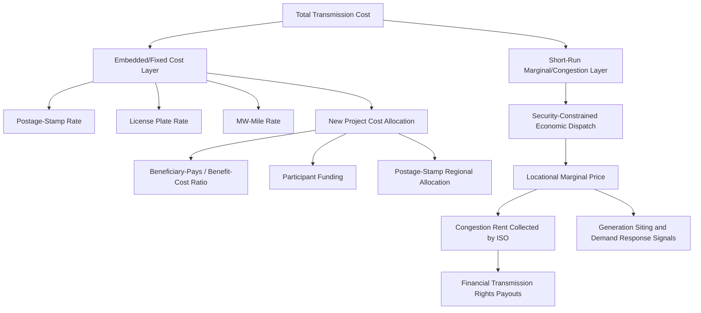

## Transmission Pricing and Cost Allocation

### Overview

Transmission pricing and cost allocation address two interrelated questions: how the fixed and variable costs of building, operating, and maintaining the transmission network should be recovered from those who use or benefit from it, and how prices should be structured to send efficient signals for grid usage, generation siting, and demand behavior. Unlike generation, transmission exhibits strong natural monopoly characteristics (high fixed costs, economies of scale, indivisibility), so its pricing is typically cost-of-service regulated rather than set by direct market competition, while still needing to interact coherently with competitive energy markets.

### Why Transmission Pricing Is Difficult

**Key Points**

- Transmission is a shared, non-excludable network resource — power flows according to physical laws (Kirchhoff's laws), not contractual paths, making it impossible to trace a specific generator's electrons to a specific load.
- Costs are largely fixed/sunk (right-of-way, towers, conductors, substations) with low short-run marginal cost, but network *congestion* creates real-time scarcity value that must be priced to avoid inefficient dispatch.
- Benefits from a transmission upgrade are diffuse: they can include reliability improvements, congestion relief, access to lower-cost generation, and facilitation of new resource interconnection — all of which are hard to attribute to individual beneficiaries.
- This dual nature — natural monopoly infrastructure requiring regulated cost recovery, combined with real-time physical scarcity requiring market-based congestion pricing — is why transmission pricing frameworks are typically split into two layers: **embedded cost recovery (postage-stamp/tariff rates)** and **short-run congestion/marginal pricing (locational signals)**.

### Layer 1: Embedded Cost Recovery (Revenue Requirement Approach)

**Key Points**

- Transmission owners recover their allowed revenue requirement — operating expenses plus a regulator-approved return on rate base — through tariffed transmission rates charged to transmission customers (load-serving entities, generators requesting interconnection, or the ISO/RTO acting on their behalf).
- The revenue requirement is computed using traditional cost-of-service regulation:

$$RR = O\&M + D + (RB \times r)$$

where $RR$ is the annual revenue requirement, $O\&M$ is operating and maintenance expense, $D$ is depreciation, $RB$ is the rate base (net plant investment), and $r$ is the allowed weighted average cost of capital (WACC), typically set through a regulatory rate case.

- **Postage-stamp rate:** A single, uniform $/kW or $/MWh charge applied across an entire pricing zone regardless of the customer's actual location or distance from generation — administratively simple and common in vertically integrated and RTO markets in North America (e.g., much of MISO and SPP network integration transmission service).
- **Distance-based / MW-mile rate:** Charges are allocated based on a customer's use of specific facilities weighted by the megawatt-miles of flow they cause on each facility, intended to better reflect actual facility usage; more complex to administer and less common today in RTOs but used in some cost allocation methodologies for new transmission projects.
- **License Plate rate:** Each transmission zone within an RTO charges its own embedded cost rate to loads within that zone, reflecting the specific utility's own cost of service, rather than a single RTO-wide postage stamp.

### Layer 2: Locational Marginal Pricing and Congestion

**Key Points**

- In RTO/ISO markets, the short-run efficient use of the transmission network is signaled through **Locational Marginal Pricing (LMP)**, which prices energy differently at each node/bus based on the marginal cost of serving one more MW of load at that location, given transmission constraints.
- LMP is typically decomposed into three components:

$$LMP_i = \lambda_{\text{energy}} + \lambda_{\text{congestion},i} + \lambda_{\text{losses},i}$$

where $\lambda_{\text{energy}}$ is the system-wide reference (marginal energy) price, $\lambda_{\text{congestion},i}$ is the congestion component at node $i$ (the shadow price of binding transmission constraints, weighted by that node's shift factor), and $\lambda_{\text{losses},i}$ is the marginal loss component reflecting incremental line losses caused by delivering power to node $i$.

- Congestion component arises from Lagrange multipliers on binding line-flow constraints in the security-constrained economic dispatch (SCED) optimization:

$$\lambda_{\text{congestion},i} = \sum_{k} SF_{i,k} \cdot \mu_k$$

where $SF_{i,k}$ is the shift factor (sensitivity of flow on constrained line $k$ to a 1 MW injection at node $i$) and $\mu_k$ is the shadow price (dollars per MW of relief) of constraint $k$.

- **Congestion rent:** The revenue collected by the ISO from LMP differences between injection and withdrawal points, computed as $(LMP_{\text{load node}} - LMP_{\text{generation node}}) \times MW$ flowing between them. This congestion rent is used to fund Financial Transmission Rights (FTR) or Transmission Congestion Rights (TCR) payouts.

### Financial Transmission Rights (FTRs) and Congestion Hedging

**Key Points**

- FTRs (called TCRs, CRRs — Congestion Revenue Rights — in different markets) are financial instruments that entitle the holder to the congestion rent between a defined source and sink point, allowing market participants to hedge against locational price risk without physically flowing power.
- An FTR from node A to node B pays out (or charges, if negative/counter-flow) an amount equal to:

$$\text{FTR Payout} = (LMP_B - LMP_A) \times \text{MW of FTR}$$

- FTRs are typically allocated to load-serving entities (as compensation for embedded transmission cost payments) and auctioned in periodic (monthly/annual) FTR auctions; they can be "Obligations" (can result in negative payments if congestion reverses direction) or "Options" (payout floored at zero).
- Revenue adequacy is a key market design property: total FTR payouts should not exceed total congestion rent collected under normal conditions, though under certain topology changes (e.g., unplanned outages), a "revenue shortfall" can occur, which is typically socialized to load via an uplift charge.

### Cost Allocation for New Transmission Investment

**Key Points**

- Distinct from ongoing tariff cost recovery, cost allocation for *new* transmission projects addresses who pays for a specific new line or upgrade, based on identified beneficiaries — governed in the U.S. context by FERC Order 1000 (2011), which required RTOs/ISOs to establish regional and interregional transmission planning and cost allocation processes tied to identified benefits.
- **Common cost allocation methodologies:**
  1. **"Beneficiary pays" / benefit-cost ratio allocation** — costs distributed among zones/utilities in proportion to modeled reliability, economic, or public policy benefits they receive (e.g., MISO's Multi-Value Project cost allocation, which spreads costs across the footprint based on adjusted production cost savings, reliability benefits, and public policy compliance value).
  2. **"Participant funding"** — the party requesting or directly causing the need for a facility (e.g., a generator requesting interconnection) pays some or all of the associated network upgrade costs, sometimes with later reimbursement (e.g., through a "network upgrade credit" mechanism) if other users subsequently benefit.
  3. **Postage-stamp regional allocation** — costs of regionally significant projects spread uniformly across all load in the footprint (e.g., some ERCOT and PJM baseline reliability projects), reflecting a judgment that benefits are broadly shared and difficult to individually quantify.
  4. **Hybrid approaches** — a project may be allocated partly via postage stamp (reflecting reliability benefits to the whole system) and partly via a beneficiary-based formula (reflecting congestion relief benefits concentrated in specific zones).

### Interconnection Cost Allocation for Generators

**Key Points**

- New generators seeking to connect to the transmission system typically undergo an **interconnection study process** (system impact study, facilities study) that identifies:
  - **Interconnection facilities** — dedicated equipment connecting the generator to the grid, generally 100% funded by the interconnecting generator.
  - **Network upgrades** — broader system reinforcements triggered or accelerated by the new generator's interconnection, which may be eligible for cost allocation to other beneficiaries or partial reimbursement via transmission credits, depending on RTO tariff rules.
- **"First-ready, first-served" vs. cluster study approaches:** Many RTOs (e.g., MISO, PJM, CAISO) have shifted from serial ("first-come, first-served") interconnection queues to cluster studies, in which multiple interconnection requests within a study window are evaluated together, partly to allocate shared network upgrade costs more efficiently across cohorts of generators located in similar areas (this shift has been substantially driven by the surge in renewable interconnection requests overwhelming serial queue processes). [Unverified: specific queue reform status and cost-sharing formulas vary by RTO/ISO and are subject to ongoing FERC filings; verify current tariff provisions for the specific region in question.]

### Comparative Table: Transmission Pricing Approaches

| Approach | Purpose | Typical Basis | Example Context |
| --- | --- | --- | --- |
| Postage-Stamp Rate | Embedded cost recovery | Uniform $/kW or $/MWh across zone | MISO, SPP Network Integration Service |
| License Plate Rate | Embedded cost recovery | Zone-specific cost-of-service | PJM zonal transmission rates |
| MW-Mile / Distance-Based | Embedded cost recovery, usage-based | Facility usage weighted by flow and distance | Selected new-project cost allocation |
| Locational Marginal Pricing | Short-run efficient dispatch signal | Marginal cost + congestion + losses | All major U.S. RTOs/ISOs |
| Financial Transmission Rights | Congestion risk hedging | Nodal LMP differences | PJM, MISO, ERCOT (CRRs), CAISO (CRRs) |
| Beneficiary-Pays Allocation | New project cost allocation | Modeled benefit-cost ratio by zone | MISO MVP, various FERC Order 1000 processes |
| Participant Funding | Interconnection-driven upgrades | Direct cost causation | Generator interconnection agreements |

### Illustrative Example: LMP Decomposition

**Example**

Consider a simplified two-node system: Node A (generation-rich, low-cost) and Node B (load center), connected by a transmission line with a binding thermal limit during a high-demand hour.

- System reference/marginal energy price: $40/MWh
- Binding line constraint shadow price ($\mu$): $15 per MW of relief
- Shift factor of load at Node B on the constrained line: 0.6
- Marginal loss factor at Node B: +$1.50/MWh (Node B is electrically farther from generation, increasing losses)

$$LMP_B = 40 + (0.6 \times 15) + 1.50 = 40 + 9 + 1.50 = \$50.50/\text{MWh}$$

$$LMP_A = 40 + 0 + 0 = \$40/\text{MWh (assuming Node A has zero shift factor and negligible loss contribution)}$$

The $10.50/MWh difference between $LMP_B$ and $LMP_A$ reflects the cost of delivering power across the congested and lossy path — this differential is what accrues as congestion rent to the ISO and is what an FTR from A to B would be designed to hedge.

### Transmission Pricing Signal Flow (Diagram)

### Regulatory and Policy Considerations

**Key Points**

- **FERC Order 1000 (U.S.):** Mandated regional and interregional transmission planning, required consideration of public policy requirements (e.g., state renewable portfolio standards) in planning, and eliminated the federal right of first refusal for incumbent transmission owners on certain regional projects to encourage competition in transmission development.
- **Order 2023 (interconnection queue reform):** Introduced firm deadlines, cluster study requirements, and financial penalties for study delays, aimed at reducing the multi-year backlogs seen in many U.S. interconnection queues. [Unverified: implementation timelines and specific procedural requirements are still being operationalized across RTOs; verify current compliance filings for the region in question.]
- **Seams and interregional cost allocation:** Transmission projects that span multiple RTO/ISO footprints or utility service territories raise complex allocation disputes, since benefit-cost analyses must be reconciled across differing planning processes and cost allocation philosophies — a persistent source of FERC litigation and stakeholder disagreement.
- **Equity and affordability considerations:** Postage-stamp and beneficiary-pays allocations have distributional consequences — rural, low-density areas may pay similar per-customer transmission costs as dense urban zones despite different usage patterns, a recurring point of regulatory and public debate. [Inference: the degree of distributional impact depends heavily on jurisdiction-specific rate design and is not a universal or precisely quantifiable claim without specific tariff data.]

### Next Steps

- **Related Topics:**
  - Locational Marginal Pricing (LMP) and Nodal Energy Markets
  - Financial Transmission Rights and Congestion Revenue Rights Auction Design
  - FERC Order 1000 Regional and Interregional Transmission Planning
  - Generator Interconnection Queue Reform (FERC Order 2023)
  - Capacity Markets and Resource Adequacy Mechanisms
  - Security-Constrained Economic Dispatch and Optimal Power Flow
  - Transmission Planning for Public Policy and Renewable Integration
  - Rate-of-Return Regulation and Cost-of-Service Ratemaking