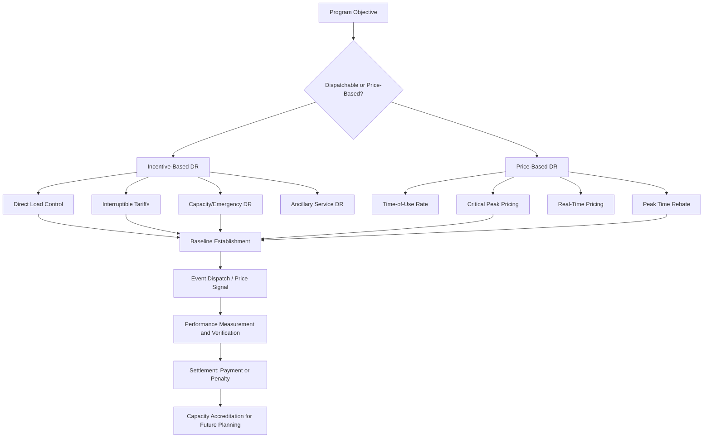

## Demand Response Program Design and Valuation

### Overview

Demand response (DR) refers to the deliberate, incentivized modification of electricity consumption patterns by end-use customers in response to price signals, reliability needs, or direct dispatch instructions. DR program design encompasses the mechanisms used to recruit, compensate, verify, and dispatch these load modifications, while valuation addresses how to quantify the economic and reliability benefits DR provides relative to supply-side alternatives (generation, storage, transmission).

### Rationale for Demand Response

**Key Points**

- Peak demand typically occurs for a small fraction of total annual hours (often under 100 hours per year for the top 1% of load), yet the system must be built to meet it, making peak-serving capacity disproportionately expensive per unit of energy delivered.
- DR provides a demand-side alternative to building or dispatching expensive peaking generation, deferring or avoiding capital investment in generation and transmission/distribution infrastructure.
- DR can improve system reliability during contingencies (unplanned generator outages, extreme weather) by providing fast-acting, dispatchable load reduction.
- DR contributes to price suppression during scarcity periods by reducing demand precisely when supply is tightest, flattening the load duration curve and reducing reliance on high-cost marginal units.
- Unlike most generation resources, DR's "fuel" (foregone consumption) has no marginal production cost to the grid, though it imposes a real cost or inconvenience (foregone comfort, lost production, deferred activity) on the participating customer, which must be reflected in compensation design.

### Classification of Demand Response Programs

**Key Points — Two Broad Categories**

1. **Incentive-Based (Dispatchable) DR** — the utility or system operator can call an event and direct participants to curtail load, with compensation tied to performance.
2. **Price-Based (Non-Dispatchable) DR** — customers respond voluntarily to time-varying price signals without a direct dispatch instruction; the system operator cannot guarantee a specific quantity of response.

**Incentive-Based DR Subtypes**

- **Direct Load Control (DLC):** Utility remotely cycles or shuts off specific end-use devices (e.g., air conditioners, water heaters) via a control signal, typically for small residential/commercial customers; compensation is usually a fixed bill credit or rate discount for enrollment.
- **Interruptible/Curtailable Tariffs:** Large industrial/commercial customers agree contractually to reduce load by a specified amount when called upon, in exchange for a discounted standard rate; non-compliance triggers penalties.
- **Capacity/Emergency Demand Response Programs:** Customers commit a firm curtailment capability, paid a capacity payment ($/kW-year or $/kW-month) for availability, plus an energy payment ($/MWh) for actual curtailment performance during called events (e.g., PJM's Emergency Load Response Program, ISO-NE's Real-Time Demand Response).
- **Ancillary Service DR:** Fast-responding loads (often aggregated via automation) bid into frequency regulation or spinning reserve markets, competing directly with generation resources on comparable performance terms.

**Price-Based DR Subtypes**

- **Time-of-Use (TOU) Rates:** Fixed price blocks (e.g., on-peak, off-peak, shoulder) that vary by time of day/season but are pre-set and known in advance.
- **Critical Peak Pricing (CPP):** A much higher price applied on a limited number of pre-designated "event days" called by the utility (typically 10–15 per year), with a lower price on all other days.
- **Real-Time Pricing (RTP):** Prices vary hourly (or sub-hourly) reflecting actual wholesale market conditions, passed through directly to retail customers.
- **Peak Time Rebate (PTR) / Critical Peak Rebate:** Customers are not penalized for high usage during event periods but instead earn a rebate for measured load reduction relative to a calculated baseline — attractive because it avoids the "loser pays" perception of CPP penalty rates.

### Baseline Methodology — The Central Measurement Challenge

**Key Points**

- Because DR performance is measured as a *reduction relative to what would have occurred absent the event* (a counterfactual), establishing an accurate customer baseline is the single most contested technical element of DR program design.
- **Common baseline methods:**
  - **X-of-Y averaging:** Average of the highest $X$ usage days out of the most recent $Y$ non-event days (e.g., "high 4 of 5" — commonly used in PJM), intended to represent "normal" usage while excluding atypically low-usage days.
  - **Regression-based baselines:** Statistical models incorporating weather variables (temperature, humidity) and day-type (weekday/weekend) to predict expected load absent the event, often more accurate for weather-sensitive loads (e.g., HVAC-heavy commercial buildings).
  - **Baseline adjustment ("morning-of" adjustment):** A same-day scaling factor applied to the historical baseline based on the ratio of actual-to-expected usage in hours immediately preceding the event, correcting for day-specific deviations (e.g., an unusually hot morning).
- **Baseline gaming risk:** Customers with advance knowledge of event calls have an incentive to inflate usage on non-event days to raise their baseline (and thus their apparent "reduction"), a well-documented issue requiring statistical safeguards, audits, and penalty provisions in program design. [Unverified: the magnitude of gaming behavior is context- and program-specific; general awareness of the risk is well-documented in DR program literature, but quantifying its prevalence requires program-specific measurement and evaluation studies.]

**Baseline Performance Calculation — Formalization**

$$\text{Measured Demand Reduction} = \text{Baseline Load} - \text{Actual Metered Load (during event)}$$

$$\text{Performance Ratio} = \frac{\text{Measured Demand Reduction}}{\text{Contracted/Nominated Capacity}}$$

Performance ratios below a program-specific threshold (e.g., 0.8) commonly trigger financial penalties or reduced future capacity credit in the following planning cycle.

### DR Program Design Flow (Diagram)

### Valuation Framework for Demand Response

**Key Points — Value Stack**

DR value is typically decomposed into multiple stackable (but sometimes mutually exclusive, depending on market rules) value streams:

1. **Capacity Value:** The avoided cost of building/procuring generation capacity, quantified similarly to generation capacity accreditation, often as the Net Cost of New Entry (Net CONE) of the deferred peaking resource, or the capacity market clearing price the DR resource displaces.
2. **Energy Value:** The wholesale energy price avoided during the hours of curtailment, valued at the real-time or day-ahead LMP at the customer's location.
3. **Ancillary Service Value:** Value from providing frequency regulation, spinning/non-spinning reserves, or other grid services, priced at the relevant AS market clearing price.
4. **Transmission and Distribution (T&D) Deferral Value:** The avoided or delayed cost of upgrading local T&D infrastructure by reducing peak load on specific constrained circuits — highly location-specific ("non-wires alternative" valuation).
5. **Environmental/Emissions Value:** Avoided emissions from displacing marginal (often fossil-fueled) generation during peak hours, sometimes monetized via carbon pricing or renewable/clean energy credit mechanisms where applicable.
6. **Reliability/Resilience Value:** Value of avoided outages or reduced Loss of Load Expectation, harder to monetize directly but sometimes incorporated into avoided-cost studies.

**Total Avoided Cost — Simplified Formalization**

$$\text{Total DR Value} = V_{\text{capacity}} + V_{\text{energy}} + V_{\text{AS}} + V_{\text{T\&D deferral}} + V_{\text{emissions}}$$

with the caveat that double-counting risk is significant — for example, avoided energy costs during a curtailment event may already be embedded in a capacity market's Net CONE calculation, and jurisdictions differ substantially on which value streams a DR resource is permitted to monetize simultaneously (i.e., market rules governing "stacking" of revenue streams).

### Cost-Effectiveness Testing

**Key Points**

- DR programs, like energy efficiency programs, are commonly evaluated using a standardized set of cost-effectiveness tests originally developed for demand-side management (DSM) programs (the "California Standard Practice Manual" tests are widely referenced):
  - **Total Resource Cost (TRC) Test:** Compares total societal costs (program administration + participant costs) against total benefits (avoided supply costs), from a societal perspective.
  - **Program Administrator Cost (PAC) Test / Utility Cost Test:** Compares utility program costs against utility avoided costs, excluding participant-borne costs.
  - **Participant Cost Test (PCT):** Evaluates whether the program is a good investment from the individual participating customer's perspective (their bill savings/incentives vs. their costs/inconvenience).
  - **Ratepayer Impact Measure (RIM) Test:** Assesses the effect of the program on the rates paid by *non-participating* customers, capturing the concern that if program costs are recovered from all ratepayers while benefits accrue disproportionately to participants, non-participants may see a net rate increase.
- Programs frequently pass the TRC test (societal benefit) while failing the RIM test (potential cost-shifting to non-participants), a persistent point of regulatory tension in DR program approval processes.

### Aggregators and Third-Party DR Providers

**Key Points**

- Curtailment Service Providers (CSPs) or DR aggregators bundle load reduction commitments from many smaller commercial/industrial or residential customers into a single resource large enough to participate in wholesale capacity and energy markets.
- Aggregators typically handle metering, baseline calculation, event notification, and settlement on behalf of individual customers, taking a share of the program payment as compensation.
- Regulatory frameworks (e.g., FERC Order 719 and Order 745 in the U.S., later addressed by the Supreme Court in *FERC v. Electric Power Supply Association*, 2016) established the right of aggregated retail DR to participate directly in wholesale markets, subject to compensation at the wholesale LMP, a landmark and historically contentious area of jurisdictional dispute between state and federal regulators. [Unverified: specific compensation formulas and eligibility rules following these orders have continued to evolve through subsequent FERC proceedings; verify current tariff provisions for the relevant market.]
- FERC Order 2222 extended similar market access principles to aggregated Distributed Energy Resources (DERs) more broadly, including behind-the-meter batteries and controllable loads, not just traditional curtailable demand.

### Illustrative Numerical Example

**Example**

A commercial customer enrolls in a capacity-based emergency DR program with the following terms:

- Nominated (contracted) curtailment capability: 500 kW
- Capacity payment: $60/kW-year
- Energy payment during called events: $150/MWh
- Baseline (X-of-Y, high 4 of 5 days): 2,000 kW average during event hours
- Actual metered load during a 4-hour called event: 1,550 kW

**Step 1 — Measured demand reduction:**

$$2{,}000 \text{ kW} - 1{,}550 \text{ kW} = 450 \text{ kW}$$

**Step 2 — Performance ratio:**

$$\frac{450 \text{ kW}}{500 \text{ kW}} = 0.90 \text{ (90\% performance, above typical 80\% penalty threshold)}$$

**Step 3 — Annual capacity payment:**

$$500 \text{ kW} \times \$60/\text{kW-year} = \$30{,}000/\text{year}$$

**Step 4 — Event energy payment (for this single 4-hour event):**

$$450 \text{ kW} \times 4 \text{ hours} \times \$150/\text{MWh} \times \frac{1 \text{ MWh}}{1{,}000 \text{ kWh}} = \$270$$

The capacity payment dominates total compensation in most emergency DR program designs, since events are called infrequently (often fewer than 10–20 hours per year), meaning the *availability* commitment, not the energy delivered, is the primary economic driver for participation.

### Technology Enablement

**Key Points**

- **Advanced Metering Infrastructure (AMI):** Interval (typically 15-minute or hourly) metering is a prerequisite for accurate baseline calculation and settlement in most modern DR programs; without AMI, DR is typically limited to simpler DLC switch-based programs.
- **Building/industrial automation integration:** OpenADR (Open Automated Demand Response) is a widely adopted communication standard enabling automated, machine-to-machine DR event signaling between utilities/aggregators and building energy management systems, reducing reliance on manual customer response and improving performance reliability.
- **Behind-the-meter storage and smart thermostats:** Increasingly used to deliver more precise, automated curtailment (e.g., pre-cooling a building before an event, then reducing HVAC load during the event window) improving both customer comfort outcomes and measured performance accuracy.

### Challenges and Design Tensions

**Key Points**

- **Snapback/rebound effect:** Curtailed load is sometimes merely deferred rather than eliminated (e.g., an EV that delays charging during a DR event will often charge immediately after), which can create a secondary demand spike immediately following an event if not managed through staggered restoration or continued price signals.
- **Persistence and free-ridership:** Some DR program designs risk paying customers for load reductions that would have occurred anyway (e.g., a facility already scheduled for planned downtime coincides with a DR event), which robust baseline methodologies attempt to minimize but cannot fully eliminate.
- **Equity considerations:** Price-based DR (especially RTP and CPP) can disproportionately affect low-income or medically vulnerable customers who have less ability to shift consumption, motivating protections such as bill caps, opt-out provisions, or exemptions for customers with critical medical equipment. [Inference: the specific equity impact depends heavily on program design details, customer demographics, and available consumer protections in a given jurisdiction, and is not a universal quantifiable outcome.]
- **Measurement and Verification (M&V) cost:** Rigorous baseline and performance measurement can itself be administratively costly, creating a tension between program integrity and program overhead, particularly for smaller residential-scale DR programs.

### Next Steps

- **Related Topics:**
  - Capacity Markets and Resource Adequacy Mechanisms
  - Locational Marginal Pricing (LMP) and Nodal Energy Markets
  - FERC Order 2222 and Distributed Energy Resource Aggregation
  - Time-Varying Retail Rate Design (TOU, CPP, RTP)
  - Advanced Metering Infrastructure and Grid Communication Standards
  - Non-Wires Alternatives and Distribution System Planning
  - Cost-Effectiveness Testing Frameworks for Demand-Side Management
  - Behind-the-Meter Storage and Building Energy Management Systems