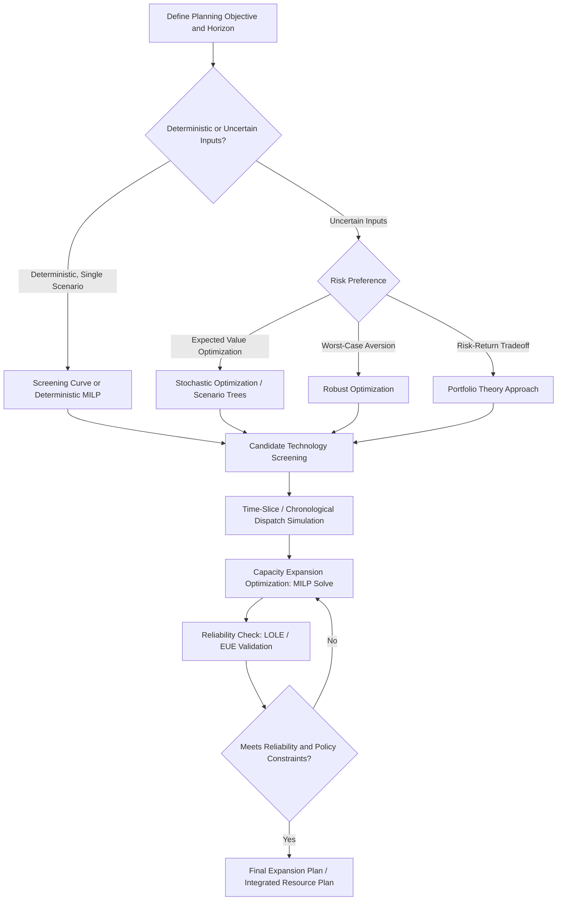

## Generation Expansion Planning Methods

### Overview

Generation Expansion Planning (GEP) is the process of determining the optimal type, size, timing, and location of new generation resources (and, increasingly, storage and demand-side resources) to be added to a power system over a multi-year to multi-decade planning horizon, such that future demand is met reliably at minimum cost while satisfying technical, environmental, and policy constraints. GEP sits at the intersection of engineering optimization, economics, and long-term uncertainty management, and is a foundational input to Integrated Resource Plans (IRPs) filed by utilities and system operators.

### Objectives and Scope

**Key Points**

- **Primary objective:** Minimize the net present value (NPV) of total system cost (capital, fixed O&M, variable O&M, fuel) over the planning horizon, subject to meeting forecasted demand and reliability targets.
- **Secondary/constraint objectives:** Reliability (reserve margin, LOLE targets), emissions limits (carbon caps, renewable portfolio standards), fuel diversity, transmission feasibility, and increasingly, resilience to extreme weather and cyber/physical threats.
- GEP differs from short-term unit commitment/dispatch in time scale (years to decades vs. hours to days) and decision variables (build/retire/retrofit decisions vs. hourly output decisions), though a full GEP model must still simulate representative dispatch to correctly value each candidate resource's contribution.
- Modern GEP increasingly must co-optimize generation, transmission, and storage investment simultaneously, since transmission expansion can substitute for generation investment in some regions (e.g., enabling access to remote low-cost renewable resources) — this is often termed integrated resource and transmission planning.

### Core Mathematical Formulation

**Key Points**

A generalized capacity expansion problem can be expressed as a mixed-integer linear program (MILP):

**Objective Function:**

$$\min \sum_{t} \frac{1}{(1+r)^t} \left[ \sum_{g} \left( CAPEX_g \cdot x_{g,t} + FOM_g \cdot CAP_{g,t} \right) + \sum_{g,h} VOM_g \cdot P_{g,h,t} + \sum_{g,h} FuelCost_g \cdot HR_g \cdot P_{g,h,t} \right]$$

where:

- $t$ = year index, $r$ = discount rate
- $g$ = candidate/existing generator or technology type
- $x_{g,t}$ = binary/continuous build decision for technology $g$ in year $t$
- $CAP_{g,t}$ = cumulative installed capacity of technology $g$ by year $t$
- $h$ = representative hour or time-slice within year $t$
- $P_{g,h,t}$ = power output of generator $g$ in hour $h$, year $t$
- $HR_g$ = heat rate, $FuelCost_g$ = fuel price

**Key Constraints:**

$$\sum_{g} P_{g,h,t} \geq D_{h,t} \quad \forall h, t \quad \text{(demand balance)}$$

$$\sum_{g} CAP_{g,t} \geq (1 + IRM) \times D^{peak}_t \quad \forall t \quad \text{(resource adequacy / reserve margin)}$$

$$\sum_{g \in \text{fossil}} EmissionRate_g \cdot P_{g,h,t} \leq E_t^{cap} \quad \forall t \quad \text{(emissions constraint, if applicable)}$$

$$0 \leq P_{g,h,t} \leq CAP_{g,t} \cdot AvailFactor_{g,h} \quad \forall g,h,t \quad \text{(capacity/availability limit)}$$

This formulation is a substantial simplification; production-grade GEP models add unit commitment logic (startup costs, minimum up/down times), transmission network constraints (DC power flow or full AC), storage state-of-charge dynamics, and stochastic scenario trees for uncertain parameters.

### Planning Horizon Structure and Time Resolution

**Key Points**

- **Static (single-stage) planning:** Determines optimal capacity additions for one future target year only; simplest but ignores the sequencing and path-dependency of investment decisions.
- **Dynamic (multi-stage) planning:** Optimizes build decisions across multiple years/decades simultaneously, capturing the timing of investment, technology cost learning curves, and retirement schedules — computationally far more demanding but essential for realistic long-term planning.
- **Representative time-slice / representative period selection:** Because full 8,760-hour chronological dispatch for every candidate portfolio across a multi-decade horizon is often computationally prohibitive, most GEP models use a reduced set of representative days, weeks, or load-duration-curve blocks (e.g., selected via clustering algorithms such as k-means) that preserve key statistical properties of the full load and renewable generation profiles.
- **Chronological vs. non-chronological modeling:** For systems with significant storage or variable renewables, chronological (hour-by-hour, temporally ordered) resolution is increasingly necessary because storage dispatch and ramping constraints depend on the sequence of hours, not just their aggregate distribution — this has driven a shift away from pure load-duration-curve approaches in modern capacity expansion tools.

### GEP Methodology Taxonomy

**Key Points — Major Approaches**

1. **Screening Curve Method (Classical/Simplified):** A graphical/analytical technique comparing candidate technologies' total annual cost as a function of capacity factor, used to determine the least-cost technology mix for a given load duration curve. Largely superseded by optimization-based methods for detailed planning but still valuable for intuition and quick screening.
2. **Linear Programming (LP) / Mixed-Integer Linear Programming (MILP):** The dominant modern approach; formulates GEP as a cost-minimization optimization problem with linear (or linearized) constraints, solved via commercial or open-source solvers (e.g., Gurobi, CPLEX, CBC, HiGHS).
3. **Dynamic Programming (DP):** Historically used for multi-stage sequential decision problems, particularly effective for smaller state spaces; suffers from the "curse of dimensionality" as the number of candidate technologies and time periods grows, limiting practical use in large modern systems.
4. **Stochastic Optimization / Scenario-Based Planning:** Explicitly incorporates uncertainty (fuel prices, demand growth, technology costs, policy) via probability-weighted scenarios or scenario trees, optimizing for expected cost or risk-adjusted objectives (e.g., Conditional Value at Risk) rather than a single deterministic forecast.
5. **Robust Optimization:** Seeks a plan that performs acceptably well across the worst-case realization within an uncertainty set, rather than optimizing for expected value — favored when decision-makers are highly risk-averse to downside scenarios (e.g., stranded asset risk).
6. **Portfolio Theory-Based Approaches:** Adapts financial portfolio optimization concepts (mean-variance optimization, analogous to Markowitz portfolio theory) to balance expected cost against cost volatility/risk across a resource portfolio.
7. **Agent-Based / Simulation Models:** Models individual market participants (generators, retailers) as autonomous decision-making agents responding to price signals and policy, used primarily for market outcome projection rather than centralized least-cost planning, common in restructured/competitive market analysis.
8. **Heuristic and Metaheuristic Methods:** Genetic algorithms, particle swarm optimization, and simulated annealing are used when the problem is highly non-convex or non-linear (e.g., incorporating detailed AC power flow or complex reliability metrics) and exact optimization becomes computationally intractable.

### Screening Curve Method — Illustrative Example

**Example**

The screening curve method compares technologies by plotting total annual cost per kW as a function of capacity factor (CF):

$$\text{Annual Cost per kW} = \text{Annualized Fixed Cost} + (\text{Variable Cost} \times 8760 \times CF)$$

Consider three candidate technologies:

| Technology | Annualized Fixed Cost ($/kW-yr) | Variable Cost ($/MWh) |
| --- | --- | --- |
| Combustion Turbine (Peaker) | 80 | 90 |
| Combined Cycle Gas Turbine | 150 | 45 |
| Coal/Baseload Steam | 300 | 25 |

Setting the peaker and combined-cycle cost equations equal to find the capacity factor "crossover point":

$$80 + 90 \times 8.76 \times CF = 150 + 45 \times 8.76 \times CF$$

$$8.76 \times CF \times (90 - 45) = 150 - 80$$

$$CF = \frac{70}{8.76 \times 45} \approx 0.177 \text{ (approximately 17.7\% capacity factor)}$$

Below this crossover capacity factor, the peaker is cheaper (used for low-utilization peak-shaving); above it, the combined-cycle unit becomes more economical. A similar crossover calculation between combined-cycle and coal would identify the next breakpoint, together defining the least-cost technology for each segment of the load duration curve. [Note: this classical method is illustrative of underlying economic logic; modern renewable- and storage-heavy systems require optimization-based methods since intermittent resources do not have a single well-defined capacity factor independent of dispatch order and correlation with load.]

### GEP Methodology Decision Flow (Diagram)

### Key Input Data Requirements

**Key Points**

- **Load forecast:** Peak demand and energy growth projections, increasingly disaggregated by end-use (electrification of transportation/heating materially changes both peak timing and load shape).
- **Technology cost and performance assumptions:** Capital cost ($/kW), fixed and variable O&M, heat rate, expected lifetime, construction lead time — often sourced from standardized cost databases (e.g., NREL's Annual Technology Baseline (ATB) is a commonly referenced U.S. source, updated annually).
- **Fuel price forecasts:** Natural gas, coal, and increasingly hydrogen price trajectories, typically modeled with uncertainty bands given historical volatility.
- **Renewable resource profiles:** Hourly or sub-hourly wind/solar capacity factor profiles by location, often derived from historical meteorological reanalysis datasets, critical for correctly valuing variable resource contributions and correlation with load.
- **Existing fleet characteristics:** Remaining useful life, planned retirements, retrofit options (e.g., carbon capture retrofit, coal-to-gas conversion), and existing contractual/regulatory obligations.
- **Policy and regulatory constraints:** Renewable Portfolio Standards (RPS), Clean Energy Standards, carbon pricing or cap-and-trade programs, interconnection queue status, and tax incentives (e.g., U.S. Investment Tax Credit / Production Tax Credit) that materially affect technology competitiveness.

### Treatment of Variable Renewable Energy (VRE) in GEP

**Key Points**

- VRE resources (wind, solar) cannot be represented by a single capacity factor input in the way thermal units can, because their output is time-varying, weather-driven, and correlated (positively or negatively) with load and with each other across sites — this requires chronological or statistically representative time-series modeling rather than simple duration-curve approximations.
- **Effective Load Carrying Capability (ELCC)** is the standard metric for VRE's contribution to resource adequacy in a GEP context (see Capacity Markets and Resource Adequacy Mechanisms), and ELCC must generally be recalculated iteratively as the VRE penetration level assumed in each planning scenario changes, since ELCC declines with increasing penetration.
- **Curtailment modeling:** As VRE penetration rises, periods of oversupply relative to load and transmission export capability lead to curtailment (foregone renewable output); GEP models must endogenously capture curtailment to avoid overstating the economic and emissions value of very high VRE penetration scenarios.
- **Complementarity and diversification:** GEP increasingly evaluates the diversification benefit of combining geographically dispersed and technologically diverse VRE resources (e.g., wind and solar with different daily/seasonal generation profiles) to reduce aggregate variability, sometimes explicitly modeled via correlation matrices in stochastic formulations.

### Storage and Hybrid Resource Modeling

**Key Points**

- Battery energy storage introduces state-of-charge dynamics into the optimization, requiring linking constraints across time periods:

$$SOC_{t+1} = SOC_t + \eta_{charge} \cdot P^{charge}_t \cdot \Delta t - \frac{P^{discharge}_t \cdot \Delta t}{\eta_{discharge}}$$

subject to $SOC^{min} \leq SOC_t \leq SOC^{max}$, where $\eta$ represents round-trip efficiency components.

- Storage duration (hours of discharge at rated power) is a critical design/planning variable distinct from power capacity (MW); GEP models increasingly co-optimize both power and energy capacity of storage resources rather than assuming a fixed duration.
- Hybrid resources (e.g., co-located solar-plus-storage) introduce additional modeling complexity around shared interconnection limits, charging-source constraints (whether storage can charge from the grid or only from the co-located renewable resource), and combined dispatch optimization.

### Reliability Validation and Feedback Loop

**Key Points**

- After an optimized capacity expansion plan is produced, it is standard practice to validate the plan against probabilistic reliability metrics (LOLE, LOLH, EUE) using a dedicated resource adequacy model (e.g., Monte Carlo simulation incorporating forced outage rates, correlated extreme weather events, and load forecast uncertainty).
- If the optimized least-cost plan fails to meet the target reliability threshold (a common outcome when cost-minimization alone under-values reliability contributions of certain resource types, particularly under simplified ELCC assumptions), the reserve margin constraint or ELCC values are revised and the capacity expansion optimization is re-run — an iterative feedback loop rather than a single-pass solve.
- Increasingly, GEP models are incorporating explicit reliability constraints or reliability-based capacity value directly into the optimization objective (rather than as a strict downstream constraint) to better internalize the marginal reliability contribution of each candidate resource during the optimization itself.

### Software and Modeling Tools Landscape

**Key Points**

- **Commercial/widely used capacity expansion tools:** Include tools such as PLEXOS, Aurora, and EnCompass, which combine capacity expansion optimization with detailed production cost/dispatch simulation and are commonly used by utilities and RTOs for IRP filings.
- **Open-source capacity expansion frameworks:** Tools such as GenX (developed at MIT), Switch, and Sienna have gained adoption in academic and some utility/regulatory contexts, offering transparent, customizable MILP formulations and increasing accessibility for reproducible research and stakeholder review. [Unverified: specific feature sets, active maintenance status, and version capabilities evolve continuously; consult current project documentation and repositories for the most up-to-date architecture and capabilities of any specific open-source tool before adoption.]
- **Coupling with production cost models:** Best practice increasingly involves validating capacity expansion results with a higher-resolution production cost model (chronological unit commitment and economic dispatch) to confirm that the selected portfolio can be operated reliably and economically at an hourly/sub-hourly level, since capacity expansion models often use simplified operational representations to remain computationally tractable.

### Integrated Resource Planning (IRP) Context

**Key Points**

- In many U.S. jurisdictions, regulated utilities are required to periodically file an Integrated Resource Plan with their state public utility commission, which uses GEP methodologies as its technical foundation but also incorporates public stakeholder input, equity considerations, and qualitative factors not easily captured in a pure optimization framework.
- IRPs typically present multiple scenarios/portfolios (e.g., a "reference case," a "high renewable case," a "high electrification case") rather than a single deterministic answer, reflecting the deep uncertainty inherent in multi-decade planning and providing regulators with a basis for comparative evaluation rather than a single mandated build-out.
- The distinction between GEP as a technical/analytical exercise and IRP as a regulatory/stakeholder process is important: the optimization identifies cost-effective portfolios, but the final approved plan often reflects negotiated adjustments addressing reliability concerns, environmental justice considerations, and political feasibility not fully internalized in the mathematical formulation.

### Next Steps

- **Related Topics:**
  - Capacity Markets and Resource Adequacy Mechanisms
  - Effective Load Carrying Capability (ELCC) Modeling Methodologies
  - Production Cost Modeling and Unit Commitment
  - Transmission Planning for Public Policy and Renewable Integration
  - Battery Storage Sizing and Duration Optimization
  - Stochastic and Robust Optimization Techniques in Power Systems
  - Load Forecasting Methods for Long-Term Planning
  - Integrated Resource Planning (IRP) Regulatory Processes