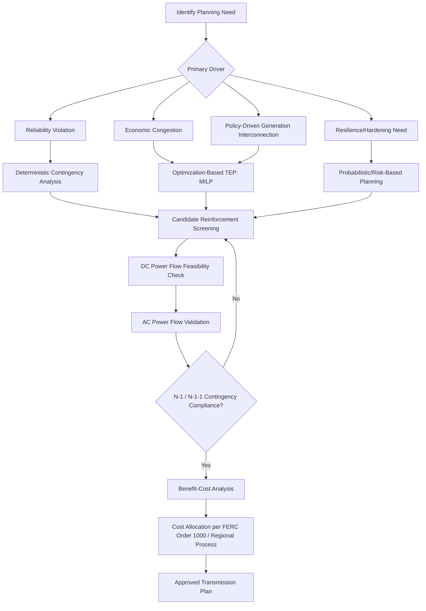

## Transmission Expansion Planning Methods

### Overview

Transmission Expansion Planning (TEP) is the process of determining the optimal set, timing, and location of new transmission lines, substations, and other network reinforcements needed to reliably and economically deliver power from generation sources to load centers over a multi-year planning horizon. TEP must jointly satisfy reliability criteria (contingency performance under N-1 and increasingly N-1-1 or N-2 standards), economic efficiency (congestion relief, production cost savings), and public policy requirements (renewable integration, interconnection of new generation), while managing the combinatorial complexity of network topology decisions.

### Objectives and Drivers of Transmission Expansion

**Key Points**

- **Reliability-driven expansion:** Addresses thermal overloads, voltage violations, or stability limits identified under defined contingency criteria (e.g., loss of a single line or transformer), ensuring the system can withstand credible outages without cascading failure or load shedding.
- **Economic/congestion-driven expansion:** Justified by production cost savings — reducing congestion allows lower-cost generation to serve load that would otherwise be served by more expensive, out-of-merit-order units, quantified via avoided congestion costs and Adjusted Production Cost (APC) savings.
- **Public policy-driven expansion:** Required to interconnect new generation mandated by state or federal policy (e.g., renewable portfolio standards), including dedicated generator lead lines and broader network upgrades enabling access to remote renewable resource areas (wind-rich or solar-rich regions often located far from load centers).
- **Resilience-driven expansion:** An increasingly prominent driver following major weather events, addressing hardening against extreme weather, wildfire risk mitigation (e.g., undergrounding or covered conductor in fire-prone areas), and reducing risk of correlated multi-facility outages.
- In practice, most major transmission projects are justified by a combination of these drivers, and modern planning processes (e.g., under FERC Order 1000 in the U.S.) require an integrated multi-driver benefit-cost evaluation rather than siloed single-purpose analysis.

### Planning Criteria and Reliability Standards

**Key Points**

- **N-1 criterion:** The system must remain within acceptable thermal, voltage, and stability limits following the loss of any single credible contingency (one transmission line, transformer, or generator) — the baseline reliability standard used across most of North America (formalized in NERC Transmission Planning (TPL) standards).
- **N-1-1 criterion:** The system must withstand a second contingency occurring after the system has already been reconfigured following an initial contingency (sequential outages), a more stringent standard applied to critical/highly loaded portions of the network.
- **N-2 criterion:** Simultaneous loss of two elements, typically applied only to specific high-consequence configurations (e.g., a double-circuit tower line where both circuits could be lost to a single structural failure).
- **Voltage stability and dynamic stability constraints:** Beyond simple thermal overload checks, TEP must verify that the system maintains adequate voltage support and does not experience transient or small-signal instability following contingencies, particularly in regions with long transmission corridors or high inverter-based resource penetration.
- **NERC TPL-001 (U.S. context):** Defines the categories of contingencies (P0 through P7) and corresponding required system performance (no interruption of firm load for lower categories, planned/controlled interruption acceptable for more extreme categories), forming the mandatory reliability floor that all TEP studies in North America must satisfy regardless of economic optimization outcomes. [Unverified: exact standard version and specific performance requirements are periodically revised by NERC; verify current TPL standard version in effect for the study year.]

### TEP Methodology Taxonomy

**Key Points — Major Approaches**

1. **Deterministic (Contingency-Based) Planning:** Traditional approach — runs power flow simulations for a defined set of contingencies against a fixed forecast, identifying and resolving violations through targeted reinforcements; well-established and required as a compliance floor, but does not inherently optimize for economic efficiency or explore alternative topologies.
2. **Optimization-Based Transmission Expansion Planning (TEP as MILP/MINLP):** Formulates the network topology and reinforcement decisions as a mixed-integer optimization problem, jointly minimizing capital cost and operational (congestion/production) cost subject to power flow and reliability constraints — the modern standard for economic and policy-driven planning studies.
3. **Probabilistic/Risk-Based Planning:** Explicitly incorporates the probability and consequence of contingencies (including correlated and extreme weather events) rather than treating all N-1 contingencies as equally certain, allowing risk-informed prioritization of investment (e.g., using Value at Risk or Expected Unserved Energy as the risk metric rather than a strict deterministic pass/fail).
4. **Scenario-Based / Robust Planning:** Evaluates candidate transmission plans against multiple future scenarios (varying load growth, generation mix, policy outcomes) and selects reinforcements that perform well (are "robust") across the plausible range of futures, rather than optimizing for a single forecast — critical given multi-decade transmission asset lifetimes and deep uncertainty in generation siting.
5. **Integrated Generation-Transmission Co-Optimization:** Jointly optimizes generation and transmission investment decisions simultaneously, recognizing that transmission can substitute for generation capacity (e.g., building a line to import cheaper remote power instead of building local generation) and that transmission access materially affects the economic viability of candidate generation sites.
6. **AC vs. DC Power Flow Formulations:** Full AC optimal power flow (ACOPF)-based TEP captures voltage and reactive power effects precisely but is non-convex and computationally intensive at scale; DC power flow (linearized, ignoring reactive power and voltage magnitude) is far more tractable and widely used for large-scale, multi-year TEP studies, with AC power flow validation performed as a subsequent, more detailed check on the DC-derived candidate plan.

### Mathematical Formulation (Simplified MILP)

**Key Points**

A representative transmission expansion optimization can be expressed as:

**Objective Function:**

$$\min \sum_{t} \frac{1}{(1+r)^t} \left[ \sum_{\ell \in \mathcal{L}^{cand}} C_\ell \cdot y_{\ell,t} + \sum_{h} OpCost_{h,t} \right]$$

where $\mathcal{L}^{cand}$ is the set of candidate transmission lines, $y_{\ell,t}$ is a binary variable indicating whether candidate line $\ell$ is built by year $t$, $C_\ell$ is its annualized capital cost, and $OpCost_{h,t}$ represents system operating (production) cost in representative hour $h$ of year $t$, derived from a nested DC-OPF dispatch subproblem.

**DC Power Flow Constraint (Disjunctive Formulation for Candidate Lines):**

$$-M(1 - y_{\ell,t}) \leq f_{\ell,h,t} - B_\ell (\theta_{i,h,t} - \theta_{j,h,t}) \leq M(1 - y_{\ell,t})$$

$$-y_{\ell,t} \cdot F_\ell^{max} \leq f_{\ell,h,t} \leq y_{\ell,t} \cdot F_\ell^{max}$$

where $f_{\ell,h,t}$ is power flow on candidate line $\ell$, $B_\ell$ is the line's susceptance, $\theta_i, \theta_j$ are voltage phase angles at the line's terminal buses, $F_\ell^{max}$ is the thermal limit, and $M$ is a sufficiently large constant ("big-M" method) used to enforce the flow equation only when the line is built ($y_{\ell,t}=1$), while relaxing it (allowing any flow difference) when the line does not yet exist.

**Contingency (N-1) Constraint (Post-Contingency Flow Limit):**

$$|f_{\ell,h,t}^{(k)}| \leq F_\ell^{max} \quad \forall \ell \neq k, \, \forall k \in \mathcal{K}$$

where $f_{\ell,h,t}^{(k)}$ denotes the flow on line $\ell$ following the outage of contingency element $k$, computed via line outage distribution factors (LODFs) for computational efficiency rather than re-solving full power flow for every contingency.

### TEP Methodology Decision Flow (Diagram)

### Candidate Line Screening and Network Topology Search

**Key Points**

- Because the number of possible transmission topology combinations grows combinatorially with the number of candidate lines (a full search is generally NP-hard for realistic network sizes), practical TEP relies on a combination of engineering judgment (pre-screening obviously beneficial or necessary reinforcements) and mathematical optimization (MILP solvers with branch-and-bound/cut techniques) to manage computational tractability.
- **Sensitivity-based screening:** Uses power transfer distribution factors (PTDFs) and line outage distribution factors (LODFs) to quickly identify which candidate lines would most effectively relieve known congestion or contingency violations, narrowing the candidate set before full optimization.
- **Benders decomposition and other decomposition techniques:** Commonly applied to split the large-scale TEP problem into a master problem (investment decisions) and subproblems (operational dispatch for each representative period/scenario), significantly improving computational tractability for large networks and long horizons.
- **Iterative "greedy" heuristics:** Add one candidate line at a time (the one yielding the greatest violation relief or cost reduction per dollar spent), re-evaluate, and repeat — computationally efficient but not guaranteed to find the global optimum; often used as a fast initial solution or cross-check against full MILP results.

### Benefit-Cost Analysis for Transmission Projects

**Key Points**

- **Adjusted Production Cost (APC) Savings:** The primary economic benefit metric — the reduction in total system production (fuel + variable O&M) cost achieved by the new transmission relative to the base case without it, simulated via production cost modeling across representative years and weather/load scenarios.
- **Avoided or Deferred Capacity Cost:** Transmission that enables access to lower-cost remote generation, or that improves resource adequacy by increasing import capability, can defer the need for local capacity additions, valued similarly to the capacity value concepts used in generation planning.
- **Reliability Benefit Quantification:** Reduction in expected unserved energy (EUE) or improvement in reserve-sharing capability across regions, often the most difficult benefit category to monetize precisely but increasingly incorporated via reliability-based benefit metrics in modern cost allocation methodologies (e.g., MISO's Multi-Value Project framework explicitly monetizes reliability benefits alongside economic and public policy benefits).
- **Public Policy Compliance Value:** For projects required to meet renewable portfolio standards or other mandates, the "benefit" is partly defined by regulatory necessity rather than pure cost-minimization, requiring a distinct evaluation lens from purely economic projects.
- **Benefit-to-Cost Ratio (BCR) threshold:** Many RTO/ISO planning processes (e.g., MISO, SPP) require a calculated BCR above a minimum threshold (often 1.0, sometimes higher for discretionary projects) for a project to be approved for regional cost allocation, computed as:

$$BCR = \frac{\text{Present Value of Total Quantified Benefits}}{\text{Present Value of Total Project Cost}}$$

### Uncertainty and Scenario Analysis in TEP

**Key Points**

- Because transmission assets have very long lifetimes (40–70+ years) and lead times (often 5–10+ years from planning to energization for major projects), TEP is especially exposed to long-horizon uncertainty in load growth, generation retirement/addition patterns, technology costs, and policy direction.
- **Scenario-based robustness testing:** Modern TEP processes commonly evaluate candidate transmission plans against multiple distinct future scenarios (e.g., "high renewable growth," "high electrification," "reference case," "high distributed energy resource adoption") and prioritize reinforcements that provide benefit across most or all scenarios ("no-regrets" investments) over those that are only justified in a single narrow future.
- **Real options analysis:** An emerging framework treating transmission investment decisions as having option-like value — e.g., building a lower-cost initial line with the physical/right-of-way option to upgrade capacity later provides flexibility value if uncertain future conditions do not materialize as expected, though this technique is less universally standardized in utility practice than deterministic or scenario-based methods. [Unverified: adoption of formal real-options quantification varies significantly by utility/RTO and is not yet a uniformly standardized planning requirement across North American jurisdictions.]

### Interregional and Multi-Driver Planning Coordination

**Key Points**

- Transmission projects that cross RTO/ISO or utility planning region boundaries require interregional coordination processes to reconcile differing benefit-cost methodologies, cost allocation philosophies, and reliability criteria between neighboring planning authorities — a persistent source of delay and stakeholder dispute in North American transmission planning.
- **FERC Order 1000 interregional requirements (U.S. context):** Mandate that neighboring transmission planning regions jointly evaluate and, where cost-effective, jointly fund interregional projects, though the practical effectiveness of these coordination provisions has been a subject of ongoing regulatory and stakeholder debate regarding whether they have produced significant new interregional transmission capacity. [Unverified: the volume and pace of interregional projects resulting from these coordination requirements is a matter of ongoing assessment and varies by regional pairing; consult current FERC compliance filings and independent evaluations for up-to-date figures.]
- **Multi-value/multi-driver project bundling:** Some planning processes explicitly evaluate and approve portfolios of transmission projects together (rather than project-by-project) when the projects collectively deliver reliability, economic, and public policy benefits that individually might not justify each project's cost in isolation (e.g., MISO's Multi-Value Project portfolio approach).

### Illustrative Example: Simple Congestion Relief Screening

**Example**

Consider a two-area system where Area A has low-cost generation (marginal cost $30/MWh) and Area B has high-cost generation (marginal cost $70/MWh), connected by an existing tie-line with a 500 MW thermal limit that is fully congested during peak hours, forcing Area B to run its expensive units instead of importing cheaper power from Area A.

- Congestion volume: Area B must self-supply an additional 200 MW during 2,000 peak hours/year beyond what the constrained tie-line allows.
- **Annual production cost penalty from congestion:**

  $$200 \text{ MW} \times 2{,}000 \text{ hours} \times (\$70 - \$30)/\text{MWh} = \$16{,}000{,}000/\text{year}$$
- If a new transmission line costing $80 million (annualized at $8 million/year over its economic life, given financing assumptions) can relieve this congestion by adding 200 MW of transfer capability, the **simple payback** and **BCR** screening calculation would be:

$$BCR = \frac{\$16{,}000{,}000/\text{year (benefit)}}{\$8{,}000{,}000/\text{year (annualized cost)}} = 2.0$$

A BCR of 2.0 would generally clear most RTO minimum thresholds for regional cost allocation eligibility, though a full study would also need to verify the line does not create new violations elsewhere in the network, confirm N-1 contingency performance with the new line in service, and validate the production cost savings using a full chronological production cost model rather than this simplified screening estimate.

### Emerging Trends and Grid-Enhancing Technologies

**Key Points**

- **Grid-Enhancing Technologies (GETs):** Include dynamic line rating (adjusting thermal limits in real time based on actual weather conditions rather than static conservative ratings), advanced power flow control devices (e.g., FACTS devices such as static VAR compensators and phase-shifting transformers), and topology optimization software — increasingly evaluated as lower-cost, faster-to-deploy alternatives or complements to new line construction in specific congestion-relief applications. [Unverified: the pace of GET adoption and specific performance/cost figures vary by vendor, region, and application; verify current vendor documentation and independent evaluations for specific deployment contexts.]
- **HVDC (High-Voltage Direct Current) transmission:** Increasingly considered for very long-distance, high-capacity transfers (particularly for remote renewable resource integration) and for asynchronous interconnection between grids with different operating frequencies or independent control areas, offering controllable power flow that AC lines cannot provide without additional control devices.
- **Interregional transfer capability studies:** A growing area of TEP analysis given increasing interest in strengthening interregional transmission ties to improve resource sharing and resilience during extreme weather events that affect multiple regions simultaneously (e.g., widespread winter storms), motivated in part by observed reliability gaps during recent extreme cold weather events in North America. [Unverified: specific study conclusions, proposed transfer capability targets, and implementation timelines are evolving and jurisdiction-specific; verify current regional and national assessments for up-to-date findings.]

### Next Steps

- **Related Topics:**
  - Generation Expansion Planning Methods
  - Transmission Pricing and Cost Allocation
  - Locational Marginal Pricing (LMP) and Nodal Energy Markets
  - FERC Order 1000 Regional and Interregional Transmission Planning
  - Power Transfer Distribution Factors and Contingency Analysis
  - Security-Constrained Economic Dispatch and Optimal Power Flow
  - Grid-Enhancing Technologies and Dynamic Line Rating
  - HVDC Transmission System Design and Applications