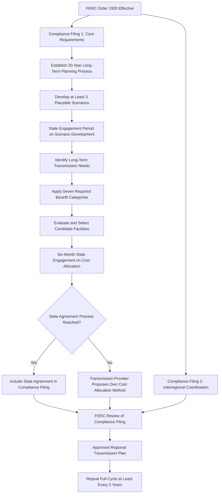

## Long-Term Regional Transmission Planning and FERC Order 1920

### Overview

Long-term regional transmission planning refers to a forward-looking, scenario-based planning discipline that evaluates transmission needs over multi-decade horizons, in contrast to shorter-term reliability and interconnection-driven planning cycles. FERC Order No. 1920, issued May 13, 2024, is the landmark U.S. federal rulemaking that mandates this practice, representing the first major overhaul of regional transmission planning and cost allocation rules since Order No. 1000 (2011). It responds to a finding that the absence of long-term, forward-looking, comprehensive transmission planning has led to insufficient and inefficient regional transmission development, with new transmission historically built primarily through uncoordinated, utility-by-utility, or generator-interconnection-driven processes rather than proactive system-wide planning. Order No. 1920 directs utilities and Regional Transmission Organizations to produce long-term regional transmission plans that consider expected changes in the nation's power supply mix, demand growth, and extreme weather, with plans based on at least three plausible scenarios of the regional power sector's development, and each transmission project must pass a benefit-cost test considering seven specified benefits. [Harvard](https://eelp.law.harvard.edu/tracker/regional-transmission-planning-rule/)

### Regulatory History and Rulemaking Timeline

**Key Points**

- The rulemaking process began with an Advance Notice of Proposed Rulemaking in July 2021, followed by an April 2022 Notice of Proposed Rulemaking (NOPR) that proposed specific reforms; FERC reviewed more than 30,000 pages of comments from nearly 200 stakeholders before issuing the final rule. [Federal Energy Regulatory Commission](https://www.ferc.gov/explainer-transmission-planning-and-cost-allocation-final-rule)
- **Order No. 1920 (May 13, 2024):** The original final rule, described by FERC as the first time in more than a decade it addressed regional transmission policy, and the first time the Commission squarely addressed the need for long-term transmission planning. [Federal Energy Regulatory Commission](https://www.ferc.gov/news-events/news/ferc-takes-long-term-planning-historic-transmission-rule)
- **Order No. 1920-A (November 21, 2024):** Issued in response to 49 timely-filed requests for rehearing and clarification raising issues across nearly all the reforms adopted in Order No. 1920; largely affirmed the original rule while enhancing state regulator involvement, particularly in scenario development and cost allocation. Notably, Order No. 1920-A set aside, in part, the requirement to use all seven categories of factors, specifically removing the requirement to incorporate corporate commitments from "Factor Category Seven" into each required Long-Term Scenario, in response to concerns that this could unnecessarily account for the needs of particular transmission users. [Federal Energy Regulatory Commission](https://www.ferc.gov/news-events/news/presentation-order-no-1920-building-future-through-electric-regional-transmission)[Federal Energy Regulatory Commission](https://www.ferc.gov/news-events/news/presentation-order-no-1920-building-future-through-electric-regional-transmission)
- **Order No. 1920-B:** A further order affirming that state regulators serve as key decision-makers in the buildout of the transmission system, giving states more power to influence regional cost allocation of long-term transmission projects. [Federal Energy Regulatory Commission](https://www.ferc.gov/what-state-regulators-need-know-about-order-no-1920-b)
- Numerous parties have petitioned for judicial review of Order No. 1920, with cases consolidated before the U.S. Court of Appeals for the Fourth Circuit. [Unverified: the status and outcome of this ongoing litigation was evolving as of the source material's publication and should be checked against current Fourth Circuit docket records for the latest disposition.]

### Core Requirements of Order No. 1920

**Key Points — Four Primary Reform Areas**

The major reforms adopted by FERC in Order No. 1920 center around four key areas: planning horizon, developing planning scenarios, selection of transmission solutions, and cost allocation. [Insideenergyandenvironment](https://www.insideenergyandenvironment.com/2024/06/ferc-issues-order-no-1920-to-accelerate-regional-transmission-planning/)

1. **Planning Horizon:** Transmission providers must conduct long-term planning for regional transmission facilities over a 20-year time horizon to anticipate future needs and determine how to pay for those transmission facilities. Regional transmission plans covering at least 20 years must be produced at least once every five years. [Federal Energy Regulatory Commission](https://www.ferc.gov/news-events/news/ferc-strengthens-order-no-1920-expanded-state-provisions)[Federal Energy Regulatory Commission](https://www.ferc.gov/news-events/news/fact-sheet-building-future-through-electric-regional-transmission-planning-and)
2. **Scenario Development:** Long-term planning must use a plausible and diverse set of at least three scenarios that incorporate specific factors and use best available data. Because these scenarios necessarily reflect how states plan to meet their own laws, policies, and regulations, transmission providers must incorporate state input into how the scenarios are developed. [Federal Energy Regulatory Commission](https://www.ferc.gov/news-events/news/fact-sheet-building-future-through-electric-regional-transmission-planning-and)[Federal Energy Regulatory Commission](https://www.ferc.gov/news-events/news/presentation-order-no-1920-building-future-through-electric-regional-transmission)
3. **Selection of Transmission Solutions:** Transmission providers must measure candidate long-term regional transmission facilities against seven specific required benefits, one of which includes avoiding or deferring reliability transmission infrastructure replacement and reducing loss-of-load risk. An evaluation process must be included to identify long-term regional transmission facilities for potential selection in the regional plan. [Insideenergyandenvironment](https://www.insideenergyandenvironment.com/2024/06/ferc-issues-order-no-1920-to-accelerate-regional-transmission-planning/)[Federal Energy Regulatory Commission](https://www.ferc.gov/news-events/news/fact-sheet-building-future-through-electric-regional-transmission-planning-and)
4. **Cost Allocation:** The rule requires a six-month engagement period for relevant state entities before a transmission provider files a cost allocation method for a chosen project with FERC. [Insideenergyandenvironment](https://www.insideenergyandenvironment.com/2024/06/ferc-issues-order-no-1920-to-accelerate-regional-transmission-planning/)

### "Right-Sizing" Provision

**Key Points**

- Order No. 1920 provides for cost-effective expansion of transmission facilities that are being replaced, when needed — known as "right-sizing" transmission facilities. [Federal Energy Regulatory Commission](https://www.ferc.gov/news-events/news/ferc-strengthens-order-no-1920-expanded-state-provisions)
- This addresses a specific inefficiency: when an aging transmission line or facility reaches end-of-life and must be rebuilt for reliability reasons, right-sizing allows the replacement to be built at a higher capacity than the original (where justified by long-term regional need) rather than automatically rebuilding to the original, potentially outdated, specification — capturing economies of scale from the fact that construction/right-of-way mobilization is already occurring.

### The Seven Required Benefit Categories

**Key Points**

- Order No. 1920 requires transmission providers to measure a set of seven required benefits for potential long-term regional transmission facilities, including: (1) avoiding or deferring reliability transmission infrastructure replacement, and (2) reducing loss of load risk/expectation. [Insideenergyandenvironment](https://www.insideenergyandenvironment.com/2024/06/ferc-issues-order-no-1920-to-accelerate-regional-transmission-planning/)
- Transmission planners must consider these seven benefits when evaluating and selecting long-term regional transmission facilities, including anticipating changes in generation, growing data center loads, and extreme weather events. [Yes Energy](https://www.yesenergy.com/blog/what-you-need-to-know-about-ferc-order-1920)
- The originally-specified "Factor Category Seven" concerned utility, corporate, and federal/state/local/Tribal policy commitments affecting long-term transmission needs; Order No. 1920-A set aside the requirement to incorporate corporate commitments specifically from this factor category into each required Long-Term Scenario, while clarifying that transmission providers are not strictly required to use the full set of seven benefits to inform their identification of Long-Term needs in every context. [Unverified: the precise current list and post-1920-A/1920-B scope of all seven benefit categories should be confirmed directly against the current effective tariff language, since amendments across the 1920/1920-A/1920-B order sequence have modified specific provisions.] [Federal Energy Regulatory Commission](https://www.ferc.gov/news-events/news/presentation-order-no-1920-building-future-through-electric-regional-transmission)

### State Regulator Role and the State Agreement Process

**Key Points**

- Order No. 1920-A clarifies and modifies requirements including state involvement in long-term regional transmission planning and cost allocation. [Federal Energy Regulatory Commission](https://www.ferc.gov/explainer-transmission-planning-and-cost-allocation-final-rule)
- The process by which states in a region seek agreement on cost allocation is called the "State Engagement Period"; Order No. 1920-A gives states the choice to extend this engagement period by an additional six months simply by requesting the extension through their own regional decision-making process, and the transmission provider may separately request its own compliance deadline extension. [Federal Energy Regulatory Commission](https://www.ferc.gov/what-state-regulators-need-know-about-order-no-1920-b)
- If states in a region agree on a regional cost allocation formula for long-term transmission projects (the "State Agreement Process"), the transmission provider must include that state agreement in its Order No. 1920-B compliance filing even if the provider prefers and separately files a different cost allocation formula — FERC will then weigh both the states' and the provider's proposals. [Federal Energy Regulatory Commission](https://www.ferc.gov/what-state-regulators-need-know-about-order-no-1920-b)
- To increase transparency, transmission providers must post publicly the results of their consultations with Relevant State Entities before filing any amendment to an on-file cost allocation method, and must explain why they declined to propose any amendment preferred by the states. [Federal Energy Regulatory Commission](https://www.ferc.gov/news-events/news/presentation-order-no-1920-building-future-through-electric-regional-transmission)

### Applicability and Scope

**Key Points**

- Order Nos. 1920 and 1920-A apply to all transmission providers — meaning public utilities that own, control, or operate transmission facilities — that have an Open Access Transmission Tariff (OATT) on file with FERC. [Federal Energy Regulatory Commission](https://www.ferc.gov/explainer-transmission-planning-and-cost-allocation-final-rule)
- Each RTO/ISO transmission planning region submits its own compliance filing, including proposed region-specific implementation of the rule's requirements. [Federal Energy Regulatory Commission](https://www.ferc.gov/explainer-transmission-planning-and-cost-allocation-final-rule)
- Notably, Order No. 1920 does not address National Interest Electric Transmission Corridors — geographic areas designated by the Department of Energy where transmission congestion has an adverse effect on consumers and where FERC may in certain circumstances have direct siting authority under the Federal Power Act — treating long-term regional planning and national interest corridor designation as distinct regulatory tracks. [Insideenergyandenvironment](https://www.insideenergyandenvironment.com/2024/06/ferc-issues-order-no-1920-to-accelerate-regional-transmission-planning/)
- While the rule standardizes long-term regional planning requirements — which could also facilitate future interregional planning and coordination — FERC has not, through Order No. 1920 itself, mandated interregional planning. Order No. 1920 mandates that studies take place using common baseline standards, but does not require planning regions to actually select or build the projects resulting from those long-term studies. [Insideenergyandenvironment](https://www.insideenergyandenvironment.com/2024/06/ferc-issues-order-no-1920-to-accelerate-regional-transmission-planning/)[RMI](https://rmi.org/wp-content/uploads/dlm_uploads/2024/12/Order-1920A-Reference-Sheet.pdf)

### Compliance Filing Timeline

**Key Points**

- Order No. 1920 took effect August 12, 2024 (60 days after Federal Register publication on June 11, 2024); compliance filings for most requirements were due within 10 months of the effective date, by June 12, 2025, while compliance filings specifically addressing interregional transmission coordination were due within 12 months, by August 12, 2025. [Crowell & Moring](https://www.crowell.com/en/insights/client-alerts/order-no-1920-ferc-reshapes-the-transmission-planning-landscape)
- The first long-term transmission planning cycle must commence within one year of the compliance filing date (originally targeted for June 2026), unless transmission providers elect an earlier start. [Crowell & Moring](https://www.crowell.com/en/insights/client-alerts/order-no-1920-ferc-reshapes-the-transmission-planning-landscape)
- Order No. 1920 requires transmission providers to submit two separate compliance filings: the first covering all Order No. 1920 requirements except interregional transmission coordination, and a second addressing interregional coordination specifically. [Federal Energy Regulatory Commission](https://www.ferc.gov/news-events/news/order-no-1920-compliance-filings-schedule)
- Individual regions have received deadline extensions reflecting the complexity of implementation: ISO New England, for example, received a FERC-granted extension of its full compliance filing deadline (including interregional coordination requirements) to June 14, 2027. [Unverified: extension timelines are region-specific and subject to further FERC action; verify current compliance schedule status for any specific RTO/ISO/transmission provider before relying on a particular date.] [Nepool](https://nepool.com/news/iso-ne-order-1920-compliance-deadline-extended-to-jun-14-2027/)

### Relationship to Order No. 1000 and Prior Framework

**Key Points**

- Order No. 1920 revises key aspects of FERC's regional transmission planning and cost allocation policies that were largely adopted in 2011 under Order No. 1000, aiming to accelerate transmission buildout needed to serve the country's changing resource mix and growing demand projections. [Insideenergyandenvironment](https://www.insideenergyandenvironment.com/2024/06/ferc-issues-order-no-1920-to-accelerate-regional-transmission-planning/)
- Order No. 1000 established the foundational regional and interregional transmission planning and cost allocation framework (including elimination of the federal right of first refusal for certain regional projects), but did not require the specific long-term (20-year), scenario-based planning discipline that Order No. 1920 now mandates — Order No. 1920 can be understood as extending and deepening the Order No. 1000 framework specifically toward forward-looking, multi-scenario long-term needs identification rather than solely near-term/economic/reliability-driven project evaluation.
- Order No. 1920 also revises the local transmission planning process specifically to close loopholes that had existed since Order No. 1000, and requires closer coordination between the generation interconnection process and regional transmission planning. [Crowell & Moring](https://www.crowell.com/en/insights/client-alerts/order-no-1920-ferc-reshapes-the-transmission-planning-landscape)

### Implementation Flow (Diagram)

### Practical and Technical Planning Implications

**Key Points**

- Meeting the 20-year modeling horizon requires transmission planners to add substantial new analytical steps to their existing planning processes, beginning with capacity expansion modeling to determine what generation resources (of any technology type) will need to be sited to meet load and reserve margin requirements over the extended horizon, before transmission needs can even be identified. [Yes Energy](https://www.yesenergy.com/blog/what-you-need-to-know-about-ferc-order-1920)
- This differs from traditional integrated transmission planning, which occurs annually and assesses near- and long-term economic and reliability transmission needs on a shorter analytical basis than the new 20-year requirement demands. [Yes Energy](https://www.yesenergy.com/blog/what-you-need-to-know-about-ferc-order-1920)
- Software and modeling vendors have responded by developing or marketing "Integrated Systems Planning" platforms intended to connect power flow, resource adequacy, production cost, and capacity expansion workflows through a common data environment, reducing manual reconciliation between what were previously separate planning studies. [Unverified: specific vendor platform capabilities and adoption rates are commercial claims subject to change; verify current product documentation directly with vendors for specific technical capabilities.]
- The requirement for at least three distinct future scenarios (rather than a single reference forecast) directly parallels the scenario-based and robust-planning methodologies used in modern Transmission Expansion Planning (see Transmission Expansion Planning Methods), reflecting the same underlying rationale: multi-decade transmission assets must perform acceptably across a range of plausible futures rather than being optimized against one deterministic forecast.

### Key Uncertainties and Open Implementation Questions

**Key Points**

- [Unverified: the ultimate outcome of consolidated judicial challenges to Order No. 1920 pending before the Fourth Circuit Court of Appeals was not resolved as of the source material reviewed; any content asserting the rule's final, litigation-settled form should be checked against current court records.]
- [Unverified: the degree to which the seven required benefit categories have been further modified, clarified, or narrowed by Order No. 1920-B beyond the changes already made in Order No. 1920-A was not fully detailed in available sources; verify current effective benefit-category language directly against FERC's most recent order text.]
- [Unverified: whether and how individual RTO/ISO compliance filings have been approved, rejected, or required to be refiled by FERC — and the resulting region-specific implementation timelines — varies by region and continues to evolve; consult the specific transmission planning region's current FERC docket for up-to-date compliance status.]
- The practical effectiveness of the rule in accelerating actual transmission construction (as opposed to merely mandating the planning studies) remains an open empirical question, since Order 1920 standardizes study requirements but does not require planning regions to select or build projects resulting from the long-term studies — it only requires that the studies take place. [RMI](https://rmi.org/wp-content/uploads/dlm_uploads/2024/12/Order-1920A-Reference-Sheet.pdf)

### Next Steps

- **Related Topics:**
  - Transmission Expansion Planning Methods
  - Transmission Pricing and Cost Allocation
  - FERC Order 1000 Regional and Interregional Transmission Planning
  - Generator Interconnection Queue Reform (FERC Order 2023)
  - National Interest Electric Transmission Corridors
  - State vs. Federal Jurisdiction in Transmission Regulation
  - Scenario-Based and Robust Planning Under Deep Uncertainty
  - Generation Expansion Planning Methods