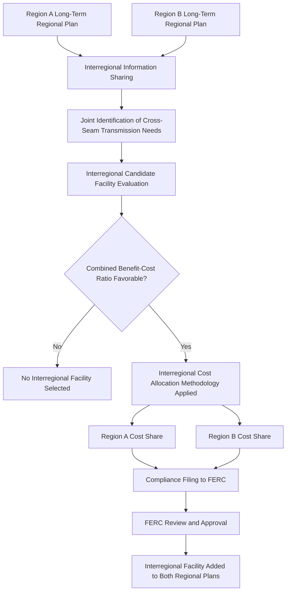

## Interregional Transmission Coordination

### Overview

Interregional transmission coordination refers to the processes, studies, and cost allocation mechanisms by which neighboring transmission planning regions — separate RTOs/ISOs, or utility planning regions outside RTO/ISO footprints — jointly evaluate, plan, and fund transmission facilities that cross or benefit multiple regions. Because individual regional planning processes (governed by FERC Order No. 1000 and, more recently, Order No. 1920) are each conducted independently within their own footprint, interregional coordination exists specifically to address transmission needs and benefits that do not respect regional boundaries, and to prevent transmission planning silos from producing an inefficient, underbuilt seam between regions.

### Why Interregional Coordination Is Distinct from Regional Planning

**Key Points**

- Each regional transmission planning process uses its own benefit-cost methodology, cost allocation formula, scenario assumptions, and stakeholder governance structure — these differences do not automatically reconcile at a shared regional boundary ("seam"), even when a transmission project would provide clear benefits on both sides.
- A transmission line proposed to cross a seam may show a strong benefit-cost ratio when benefits from both regions are combined, yet fail to clear either region's individual planning process if each region only counts benefits accruing within its own footprint — this is a core structural rationale for dedicated interregional processes.
- Historically, transmission development across seams has been comparatively rare relative to intraregional development, attributed in significant part to the absence of a standardized, mandatory process for evaluating and funding interregional benefits prior to more recent reforms.
- Interregional coordination is conceptually and procedurally distinct from *interconnection* between regions for operational purposes (e.g., tie-line scheduling, emergency energy sharing agreements) — coordination in the planning sense specifically concerns joint identification and cost allocation of new transmission infrastructure investment.

### Regulatory Foundation: FERC Order No. 1000

**Key Points**

- FERC Order No. 1000 (2011) first established formal interregional transmission planning and cost allocation requirements, requiring pairs of neighboring transmission planning regions to:
  1. Share information on their respective regional plans, including transmission needs and candidate solutions.
  2. Jointly evaluate whether interregional transmission facilities could meet the identified needs of both regions more efficiently or cost-effectively than separate regional solutions.
  3. Establish a common interregional cost allocation methodology for facilities selected through the interregional process, ensuring costs are allocated roughly commensurate with estimated benefits and that the allocation is not made to entities that receive no benefit.
- Order No. 1000 explicitly did *not* mandate a single interregional planning entity or a continent-wide transmission plan; instead, it required each pair of neighboring regions to establish their own bilateral interregional process, resulting in a patchwork of separate interregional coordination procedures across different regional pairings rather than a unified national framework.
- A recurring critique of the Order No. 1000 interregional framework has been that its practical effectiveness in producing new interregional transmission capacity has been limited, with relatively few interregional projects approved and constructed under the process in the years following its implementation. [Unverified: the precise number and pace of interregional projects resulting from Order No. 1000 processes varies by regional pairing and is a matter of ongoing assessment; consult current FERC compliance filings and independent evaluations (e.g., from national laboratories or grid policy research organizations) for up-to-date figures.]

### Order No. 1920's Treatment of Interregional Coordination

**Key Points**

- FERC Order No. 1920 (2024) requires transmission providers to revise existing interregional transmission coordination processes to reflect the new long-term regional transmission planning reforms it establishes, meaning interregional processes must now incorporate the same long-term (20-year), scenario-based planning discipline applied within each individual region.
- Order No. 1920 requires a separate, second compliance filing specifically addressing interregional transmission coordination requirements, distinct from the first compliance filing covering the rule's core regional (intraregional) requirements — reflecting that interregional coordination involves additional complexity (bilateral or multilateral agreement between separate transmission planning regions) beyond what any single region can resolve unilaterally.
- While Order No. 1920 standardizes long-term regional planning requirements within each region — which could make interregional planning and coordination comparatively easier by creating more consistent underlying scenario and benefit-cost frameworks across regions — the rule does not itself mandate a specific interregional planning process design or a unified interregional planning entity; the substantive nature of interregional mandates beyond the coordination-of-processes and compliance filing requirement is not fully detailed in the material reviewed. [Unverified: the specific substantive (as opposed to procedural/filing) interregional requirements introduced by Order No. 1920, beyond directing revision of existing coordination processes to reflect the new long-term planning reforms, should be verified against the current effective rule text and subsequent orders (1920-A, 1920-B) for precise scope.]

### Interregional Coordination Process Flow (Diagram)

### Interregional Cost Allocation Principles

**Key Points**

- FERC's general cost allocation principles, established through Order No. 1000 and subsequent orders, require that costs of an interregional transmission facility be allocated in a manner roughly commensurate with the estimated benefits received, and that costs not be involuntarily allocated to entities that receive no benefit from the facility ("beneficiary pays" principle applied across a seam).
- Establishing an interregional cost allocation methodology is procedurally more complex than a purely regional one because it requires agreement (or, absent agreement, FERC-imposed resolution) between two or more transmission planning regions with potentially different benefit quantification methods, different classes of stakeholders, and different state regulatory environments on each side of the seam.
- Interregional cost allocation often must reconcile a fundamental asymmetry: a facility may provide primarily reliability benefits to one region and primarily economic (congestion relief/production cost savings) benefits to the neighboring region, requiring a combined benefit-cost framework capable of weighing dissimilar benefit types across the two regions on a common basis.

### National Interest Electric Transmission Corridors (Related but Distinct Mechanism)

**Key Points**

- Separate from the Order No. 1000/1920 interregional coordination framework, the U.S. Department of Energy has authority to designate National Interest Electric Transmission Corridors (National Interest Corridors) — geographic areas where transmission congestion or constraints have an adverse effect on consumers.
- In certain circumstances, FERC has direct transmission siting authority under the Federal Power Act within a designated National Interest Corridor, providing a potential federal backstop siting mechanism when state-level siting processes fail to act — this is a distinct legal tool from the interregional planning coordination requirements and operates on a different statutory basis.
- FERC Order No. 1920 makes no mention of National Interest Corridors, meaning the long-term regional and interregional planning reforms under Order No. 1920 and the National Interest Corridor designation/siting process under separate DOE/FERC authority remain procedurally distinct mechanisms that a given transmission project could potentially engage with independently or in combination. [Unverified: the practical interaction between projects identified through Order No. 1920 interregional processes and separately-designated National Interest Corridors — e.g., whether identification through one process influences eligibility or priority under the other — was not detailed in the material reviewed and should be verified against current DOE and FERC guidance.]

### Technical and Analytical Challenges Specific to Interregional Studies

**Key Points**

- **Model harmonization:** Neighboring regions often use different power flow base cases, load forecasts, and generation interconnection queue assumptions; interregional studies require harmonizing or merging these models into a consistent joint representation of the combined network before meaningful joint analysis is possible.
- **Loop flow and unscheduled flow effects:** Power flows according to physical network impedance rather than contractual paths, meaning transactions scheduled entirely within one region can cause "loop flow" on transmission facilities in a neighboring region; interregional coordination studies must explicitly model these effects using techniques such as flowgate-based coordination or joint security-constrained analysis to avoid underestimating cross-seam impacts.
- **Divergent reliability criteria and study horizons:** If neighboring regions apply different contingency planning criteria (e.g., differing N-1-1 practices) or different planning horizons prior to harmonization under Order No. 1920's common 20-year requirement, joint interregional reliability assessment can be complicated by inconsistent underlying assumptions.
- **Resource diversity and complementarity benefits:** Interregional transmission can provide significant value by connecting regions with complementary generation resource profiles (e.g., a wind-heavy region with evening supply surplus paired with a solar-heavy region with midday surplus and evening net-peak need), but quantifying this diversity/complementarity benefit requires joint chronological production cost modeling across the combined footprint rather than separate single-region analyses.

### Resilience Rationale for Interregional Transfer Capability

**Key Points**

- Extreme weather events affecting large geographic areas (e.g., widespread winter storms spanning multiple RTO/ISO footprints) have highlighted reliability gaps where individual regions experiencing simultaneous, correlated stress cannot adequately rely on emergency energy imports from neighbors due to limited interregional transfer capability.
- This experience has motivated growing interest in interregional transfer capability studies specifically aimed at strengthening ties between regions to improve resource-sharing and resilience during extreme weather, as a complement to the primarily economic and generation-integration rationales that have historically dominated interregional transmission discussions. [Unverified: specific proposed interregional transfer capability targets, study conclusions, and implementation timelines stemming from this resilience rationale are evolving and jurisdiction-specific; verify current regional and national assessments (e.g., from NERC, DOE, or individual RTOs) for up-to-date findings.]
- Some analyses have specifically examined the potential reliability value of increased transfer capability between adjacent regions during winter peak conditions, given that generation resource mixes and peak-timing characteristics can differ meaningfully between neighboring regions, potentially allowing diversity benefits during correlated-but-not-identical stress events. [Unverified: quantitative conclusions from such studies are specific to the regions, weather scenarios, and modeling assumptions used and should not be generalized without consulting the specific underlying study.]

### Institutional and Governance Complexity

**Key Points**

- Interregional coordination requires ongoing institutional cooperation between separate RTO/ISO governance structures, each with their own independent stakeholder processes, boards, and state regulatory relationships — creating governance complexity beyond what any single region's internal stakeholder process must manage.
- State public utility commissions on each side of an interregional seam may have differing policy priorities (e.g., differing renewable portfolio standards, differing views on ratepayer cost exposure for facilities primarily benefiting the neighboring region), which can complicate the state engagement and cost allocation agreement processes established under Order No. 1920 when extended to an interregional context.
- Non-RTO regions (utilities outside formal RTO/ISO footprints, which conduct their own individual or sub-regional planning) add further complexity to interregional coordination, since these regions may lack a single centralized planning entity equivalent to an RTO/ISO with which a neighboring RTO/ISO can coordinate directly.

### Next Steps

- **Related Topics:**
  - Long-Term Regional Transmission Planning and FERC Order 1920
  - Transmission Expansion Planning Methods
  - Transmission Pricing and Cost Allocation
  - FERC Order 1000 Regional and Interregional Transmission Planning
  - National Interest Electric Transmission Corridors
  - Resource Adequacy and Interregional Reserve Sharing
  - Extreme Weather Risk and Correlated Outage Modeling in Reliability Studies
  - Loop Flow and Flowgate-Based Transmission Coordination