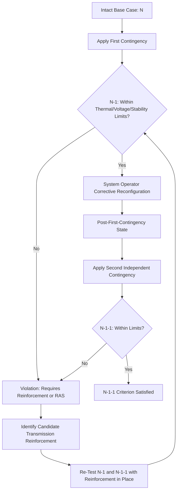

## Reliability-Based Planning Criteria (N-1, N-1-1)

### Overview

Reliability-based planning criteria are the deterministic contingency standards used in transmission system planning to ensure the grid can withstand the loss of critical equipment without violating thermal, voltage, or stability limits, and without uncontrolled cascading outages or unplanned loss of firm load. These criteria — most fundamentally the N-1 standard and its more stringent extension, N-1-1 — form the mandatory reliability floor that transmission planning studies must satisfy in North America, independent of and prior to any economic optimization considerations layered on top in a full transmission expansion planning process.

### The "N" Notation and Base Case Concept

**Key Points**

- "N" represents the total number of significant elements in a defined portion of the power system (generators, transmission lines, transformers, reactive compensation devices) operating in their normal, intact configuration — the base case against which contingencies are measured.
- Contingency criteria are expressed as "N minus" some number of elements, describing how many of those elements are assumed lost simultaneously (or in sequence) when testing system performance.
- The base case itself must reflect a specific, defined system condition (e.g., summer peak load, winter peak load, light load/shoulder season) with a specific generation dispatch pattern, since system performance under contingency can vary substantially across different operating conditions — a single "N" case is therefore actually a family of cases across relevant seasons and dispatch scenarios.

### N-1 Criterion

**Key Points**

- The N-1 criterion requires that the system remain within acceptable thermal, voltage, and stability limits following the loss of any single credible contingency — typically one transmission line, one transformer, or one generating unit — with all other elements remaining in service.
- This is the baseline, universally applied reliability standard across essentially all of North America, formalized in NERC's Transmission Planning (TPL) standards, and represents the minimum acceptable level of redundancy: the system must not fail catastrophically or shed firm load due to a single, reasonably foreseeable equipment failure.
- N-1 analysis is performed for every element in the study footprint deemed a "credible contingency" (generally all in-service transmission facilities above a defined voltage threshold, and major generating units), meaning a full N-1 study for a large system requires evaluating system performance under potentially thousands of individual contingency simulations.
- **Post-contingency performance requirements** typically include: no thermal overloads beyond emergency ratings, no voltage excursions outside acceptable bands, no loss of voltage or transient stability, and no automatic firm load shedding for most contingency categories (though planned, controlled load shedding may be acceptable for certain more extreme, lower-probability contingency categories under NERC's tiered performance requirements).

### N-1-1 Criterion

**Key Points**

- The N-1-1 criterion (sometimes written N-1-1 or described as "sequential N-1") requires that the system withstand a *second* contingency occurring after the system has already been reconfigured following an initial contingency — i.e., the system must survive one more single-element loss even while already operating in a post-first-contingency, already-stressed state.
- This differs meaningfully from a simultaneous N-2 loss: in N-1-1, system operators are assumed to have time to take corrective switching actions or redispatch after the first contingency before the second, independent contingency occurs, so the study reflects a *sequential* rather than *simultaneous* stress test.
- N-1-1 is applied selectively rather than universally — typically to critical, highly loaded, or otherwise high-consequence portions of the network (e.g., areas serving large metropolitan load centers, or configurations where a single first contingency would leave very little remaining margin), rather than to every possible element combination system-wide, since a full N-1-1 study across all possible sequential contingency pairs would be computationally prohibitive for large networks.
- The rationale for N-1-1 reflects the recognition that N-1-compliant systems, while safe against any single first failure, may be left in a substantially weakened state after that first failure — with materially reduced margin against a subsequent, independent failure occurring before repairs or full restoration are complete — making the sequential (not simultaneous) second-contingency test a meaningful additional layer of assurance for critical network areas.

### N-2 Criterion

**Key Points**

- N-2 refers to the *simultaneous* (not sequential) loss of two elements, and is typically applied only to specific high-consequence configurations where a single common-mode failure could plausibly cause both losses at once — the classic example being a double-circuit transmission line where both circuits share the same physical towers, such that a single structural failure (tower collapse, ice storm damage) could simultaneously remove both circuits.
- N-2 is applied much more narrowly than N-1, generally reserved for these specific common-structure or common-mode-failure configurations rather than as a general system-wide standard, reflecting that treating all possible two-element combinations as equally probable would be both computationally intractable and economically unjustified given the very low probability of most independent, non-common-mode double contingencies occurring simultaneously.

### Contingency Category Hierarchy (NERC TPL Framework Context)

**Key Points**

- North American reliability standards (administered by NERC, the North American Electric Reliability Corporation, under its Transmission Planning — TPL — standard series) define a hierarchy of contingency categories (commonly referenced as P0 through P7 in recent TPL standard versions) reflecting increasing severity and correspondingly different required system performance.
- Lower-numbered/more probable categories (e.g., loss of a single line, single transformer, single generator) generally require no interruption of firm load and no cascading outages.
- Higher-numbered/less probable, more extreme categories (e.g., certain multiple-contingency events, loss of a common structure, extreme events) may permit planned, controlled interruption of firm load as an acceptable outcome, reflecting a risk-informed graduation of required performance rather than a single uniform standard applied identically to every possible contingency severity.
- [Unverified: the exact current category definitions (P0–P7) and their precise associated performance requirements are periodically revised by NERC through its standards development process; verify the specific TPL standard version in effect for the study year and region before relying on exact category definitions or performance thresholds.]

### Analytical Basis: Power Flow and Distribution Factors

**Key Points**

- N-1 (and N-1-1) contingency screening is computationally intensive if each contingency requires a full independent power flow re-solve; in practice, large-scale planning studies rely heavily on linear sensitivity factors to efficiently screen the full contingency set before targeted detailed analysis of flagged violations.
- **Power Transfer Distribution Factors (PTDFs):** Quantify the sensitivity of flow on a given transmission element to a change in power injection/withdrawal at a specific pair of buses, used to estimate how a transaction or dispatch change affects flows across the network without re-solving the full power flow.
- **Line Outage Distribution Factors (LODFs):** Quantify the sensitivity of flow on a monitored element to the *outage* of another specific element, allowing rapid estimation of post-contingency flows across the entire network for a given base-case dispatch, without re-solving power flow for each individual contingency:

$$f_{\ell}^{(k)} = f_{\ell}^{(0)} + LODF_{\ell,k} \cdot f_{k}^{(0)}$$

where $f_{\ell}^{(k)}$ is the post-contingency flow on monitored line $\ell$ following outage of line $k$, $f_{\ell}^{(0)}$ is the pre-contingency (base-case) flow on line $\ell$, $f_{k}^{(0)}$ is the pre-contingency flow on the outaged line $k$, and $LODF_{\ell,k}$ is the line outage distribution factor relating the two.

- This linearized sensitivity approach (based on a DC power flow approximation) allows rapid screening of thousands of contingencies to identify which ones produce potential thermal violations; flagged violations are then typically subjected to more detailed AC power flow analysis to confirm voltage and reactive power behavior that the linearized DC approximation does not capture.
- **Sequential (N-1-1) analysis** extends this concept by applying LODFs (or full re-dispatch) to an already-post-contingency flow state, then applying a second round of LODFs (or re-solve) to test the subsequent contingency — computationally more demanding than single-contingency N-1 screening because it requires evaluating contingency pairs rather than single contingencies, though intelligent screening (limiting the search to plausible/critical pairs rather than the full combinatorial set) keeps this tractable for the selectively-applied areas where N-1-1 is required.

### Illustrative Example: N-1 Thermal Violation Screening

**Example**

Consider a monitored transmission line $\ell$ carrying 300 MW in the intact base case, with a normal thermal rating of 400 MW and an emergency (short-term post-contingency) rating of 480 MW. A nearby parallel line $k$ carries 350 MW in the base case. Suppose the LODF relating line $\ell$'s flow to the outage of line $k$ is calculated as $LODF_{\ell,k} = 0.55$ (meaning 55% of line $k$'s pre-contingency flow would redistribute onto line $\ell$ if line $k$ were lost).

**Post-contingency flow estimate on line $\ell$ following loss of line $k$:**

$$f_{\ell}^{(k)} = 300 + (0.55 \times 350) = 300 + 192.5 = 492.5 \text{ MW}$$

Since $492.5$ MW exceeds line $\ell$'s emergency rating of 480 MW, this contingency would be flagged as a thermal violation requiring corrective action — potential remedies could include a transmission reinforcement (upgrading line $\ell$'s rating or adding parallel capacity), a redispatch/re-scheduling constraint limiting pre-contingency flow on either line, or an operating procedure (e.g., a Special Protection System/Remedial Action Scheme) that automatically adjusts generation or load following detection of the line $k$ outage to bring flow on line $\ell$ back within its emergency rating.

### N-1 vs. N-1-1 Sequential Testing (Diagram)

### Remedial Action Schemes as an Alternative to Physical Reinforcement

**Key Points**

- Rather than building new transmission capacity to resolve every identified N-1 or N-1-1 violation, planners may employ Remedial Action Schemes (RAS), also called Special Protection Systems (SPS) — automated control systems that detect a specific contingency and automatically take a pre-programmed corrective action (generation runback, controlled load shedding, capacitor/reactor switching, or intentional islanding) within a fraction of a second to prevent limit violations.
- RAS/SPS can be a more cost-effective near-term solution than building new transmission facilities, particularly for addressing a specific, well-defined violation, but generally requires ongoing maintenance, testing, and reliability oversight of the automated scheme itself, and reliance on RAS as a permanent substitute for physical reinforcement is generally disfavored by reliability standards for widespread, indefinite use, since a RAS failure (misoperation or failure to operate) introduces its own risk that must be accounted for in the overall reliability assessment. [Inference: the specific regulatory and reliability-standard limits on the extent to which RAS/SPS may substitute for physical transmission reinforcement, versus being used only as a temporary or supplementary measure, vary by NERC region and specific TPL standard requirements; verify current standard language for precise applicability limits.]

### Interaction with Economic and Long-Term Planning Processes

**Key Points**

- Reliability-based N-1/N-1-1 criteria represent a mandatory compliance floor that must be satisfied regardless of economic optimization outcomes — a candidate transmission expansion plan identified as least-cost from a pure production-cost-minimization perspective (see Transmission Expansion Planning Methods) must still separately pass N-1/N-1-1 contingency screening before it can be considered a viable, compliant plan.
- In practice, many transmission reinforcements are justified by multiple overlapping drivers simultaneously — a line that resolves an N-1 thermal violation may also provide meaningful congestion relief and economic production cost savings, and increasingly, planning processes (including those required under FERC Order No. 1920's long-term regional planning framework) evaluate reliability, economic, and public policy benefits jointly rather than treating reliability compliance as a wholly separate, siloed screening step.
- As inverter-based resources (wind, solar, battery storage) constitute a growing share of the generation fleet, some traditional assumptions embedded in N-1/N-1-1 contingency analysis — particularly around dynamic/transient stability behavior and reactive power support characteristics following a contingency — require updated modeling approaches, since inverter-based resources behave differently under fault and post-fault conditions than traditional synchronous generation. [Unverified: the specific evolving NERC standards and modeling guidance addressing inverter-based resource contingency behavior are an active area of standards development; verify current NERC guidance documents for up-to-date modeling requirements.]

### Next Steps

- **Related Topics:**
  - Transmission Expansion Planning Methods
  - Power Transfer Distribution Factors and Contingency Analysis
  - Security-Constrained Economic Dispatch and Optimal Power Flow
  - Long-Term Regional Transmission Planning and FERC Order 1920
  - Remedial Action Schemes and Special Protection Systems
  - Voltage Stability and Transient Stability Analysis
  - Inverter-Based Resource Performance and Grid Stability
  - Interregional Transmission Coordination