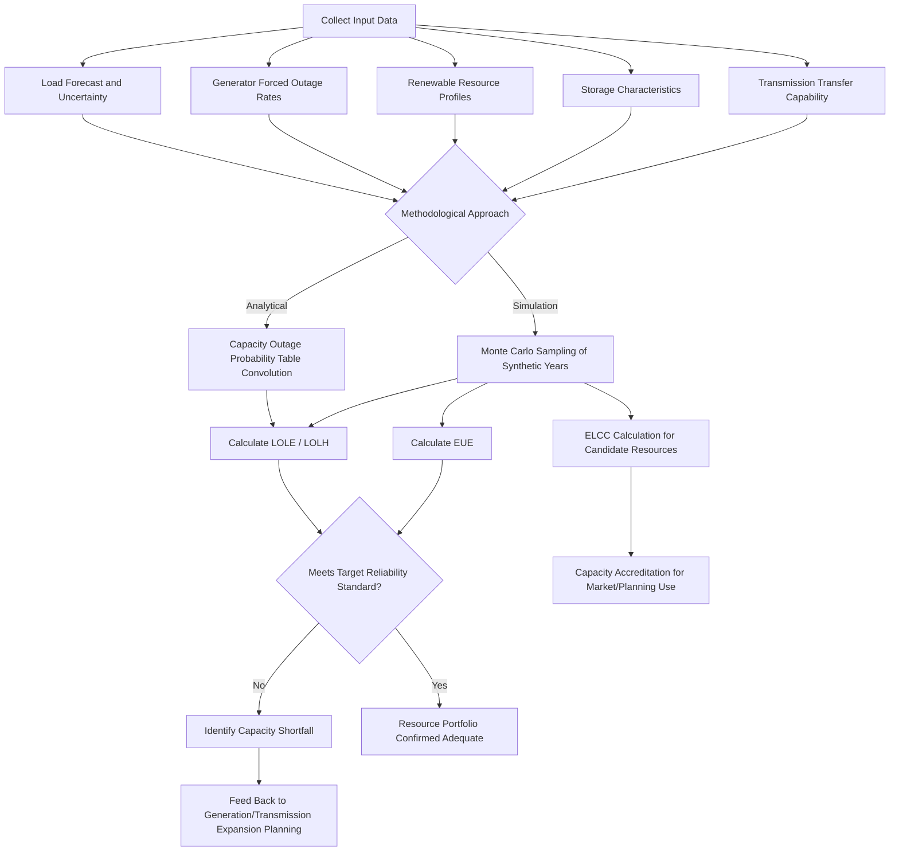

## Resource Adequacy Assessment

### Overview

Resource adequacy (RA) assessment is the analytical discipline of quantifying whether a power system has, or is projected to have, sufficient generation, demand response, and storage capacity to reliably meet forecasted demand across a defined future period, accounting for the probabilistic nature of equipment failures, weather-driven load and renewable output variability, and forecast uncertainty. It is distinct from — but feeds directly into — the market and policy mechanisms (capacity markets, resource adequacy requirements) covered under power system economics, and from the investment decisions made in generation expansion planning; RA assessment is the probabilistic engineering analysis that determines *how much* capacity is needed and *whether* a given resource portfolio meets that need.

### Purpose and Position in the Planning Process

**Key Points**

- RA assessment answers a fundamentally probabilistic question — not "will the system have enough capacity" (a deterministic yes/no) but "what is the probability, frequency, or expected magnitude of a capacity shortfall," recognizing that some non-zero risk of shortfall is generally accepted as economically efficient rather than pursuing zero-risk (which would require uneconomically excessive over-building).
- RA assessment results directly determine the target reserve margin or capacity procurement target used in capacity markets (see Capacity Markets and Resource Adequacy Mechanisms) and validate whether a candidate generation expansion plan (see Generation Expansion Planning Methods) actually achieves acceptable reliability, closing the loop between economic optimization and physical reliability performance.
- Unlike transmission reliability criteria (N-1, N-1-1), which are deterministic contingency-based standards evaluating specific defined failure scenarios, resource adequacy assessment is inherently probabilistic, using Monte Carlo or analytical convolution methods to capture the combined effect of many simultaneously uncertain variables (unit availability, load, renewable output, weather) rather than testing single defined contingencies.

### Core Reliability Metrics

**Key Points**

- **Loss of Load Expectation (LOLE):** The expected number of days (or hours, as LOLH — Loss of Load Hours) per year in which available generation capacity is insufficient to meet demand, calculated via probabilistic simulation. The most widely referenced planning target in North America is "1 day in 10 years" (LOLE = 0.1 days/year), though some jurisdictions apply alternative formulations or supplementary metrics.
- **Loss of Load Probability (LOLP):** The probability, for a specific hour or day, that available capacity will be less than demand — essentially the instantaneous or discrete-period building block from which LOLE is aggregated over the study period.
- **Expected Unserved Energy (EUE):** The expected annual MWh of demand that cannot be served, capturing both the frequency and the *magnitude* (depth and duration) of shortfall events — increasingly favored over LOLE-based metrics because a system could meet a "1 day in 10 years" LOLE target while still exhibiting very different risk profiles depending on whether shortfall events tend to be shallow and brief versus deep and prolonged, a distinction pure LOLE does not capture.
- **Loss of Load Hours (LOLH):** A related frequency-based metric counting expected hours (rather than days) of shortfall per year, offering finer temporal resolution than day-based LOLE, particularly relevant in systems where shortfall risk may be concentrated in specific narrow hourly windows (e.g., immediately after solar generation drops off in the evening net-peak period).
- **Normalized EUE / EUE as percentage of annual energy:** Sometimes expressed as a fraction of total annual energy demand to allow comparison across systems of different sizes, though absolute EUE (in MWh) remains the primary metric used in most formal reliability standards and target-setting processes.

### Formal Definition and Calculation Basis

**Key Points**

LOLE over a study period is calculated as the summation of the daily (or hourly) loss-of-load probabilities across all days (or hours) in the study period:

$$LOLE = \sum_{d=1}^{D} LOLP_d$$

where $D$ is the number of days in the study period (typically 365) and $LOLP_d$ is the probability that available capacity falls short of demand on day $d$, itself derived from convolving the probability distribution of available capacity (accounting for random forced outages across the generation fleet) with the load (and, where relevant, net load after subtracting variable renewable output) distribution for that day.

EUE is calculated as:

$$EUE = \sum_{d=1}^{D} E[\max(0, \, Load_d - AvailableCapacity_d)]$$

representing the expected value of unserved MWh, summed across the study period, capturing not just whether a shortfall occurs but its expected magnitude when it does.

### Methodological Approaches to RA Assessment

**Key Points — Two Primary Computational Approaches**

1. **Analytical/Convolution Methods:** Historically dominant approach, using probabilistic convolution of a Capacity Outage Probability Table (COPT) — representing the discrete probability distribution of total available generation capacity given each unit's independent forced outage rate — against the load duration curve to analytically derive LOLE. Computationally efficient and well-suited to systems dominated by conventional thermal generation with well-characterized, largely independent forced outage rates, but less naturally suited to capturing correlated renewable output variability, storage state-of-charge dynamics, and correlated extreme weather events without significant methodological extension.
2. **Monte Carlo Simulation Methods:** Increasingly the standard approach for modern RA assessment, particularly as systems incorporate significant variable renewable generation and storage — randomly samples many (often thousands to tens of thousands of) synthetic years or scenarios of load, weather-driven renewable output, and unit outages (drawing on historical or synthetic weather years and outage statistics), simulates system operation (including storage dispatch) for each sampled year, and aggregates the results to estimate LOLE, LOLH, and EUE with associated statistical confidence.

- Monte Carlo approaches are generally preferred in modern practice specifically because they naturally capture correlation structures that analytical convolution methods struggle to represent directly — for example, the correlation between high load (driven by extreme heat or cold) and reduced generator availability (extreme temperatures can increase thermal unit forced outage rates), and the correlation between renewable output across geographically dispersed but weather-correlated sites.

### Key Inputs Required for RA Assessment

**Key Points**

- **Load forecast and load shape:** Hourly or sub-hourly load profiles for the study period, increasingly requiring explicit modeling of load forecast uncertainty (rather than a single deterministic forecast) given the significant load growth uncertainty introduced by factors such as data center demand growth and electrification of transportation and heating.
- **Generator forced outage rates:** Historical or projected Equivalent Forced Outage Rate (EFORd) statistics by unit or technology class, capturing the probability a unit is unexpectedly unavailable when needed; critically, these statistics must increasingly account for weather-correlated (rather than purely independent/random) outage behavior following major weather events that revealed correlated failure modes not well captured by traditional independent-outage assumptions.
- **Renewable resource profiles:** Historical or synthetic weather-year time series of wind and solar output by location, essential for correctly capturing both the average and — critically — the tail-risk (low-output, high-load-coincidence) behavior of variable renewable resources.
- **Storage operating characteristics:** Power rating, energy capacity (duration), round-trip efficiency, and assumed dispatch/charging strategy for battery and other storage resources, since storage's reliability contribution is highly sensitive to how and when it is assumed to charge and discharge relative to the net load shape.
- **Transmission transfer capability:** For multi-area or multi-region RA assessments, the transfer capability between adjacent areas materially affects the degree to which one area can rely on imports during a local shortfall, requiring the RA model to represent not just aggregate capacity but also relevant transmission constraints between areas.
- **Demand response and price-responsive load characteristics:** Availability, response time, and duration limitations of demand response resources, which may have more constrained availability (e.g., limited to a certain number of hours or events per year) than dispatchable generation.

### Effective Load Carrying Capability (ELCC) as an RA Assessment Output

**Key Points**

- ELCC (introduced under Capacity Markets and Resource Adequacy Mechanisms and Generation Expansion Planning Methods) is fundamentally an *output* of an RA assessment process — it is derived by running the probabilistic reliability model twice (once with the candidate resource and once with an equivalent-cost hypothetical "perfect capacity" resource) and comparing the amount of perfect capacity needed to achieve the same target LOLE/EUE, expressing the actual resource's contribution as a fraction of its nameplate capacity.
- Because ELCC is a *marginal* concept (it reflects the reliability contribution of adding one more increment of a resource type given everything else already on the system), it must be recalculated whenever the overall resource mix or penetration level of that resource type changes materially — a static, one-time ELCC calculation becomes progressively less accurate as a system's actual resource mix evolves.
- ELCC calculations are computationally demanding precisely because they require running the full Monte Carlo or convolution-based RA assessment multiple times (with and without the candidate resource, often at multiple penetration increments to trace out a full ELCC curve), making efficient RA assessment methodology a practical prerequisite for tractable ELCC studies at the scale and frequency modern resource mixes increasingly require.

### RA Assessment Process Flow (Diagram)

### Illustrative Example: Simplified LOLE Calculation

**Example**

Consider a highly simplified system with only two generating units and a fixed daily peak load, evaluated for a single representative day:

- Unit 1: 100 MW capacity, forced outage rate (probability of being unavailable) = 0.05 (5%)
- Unit 2: 80 MW capacity, forced outage rate = 0.03 (3%)
- Daily peak load: 150 MW
- Assume unit outages are statistically independent of each other

**Capacity Outage Probability Table (COPT) — possible available capacity states:**

| State | Available Capacity | Probability |
| --- | --- | --- |
| Both units available | 180 MW | $0.95 \times 0.97 = 0.9215$ |
| Unit 1 out, Unit 2 available | 80 MW | $0.05 \times 0.97 = 0.0485$ |
| Unit 1 available, Unit 2 out | 100 MW | $0.95 \times 0.03 = 0.0285$ |
| Both units out | 0 MW | $0.05 \times 0.03 = 0.0015$ |

**Identifying loss-of-load states (available capacity < 150 MW load):**

The states with 80 MW, 100 MW, and 0 MW available capacity all fall below the 150 MW load requirement and constitute loss-of-load events.

$$LOLP_{day} = 0.0485 + 0.0285 + 0.0015 = 0.0785$$

If this daily risk profile were representative of every day in a 365-day year (a simplification for illustration only — in practice, load and outage risk vary substantially by day and season):

$$LOLE \approx 0.0785 \times 365 \approx 28.6 \text{ days/year}$$

This result is far above the common "1 day in 10 years" (0.1 days/year) target, illustrating — in this deliberately simplified two-unit example — how thin a margin (only 180 MW of capacity against 150 MW of peak load, a 20% reserve margin) can still produce an unacceptably high LOLE when unit sizes are large relative to total system size, underscoring why real systems require both adequate aggregate reserve margins and sufficient unit diversity (many smaller units, or geographically/technologically diverse large units) to avoid excessive single-contingency risk exposure.

### Multi-Area and Interregional RA Assessment

**Key Points**

- Many modern power systems are interconnected with neighboring areas via transmission ties, meaning a strictly single-area RA assessment (ignoring the possibility of importing capacity during a local shortfall) can materially overstate actual shortfall risk if meaningful import capability exists.
- Multi-area RA models explicitly represent the transfer capability between adjacent areas and simulate the joint probability of correlated or uncorrelated shortfall conditions across areas, recognizing that two areas experiencing simultaneous extreme weather-driven stress (e.g., a widespread winter storm) will have much less ability to rely on emergency imports from one another than the same two areas would during uncorrelated, independent stress events.
- This directly connects to the resilience rationale for interregional transmission coordination (see Interregional Transmission Coordination): the reliability *value* of increased interregional transfer capability is itself quantified through multi-area RA assessment, since the benefit of a proposed interregional transmission upgrade in reducing EUE or LOLE across the combined footprint is a direct RA assessment output that feeds into interregional benefit-cost analysis.

### Emerging Challenges in RA Assessment

**Key Points**

- **Correlated extreme weather risk:** Recent major weather events have revealed that traditional independent-forced-outage assumptions embedded in classical RA methods can significantly understate risk during extreme, widespread weather conditions where many generating units (particularly natural gas units exposed to fuel supply and wellhead freeze-off risk, and units with inadequate winterization) fail simultaneously due to a common weather-driven cause rather than independent random failure — prompting a shift toward explicitly modeling weather-correlated outage behavior rather than assuming statistical independence across units. [Unverified: the specific magnitude of correlated outage risk and resulting methodological adjustments vary by region, generation fleet composition, and ongoing standards development; verify current NERC and regional RA assessment methodology documentation for specifics.]
- **Storage duration and depletion risk:** As battery storage penetration grows, RA assessment must increasingly capture the risk that sequential batteries "run out" of stored energy during extended net-peak periods (particularly multi-hour evening periods following solar sunset), a dynamic that a simple capacity-only (MW-based) representation cannot capture, requiring explicit energy-limited (state-of-charge-aware) modeling within the RA simulation.
- **Growing winter/shoulder-season risk:** In systems experiencing significant electrification of heating load, RA assessment increasingly must evaluate winter and shoulder-season conditions with the same rigor traditionally reserved for summer peak assessment, since electrification can shift or create new seasonal peak risk that legacy RA processes calibrated primarily around summer conditions may not adequately capture. [Inference: the degree and timing of this seasonal risk shift is specific to each system's electrification trajectory and climate zone, and is not a uniform or precisely quantifiable claim applicable to all systems.]
- **Load forecast uncertainty from large, lumpy new loads:** Rapid growth in large individual loads (e.g., data centers) can introduce step-change load forecast uncertainty that differs qualitatively from the smoother, more continuous historical load growth patterns that traditional load forecasting and RA assessment methods were designed around.

### Next Steps

- **Related Topics:**
  - Capacity Markets and Resource Adequacy Mechanisms
  - Generation Expansion Planning Methods
  - Effective Load Carrying Capability (ELCC) Modeling Methodologies
  - Interregional Transmission Coordination
  - Reliability-Based Planning Criteria (N-1, N-1-1)
  - Battery Storage Sizing and Duration Optimization
  - Load Forecasting Methods for Long-Term Planning
  - Extreme Weather Risk and Correlated Outage Modeling in Reliability Studies