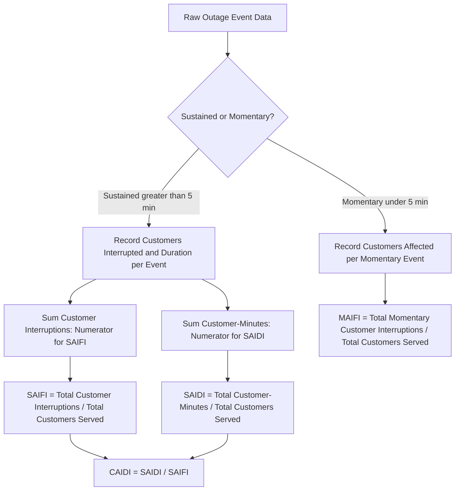

## Reliability Indices: SAIDI, SAIFI, CAIDI, and MAIFI

### Overview

Distribution system reliability indices are standardized quantitative metrics used by utilities, regulators, and grid planners to measure the frequency and duration of service interruptions experienced by customers. Unlike the probabilistic resource adequacy metrics (LOLE, EUE) used for long-term generation planning, these indices are primarily *historical performance metrics*, calculated from actual outage event data recorded over a defined reporting period (typically annual), and are the standard basis for utility regulatory reporting, performance benchmarking, and reliability-improvement investment justification at the distribution system level. The core set — SAIDI, SAIFI, CAIDI, and MAIFI — is standardized in North America primarily through IEEE Standard 1366.

### Foundational Concepts and Definitions

**Key Points**

- **Sustained interruption:** An outage lasting longer than a defined threshold — most commonly greater than 5 minutes under IEEE Std. 1366 convention — that requires manual intervention (crew dispatch, switching) to restore service; sustained interruptions are the basis for SAIDI, SAIFI, and CAIDI.
- **Momentary interruption:** A brief outage, typically lasting less than the sustained-interruption threshold (commonly under 5 minutes), often caused by automatic protective device operation (e.g., a recloser operation clearing a temporary fault) that restores service automatically without crew intervention; momentary interruptions are the basis for MAIFI.
- **Customer-interruption:** The fundamental unit underlying most indices — one customer experiencing one interruption event. A single outage event affecting 1,000 customers is recorded as 1,000 customer-interruptions for index calculation purposes, regardless of it being one physical event.
- **Customer-minutes of interruption:** The product of the number of customers interrupted and the duration (in minutes) they were without service for a given event, summed across all events in the reporting period; this is the fundamental building block for duration-based indices like SAIDI.
- Reporting periods are typically annual (calendar year), though some regulatory frameworks require rolling or multi-year reporting for trend analysis and to smooth the effect of unusually severe single-year weather events.

### SAIDI — System Average Interruption Duration Index

**Key Points**

- SAIDI measures the average total duration of sustained interruptions experienced by a customer over the reporting period, expressed in minutes (or sometimes hours) per customer per year.
- SAIDI is the most commonly cited "headline" reliability metric because it directly reflects the customer experience of *total outage time*, integrating both how often outages occur and how long they last into a single number.

$$SAIDI = \frac{\sum_{i} N_i \cdot r_i}{N_T}$$

where $N_i$ is the number of customers interrupted by sustained interruption event $i$, $r_i$ is the restoration duration (in minutes) of event $i$, and $N_T$ is the total number of customers served in the system.

### SAIFI — System Average Interruption Frequency Index

**Key Points**

- SAIFI measures the average number of sustained interruptions experienced by a customer over the reporting period, expressed in interruptions per customer per year — it captures *frequency* independent of how long each interruption lasted.

$$SAIFI = \frac{\sum_{i} N_i}{N_T}$$

where $N_i$ is the number of customers interrupted by sustained interruption event $i$, and $N_T$ is the total number of customers served in the system.

- A system could have a "good" (low) SAIFI while still having a "poor" (high) SAIDI if its relatively infrequent outages tend to last a very long time — this is precisely the distinction that CAIDI is designed to isolate.

### CAIDI — Customer Average Interruption Duration Index

**Key Points**

- CAIDI measures the average restoration time *per interruption event experienced*, expressed in minutes (or hours) per interruption — it answers the question "when a customer does experience an outage, how long does it typically last?" as distinct from SAIDI's system-wide average across all customers (including those who experienced zero outages).

$$CAIDI = \frac{SAIDI}{SAIFI} = \frac{\sum_{i} N_i \cdot r_i}{\sum_{i} N_i}$$

- CAIDI is mathematically derived directly from SAIDI and SAIFI rather than being an independently calculated index, making the three metrics interdependent: given any two, the third is determined.
- CAIDI is particularly useful for evaluating restoration process efficiency and crew responsiveness in isolation from underlying outage frequency (which is more closely tied to asset condition, vegetation management, and equipment failure rates), since a utility could improve CAIDI purely through better outage response logistics without necessarily changing how often outages initially occur.

### MAIFI — Momentary Average Interruption Frequency Index

**Key Points**

- MAIFI measures the average number of *momentary* interruptions experienced by a customer over the reporting period, expressed in momentary interruptions per customer per year — the momentary-interruption counterpart to SAIFI's sustained-interruption frequency measure.

$$MAIFI = \frac{\sum_{i} N_{mi}}{N_T}$$

where $N_{mi}$ is the number of customers affected by momentary interruption event $i$, and $N_T$ is the total number of customers served.

- MAIFI captures a category of service quality degradation that SAIDI and SAIFI do not: brief automatic-recloser-driven "blinks" that do not register as sustained outages under standard duration thresholds but are nonetheless disruptive to certain customer types, particularly those with sensitive electronic equipment, industrial processes with restart procedures, or digital clocks/controls that require resetting after even a momentary loss of power.
- Some utilities also track a related variant, MAIFIE (Momentary Average Interruption Event Frequency Index), which counts *events* (a single multi-operation recloser sequence counted once) rather than counting each individual momentary interruption operation separately, addressing ambiguity in how to count reclosers that operate multiple times in rapid succession during a single fault-clearing sequence.

### Index Relationships and Calculation Flow (Diagram)

### Illustrative Numerical Example

**Example**

Consider a distribution utility serving 100,000 customers over one calendar year, with the following recorded sustained interruption events:

| Event | Customers Interrupted | Restoration Duration (minutes) |
| --- | --- | --- |
| Event 1 (storm) | 8,000 | 240 |
| Event 2 (equipment failure) | 1,500 | 90 |
| Event 3 (vehicle accident) | 600 | 150 |
| Event 4 (tree contact) | 3,200 | 60 |

Additionally, 12,000 total customer-momentary-interruptions were recorded from recloser operations during the year.

**Step 1 — Total customer-interruptions (sustained):**

$$8{,}000 + 1{,}500 + 600 + 3{,}200 = 13{,}300$$

**Step 2 — Total customer-minutes of interruption:**

$$(8{,}000 \times 240) + (1{,}500 \times 90) + (600 \times 150) + (3{,}200 \times 60)$$

$$= 1{,}920{,}000 + 135{,}000 + 90{,}000 + 192{,}000 = 2{,}337{,}000 \text{ customer-minutes}$$

**Step 3 — SAIDI:**

$$SAIDI = \frac{2{,}337{,}000}{100{,}000} = 23.37 \text{ minutes/customer/year}$$

**Step 4 — SAIFI:**

$$SAIFI = \frac{13{,}300}{100{,}000} = 0.133 \text{ interruptions/customer/year}$$

**Step 5 — CAIDI:**

$$CAIDI = \frac{SAIDI}{SAIFI} = \frac{23.37}{0.133} \approx 175.7 \text{ minutes/interruption}$$

**Step 6 — MAIFI:**

$$MAIFI = \frac{12{,}000}{100{,}000} = 0.12 \text{ momentary interruptions/customer/year}$$

This result set indicates that, on average, each customer experienced about 0.133 sustained interruptions during the year, each typically lasting roughly 176 minutes when it occurred, contributing to a system-wide average of about 23.4 minutes of total sustained outage time per customer for the year — plus an additional 0.12 brief automatic-recloser "blinks" per customer on average.

### Data Aggregation Boundaries and Reporting Conventions

**Key Points**

- **Major event day (MED) exclusion:** IEEE Std. 1366 defines a statistical methodology (based on daily SAIDI values exceeding a calculated threshold, commonly using a "2.5 Beta" method on the log-normal distribution of daily system SAIDI) for identifying "major event days" — typically severe storms — that can be reported and analyzed separately from "normal" day-to-day reliability performance, since including major storm days in standard annual indices can dramatically skew results and obscure underlying baseline reliability trends. [Unverified: the precise current statistical threshold methodology (e.g., specific beta parameter conventions) may be periodically refined in updated IEEE 1366 revisions; verify against the current standard edition in effect.]
- **Indices with and without major event days:** Utilities and regulators commonly report both a "with major events" figure (reflecting the full customer experience including severe weather impact) and an "excluding major events" figure (reflecting controllable, baseline day-to-day performance more directly attributable to utility asset management and operational practices) — regulatory performance benchmarks and incentive/penalty mechanisms typically reference the excluding-major-events figures to avoid penalizing utilities for extreme weather largely outside their control.
- **System-wide vs. circuit-level/feeder-level indices:** While SAIDI, SAIFI, CAIDI, and MAIFI are most commonly reported at the aggregate system level, the same formulas can be (and often are) calculated at the individual circuit or feeder level, which is particularly useful for utility internal reliability-improvement targeting — identifying the specific "worst-performing circuits" for prioritized capital investment rather than relying solely on the system-wide average, which can mask significant reliability disparities between well-performing and poorly-performing areas of the same system.

### Related and Supplementary Indices

**Key Points**

- **CAIFI (Customer Average Interruption Frequency Index):** Similar to SAIFI but normalizes by the number of customers *who actually experienced at least one interruption* during the period, rather than by total customers served — useful for characterizing the experience specifically of affected customers rather than diluting the metric across an entire customer base including those with zero outages.
- **ASAI (Average Service Availability Index):** Expresses reliability as the fraction (or percentage) of total customer-hours during which service was actually available, calculated as:

$$ASAI = \frac{\text{Customer-Hours of Service Availability}}{\text{Customer-Hours Demanded}} = 1 - \frac{SAIDI \text{ (in hours)}}{8760 \text{ hours/year}}$$

ASAI is often expressed with multiple "nines" of reliability (e.g., 99.9% availability), analogous to reliability metrics used in other infrastructure and IT/telecommunications contexts, providing an intuitive percentage-based framing that some stakeholders find more accessible than raw minutes-per-year figures.

- **ENS (Energy Not Served):** Distinct from the customer-count-based indices above, ENS measures the total energy (MWh) not delivered due to interruptions, providing a magnitude-weighted view analogous to the EUE concept used in generation resource adequacy assessment, though applied at the distribution outage level rather than the generation shortfall level.

### Applications in Utility Planning and Regulation

**Key Points**

- **Performance-based regulation:** Many state and national regulators tie a portion of utility allowed revenue or return on equity to achievement of specific SAIDI/SAIFI targets or year-over-year improvement, creating direct financial consequences for reliability performance and making accurate, consistent, and auditable index calculation methodology a matter of significant regulatory and financial importance.
- **Reliability investment prioritization:** Circuit-level and feeder-level index calculation allows utilities to target capital investment (undergrounding, vegetation management, equipment replacement, automated switching/reclosing devices) toward the specific portions of the system contributing disproportionately to system-wide SAIDI/SAIFI, following an approach often informally described as addressing the "worst-performing circuits" first for greatest reliability improvement per dollar invested.
- **Benchmarking across utilities:** Industry associations and regulatory bodies periodically compile and compare SAIDI/SAIFI statistics across utilities to establish performance benchmarks, though meaningful cross-utility comparison requires care given differing major-event-day exclusion methodologies, differing service territory characteristics (urban vs. rural, overhead vs. underground infrastructure mix), and differing weather exposure between utilities. [Inference: the specific comparability caveats and their quantitative impact on any given cross-utility benchmarking exercise depend on the specific utilities, regions, and methodologies being compared, and general awareness of this limitation does not itself establish a specific quantified adjustment.]
- **Grid modernization and resilience investment justification:** MAIFI in particular has gained increased attention as a metric justifying investment in advanced distribution automation (e.g., fault location, isolation, and service restoration — FLISR — systems, and advanced reclosing schemes) that can reduce the frequency or customer-impact scope of momentary interruptions, even where such investment may have limited direct effect on the sustained-interruption-based SAIDI/SAIFI metrics.

### Next Steps

- **Related Topics:**
  - Resource Adequacy Assessment
  - Distribution Automation and Fault Location, Isolation, and Service Restoration (FLISR)
  - Performance-Based Regulation for Utility Ratemaking
  - Vegetation Management and Overhead Line Reliability
  - Distribution System Resilience Planning and Extreme Weather Hardening
  - Reliability-Based Planning Criteria (N-1, N-1-1)
  - Advanced Metering Infrastructure and Outage Management Systems
  - Smart Grid Self-Healing and Automated Switching Schemes