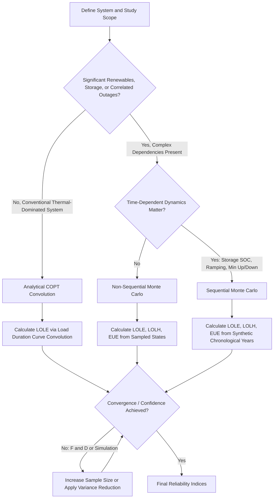

## Probabilistic Reliability Assessment Methods

### Overview

Probabilistic reliability assessment methods form the analytical foundation for quantifying power system reliability under uncertainty, providing the mathematical and computational techniques used to translate component-level failure statistics into system-level reliability metrics. These methods underpin both generation resource adequacy assessment (LOLE, EUE) and, in extended forms, composite system and distribution reliability analysis (SAIDI, SAIFI). Unlike deterministic contingency criteria (N-1, N-1-1), which test discrete, specifically-defined failure scenarios against fixed pass/fail limits, probabilistic methods explicitly model the *likelihood* of various system states and quantify risk in terms of probability, frequency, duration, and expected magnitude of inadequate performance.

### Why Probabilistic Methods Are Necessary

**Key Points**

- Power system components fail randomly and independently (for the most part) according to statistically characterizable failure and repair rates; a purely deterministic analysis considering only a single fixed "worst case" cannot capture the full richness of a system's actual risk profile, particularly the difference between a system that fails rarely but catastrophically versus one that fails somewhat more often but with much smaller consequence.
- Deterministic criteria are computationally simpler and provide a clear, auditable pass/fail compliance standard (valuable for regulatory purposes), but do not inherently answer economically important questions such as "how much would reliability improve if we invested an additional $X" or "what is the expected annual cost of unreliability" — questions that require assigning probabilities and expected values, which only probabilistic methods can address.
- Modern power systems increasingly require probabilistic methods specifically because variable renewable generation output, weather-correlated demand, and correlated extreme-weather-driven outages introduce complex statistical dependencies that simple deterministic worst-case analysis cannot adequately represent — a purely deterministic "N-1" style test does not naturally extend to characterizing the risk contribution of, for example, a 30% probability of low wind output coinciding with a 15% probability of extreme cold-driven thermal unit outages.

### Two-State and Multi-State Component Models

**Key Points**

- The most fundamental building block of probabilistic reliability assessment is the **two-state component model**, representing each component (generator, transmission line) as being in one of two states — "up" (available) or "down" (on forced outage) — characterized by two key parameters:
  - **Failure rate ($\lambda$):** The expected frequency of transitions from the up state to the down state, typically expressed in failures per year or per unit-hour.
  - **Repair rate ($\mu$):** The expected frequency of transitions from the down state back to the up state, the inverse of mean time to repair (MTTR).
- The steady-state (long-run average) probability of a component being in the down state — its **forced outage rate (FOR)** or unavailability — is derived from these two parameters:

$$FOR = \frac{\lambda}{\lambda + \mu} = \frac{MTTR}{MTTF + MTTR}$$

where $MTTF$ (mean time to failure) is $1/\lambda$ and $MTTR$ (mean time to repair) is $1/\mu$.

- **Multi-state models** extend beyond the simple binary up/down representation to capture partial outage states — for example, a generating unit derated to 60% of nameplate capacity due to a partial equipment fault rather than being fully unavailable — providing more granular and realistic representation for components where partial-capacity operation is a common and reliability-relevant occurrence.
- **Markov chain representation:** Two-state and multi-state component models are formally special cases of continuous-time Markov chains, where state transition rates (failure and repair rates) define the probability of moving between states, and the steady-state probability distribution across states is obtained by solving the Markov chain's balance equations.

### Analytical Methods

**Key Points**

1. **Capacity Outage Probability Table (COPT) Construction:** The core analytical technique for generation system reliability assessment — builds a discrete probability distribution of total available system generation capacity by successively convolving each individual unit's two-state (or multi-state) capacity outage probability distribution with the running total, typically using a recursive algorithm to manage the combinatorial growth in possible capacity states as more units are added:

$$P(X = x) = P_{n-1}(X = x) \cdot (1 - FOR_n) + P_{n-1}(X = x - C_n) \cdot FOR_n$$

where $P_{n-1}(X=x)$ is the cumulative probability of available capacity $x$ after considering the first $n-1$ units, $C_n$ is the capacity of the $n$-th unit being added, and $FOR_n$ is its forced outage rate — this recursive convolution builds up the full system COPT unit by unit.

2. **Load-Duration-Curve Convolution:** Once the COPT is constructed, it is convolved against the system's load duration curve (or, for multi-period studies, against each period's load distribution) to derive LOLE, following the analytical approach summarized under Resource Adequacy Assessment.
3. **Frequency and Duration (F&D) Method:** Extends basic LOLE/probability calculation to also estimate the *frequency* (expected number of occurrences per year) and *average duration* of loss-of-load events, not just the total probability or expected days of shortfall — providing additional insight into whether reliability risk manifests as many brief events or fewer, longer events, which can have different operational and economic implications even at equivalent total LOLE.
4. **Analytical methods' key limitation:** These techniques generally assume component failures are statistically independent, which becomes an increasingly poor approximation as common-mode and weather-correlated failure mechanisms (e.g., widespread cold-weather-driven natural gas system failures affecting many generating units simultaneously) become more reliability-significant, motivating the shift toward simulation-based methods described below.

### Monte Carlo Simulation Methods

**Key Points**

- **Sequential Monte Carlo simulation:** Generates synthetic chronological time series (often spanning a full year or multiple years, at hourly or sub-hourly resolution) of component states, load, and renewable output, explicitly preserving the *temporal sequence* of events — critical for correctly capturing storage state-of-charge dynamics, ramping constraints, minimum up/down time restrictions, and the duration (not just occurrence) of shortfall events.
- **Non-sequential (state sampling) Monte Carlo simulation:** Randomly samples individual system states (a specific combination of unit availabilities and a specific load level) without regard to chronological sequence between samples, generally computationally faster per sample than sequential simulation but unable to directly capture time-dependent phenomena like storage depletion across consecutive hours or minimum outage duration constraints.
- **Variance reduction techniques:** Because a very large number of Monte Carlo samples (often tens of thousands of synthetic years) may be needed to achieve acceptably tight statistical confidence intervals around rare-event metrics like LOLE (since loss-of-load events are, by design, intended to be rare), variance reduction techniques such as importance sampling (deliberately over-sampling higher-risk conditions and then re-weighting results) and control variates are commonly employed to reduce the computational burden needed to achieve a given confidence level.
- **Convergence criteria:** Simulation is typically run until calculated reliability indices stabilize within a pre-defined statistical tolerance (e.g., the coefficient of variation of the LOLE estimate falling below a target threshold such as 5%), rather than running a fixed, arbitrarily-chosen number of iterations — ensuring computational effort is calibrated to the actual convergence behavior of the specific system and metric being estimated.
- Monte Carlo methods' key advantage over analytical convolution is their natural flexibility in representing complex dependencies (correlated renewable output across sites, weather-correlated outage rates, energy-limited storage dynamics, demand response availability constraints) that are difficult or impossible to represent tractably within a purely analytical convolution framework.

### Comparison of Methodological Approaches

| Method | Computational Approach | Strengths | Limitations |
| --- | --- | --- | --- |
| Analytical (COPT Convolution) | Recursive probability convolution | Fast, exact (given independence assumption), well-established | Struggles with correlated failures, energy-limited resources, chronological dynamics |
| Frequency and Duration (F&D) | Extension of analytical convolution with transition rates | Adds frequency/duration insight beyond simple LOLE | Same independence-assumption limitations as basic analytical methods |
| Non-Sequential Monte Carlo | Random state sampling | Computationally efficient per sample; flexible dependency modeling | Cannot capture time-sequential/storage-depletion dynamics directly |
| Sequential Monte Carlo | Synthetic chronological time-series simulation | Captures full chronological/storage/ramping dynamics; most flexible | Most computationally intensive; requires representative synthetic weather-year data |

### Reliability Assessment Method Selection Flow (Diagram)

### Illustrative Example: Recursive COPT Construction

**Example**

Building on the two-unit system introduced under Resource Adequacy Assessment, consider constructing the COPT recursively, adding one unit at a time, for a system with three units:

- Unit 1: 50 MW, FOR = 0.02
- Unit 2: 50 MW, FOR = 0.02
- Unit 3: 100 MW, FOR = 0.05

**Step 1 — After Unit 1 alone:**

| Capacity Out | Probability |
| --- | --- |
| 0 MW | 0.98 |
| 50 MW | 0.02 |

**Step 2 — Add Unit 2 (convolve with Unit 1's table):**

$$P(\text{0 MW out}) = 0.98 \times 0.98 = 0.9604$$

$$P(\text{50 MW out}) = (0.98 \times 0.02) + (0.02 \times 0.98) = 0.0392$$

$$P(\text{100 MW out}) = 0.02 \times 0.02 = 0.0004$$

**Step 3 — Add Unit 3 (convolve previous table with Unit 3's two-state distribution: 0.95 up, 0.05 down for 100 MW):**

$$P(\text{0 MW out}) = 0.9604 \times 0.95 = 0.91238$$

$$P(\text{50 MW out}) = 0.0392 \times 0.95 = 0.03724$$

$$P(\text{100 MW out}) = (0.0004 \times 0.95) + (0.9604 \times 0.05) = 0.00038 + 0.04802 = 0.0484$$

$$P(\text{150 MW out}) = 0.0392 \times 0.05 = 0.00196$$

$$P(\text{200 MW out}) = 0.0004 \times 0.05 = 0.00002$$

This final table represents the complete Capacity Outage Probability Table for the three-unit, 200 MW-total system, ready to be convolved against a load duration curve to compute LOLE, following the same conceptual approach illustrated in the simplified two-unit example under Resource Adequacy Assessment, but now correctly capturing all possible combinations of simultaneous unit outages across the full three-unit fleet.

### Composite System (Generation and Transmission) Reliability Assessment

**Key Points**

- **Hierarchical Level I (HLI):** Assesses generation adequacy alone, treating the transmission system as an ideal, unconstrained "copper plate" that can deliver any generated power anywhere on the system without loss or constraint — this is the level of analysis underlying the basic LOLE/EUE calculations described under Resource Adequacy Assessment.
- **Hierarchical Level II (HLII):** Extends the analysis to jointly assess generation *and* transmission adequacy, explicitly modeling transmission network constraints and their probabilistic outages alongside generation outages, capturing the risk that adequate generation exists system-wide but cannot be delivered to a specific load pocket due to transmission limitations or outages — computationally far more demanding since it requires power flow analysis (not merely capacity summation) for each sampled system state.
- **Hierarchical Level III (HLIII):** Further extends to include distribution system reliability, representing the full path from generation through transmission to individual distribution customers — rarely modeled in full detail at a system-wide scale due to computational complexity, with distribution reliability more commonly assessed separately using the historical-index-based methods described under Reliability Indices (SAIDI, SAIFI, CAIDI, MAIFI) rather than fully integrated probabilistic composite modeling.
- Composite system (HLII) reliability assessment is particularly relevant for evaluating the reliability *value* of specific transmission reinforcements (connecting directly to the interregional transfer capability and transmission expansion planning benefit-cost concepts discussed elsewhere), since it can directly quantify how a proposed transmission upgrade changes system-wide EUE by improving deliverability, not just aggregate generation capacity.

### Data Requirements and Statistical Considerations

**Key Points**

- **Historical outage data quality:** Probabilistic methods are only as reliable as the underlying failure and repair rate statistics used as inputs; utilities and reliability organizations (e.g., through NERC's Generating Availability Data System, GADS, in North America) maintain standardized databases of generator outage statistics specifically to support consistent, high-quality probabilistic reliability assessment across the industry.
- **Sample size and statistical confidence for rare events:** Because forced outage rates for well-maintained modern equipment are often quite low (single-digit percentages or lower), and loss-of-load events are, by design of an adequately-planned system, intended to be rare, obtaining statistically robust historical estimates of tail-risk behavior (rather than just average behavior) requires either very long historical data records or, increasingly, synthetic data generation techniques (e.g., physically-based synthetic weather-year generation for renewable output and weather-correlated outage modeling) to supplement necessarily limited historical extreme-event observations.
- **Non-stationarity concerns:** Climate trends, aging infrastructure, and evolving generation fleet composition mean that historical failure/repair statistics may not remain fully representative of future risk, requiring probabilistic reliability assessment methodologies to periodically update input statistics and, in some cases, explicitly model trend or non-stationary behavior rather than assuming a fixed, unchanging statistical distribution indefinitely. [Inference: the specific degree to which any given input statistic is affected by non-stationarity, and the appropriate methodological adjustment, is system- and context-specific and requires dedicated statistical analysis rather than a generic universal correction.]

### Applications Beyond Generation Adequacy

**Key Points**

- Probabilistic reliability assessment methods, while most prominently associated with generation resource adequacy (LOLE, EUE), also underpin transmission and substation equipment reliability-centered maintenance programs, informing optimal maintenance scheduling and spare-equipment inventory decisions based on quantified failure probability and consequence.
- The same foundational two-state/multi-state component modeling and Markov chain techniques extend to protection system reliability analysis (evaluating the probability of protective relay misoperation or failure-to-operate) and to broader power system resilience assessment frameworks that increasingly seek to quantify not just steady-state probabilistic risk but also time-varying risk during and after extreme, high-impact/low-probability events.
- ELCC calculations (introduced under Capacity Markets and Resource Adequacy Mechanisms and Resource Adequacy Assessment) are themselves a direct downstream application of these probabilistic methods, since deriving an ELCC value fundamentally requires running the full probabilistic reliability model (analytical or Monte Carlo) multiple times under different resource portfolio assumptions.

### Next Steps

- **Related Topics:**
  - Resource Adequacy Assessment
  - Effective Load Carrying Capability (ELCC) Modeling Methodologies
  - Reliability Indices: SAIDI, SAIFI, CAIDI, and MAIFI
  - Reliability-Based Planning Criteria (N-1, N-1-1)
  - Extreme Weather Risk and Correlated Outage Modeling in Reliability Studies
  - Composite System Reliability and Hierarchical Level II Assessment
  - Generating Availability Data System (GADS) and Outage Statistics
  - Battery Storage Sizing and Duration Optimization