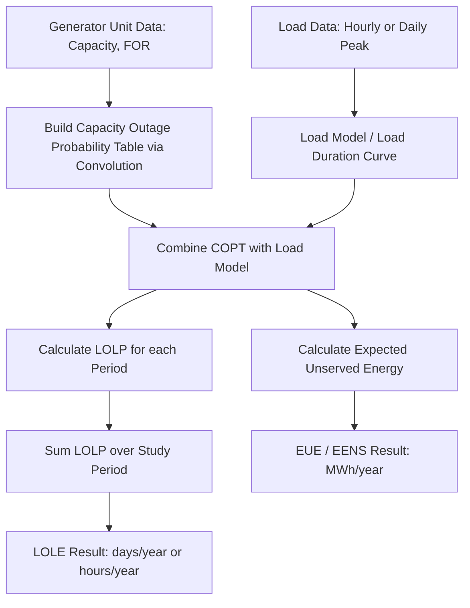

## Loss-of-Load Probability and Loss-of-Load Expectation

### Overview

Loss-of-Load Probability (LOLP) and Loss-of-Load Expectation (LOLE) are foundational probabilistic reliability indices used in power system generation adequacy assessment. They quantify the risk that available generation capacity will be insufficient to meet system demand, forming the analytical basis for capacity planning, reserve margin requirements, and resource adequacy standards used by system operators and regulators worldwide.

### Fundamental Concepts

#### Definition of LOLP

LOLP represents the probability that the system load will exceed the available generating capacity at a specific point in time. It is a dimensionless probability value between 0 and 1 (or expressed as a percentage), calculated by convolving the probability distribution of generator outages with the probability distribution of load.

$$LOLP = P(Load > Available\ Capacity)$$

#### Definition of LOLE

LOLE extends LOLP over a defined time period (typically one year) and is expressed as the expected number of days or hours during which load is expected to exceed available generation capacity.

$$LOLE = \sum_{t=1}^{T} LOLP_t$$

where $T$ is the number of time periods (days or hours) in the study period, and $LOLP_t$ is the loss-of-load probability calculated for period $t$.

The most widely adopted industry criterion is:

$$LOLE \leq 0.1\ days/year$$

This is commonly known as the "one day in ten years" criterion, historically established by many North American utilities and reliability councils.

### Theoretical Foundation

#### Generation Model: Capacity Outage Probability Table (COPT)

The core input to LOLP/LOLE calculation is the Capacity Outage Probability Table, which represents the probability distribution of total available generating capacity, accounting for forced outages of individual units.

For a single unit with forced outage rate (FOR) $q$, the probability of the unit being on outage is $q$, and the probability of being available is $(1-q)$.

For a system of $n$ independent units, the COPT is built by successive convolution:

$$P(X = x) = \sum_{i} P(\text{Unit}_i \text{ state}) \cdot P(\text{Remaining capacity} = x - c_i)$$

**Key Points:**

- **Forced Outage Rate (FOR):** $FOR = \dfrac{Forced\ Outage\ Hours}{Forced\ Outage\ Hours + Service\ Hours}$
- Units are typically modeled as two-state (up/down) Markov processes
- Larger units or multi-state units (derated states) require multi-state modeling
- The COPT is recursively built by adding one generating unit at a time to the cumulative distribution

#### Recursive COPT Construction Algorithm

Given an existing COPT $P_{n-1}(X)$ built from $n-1$ units, adding unit $n$ with capacity $C_n$ and FOR $q_n$ produces:

$$P_n(X = x) = (1 - q_n) \cdot P_{n-1}(X = x) + q_n \cdot P_{n-1}(X = x - C_n)$$

This is applied iteratively for each unit in the system, producing a cumulative probability table of available capacity outage states.

#### Load Model

The load model represents the probability distribution of system demand over the study period. Two primary approaches exist:

1. **Load Duration Curve (LDC):** Chronological load values sorted in descending order, representing the fraction of time load exceeds a given value.
2. **Daily Peak Load Variation Curve (DPLVC):** Used in the "daily peak" method for LOLE calculation, where each day's peak load is treated as a discrete random variable.

### Calculation Methodology

#### Step-by-Step LOLE Calculation (Daily Peak Method)

1. Construct the COPT for the generation system (convolve all unit outage states).
2. Determine the daily peak load for each day of the study period (from historical or forecast load data).
3. For each day, calculate the margin state: $Margin = Installed\ Capacity - Peak\ Load$.
4. For each day, find the LOLP by summing the probabilities in the COPT where the capacity outage exceeds the reserve margin, i.e., $P(Outage \geq Reserve\ Margin)$.
5. Sum the daily LOLP values across all days in the study period (typically 365) to obtain the annual LOLE in days/year.

**Example:**

Consider a simplified system with installed capacity of 1,000 MW, composed of:

- Unit A: 400 MW, FOR = 0.02
- Unit B: 400 MW, FOR = 0.02
- Unit C: 200 MW, FOR = 0.05

**Capacity Outage Probability Table (partial, cumulative):**

| Capacity Out (MW) | Available Capacity (MW) | Individual Probability | Cumulative Probability |
| --- | --- | --- | --- |
| 0 | 1000 | 0.9124 | 1.0000 |
| 200 | 800 | 0.0480 | 0.0876 |
| 400 | 600 | 0.0192 | 0.0396 |
| 600 | 400 | 0.0004 | 0.0204 |
| 800 | 200 | 0.0196 | 0.0200 |
| 1000 | 0 | 0.0004 | 0.0004 |

If the daily peak load on a given day is 850 MW, the reserve margin is $1000 - 850 = 150\ MW$. Loss of load occurs when the capacity outage exceeds 150 MW, i.e., when outage $\geq 200$ MW. From the table, the cumulative probability of outage $\geq 200$ MW is 0.0876. This value (0.0876) is that day's contribution to LOLE. Repeating this for all 365 days and summing yields the annual LOLE.

#### Hourly LOLP Method

For systems with significant intermittent generation (wind, solar) or where sub-daily load shape variation matters, LOLP is computed for each hour of the year (8,760 hours), and LOLE is expressed in hours/year:

$$LOLE_{hours} = \sum_{h=1}^{8760} LOLP_h$$

This method is increasingly standard in modern resource adequacy studies due to the growing penetration of variable renewable energy (VRE), where daily peak load alone is insufficient to capture net-load risk (e.g., "duck curve" evening ramp risk).

### Related and Derived Indices

| Index | Definition | Units |
| --- | --- | --- |
| LOLP | Probability of loss of load at a point in time | Probability (0-1) |
| LOLE | Expected duration of loss-of-load events over a period | Days/year or Hours/year |
| LOLF | Loss-of-Load Frequency — expected number of loss-of-load events per year | Occurrences/year |
| LOLD | Loss-of-Load Duration — average duration of a loss-of-load event | Hours/event |
| EUE / EENS | Expected Unserved Energy / Expected Energy Not Served — expected energy shortfall | MWh/year |
| EPNS | Expected Power Not Supplied | MW |

**Key Points:**

- LOLE is a *frequency-like* measure (days at risk), not a measure of severity or duration of interruption.
- EUE/EENS captures magnitude and is increasingly preferred as a complementary metric because it reflects the depth of shortfall, not just its occurrence.
- A system can have low LOLE but high EUE if rare events are severe (important for renewable-heavy grids with correlated outage risk).

### Modern Extensions and Considerations

#### Treatment of Variable Renewable Energy (VRE)

Wind and solar cannot be modeled with simple two-state FOR models because their availability is time-correlated and weather-driven rather than independently random. Modern LOLE studies use:

- **Effective Load Carrying Capability (ELCC):** The amount of firm (perfectly reliable) capacity that a VRE resource can displace while maintaining the same LOLE.
- **Multi-year chronological simulation:** Using historical weather years (e.g., 10-20 years of hourly wind/solar profiles) convolved with load and thermal unit outages via Monte Carlo or sequential simulation.

#### Correlated and Common-Mode Outages

Standard COPT convolution assumes independent unit outages. Extreme weather events (e.g., the 2021 Texas winter storm) demonstrated that correlated forced outages across many units simultaneously can produce loss-of-load risk far exceeding what independent-outage COPT models predict. This has driven adoption of **Extreme Weather Assessment** methods and **temperature-dependent forced outage rates** in modern adequacy studies (e.g., NERC's Probabilistic Assessment methodology).

#### Interconnection and Tie-Line Assistance

For interconnected systems, LOLE calculations may incorporate:

- Probabilistic modeling of tie-line capacity availability
- Assumption of reciprocal emergency assistance from neighboring balancing authorities
- Reduction in effective LOLE due to load diversity and capacity sharing across regions

### Computational Methods

#### Analytical Convolution Method

Directly computes the COPT via recursive convolution (as shown above) and combines it with the load model analytically. Computationally efficient but assumes independence of outages and requires discretization of capacity states.

#### Monte Carlo Simulation Method

Sequential or non-sequential Monte Carlo simulation randomly samples unit availability states (and, in modern methods, weather-correlated renewable output and load) across many trials (e.g., thousands of years) to statistically estimate LOLP/LOLE, LOLF, and EUE simultaneously.

**Key Points:**

- Monte Carlo methods handle correlated outages, multi-state units, and time-varying VRE output more naturally than analytical convolution.
- Convergence requires a sufficiently large number of simulated years/trials, especially for rare, high-impact tail events.
- Computationally more expensive but has become the industry standard for resource adequacy studies (e.g., PLEXOS, GE MARS, SERVM).

### Process Flow Diagram

### Illustrative Reliability Curve

<svg xmlns="http://www.w3.org/2000/svg" viewBox="0 0 640 340">
<text x="320" y="24" font-size="16" font-family="Arial" text-anchor="middle" fill="#222">LOLE vs Installed Reserve Margin (svg_diagram)</text>
<line x1="70" y1="280" x2="600" y2="280" stroke="#333" stroke-width="2" />
<line x1="70" y1="280" x2="70" y2="50" stroke="#333" stroke-width="2" />
<text x="335" y="315" font-size="13" font-family="Arial" text-anchor="middle" fill="#333">Reserve Margin (%)</text>
<text x="30" y="165" font-size="13" font-family="Arial" text-anchor="middle" fill="#333" transform="rotate(-90 30,165)">LOLE (days/year)</text>
<path d="M 90 60 C 180 90, 240 160, 300 220 C 360 260, 450 274, 580 278" fill="none" stroke="#1a6fb5" stroke-width="3" />
<line x1="70" y1="245" x2="600" y2="245" stroke="#c0392b" stroke-width="1.5" stroke-dasharray="6,4" />
<text x="580" y="238" font-size="12" font-family="Arial" text-anchor="end" fill="#c0392b">0.1 day/yr criterion</text>
<circle cx="330" cy="245" r="4" fill="#c0392b" />
<line x1="330" y1="245" x2="330" y2="280" stroke="#c0392b" stroke-width="1.5" stroke-dasharray="4,3" />
<text x="330" y="298" font-size="12" font-family="Arial" text-anchor="middle" fill="#c0392b">Target Reserve Margin</text>
<text x="90" y="50" font-size="11" font-family="Arial" fill="#1a6fb5">0%</text>
<text x="590" y="280" font-size="11" font-family="Arial" text-anchor="end" fill="#1a6fb5">40%</text>
</svg>

### Applications in Planning and Policy

**Key Points:**

- **Resource Adequacy Planning:** RTOs/ISOs (PJM, MISO, ERCOT, CAISO) use LOLE-based studies to set installed reserve margin (IRM) requirements and capacity market demand curves.
- **Capacity Accreditation:** ELCC-based accreditation of intermittent and storage resources for capacity market participation relies directly on LOLE/EUE sensitivity analysis.
- **Interconnection Studies:** New generator additions are evaluated for their marginal contribution to system LOLE reduction.
- **Regulatory Standards:** NERC Reliability Standards (e.g., BAL and TPL series) and regional planning criteria reference LOLE thresholds, most commonly 0.1 days/year, though some jurisdictions use alternative criteria such as 2.4 hours/year (equivalent under certain assumptions) or EUE-based standards.

[Inference] The equivalence between "1 day in 10 years" (0.1 days/year) and "2.4 hours/year" is only exact under the assumption that each loss-of-load event has a duration profile consistent with historical U.S. utility outage statistics; this conversion factor is not universally applicable across all systems and load shapes.

### Limitations and Criticisms

**Key Points:**

- LOLE alone does not indicate the *severity* of shortfall events — a system can meet the LOLE criterion while facing occasional very deep energy deficits (motivating combined use of EUE).
- Traditional LOLE metrics underrepresent risk in systems with high VRE penetration unless renewable and weather correlation is explicitly modeled.
- Results are highly sensitive to the accuracy of input FOR data, load forecast uncertainty, and the granularity (hourly vs. daily peak) of the study.
- [Unverified] The specific numerical LOLE/EUE results from any given commercial software (e.g., SERVM, PLEXOS, GE MARS) may vary depending on solver settings, Monte Carlo sample size, and modeling assumptions, even when using identical input datasets.

### Next Steps

- **Effective Load Carrying Capability (ELCC) Methodology**
- **Capacity Outage Probability Table (COPT) Construction Techniques**
- **Monte Carlo Simulation for Resource Adequacy (Sequential vs. Non-Sequential)**
- **Expected Unserved Energy (EUE) and Energy Adequacy Metrics**
- **NERC Probabilistic Assessment and Extreme Weather Risk Modeling**
- **Reserve Margin Determination and Capacity Market Demand Curves**
- **Reliability Indices for Distribution Systems (SAIDI, SAIFI, CAIDI)**
- **Load Forecasting Uncertainty and Its Impact on Adequacy Studies**