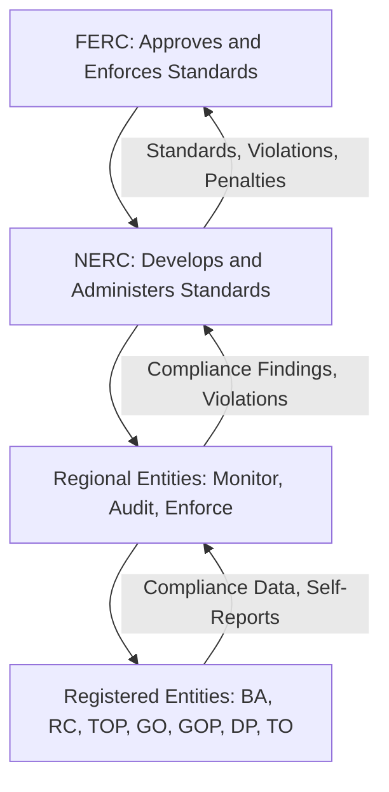
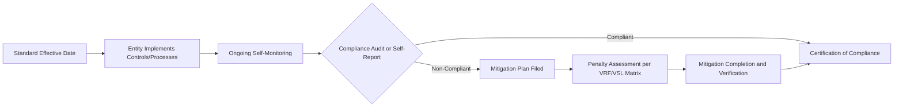

## Bulk Power System Reliability Standards

### Overview

Bulk Power System (BPS) reliability standards are the mandatory and enforceable technical and operational requirements that govern the planning, design, and operation of the interconnected high-voltage electric grid. In North America, these standards are developed and enforced primarily by the North American Electric Reliability Corporation (NERC) under authority delegated by the Federal Energy Regulatory Commission (FERC), pursuant to the Energy Policy Act of 2005. Similar frameworks exist internationally (ENTSO-E in Europe, AEMO in Australia), but the NERC framework is the most extensively codified and widely referenced model globally.

### Regulatory and Institutional Framework

**Key Points:**

- **FERC (Federal Energy Regulatory Commission):** The U.S. federal agency with statutory authority to approve, or remand, reliability standards proposed by the Electric Reliability Organization (ERO). FERC-approved standards become mandatory and enforceable under U.S. law.
- **NERC (North American Electric Reliability Corporation):** The FERC-certified Electric Reliability Organization (ERO) responsible for developing, maintaining, and enforcing reliability standards across the U.S., Canada, and parts of Baja California, Mexico.
- **Regional Entities:** NERC delegates monitoring and enforcement authority to Regional Entities (e.g., WECC, SERC, RF, Texas RE, NPCC), which conduct audits, investigations, and compliance enforcement within their footprints.
- **Registered Entities:** Organizations subject to compliance — Balancing Authorities (BA), Reliability Coordinators (RC), Transmission Operators (TOP), Generator Owners/Operators (GO/GOP), Distribution Providers (DP), and others — as defined by the NERC Functional Model.

### The Standards Development Process

Reliability standards follow a structured, stakeholder-driven development lifecycle:

1. **Standards Authorization Request (SAR):** A formal proposal identifying the reliability gap or need for a new/revised standard.
2. **Drafting Team Formation:** Industry technical experts are assembled to draft requirements.
3. **Field/Industry Comment Periods:** Multiple rounds of public comment and ballot by registered industry stakeholders.
4. **Industry Ballot:** Requires a quorum and a weighted segment-based approval threshold (typically 2/3 approval).
5. **NERC Board of Trustees Adoption:** Final approval by the NERC governing board.
6. **FERC Filing and Approval:** Submission to FERC for regulatory approval, at which point the standard becomes mandatory and enforceable.
7. **Implementation and Enforcement:** Standards typically include phased effective dates to allow registered entities to achieve compliance.

NERC maintains a multi-year Reliability Standards Development Plan submitted to FERC, outlining priorities and forecasted development work, with a prioritization framework designed to address the highest reliability risk issues earliest in the planning period. [TRC](https://www.trccompanies.com/insights/nerc-releases-2024-2026-standards-development-plan/)

### Major Standard Categories

NERC standards are organized into functional categories, each identified by a two-to-four letter acronym prefix followed by a numeric designation (e.g., TOP-001, PRC-005).

Reliability Coordination (IRO) standards focus on maintaining real-time system reliability and coordination between operators, while Transmission Operations (TOP) standards ensure the safe and reliable operation of transmission systems. Critical Infrastructure Protection (CIP) standards address cybersecurity and the protection of critical assets from physical and cyber threats, Planning (TPL) standards deal with long-term system planning to ensure the grid can handle future demands and contingencies, and Protection and Control (PRC) standards focus on system protection schemes and fault management. [BigBizMaker](https://www.bigbizmaker.com/blog/complete-guide-to-nerc-reliability-standards-for-utilities)[BigBizMaker](https://www.bigbizmaker.com/blog/complete-guide-to-nerc-reliability-standards-for-utilities)

| Category Code | Full Name | Scope |
| --- | --- | --- |
| BAL | Resource and Demand Balancing | Frequency response, Area Control Error (ACE), regulating reserves |
| CIP | Critical Infrastructure Protection | Cybersecurity, physical security of BES Cyber Systems |
| COM | Communications | Operating instructions, communications protocols |
| EOP | Emergency Preparedness and Operations | System restoration, blackstart, emergency operating plans |
| FAC | Facilities Design, Connections, and Maintenance | Facility ratings, connection requirements, vegetation management |
| INT | Interchange Scheduling and Coordination | Interchange transaction tagging and accounting |
| IRO | Interconnection Reliability Operations and Coordination | Reliability Coordinator authority, wide-area situational awareness |
| MOD | Modeling, Data, and Analysis | System modeling data requirements, transfer capability methodology |
| NUC | Nuclear | Coordination between BPS operators and nuclear plant operators |
| PER | Personnel Performance, Training, and Qualifications | Operator certification and training |
| PRC | Protection and Control | Relay protection systems, misoperations, UFLS/UVLS |
| TOP | Transmission Operations | Real-time transmission system operation |
| TPL | Transmission Planning | Long-term planning, contingency (N-1, N-1-1, N-2) criteria |
| VAR | Voltage and Reactive | Reactive power and voltage schedule requirements |

### Key Standards by Category (Illustrative)

#### TPL — Transmission Planning

- **TPL-001-5.1:** Establishes transmission system planning performance requirements, defining acceptable system response to a spectrum of contingencies (Category P0 through P7), including steady-state voltage/thermal limits and stability performance.
- Requires no cascading outages for single contingencies (N-1) and limited, controlled load loss for more severe multiple-contingency events.

#### PRC — Protection and Control

- **PRC-005:** Protection System, Automatic Reclosing, and Sudden Pressure Relaying maintenance and testing requirements.
- **PRC-023:** Transmission relay loadability — ensures protective relays do not trip on load conditions within emergency ratings.
- **PRC-024:** Generator frequency and voltage protective relay settings — coordinates generator ride-through capability with system protection.

#### BAL — Resource and Demand Balancing

- **BAL-001:** Real Power Balancing Control Performance — governs ACE and frequency control obligations of Balancing Authorities.
- **BAL-003:** Frequency Response and Frequency Bias Setting — establishes minimum frequency response obligations following frequency-deviating events.

#### CIP — Critical Infrastructure Protection

- **CIP-002 through CIP-014:** Cover BES Cyber System categorization, security management controls, personnel/training, electronic security perimeters, physical security, incident reporting, and recovery planning.
- CIP-015, approved by FERC, marks an evolution in cybersecurity expectations, shifting from purely perimeter-based defenses toward internal network security monitoring within trusted zones to detect adversarial activity. [TRC](https://www.trccompanies.com/insights/nerc-releases-2024-2026-standards-development-plan/)

#### FAC — Facilities Design, Connections, and Maintenance

- **FAC-008:** Facility Ratings methodology — governs how equipment thermal ratings are determined and applied.
- **FAC-014:** Establishes and communicates System Operating Limits (SOLs) and Interconnection Reliability Operating Limits (IROLs).

#### EOP — Emergency Preparedness and Operations

- **EOP-005:** System Restoration from Blackstart Resources.
- **EOP-011:** Emergency Operations — requires Operating Plans for capacity/energy emergencies and coordinated load-shedding procedures.

### Compliance and Enforcement Structure

**Key Points:**

- **Violation Risk Factors (VRF):** Each requirement within a standard is assigned Lower, Medium, or High risk based on its potential reliability impact if violated.
- **Violation Severity Levels (VSL):** Define the degree of non-compliance (Lower, Moderate, High, Severe) used to calibrate penalties.
- **Penalty Matrix:** FERC-approved penalty guidelines set maximum civil penalties (historically up to approximately $1 million per violation per day, subject to periodic inflation adjustment).
- **Self-Reporting and Self-Logging:** Registered entities are encouraged to self-identify and self-report violations, often resulting in reduced penalties through NERC's risk-based compliance monitoring approach.
- **Compliance Monitoring:** Includes scheduled audits, spot checks, self-certifications, and complaint-driven investigations conducted by Regional Entities.

### Emerging Drivers Reshaping Standards Development

NERC has released a series of upcoming Reliability Standards scheduled to become effective between 2026 and 2028, reflecting the rapid evolution of the bulk electric system driven by growth of inverter-based resources (IBRs) such as solar, wind, and battery energy storage systems, as well as increasing cybersecurity risks and climate-driven planning challenges. For asset owners, operators, developers, and newly registered Generator Owners and Generator Operators, early compliance planning is essential, since many of these standards require engineering studies, protection setting changes, electromagnetic transient (EMT) modeling, cyber architecture updates, and extensive documentation. [Keentel Engineering](https://keentelengineering.com/upcoming-nerc-reliability-standards-2026-2028)[Keentel Engineering](https://keentelengineering.com/upcoming-nerc-reliability-standards-2026-2028)

**Key Points:**

- **Inverter-Based Resources (IBR):** New and revised standards (e.g., PRC-024 revisions, MOD standards for dynamic modeling) address ride-through requirements, EMT model submission, and performance validation for wind, solar, and battery storage facilities following widespread IBR-related disturbance events.
- NERC's ongoing reporting has examined how large flexible/co-located loads such as crypto-mining facilities can cause sudden grid load loss during voltage dips, prompting new data and modeling standard development. [TRC](https://www.trccompanies.com/insights/nerc-releases-2024-2026-standards-development-plan/)
- **Extreme Weather and Climate Resilience:** Following events such as the 2021 Texas winter storm (Uri), standards development has expanded to address cold-weather preparedness (e.g., EOP-011/012 cold weather requirements) and extreme heat/wildfire risk assessment.
- **Grid-Enhancing and Data/Modeling Standards:** A set of new grid reliability standards approved by FERC targets the gap between the rapid expansion of modern energy resources and the data and models historically used to plan and operate the grid. [TRC](https://www.trccompanies.com/insights/nerc-releases-2024-2026-standards-development-plan/)

[Inference] The precise scope and numbering of standards effective in the 2026–2028 window may continue to shift as NERC finalizes drafting team ballots and FERC issues final orders; entities should consult NERC's official Reliability Standards site for the authoritative current version applicable to a specific compliance date.

### Standards vs. Reliability Criteria: Key Distinction

**Key Points:**

- **Mandatory Standards (e.g., NERC Reliability Standards):** Legally enforceable with financial penalties for non-compliance.
- **Planning Criteria (e.g., regional NERC Reliability Standards or RTO/ISO planning criteria):** May supplement mandatory standards with more stringent regional requirements (e.g., ERCOT, WECC, individual RTO planning guides).
- **Probabilistic Reliability Metrics (LOLE, EUE):** Distinct from mandatory compliance standards — these are analytical planning targets, not directly enforced NERC requirements, though they inform resource adequacy assessments referenced in NERC's annual reliability assessments (e.g., Long-Term Reliability Assessment, Summer/Winter Reliability Assessments).

### International Comparisons

| Region | Governing Body | Framework |
| --- | --- | --- |
| North America | NERC / FERC | Mandatory, enforceable Reliability Standards |
| European Union | ENTSO-E | Network Codes, System Operation Guideline (non-identical enforcement structure across member states) |
| United Kingdom | National Energy System Operator (NESO), Ofgem | Grid Code, Security and Quality of Supply Standard (SQSS) |
| Australia | AEMC / AEMO | National Electricity Rules (NER), Reliability Standard (expressed as USE — Unserved Energy target) |

[Unverified] Detailed point-by-point equivalency between NERC Reliability Standards categories and their closest international analogues is not exact, as underlying market structures, transmission planning obligations, and enforcement mechanisms differ substantially by jurisdiction.

### Compliance Workflow Example

### Next Steps

- **NERC Functional Model and Registered Entity Categories**
- **System Operating Limits (SOL) and Interconnection Reliability Operating Limits (IROL)**
- **Inverter-Based Resource (IBR) Ride-Through and Performance Standards**
- **NERC Long-Term Reliability Assessment (LTRA) Methodology**
- **CIP Cybersecurity Standards Deep Dive (CIP-002 through CIP-015)**
- **Contingency Analysis and N-1/N-1-1 Planning Criteria (TPL-001)**
- **Frequency Response and Primary Frequency Control (BAL-003)**
- **Extreme Weather Preparedness Standards (Post-Uri Cold Weather Requirements)**