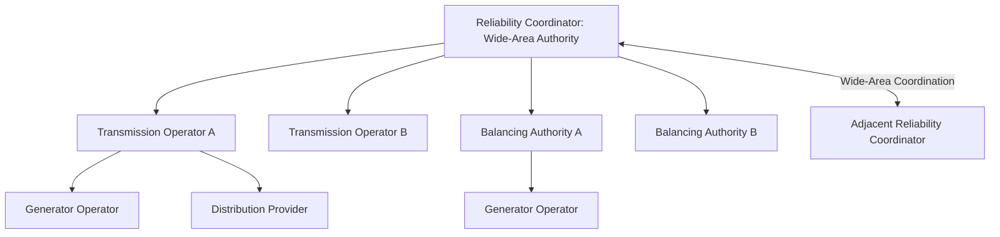
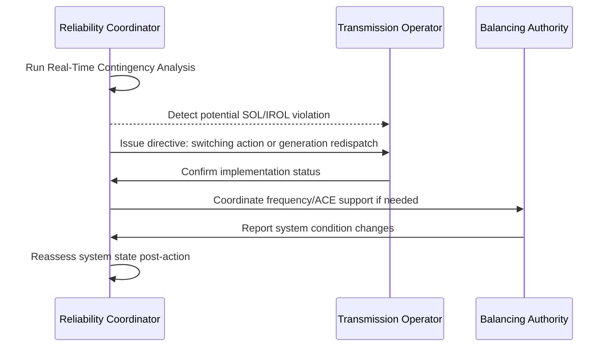

## Reliability Coordinator Functions

### Overview

The Reliability Coordinator (RC) is the highest level of authority in the NERC Functional Model, responsible for the real-time reliability of the Bulk Power System (BPS) within a defined wide-area footprint. The RC has the broadest situational awareness of any entity in the reliability hierarchy and holds the authority to direct actions by Transmission Operators (TOPs) and Balancing Authorities (BAs) to prevent or mitigate instances of instability, uncontrolled separation, or cascading failures across its Reliability Coordinator Area.

### Position in the NERC Functional Model

**Key Points:**

- The RC sits above Balancing Authorities and Transmission Operators in the authority hierarchy — it can direct their actions during reliability-impacting conditions.
- RC Areas typically span multiple Balancing Authority Areas and Transmission Operator footprints, providing a wide-area view that individual entities lack.
- In North America, examples of Reliability Coordinators include PJM Interconnection, MISO, SPP, ERCOT, California ISO, and independent RCs such as those formed by some utilities after the retirement of legacy peer-to-peer RC arrangements.

### Core Functional Responsibilities

#### Wide-Area Situational Awareness

The RC must maintain real-time monitoring of system conditions across its entire footprint, including:

- Real-time state estimation and contingency analysis (typically refreshed every few minutes or faster)
- Monitoring of System Operating Limits (SOLs) and Interconnection Reliability Operating Limits (IROLs)
- Visibility into adjacent RC areas' conditions that could affect its own footprint (and vice versa)
- Tracking of Facility Ratings, generation dispatch, and transmission topology changes

#### Operational Authority and Directives

**Key Points:**

- The RC has the authority to direct actions of TOPs and BAs within its area to prevent or mitigate System Operating Limit (SOL) or Interconnection Reliability Operating Limit (IROL) violations.
- Directives issued by the RC must be implemented by the receiving entity without delay for the preservation of reliability, subject to safety and equipment limitations.
- The RC can direct load shedding, generation redispatch, transmission switching, and other emergency actions as a last resort to prevent cascading outages.
- Entities may take actions that deviate from RC directives if such actions are necessary to preserve safety of personnel or equipment — this must be reported to the RC as soon as practical.

#### Reliability Assessment and Contingency Analysis

- **Next-Day and Seasonal Assessments:** The RC evaluates anticipated system conditions for the next operating day and seasonal peak periods to identify potential reliability risks in advance.
- **Real-Time Contingency Analysis (RTCA):** Continuous simulation of the "next credible contingency" (typically N-1, and in some cases N-1-1 for critical facilities) to verify the system can withstand the loss of any single element without violating operating limits.
- **Coordination of Operating Plans:** The RC coordinates emergency operating plans and restoration plans across the entities within its footprint.

#### Emergency and Cascading Failure Prevention

**Key Points:**

- The RC is the entity primarily responsible for preventing uncontrolled cascading outages, which are the mechanism behind historic large-scale blackouts (e.g., the August 2003 Northeast Blackout).
- During an IROL exceedance, the RC must ensure that the system returns within limits within a defined time period (commonly 30 minutes, though the specific IROL Tv—time to voltage/thermal/stability limit—is study-specific).
- The RC coordinates system restoration efforts following blackouts, including blackstart sequencing across multiple TOPs and BAs.
- The RC monitors for and responds to Energy Emergency Alerts (EEA) escalations reported by BAs within its footprint.

### Applicable NERC Standards (IRO Series)

| Standard | Focus Area |
| --- | --- |
| IRO-001 | Reliability Coordination — Responsibilities and Authorities |
| IRO-002 | Reliability Coordination — Facilities (tools, monitoring capability) |
| IRO-006 | Transmission Loading Relief procedures coordination |
| IRO-008 | Reliability Coordinator Operational Analyses and Real-Time Assessments |
| IRO-009 | Reliability Coordinator Actions to Operate Within IROLs |
| IRO-010 | Reliability Coordinator Data and Information Specification and Collection |
| IRO-014 | Coordination among Reliability Coordinators (adjacent-area coordination agreements) |
| IRO-017 | Outage Coordination |
| IRO-018 | Reliability Coordinator Real-Time Reliability Monitoring and Analysis Capabilities |

[Inference] Specific standard version numbers (e.g., IRO-008-2 vs. IRO-008-3) in force at any given time depend on the current FERC-approved version; the functional scope described here reflects the stable, long-standing intent of the IRO standard series rather than a specific dated revision.

### Tools and Technology Infrastructure

**Key Points:**

- **State Estimator (SE):** Produces a real-time model of system voltages, flows, and topology from telemetered SCADA data, typically solved every 1-5 minutes.
- **Real-Time Contingency Analysis (RTCA):** Automatically evaluates the impact of the loss of each monitored element against the current state estimate.
- **Energy Management System (EMS):** The overarching platform integrating SCADA, state estimation, contingency analysis, and operator displays.
- **Wide-Area Situational Awareness Tools:** Including synchrophasor (PMU) data visualization, dynamic stability monitoring, and inter-RC data exchange systems (e.g., NERC's Reliability Coordinator Information System, RCIS).
- **Transmission Loading Relief (TLR) Procedures:** A coordination mechanism used historically (particularly in the Eastern Interconnection) to manage transmission congestion across multiple Balancing Authority Areas; largely superseded in RTO/ISO markets by market-based congestion management (e.g., LMP-based redispatch) but retained for non-market areas and cross-seam coordination.

### Relationship to Balancing Authorities and Transmission Operators

**Key Points:**

- **Balancing Authority (BA):** Responsible for maintaining generation-load balance and frequency within its area; operates under RC oversight but retains primary responsibility for ACE (Area Control Error) management.
- **Transmission Operator (TOP):** Responsible for real-time operation of the transmission system within its footprint; must comply with RC directives regarding SOL/IROL management.
- The RC does not typically operate equipment directly — it coordinates and directs the TOPs/BAs, who retain operational control of their respective facilities.

### RC Certification and Staffing Requirements

- RCs must be certified by NERC, involving a rigorous review of tools, staffing, training programs, and procedures before being granted RC status.
- RC operators (System Operators) must hold NERC certification (per PER-005 training standards) and typically require specialized RC-level certification beyond standard TOP/BA operator credentials.
- RCs must maintain 24/7/365 staffed operations with backup control centers and defined failover procedures in case of primary control center loss.

### Historical Context and Evolution

**Key Points:**

- The Reliability Coordinator function was significantly strengthened following the August 2003 Northeast Blackout, where post-event analysis identified inadequate situational awareness and unclear lines of authority as contributing factors.
- Post-2003, NERC standards were revised (transitioning from voluntary reliability guidelines to FERC-mandated, enforceable standards under EPAct 2005) to formalize and strengthen RC authority, including explicit directive authority over TOPs and BAs.
- The number of distinct RC entities in North America has consolidated over time, with several major RTOs/ISOs (e.g., SPP, PJM) expanding their RC footprints to cover additional utility areas previously served by smaller, standalone RCs — improving wide-area visibility and coordination consistency.

### Example: RC Response to an IROL Exceedance

**Example:**

1. State estimator and RTCA detect that the loss of a specific 500 kV line would cause a parallel corridor to exceed its IROL (an unacceptable risk of cascading outage).
2. The RC issues a pre-contingency directive to the affected TOP to redispatch generation or adjust transmission topology to reduce flow on the at-risk corridor.
3. If the contingency occurs before mitigation is complete, the RC directs emergency actions (e.g., further redispatch, transmission switching, or as a last resort, controlled load shedding) to return the system within the IROL inside the required restoration time.
4. The RC documents the event and reports it per NERC disturbance and IROL exceedance reporting requirements, potentially triggering a root-cause analysis.

### Next Steps

- **Balancing Authority ACE and Frequency Control (BAL-001/BAL-003)**
- **System Operating Limits (SOL) and Interconnection Reliability Operating Limits (IROL) Methodology**
- **Transmission Loading Relief (TLR) Procedures**
- **State Estimation and Real-Time Contingency Analysis (RTCA) Architecture**
- **NERC Functional Model: Full Registered Entity Roles**
- **August 2003 Northeast Blackout: Root Cause and Standards Response**
- **System Restoration and Blackstart Coordination (EOP-005)**
- **Synchrophasor (PMU) Applications in Wide-Area Monitoring**