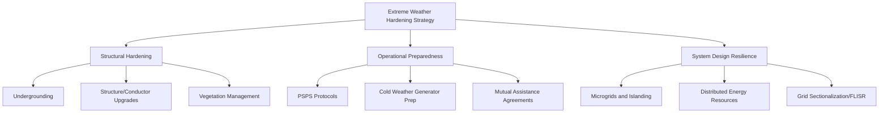

## Extreme Weather Hardening Strategies

### Overview

Extreme weather hardening encompasses the engineering, operational, and planning measures utilities undertake to reduce the vulnerability of power system infrastructure to high-impact weather events — including hurricanes, ice storms, extreme heat, extreme cold, wildfires, and flooding. Hardening strategies differ from resilience strategies in scope: hardening focuses on preventing or reducing physical damage to infrastructure, while broader resilience also includes the system's ability to withstand, adapt to, and rapidly recover from disruptions once they occur.

### Threat Categories and Failure Mechanisms

| Threat | Primary Failure Mechanisms |
| --- | --- |
| Hurricanes/High Wind | Pole/tower failure, conductor galloping, vegetation-caused faults, flying debris strikes |
| Ice Storms | Conductor/structure overload from ice accretion, galloping-induced conductor clashing |
| Extreme Heat | Thermal derating of lines/transformers, sag-induced clearance violations, load-driven overload |
| Extreme Cold | Generator cold-weather trips, gas supply curtailment, freezing of instrumentation and control systems |
| Wildfire | Direct fire damage to poles/conductors, PSPS-driven proactive de-energization, smoke-induced insulator flashover |
| Flooding | Substation inundation, underground vault flooding, erosion of transmission structure foundations |

**Key Points:**

- Events such as the February 2021 Texas winter storm (Uri) demonstrated that cold-weather generator and gas-supply failures, not just transmission/distribution damage, can drive severe loss-of-load events.
- Correlated, simultaneous multi-unit outages during extreme weather violate the independence assumption used in standard generation adequacy (LOLE) models, motivating specialized Extreme Weather Assessments.

### Transmission and Distribution Hardening Measures

#### Structural and Design Hardening

- **Undergrounding:** Converting overhead distribution (and in select cases, subtransmission) circuits to underground construction eliminates exposure to wind, ice, and vegetation-related faults, at significantly higher capital cost (commonly cited as 5-10x overhead cost per mile, highly site-dependent) and with introduced flood vulnerability.
- **Structure Upgrades:** Replacing wood poles with steel, concrete, or composite structures; upgrading design wind/ice loading criteria (e.g., designing to higher extreme wind speed return periods or NESC Grade B/heavy loading districts).
- **Conductor and Hardware Upgrades:** Using higher-strength conductors, spacer cable, or covered/insulated conductor in high-risk vegetation zones to reduce fault initiation from contact.
- **Foundation and Flood Protection:** Elevating substation equipment above base flood elevation, installing flood walls/barriers, and using submersible or flood-resistant switchgear in flood-prone substations.

#### Vegetation Management

- Enhanced right-of-way (ROW) clearance standards beyond minimum regulatory requirements in high-risk corridors.
- LiDAR-based vegetation encroachment monitoring and risk-scored trimming prioritization.
- Danger tree identification and removal programs extending beyond the maintained ROW footprint (particularly relevant for wildfire-prone areas).

#### Wildfire-Specific Hardening

**Key Points:**

- **Covered Conductor / Spacer Cable:** Reduces ignition risk from vegetation contact and conductor clashing.
- **Fast-Trip / Sensitive Relay Settings:** Reduces fault energy and arcing duration during high-fire-risk conditions, at the cost of increased nuisance tripping.
- **Public Safety Power Shutoff (PSPS):** Proactive de-energization of circuits during extreme fire-weather conditions (high wind, low humidity, dry fuel) as a last-resort ignition prevention measure, balanced against the reliability and public-safety costs of planned outages.
- **Weather Station and Fire-Risk Modeling Networks:** Dense weather station deployment along high-risk circuits feeding real-time fire-risk indices that inform PSPS decisions and sensitive protection settings.
- **Undergrounding in Very-High Fire-Threat Districts:** Increasingly adopted in the highest-risk wildfire zones despite high cost, given the catastrophic liability and public-safety consequences of wildfire ignition.

### Generation and Fuel Supply Hardening (Cold Weather)

Following widespread cold-weather generator failures in events such as Winter Storm Uri, hardening measures have expanded significantly for thermal generation:

**Key Points:**

- **Weatherization of Generating Units:** Insulation, heat tracing, and enclosure of sensing lines, instrumentation, and auxiliary equipment vulnerable to freezing.
- **Cold Weather Preparedness Plans:** Mandatory annual weatherization implementation and readiness attestation for generators (formalized in NERC EOP-011/012-type cold weather standards following Uri).
- **Fuel Supply Diversity and Firm Gas Contracts:** Reducing reliance on interruptible natural gas supply for generation, and coordinating electric-gas interdependency planning.
- **Critical Infrastructure Designation:** Prioritizing electric service to natural gas production and processing facilities to prevent cascading gas-electric supply failures.

### Substation and Control System Hardening

- **Physical Security and Flood Barriers:** Perimeter flood walls, elevated equipment pads, submersible switchgear.
- **Redundant Protection and Control:** Backup protection schemes and redundant communication paths (fiber, microwave, cellular) to maintain SCADA/telemetry visibility during storm conditions.
- **Backup Power for Control Centers:** On-site generation and fuel reserves to sustain control center and critical substation operations during extended outages.
- **Extreme Heat Derating Management:** Dynamic Line Rating (DLR) systems that adjust conductor ampacity in real time based on measured (rather than static/conservative) weather conditions, allowing safe operation closer to true thermal limits during heat events while avoiding excessive sag/clearance violations.

### System-Level and Operational Resilience Measures

**Key Points:**

- **Grid Sectionalization and Automated Switching (FLISR):** Fault Location, Isolation, and Service Restoration systems automatically isolate faulted sections and restore service to unaffected portions via alternate feeds, limiting outage scope and duration.
- **Microgrids:** Enable critical facilities (hospitals, emergency services, shelters) to island from the main grid and continue operating on local generation/storage during extended outages.
- **Mutual Assistance Agreements:** Pre-arranged inter-utility crew and equipment sharing agreements that accelerate restoration following major storm events.
- **Storm Hardening Investment Prioritization:** Utilities increasingly use probabilistic risk models (combining asset condition, exposure, and consequence data) to prioritize hardening capital investment toward circuits with the highest expected outage-hours or customer-impact reduction per dollar spent.

### Regulatory and Planning Frameworks

**Key Points:**

- **Resilience Planning Filings:** Many U.S. state utility commissions now require formal storm hardening or resilience plans as part of rate case proceedings, with cost-recovery tied to demonstrated risk-reduction outcomes.
- **NERC Extreme Weather Standards:** Post-Uri standards development has introduced cold-weather preparedness requirements (e.g., generator weatherization, extreme cold weather Operating Plans) as mandatory, enforceable requirements rather than voluntary guidelines.
- **Climate-Informed Design Criteria:** A growing engineering practice trend toward using forward-looking climate projections (rather than purely historical weather records) for structural design loading criteria, reflecting the changing frequency/intensity of extreme events.

[Inference] The specific numerical return-period design criteria (e.g., 1-in-100-year wind speed) adopted by a given utility for hardening projects vary by jurisdiction, regulatory requirement, and internal risk tolerance; there is no single universally mandated national design standard beyond baseline NESC loading district requirements.

### Cost-Benefit and Prioritization Considerations

**Key Points:**

- Hardening investments are typically evaluated using metrics such as avoided outage-hours, avoided Value of Lost Load (VOLL), and reduction in SAIDI/SAIFI contribution from major event days (which are often excluded from standard reliability metrics but tracked separately for resilience planning).
- Major Event Day (MED) exclusion in standard IEEE 1366 reliability reporting means normal SAIDI/SAIFI metrics can understate the customer impact of extreme weather; utilities increasingly track separate "resilience metrics" capturing extended, multi-day restoration events.
- Full system undergrounding is rarely cost-justified system-wide; most utilities apply targeted, risk-ranked hardening (undergrounding, covered conductor, or structure upgrades) to the highest-risk, highest-consequence circuit segments.

### Example: Layered Hardening Approach for a Coastal Distribution Circuit

**Example:**

1. **Assessment:** Circuit identified as high-risk via historical outage data, exposure to storm surge, and proximity to dense vegetation corridors.
2. **Vegetation Hardening:** Enhanced ROW clearance and danger-tree removal completed first (lowest cost, fastest deployment).
3. **Structural Hardening:** Wood poles in the most exposed spans replaced with concrete/steel; conductor upgraded to spacer cable in the highest-risk sections.
4. **Automation:** FLISR-capable reclosers installed at key sectionalizing points to limit outage propagation.
5. **Targeted Undergrounding:** The most storm-exposed, highest-consequence segment (e.g., feeding a hospital) converted to underground construction.
6. **Operational Layer:** Circuit included in mutual assistance staging plans and prioritized in storm restoration sequencing due to critical facility service.

### Next Steps

- **Dynamic Line Rating (DLR) Systems and Real-Time Thermal Monitoring**
- **Public Safety Power Shutoff (PSPS) Program Design and Risk Modeling**
- **NERC Cold Weather Standards (Post-Winter Storm Uri Reforms)**
- **Fault Location, Isolation, and Service Restoration (FLISR) Architecture**
- **Microgrid Design for Critical Facility Resilience**
- **IEEE 1366 Reliability Metrics and Major Event Day Classification**
- **Climate-Informed Infrastructure Design Criteria**
- **Mutual Assistance and Storm Restoration Logistics Planning**