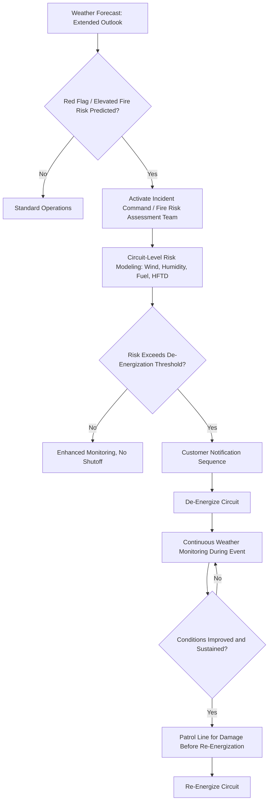

## Wildfire Mitigation and Public Safety Power Shutoffs

### Overview

Wildfire mitigation encompasses the engineering, vegetation management, operational, and risk-modeling programs utilities implement to reduce the probability that electric infrastructure ignites a wildfire, and to limit consequences when ignition risk cannot be sufficiently reduced through physical measures alone. Public Safety Power Shutoff (PSPS) is the operational tool of last resort within this broader program — the proactive, deliberate de-energization of power lines during conditions of extreme fire danger to eliminate the possibility of electrical-equipment-caused ignition.

### Ignition Mechanisms from Electrical Infrastructure

**Key Points:**

- **Conductor Contact/Clashing:** Wind-driven contact between conductors or between conductors and vegetation, producing arcing and hot metal particles capable of igniting dry fuel.
- **Equipment Failure:** Failed insulators, broken conductors (line-down events), failed connectors, or transformer failures that create sparks or fault energy.
- **Vegetation Contact:** Trees or branches falling into or growing into energized lines, a leading cause of both faults and direct ignition.
- **Fault Arcing Energy:** The magnitude and duration of fault current before protective clearing directly affects the probability that a fault event produces sufficient thermal energy to ignite adjacent fuel.

### Wildfire Risk Modeling

#### Fire Potential Index and Weather-Driven Risk

Utilities and fire-weather services combine multiple inputs into composite risk indices used to trigger elevated operational protocols:

$$Fire\ Risk\ Index = f(Wind\ Speed,\ Relative\ Humidity,\ Fuel\ Moisture,\ Temperature,\ Historical\ Ignition\ Density)$$

**Key Points:**

- **Red Flag Warnings:** National Weather Service designations indicating critical fire weather conditions (typically low humidity, high wind, warm temperatures) used as a common trigger threshold for elevated utility protocols.
- **Fuel Moisture Content:** Dead and live fuel moisture measurements indicate how readily vegetation will ignite and sustain fire spread; low fuel moisture (common in late dry season) significantly elevates risk.
- **High Fire Threat District (HFTD) Mapping:** Regulatory or utility-defined geographic zones (e.g., California's Tier 2/Tier 3 HFTD maps) that classify circuit segments by wildfire consequence risk, driving differentiated design, inspection, and operational requirements.

#### Network-of-Things Weather Monitoring

- Dense deployment of weather stations directly on transmission/distribution structures in high-risk corridors, providing hyper-local wind, humidity, and temperature data at a spatial resolution far finer than regional weather forecasts.
- High-definition cameras (often AI-assisted for smoke/flame detection) deployed at strategic vantage points for early ignition detection, both from utility-caused and other ignition sources.
- Integration of these inputs into real-time fire-risk dashboards that inform both PSPS decision-making and dynamic protection setting adjustments.

### Physical and Design Mitigation Measures

| Measure | Function |
| --- | --- |
| Covered/Insulated Conductor | Reduces ignition probability from vegetation contact and conductor clashing |
| Spacer Cable / Aerial Cable Systems | Bundles conductors to prevent clashing under wind-induced galloping |
| Undergrounding | Eliminates wind/vegetation/equipment-contact ignition pathway entirely (highest cost) |
| Non-Expulsion Fuses | Prevents ejection of hot particles during fault clearing (standard expulsion fuses can eject burning material) |
| Fire-Resistant Poles | Composite or steel poles resistant to ignition/structural failure in fire conditions |
| Animal Guards and Covers | Reduces faults from wildlife contact, a secondary but non-trivial ignition contributor |
| Enhanced Vegetation Clearance | Wider ROW clearance standards specifically in HFTD zones, beyond baseline regulatory minimums |

### Protection System Adjustments for Fire Season

**Key Points:**

- **Fast-Trip / Sensitive Protection Settings:** Temporarily reducing relay pickup thresholds and disabling reclosing during elevated fire-risk conditions, reducing fault energy and arc duration at the cost of increased nuisance tripping and customer outages.
- **Reclosing Suspension:** Automatic reclosing (which re-energizes a line after a momentary fault, useful for reducing outage duration from transient faults) is typically disabled during high fire-risk conditions, since re-energizing into a persistent fault (e.g., a fallen conductor) risks sustained arcing and ignition.
- **Trade-off:** Sensitive settings and disabled reclosing measurably reduce ignition probability but increase the frequency and duration of customer outages from otherwise self-clearing transient faults — a core operational trade-off in fire-season protection philosophy.

### Public Safety Power Shutoff (PSPS) Program Structure

#### Decision Framework

#### Key Program Elements

**Key Points:**

- **Decision Criteria:** Combination of sustained wind speed thresholds, relative humidity, fuel moisture, Red Flag Warning status, and circuit-specific HFTD classification, typically evaluated against pre-defined thresholds calibrated per circuit or region.
- **Notification Protocols:** Regulatory requirements typically mandate advance customer notification (commonly targeting 48-72 hours where forecast confidence allows, though actual lead time varies significantly with weather predictability), with special outreach protocols for medical baseline/life-support customers and critical facilities.
- **De-Energization Execution:** Circuits are switched out in a coordinated sequence, often starting with the highest-risk segments; SCADA-enabled remote switching is preferred over manual switching where available to enable faster shutoff and restoration.
- **Post-Event Patrol Requirement:** Before re-energization, de-energized circuits typically must be patrolled (via ground crews, drone, or helicopter) to confirm no damage occurred that could create a hazard upon re-energization — this patrol requirement is often the longest-duration step in the PSPS cycle, extending outage duration beyond the weather event itself.
- **Re-Energization Sequencing:** Circuits are restored once conditions improve and sustain below threshold and patrol confirms safety, typically in reverse priority order.

#### Customer and Community Impact Mitigation

- **Community Resource Centers:** Temporary facilities providing charging, water, restrooms, and information during extended PSPS events.
- **Backup Power Support:** Utility-provided or subsidized generator/battery programs for medical baseline customers dependent on electrically powered medical equipment.
- **Critical Facility Prioritization:** Hospitals, emergency services, and water/wastewater treatment facilities often prioritized for microgrid backup, mobile generation, or circuit-level exemption strategies where feasible.
- **Vulnerable Population Outreach:** Enhanced notification and support protocols for elderly, disabled, and low-income populations disproportionately affected by extended outages.

### Sectionalization to Minimize PSPS Scope

**Key Points:**

- **Circuit Segmentation:** Installing additional automated switches/reclosers allows utilities to de-energize only the specific high-risk segment of a circuit rather than the entire feeder, reducing the customer count affected by a given PSPS event.
- **Weather-Informed Sectionalizing:** Because fire-weather risk is often localized (e.g., a specific canyon or ridge experiencing high wind while the broader circuit does not), granular switching capability directly reduces both the scope and duration of shutoff-related outages.
- Utilities have progressively invested in expanding remote-controlled sectionalizing device density specifically to reduce PSPS customer-impact as programs have matured since their initial large-scale implementation.

### Regulatory Oversight and Reporting

**Key Points:**

- Utility commissions in wildfire-prone jurisdictions (most notably California, under CPUC oversight) require formal Wildfire Mitigation Plans (WMPs) detailing risk modeling methodology, hardening investment plans, vegetation management programs, and PSPS protocols, subject to regulatory review and approval.
- Post-event PSPS reporting requirements typically mandate disclosure of circuits de-energized, customer-count and duration impact, weather conditions justifying the decision, and post-event damage findings (including any ignitions that occurred despite mitigation).
- [Unverified] The specific quantitative thresholds (e.g., exact wind speed cutoffs) used by individual utilities to trigger PSPS are generally circuit-specific and periodically recalibrated based on operating experience; publicly disclosed threshold values should be verified against the specific utility's current, regulator-approved Wildfire Mitigation Plan rather than assumed to be standardized industry-wide.

### Program Evolution and Criticism

**Key Points:**

- Early large-scale PSPS implementations drew significant public and regulatory criticism for broad geographic scope (de-energizing far more customers than necessary relative to actual localized risk) and inadequate advance notification.
- Program maturation has generally trended toward more granular circuit segmentation, improved weather-risk modeling precision, and expanded customer support infrastructure to reduce both the frequency and impact-severity of shutoff events over time.
- PSPS remains explicitly framed by utilities and regulators as a measure of last resort, to be used only when physical hardening and operational protection measures are judged insufficient to manage ignition risk under forecast conditions — not as a routine first-line mitigation tool.

### Example: PSPS Event Lifecycle

**Example:**

1. **T-72 hours:** Extended forecast identifies potential Red Flag conditions (high wind, low humidity) for a specific region; utility activates fire-risk assessment team.
2. **T-48 hours:** Circuit-level risk modeling identifies specific high-risk circuits in HFTD zones exceeding de-energization thresholds; initial customer notifications issued.
3. **T-24 hours:** Confirmed forecast; final notification sent to affected customers, medical baseline customers contacted directly, community resource center locations announced.
4. **T-0:** Circuits de-energized in priority sequence as wind speeds cross threshold.
5. **During event:** Continuous weather monitoring; utility crews and aerial patrol standing by.
6. **Post-peak-wind:** Once winds subside and sustain below threshold, ground/aerial patrol inspects de-energized segments for damage.
7. **Re-energization:** Circuits restored in sequence once patrol confirms no hazards; post-event report filed documenting decision basis and impact.

### Next Steps

- **High Fire Threat District (HFTD) Risk Mapping Methodology**
- **Covered Conductor and Undergrounding Cost-Benefit Analysis**
- **Fast-Trip Protection Settings and Reclosing Suspension Trade-offs**
- **Wildfire Mitigation Plan (WMP) Regulatory Filing Requirements**
- **Microgrids and Backup Power for Critical Facilities During PSPS**
- **AI-Based Smoke and Flame Detection Camera Networks**
- **Dynamic Line Rating and Real-Time Weather-Informed Operations**
- **Post-Wildfire Utility Liability and Inverse Condemnation Frameworks**