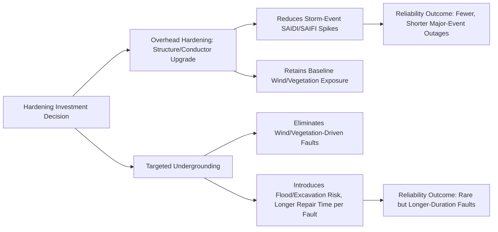

## Storm Hardening and Undergrounding Tradeoffs

### Overview

The decision to convert overhead electric infrastructure to underground construction, or to pursue alternative overhead hardening measures, involves a complex set of engineering, economic, operational, and environmental tradeoffs. While undergrounding is frequently proposed as an intuitive solution to storm-related outages, it is not universally cost-effective or risk-reducing, and introduces its own distinct vulnerabilities. This topic examines the comparative technical and economic analysis utilities use to make hardening investment decisions.

### Comparative Vulnerability Profile

| Threat | Overhead Vulnerability | Underground Vulnerability |
| --- | --- | --- |
| High Wind | High — direct exposure of conductors/structures | Low — no direct wind exposure |
| Ice Accretion | High — conductor/structure overload, galloping | Low — not exposed |
| Vegetation/Falling Trees | High — leading cause of storm-related faults | Low — eliminated except at transitions |
| Flooding | Low — generally unaffected | High — vault/conduit inundation, submerged splices |
| Lightning | Moderate-High — direct strike exposure | Low — shielded by earth, though surge propagation still possible |
| Wildfire | High — ignition source and fire damage | Low — ignition risk largely eliminated |
| Excavation/Dig-ins | None | High — third-party dig-in risk (a leading cause of underground faults) |
| Seismic/Ground Movement | Low-Moderate | Moderate-High — conduit/vault displacement risk |
| Corrosion/Water Intrusion | Low | Moderate — long-term cable insulation degradation |

**Key Points:**

- Undergrounding does not eliminate outage risk — it trades a wind/vegetation/ice risk profile for a flood/excavation/long-term degradation risk profile.
- Underground faults, while less frequent than overhead faults in most environments, are typically significantly more time-consuming and costly to locate and repair due to the need for excavation and specialized fault-location techniques.

### Cost Comparison

**Key Points:**

- Underground distribution conversion typically costs substantially more per mile than equivalent overhead construction — commonly cited industry ranges place underground conversion at roughly 3 to 10 times the cost of comparable overhead rebuild, though the specific multiplier is highly sensitive to soil conditions, urban density, existing utility conflicts, and pavement restoration requirements.
- Cost variability is driven by: soil type and rock presence (trenching vs. boring costs), existing underground utility congestion (water, gas, telecom conflicts), pavement cut and restoration requirements in urban areas, and whether construction uses open trenching versus horizontal directional drilling (HDD).
- Transmission-level undergrounding (as opposed to distribution) carries an even steeper cost multiplier due to specialized high-voltage cable, thermal management (cable ampacity is more constrained underground due to limited heat dissipation), and specialized termination/splicing requirements.

[Inference] Specific cost-per-mile figures vary enormously by region, utility, and project-specific conditions; any generic multiplier cited in industry literature should be treated as an order-of-magnitude planning reference rather than a precise universal figure applicable to a specific project.

### Operational and Maintenance Tradeoffs

#### Fault Location and Restoration Time

- **Overhead:** Faults are typically visible or locatable via patrol (ground, aerial, or drone), enabling relatively fast diagnosis; repair often involves conductor/hardware replacement completable within hours to a day for a typical fault.
- **Underground:** Fault location requires specialized techniques (time-domain reflectometry, thumping, acoustic detection) since the fault point is not visually accessible; repair requires excavation, which extends restoration time, particularly in paved or congested urban areas — underground fault restoration is frequently measured in days rather than hours.

#### Routine Maintenance

- **Overhead:** Requires ongoing vegetation management, periodic visual/infrared inspection, and hardware replacement programs; maintenance activities are generally straightforward to perform without excavation.
- **Underground:** Vegetation management burden is eliminated, but cable systems require periodic partial-discharge testing, and cable/splice replacement at end-of-life is significantly more disruptive and costly than in-kind overhead conductor replacement.

#### System Lifespan Considerations

- Underground cable systems (particularly older paper-insulated lead-covered, PILC, and early cross-linked polyethylene, XLPE, cable) can be subject to water-treeing degradation and insulation breakdown over time, with failure modes that are less visually predictable than overhead conductor/hardware wear.
- Modern XLPE cable with improved manufacturing and jacketing has substantially improved underground cable longevity relative to older cable generations, though long-term field performance data continues to accumulate as these newer cable generations age.

### Reliability Metric Impact

**Key Points:**

- Undergrounding tends to reduce the *frequency* of faults (SAIFI improvement) substantially in storm-prone areas by eliminating the dominant wind/vegetation fault causes.
- Undergrounding can, in some cases, worsen average restoration *duration* per fault (affecting CAIDI) due to the excavation and specialized repair requirements, even while overall fault frequency drops.
- Major Event Day (per IEEE 1366) exclusion practices mean that the storm-resilience benefit of undergrounding is often better demonstrated through avoided extreme-event outage-hours than through standard annual SAIDI/SAIFI trends alone.

### Decision Framework for Hardening Investment Selection

**Key Points:**

- **Risk-Based Circuit Prioritization:** Utilities increasingly use probabilistic risk models combining exposure (storm/wildfire/flood history), consequence (customer count, critical facility service, economic impact), and asset condition to rank circuits for hardening investment, rather than applying a single hardening approach uniformly.
- **Value of Lost Load (VOLL) and Avoided Outage-Hours:** Cost-benefit analysis typically compares the incremental capital cost of undergrounding (or alternative overhead hardening) against the monetized value of avoided outage-hours over the asset's service life, using region- and customer-class-specific VOLL estimates.
- **Flood Zone Screening:** Undergrounding is generally disfavored, or requires substantial flood-mitigation design (elevated vaults, sealed enclosures), in circuits located within mapped flood-prone areas, since it would trade one hazard for a potentially worse one.
- **Hybrid Approaches:** Many utilities pursue a tiered strategy — full undergrounding reserved for the highest-risk, highest-consequence segments (e.g., circuits serving hospitals in wildfire-prone canyons), with covered conductor, spacer cable, or structure upgrades applied more broadly across lower-tier risk segments at substantially lower cost.

### Alternative Overhead Hardening as a Cost-Effective Middle Ground

| Measure | Relative Cost vs. Undergrounding | Primary Risk Addressed |
| --- | --- | --- |
| Covered/Spacer Conductor | Lower | Vegetation contact, conductor clashing |
| Steel/Concrete Pole Upgrades | Lower | Wind/ice structural failure |
| Enhanced Vegetation Clearance | Lowest | Vegetation-caused faults |
| Automated Sectionalizing (FLISR) | Moderate | Outage scope/duration (not fault prevention) |
| Full Undergrounding | Highest | Nearly all overhead-specific hazards |

**Key Points:**

- Covered conductor and structure upgrades can capture a substantial portion of undergrounding's reliability benefit (particularly for vegetation- and wind-driven faults) at a fraction of the capital cost, making them the more common choice for broad-based hardening programs.
- Full undergrounding is generally reserved for circuits where the consequence of outage is severe enough (critical facilities, extreme wildfire risk, high-density urban load) to justify the substantially higher cost, or where aesthetic/local regulatory requirements independently drive undergrounding regardless of reliability cost-benefit.

### Regulatory and Rate Recovery Considerations

**Key Points:**

- Undergrounding programs typically require utility commission approval for cost recovery, often subject to specific program caps, customer cost-sharing mechanisms, or dedicated storm-hardening rider mechanisms distinct from base rates.
- Some jurisdictions have specific statutory or regulatory frameworks for storm hardening plans (particularly in hurricane- and wildfire-prone states) that mandate periodic hardening plan filings, cost-effectiveness justification, and progress reporting.
- Public and political pressure following major storm events frequently drives undergrounding program funding decisions, which can create tension between engineering-optimal risk-based prioritization and politically-prioritized visible infrastructure projects.

### Example: Comparative Analysis for a Hurricane-Exposed Coastal Feeder

**Example:**

A utility evaluates a 5-mile distribution feeder serving 2,000 customers in a hurricane-exposed coastal area, currently experiencing frequent storm-driven outages from wind and vegetation.

- **Option A — Full Undergrounding:** Estimated at a significant capital multiple over overhead rebuild cost; substantially reduces wind/vegetation fault frequency but introduces storm-surge flood exposure risk at low-lying vault locations along the route, requiring additional flood-mitigation design cost.
- **Option B — Covered Conductor + Pole Upgrade:** Substantially lower capital cost than full undergrounding; addresses the majority of vegetation-contact and conductor-clashing fault causes while retaining wind-exposure risk to structures, partially mitigated by upgraded pole standards.
- **Option C — Hybrid:** Full undergrounding applied only to the storm-surge-safe, highest-consequence segment serving a critical care facility; covered conductor and pole upgrades applied to the remaining route.

The utility's risk-based cost-benefit model, weighing avoided outage-hours against capital cost and accounting for the flood exposure introduced by undergrounding low-lying segments, informs the final selected option — commonly resulting in a hybrid approach for coastal and flood-exposed corridors.

### Next Steps

- **Value of Lost Load (VOLL) Estimation Methodologies**
- **IEEE 1366 Reliability Metrics and Major Event Day Exclusion**
- **Underground Cable Fault Location Techniques**
- **Flood-Resistant Substation and Vault Design**
- **Risk-Based Circuit Hardening Prioritization Models**
- **Covered Conductor and Spacer Cable Engineering Specifications**
- **Storm Hardening Cost Recovery and Rate Case Mechanisms**
- **Dynamic Line Rating for Overhead Hardened Circuits**