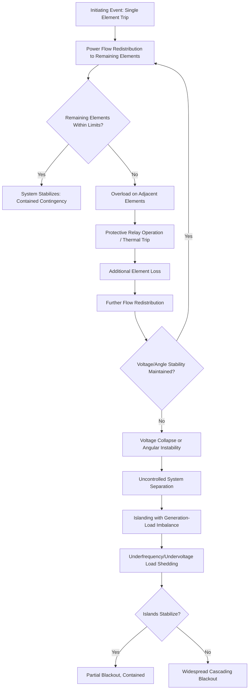
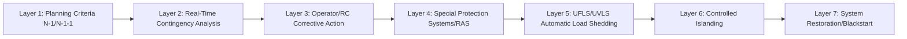

## Cascading Failure Mechanisms and Prevention

### Overview

Cascading failure is the sequential, self-propagating loss of multiple power system elements — typically initiated by a single contingency that, left uncontained, triggers subsequent overloads, protection operations, and system separations culminating in widespread blackout. Unlike a simple N-1 contingency, which well-designed systems are engineered to withstand, cascading failure represents the breakdown of the protective margins and operational safeguards intended to contain disturbances to a limited area. Understanding cascade mechanisms and the engineering measures used to prevent them is central to bulk power system reliability engineering.

### Anatomy of a Cascading Failure

**Key Points:**

- Cascading failure is fundamentally a *positive feedback* process: each element loss increases stress on remaining elements, increasing the probability of further loss.
- The propagation speed of a cascade varies dramatically — some cascades unfold over minutes to hours (thermal overload-driven), while voltage collapse or angular instability-driven cascades can progress in seconds.
- Cascades are distinguished from simple multi-contingency events by their self-reinforcing, sequential nature — each subsequent trip is a consequence of the prior trip, not an independent coincident failure.

### Primary Failure Mechanisms

#### Thermal Overload Cascading

- Loss of a transmission element redistributes its pre-outage power flow onto parallel and electrically adjacent paths.
- If redistributed flow exceeds the thermal (or emergency) rating of adjacent elements, those elements will eventually trip on thermal overload protection or sag into ground clearance violations, redistributing flow further.
- This mechanism tends to be relatively slow (minutes to tens of minutes), governed by conductor thermal time constants, providing a window for operator or automated corrective action.

#### Voltage Collapse

- Reactive power deficiency following an element loss (e.g., loss of a reactive support source or a heavily loaded line whose loss increases reactive losses elsewhere) can drive progressive voltage decline.
- As voltage declines, load characteristics (particularly induction motor loads) can draw increased reactive current, further depressing voltage in a self-reinforcing spiral.
- Voltage collapse can proceed to a point of no return (beyond the maximum power transfer/nose point of the P-V curve) within seconds to a few minutes, often too fast for manual operator intervention alone.

#### Angular/Transient Instability

- Loss of a critical transmission path can increase the electrical separation between generation and load centers, increasing the power angle across the remaining network.
- If the resulting angular swing exceeds the critical clearing angle for system stability, generators can lose synchronism, triggering out-of-step protection tripping and further element loss.
- This mechanism is the fastest of the three, unfolding within seconds (often sub-second to a few seconds) following the initiating disturbance.

#### Hidden Failures and Protection Misoperation

**Key Points:**

- A "hidden failure" is a defect in a protection system component (relay, communication channel, current/voltage transformer) that remains undetected during normal conditions but causes incorrect (typically overtripping) operation when exposed to system stress from an unrelated disturbance.
- Hidden failures are a historically significant cascade-amplifying factor — the removal of a healthy element by a misoperating relay, itself triggered by stress from the initiating event, has contributed to several major historical blackouts.
- Protection system maintenance, testing (per PRC-005), and relay loadability coordination (PRC-023) are specifically intended to reduce the incidence of hidden failures contributing to cascade propagation.

### Historical Case Reference: Mechanisms Illustrated

[Inference] The following summarizes commonly cited contributing factors from post-event analyses of major North American cascading blackouts; exact causal sequences are documented in the respective official investigation reports (e.g., the U.S.-Canada Power System Outage Task Force report for the August 2003 event) and should be consulted directly for authoritative detail.

- **August 2003 Northeast Blackout:** Contributing factors commonly cited include inadequate vegetation management leading to initial line trips, a software/alarm failure that degraded operator situational awareness, and insufficient wide-area coordination — factors that directly motivated the post-2003 strengthening of Reliability Coordinator authority and mandatory, enforceable NERC standards.
- General lesson pattern across major cascade events: an initiating event compounded by degraded situational awareness (operators unaware of true system state), inadequate wide-area coordination, and insufficient real-time contingency analysis to identify the emerging risk before it propagated beyond containment.

### Preventive Engineering Measures

#### Planning-Stage Prevention

- **N-1 and N-1-1 Contingency Criteria (TPL-001):** Transmission systems are planned to withstand the loss of any single element (and, for critical facilities, sequential double contingencies) without cascading, requiring adequate thermal, voltage, and stability margins under a defined spectrum of contingency categories.
- **Special Protection Systems / Remedial Action Schemes (SPS/RAS):** Automated schemes that detect specific pre-identified contingency combinations and take pre-programmed corrective action (generation tripping, load shedding, capacitor/reactor switching) faster than manual operator response, specifically engineered to prevent identified cascade-prone scenarios.
- **Adequate Reactive Power Margin:** Planning studies ensure sufficient dynamic (generator, SVC, STATCOM) and static (capacitor bank) reactive support margin to prevent voltage collapse following credible contingencies.

#### Real-Time Operational Prevention

- **Real-Time Contingency Analysis (RTCA):** Continuous evaluation of the "next credible contingency" against current system conditions, enabling operators/RCs to identify and pre-emptively mitigate emerging IROL exceedance risk before an initiating event occurs.
- **System Operating Limits (SOL) / IROL Enforcement:** Operating within pre-established limits ensures adequate margin exists to absorb the loss of the next credible contingency without cascading.
- **Wide-Area Situational Awareness (Synchrophasor/PMU Systems):** High-resolution, time-synchronized measurement across the wide area enables detection of developing angular instability or oscillatory behavior faster than traditional SCADA-based state estimation alone.
- **Transmission Loading Relief and Redispatch:** Pre-emptive generation redispatch or transaction curtailment to relieve loading on stressed elements before a contingency can trigger cascading overload.

#### Automatic Protective Measures (Last Line of Defense)

**Key Points:**

- **Underfrequency Load Shedding (UFLS):** Automatically sheds load blocks when system frequency declines below defined thresholds, arresting frequency decline following a generation-load imbalance (commonly triggered by islanding) before frequency collapse.
- **Undervoltage Load Shedding (UVLS):** Automatically sheds load in response to sustained low voltage conditions to arrest voltage collapse before it becomes unrecoverable.
- **Controlled Islanding:** Deliberately separating the system into pre-planned islands (each balanced between generation and load) as a controlled alternative to uncontrolled separation, preserving service to the maximum practical customer base while preventing wider cascade propagation.
- **Out-of-Step Relaying:** Detects and isolates generators/areas that have lost synchronism, preventing damaging pole-slipping conditions and containing the instability to a defined boundary.

### Applicable NERC Standards

| Standard | Cascade-Relevant Function |
| --- | --- |
| TPL-001 | Contingency planning criteria preventing cascading under credible contingencies |
| IRO-008/009 | RC real-time assessment and IROL enforcement |
| PRC-005 | Protection system maintenance reducing hidden-failure risk |
| PRC-023 | Relay loadability, preventing unnecessary overload-driven tripping |
| PRC-006 | Automatic Underfrequency Load Shedding requirements |
| EOP-011 | Emergency operations and controlled system separation planning |
| FAC-014 | SOL/IROL methodology, defining the margins cascades must not exceed |

### System Design Philosophy: Defense in Depth

**Key Points:**

- Cascade prevention follows a defense-in-depth philosophy: multiple independent, progressively faster-acting layers are designed so that failure of any single layer does not necessarily result in uncontrolled cascade propagation.
- Each layer operates on a different timescale — planning criteria operate at the design stage (years), RTCA/operator action at the minutes-to-hours scale, SPS/RAS at the sub-second to seconds scale, and automatic load shedding at the seconds scale — providing redundant protection across the full range of cascade propagation speeds.
- The final layer, system restoration, is itself carefully engineered (blackstart sequencing, EOP-005) to prevent restoration activities from re-triggering instability during recovery.

### Example: Contained vs. Uncontained Contingency Response

**Example:**

Consider the loss of a heavily loaded 500 kV transmission line during peak summer conditions:

- **Contained Response:** RTCA had previously flagged this contingency as approaching IROL risk; the RC had directed pre-contingency generation redispatch, providing sufficient margin that the actual outage redistributes flow within adjacent line ratings. System operates normally following the single contingency — a successfully contained N-1 event.
- **Uncontained Response (Illustrative Failure Mode):** Absent pre-contingency mitigation, the loss redistributes flow onto a parallel corridor already near its rating; the parallel line trips on thermal/relay protection, further redistributing flow and depressing voltage in the load center; a hidden relay failure at a third substation, stressed by the abnormal flow pattern, causes an unnecessary trip of a healthy line; voltage in the load pocket collapses below UVLS thresholds, triggering automatic load shedding that succeeds in arresting further collapse but results in a significant, though contained, area blackout.

### Next Steps

- **System Operating Limits (SOL) and IROL Determination Methodology**
- **Special Protection Systems / Remedial Action Schemes (SPS/RAS) Design**
- **Underfrequency and Undervoltage Load Shedding Scheme Design (PRC-006)**
- **Synchrophasor (PMU) Wide-Area Monitoring for Instability Detection**
- **Controlled Islanding and System Separation Strategy**
- **System Restoration and Blackstart Sequencing (EOP-005)**
- **Protection System Hidden Failure Modes and Relay Maintenance (PRC-005)**
- **August 2003 Northeast Blackout: Detailed Case Study**