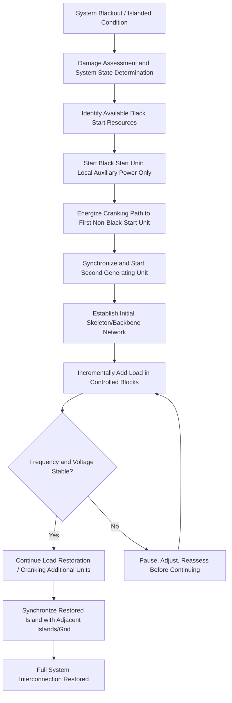

## System Restoration and Black Start Procedures

### Overview

System restoration is the coordinated process of returning a power system to normal operating condition following a partial or complete blackout. Black start refers specifically to the capability to restore power to a de-energized system without relying on external transmission support — that is, starting generation using only on-site or local power sources, since most large thermal and nuclear generating units require external auxiliary power (for boiler feed pumps, cooling systems, control systems) to start and cannot self-start from a fully de-energized condition.

### Fundamental Restoration Challenge

**Key Points:**

- Most large synchronous generating units (coal, nuclear, and many combined-cycle gas units) require station auxiliary power drawn from the grid to start — they cannot restart themselves once isolated from all external power, a condition known as lacking black start capability.
- Black start-capable units (typically small gas turbines, diesel generators, or hydroelectric units with sufficient head and minimal auxiliary requirements) can start independently and are used to energize a local "cranking path" to bring larger, non-black-start units online.
- Restoration is not simply "turning the system back on" — it is a carefully sequenced process managing generation-load balance, voltage control, and system stability at every step to avoid re-triggering instability or a repeat collapse.

### Restoration Process Architecture

### Key Phases of Restoration

#### 1. Damage Assessment and Planning

- Following a blackout event, the Reliability Coordinator and affected Transmission Operators/Balancing Authorities assess the extent of the outage, status of transmission and generation assets, and any physical damage requiring repair before restoration can proceed.
- Pre-established, regularly tested restoration plans (required under EOP-005) provide the pre-planned sequence and cranking paths to be used, adapted in real time to actual system conditions and asset availability.

#### 2. Black Start Unit Initiation

**Key Points:**

- Black start units are started using local resources — typically diesel engines, battery systems, or the unit's own small-scale self-contained start system — entirely independent of grid power.
- Common black start resource types include: small gas turbines/combustion turbines with diesel or battery starting systems, hydroelectric units (particularly those with sufficient reservoir head enabling self-start via governor and local battery-powered controls), and increasingly, battery energy storage systems (BESS) paired with grid-forming inverter capability.
- Utilities identify and contractually/operationally designate specific black start resources within their footprint as part of mandatory restoration planning, with periodic testing required to verify actual black start capability (a unit's nameplate black-start designation does not guarantee successful real-world performance without regular verification).

#### 3. Cranking Path Energization

- The "cranking path" is the specific transmission path used to carry power from the black start unit to the next generating unit to be started, selected in advance to minimize the risk of instability, voltage issues, and equipment damage during energization.
- Cranking paths are typically kept as short and electrically simple as possible, avoiding heavily reactive (highly charged) long transmission lines that can produce excessive overvoltage (Ferranti effect) when initially energized from a small source with limited reactive absorption capability.
- Energizing a transmission line from a small black start unit requires careful management of charging current and reactive power, since large capacitive charging demand from long lines can exceed the reactive capability of the small starting unit, causing overvoltage.

#### 4. Sequential Unit Startup and Frequency/Voltage Control

**Key Points:**

- As each subsequent generating unit is brought online, system operators must carefully balance the incremental generation against connected load (including the auxiliary/station load of the units themselves) to maintain frequency within acceptable bounds.
- Voltage control during restoration is particularly challenging because the system is lightly loaded relative to its normal transmission capacity, creating a tendency toward overvoltage from line charging that must be managed via reactor switching, generator underexcitation, and careful sequencing of line energization.
- Governor and voltage regulator settings during restoration are often operated in more conservative, tightly controlled modes than normal operation, given the reduced system strength (lower short-circuit capacity) during early restoration stages.

#### 5. Load Restoration

- Load is restored in carefully sized, incremental blocks (rather than reconnecting all de-energized load simultaneously) to avoid overwhelming the still-limited available generation and to allow operators to observe and stabilize frequency/voltage response between each block.
- **Cold Load Pickup:** Reconnecting load after an extended outage often produces a higher-than-normal initial demand spike (due to loss of thermostatic diversity — e.g., all air conditioners and refrigeration equipment calling for power simultaneously upon reenergization), requiring restoration planning to account for this elevated initial pickup demand rather than assuming pre-outage load levels.
- Priority is typically given to restoring critical facilities (hospitals, water/wastewater treatment, emergency services, communications infrastructure) and to load blocks that assist in stabilizing the restoration process (e.g., load that helps balance generation without introducing large motor-starting transients).

#### 6. Island Synchronization and Full Interconnection

- As multiple restoration islands are established (potentially by different utilities or TOPs within a wide interconnection), they must eventually be synchronized together — matching frequency, voltage, and phase angle before closing the interconnecting breaker — a process requiring careful coordination, often directed by the Reliability Coordinator across the affected wide area.
- Synchronization of large islands carries risk if frequency/voltage/angle are not properly matched; automatic or manual synchronizing equipment (synchroscopes, synchronizing relays) verifies alignment before closing tie breakers.

### Regulatory Framework: EOP-005 and Related Standards

| Standard | Function |
| --- | --- |
| EOP-005 | System Restoration from Blackstart Resources — mandates restoration plans, testing, and training |
| EOP-006 | System Restoration Coordination — RC-level coordination of restoration across multiple TOPs/BAs |
| EOP-011 | Emergency Operations — broader emergency planning encompassing restoration triggers |
| TOP standards | Real-time operational requirements applicable during restoration-phase operation |

**Key Points:**

- EOP-005 requires Transmission Operators to have a Reliability Coordinator-reviewed restoration plan, including identification of black start resources, cranking paths, and restoration priorities specific to their footprint.
- Regular testing of black start units (verifying actual successful start from a de-energized state, not just nameplate capability) and periodic restoration plan drills/simulations are mandatory components of maintaining certified restoration readiness.
- Restoration plans must be coordinated with adjacent Transmission Operators and the overseeing Reliability Coordinator to ensure cranking paths and synchronization points are mutually consistent across the wider system.

### Modern Considerations: Inverter-Based Resources in Restoration

**Key Points:**

- **Grid-Forming Inverters:** Unlike conventional grid-following inverters (which require an existing voltage/frequency reference from synchronous generation to operate), grid-forming inverter technology can establish voltage and frequency reference independently, enabling battery energy storage systems (BESS) to serve as black start resources — a capability of growing interest as BESS deployment expands.
- **Battery Storage as Black Start Resource:** BESS paired with grid-forming inverters offers fast-start capability (near-instantaneous, unlike thermal unit startup times) and precise, software-controlled ramp rates during cranking path energization, potentially simplifying some aspects of traditional restoration sequencing.
- [Inference] While grid-forming BESS black-start capability has been demonstrated in pilot deployments and is an active area of standards development, the extent of its adoption as a primary (versus supplemental) black start resource across major interconnections continues to evolve, and specific utility restoration plans should be consulted for current designated black start resource inventories.
- The declining fleet of traditional synchronous black-start-capable units (as some older gas and hydro units retire) has increased industry attention on qualifying new resource types (grid-forming BESS, and in some cases DER aggregations) as alternative restoration assets.

### Restoration Training and Simulation

- System operators undergo periodic restoration drills using power system simulators to practice cranking path energization, load restoration sequencing, and island synchronization procedures under realistic (though non-live) conditions.
- Tabletop exercises and full-scale restoration drills (sometimes involving actual, controlled black start unit testing) are conducted periodically to validate that restoration plans remain executable given current system configuration, which changes over time as generation and transmission assets are added, retired, or modified.

### Example: Simplified Restoration Sequence

**Example:**

1. **T+0:** Wide-area blackout occurs; RC and TOPs begin damage assessment and confirm no unsafe conditions exist for restoration to proceed.
2. **T+15 min:** Designated black start hydroelectric unit is started using battery-powered local controls (no grid power required).
3. **T+45 min:** Black start unit energizes a short, pre-designated cranking path to a nearby combined-cycle gas plant, providing auxiliary power to start that unit's auxiliary systems.
4. **T+90 min:** Second unit comes online; combined generation begins serving a small initial load block including a designated critical hospital feeder.
5. **T+2-4 hours:** Additional units are progressively started via expanding cranking paths; load is added in incremental blocks, with operators monitoring frequency/voltage stability between each addition.
6. **T+6-12 hours:** Multiple restoration islands, each independently stabilized, are synchronized together under RC coordination as cranking paths connect previously separate restoration zones.
7. **T+12+ hours (event and system-size dependent):** Full system restoration achieved; post-event review begins to document lessons learned and update restoration plans as needed.

[Inference] Restoration timelines vary enormously depending on the extent of the initiating outage, the number and geographic distribution of available black start resources, weather conditions, and any physical damage requiring repair before energization — the example above illustrates a generic sequence structure rather than a predictive timeline for any specific event.

### Next Steps

- **Black Start Resource Qualification and Testing Requirements**
- **Grid-Forming Inverter Technology for Battery Storage Black Start**
- **Cold Load Pickup and Load Restoration Sequencing**
- **Reliability Coordinator Wide-Area Restoration Coordination**
- **Cascading Failure Mechanisms Leading to Blackout Conditions**
- **Synchronization and Islanding Procedures**
- **Transmission Line Charging and Reactive Power Management During Restoration**
- **Restoration Plan Simulation and Drill Methodologies**