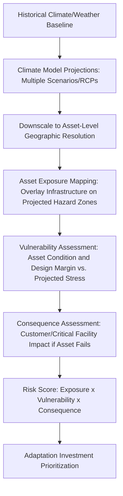

## Climate Adaptation Planning for Grid Infrastructure

### Overview

Climate adaptation planning for grid infrastructure is the systematic process of identifying, assessing, and planning for the long-term physical and operational risks that a changing climate poses to electric power systems, and adjusting infrastructure design, operational practices, and investment planning accordingly. Unlike traditional storm hardening, which typically responds to historical weather patterns, climate adaptation planning explicitly incorporates forward-looking climate projections to account for shifting baseline conditions and increasing frequency/intensity of extreme events over asset lifetimes spanning decades.

### Distinction from Traditional Hardening and Mitigation

**Key Points:**

- **Climate Mitigation:** Refers to reducing greenhouse gas emissions (e.g., grid decarbonization, renewable integration) — a related but distinct concept from adaptation.
- **Climate Adaptation:** Refers to adjusting infrastructure and operations to withstand the physical consequences of climate change that are already occurring or projected, regardless of mitigation efforts.
- **Traditional Storm Hardening:** Typically designed against historical extreme weather statistics (e.g., 100-year return period based on historical records).
- **Climate-Informed Adaptation:** Explicitly incorporates forward-looking climate model projections, recognizing that historical statistics may understate future risk as climate patterns shift — designing for the conditions an asset will face over its full service life (often 30-80 years for major transmission infrastructure), not just conditions at the time of construction.

### Climate Risk Categories for Grid Infrastructure

| Climate Stressor | Grid Infrastructure Impact |
| --- | --- |
| Increasing Extreme Heat Frequency/Duration | Thermal derating of lines/transformers, increased peak cooling load, accelerated equipment aging |
| Shifting Precipitation Patterns | Increased flood risk to substations, altered hydroelectric generation patterns |
| Sea Level Rise | Coastal substation/infrastructure inundation risk, saltwater corrosion acceleration |
| Increasing Wildfire Frequency/Severity | Expanded high-fire-threat zones, extended fire season duration |
| Changing Storm Intensity (Hurricanes) | Higher design wind loading requirements, storm surge exposure expansion |
| Shifting Cold Extremes / Polar Vortex Events | Generator/gas-supply cold-weather vulnerability despite overall warming trend |
| Drought | Reduced hydroelectric generation capacity, cooling water availability constraints for thermal plants |

**Key Points:**

- A critical and sometimes counterintuitive planning challenge is that climate change can increase both extreme heat *and* extreme cold event risk in a given region — overall warming trends do not eliminate the risk of severe cold-weather events (e.g., polar vortex disruptions), which have driven some of the most severe recent grid reliability failures.
- Compound and cascading climate risks — such as drought-driven wildfire risk combined with extreme heat load and reduced hydroelectric availability occurring simultaneously — represent a growing planning challenge that single-hazard risk assessments do not adequately capture.

### Climate Risk Assessment Methodology

**Key Points:**

- **Climate Scenario Modeling:** Adaptation planning typically evaluates infrastructure exposure across multiple future climate scenarios (e.g., varying greenhouse gas emission trajectories/Representative Concentration Pathways) rather than a single deterministic forecast, reflecting genuine uncertainty in long-term climate outcomes.
- **Downscaling:** Global and regional climate models must be spatially downscaled to asset-level resolution (specific substations, transmission corridors) to be useful for infrastructure planning, a technically demanding step requiring specialized climate science expertise often obtained through partnership with national laboratories, universities, or specialized climate risk consultancies.
- **Asset-Level Exposure Mapping:** Overlaying georeferenced infrastructure asset data (substation locations, transmission routes, generation sites) against projected hazard zones (flood, wildfire, extreme heat/cold, sea level rise) to identify specific assets facing elevated future risk.

### Design Standard Evolution

**Key Points:**

- **Forward-Looking Design Criteria:** A growing engineering practice trend toward using climate-projected (rather than purely historical) extreme value statistics for structural design parameters — for example, using projected future extreme wind speeds or flood elevations rather than historical 100-year return period values, which may understate future risk under a shifting climate baseline.
- **Codes and Standards Evolution:** Organizations such as IEEE and the National Electrical Safety Code (NESC) periodically review loading district maps and design criteria; there is ongoing industry and academic discussion about whether current code-based loading criteria adequately reflect projected future extreme weather given their historical basis, though the specific pace and scope of formal code revisions is an evolving regulatory matter.
- **Asset-Specific vs. Blanket Standards:** Given the significant cost implications of universally upgrading design standards, many utilities apply climate-adjusted design criteria selectively to new construction and major asset replacement in the highest-risk zones, rather than retroactively upgrading the entire existing asset base.

[Inference] The degree to which formal engineering codes (IEEE, NESC, ASCE) have been revised to explicitly incorporate forward-looking climate projections, versus utilities independently applying more conservative climate-adjusted margins ahead of formal code updates, varies by standard and is a continuing area of development; current edition-specific code language should be verified directly against the applicable current standard.

### Sector-Specific Adaptation Measures

#### Transmission and Distribution

- Elevated substation design in projected flood/sea-level-rise zones; submersible or flood-resistant equipment specification for unavoidably exposed sites.
- Upgraded structural loading criteria (wind, ice) for new construction and major rebuilds in corridors with projected increasing extreme weather intensity.
- Expanded vegetation management and covered conductor deployment in zones with projected wildfire season expansion.

#### Generation

- Enhanced cooling water availability planning for thermal generation facing projected drought/reduced water availability, including evaluation of alternative cooling technologies (dry/hybrid cooling) in water-constrained regions.
- Expanded cold-weather generator weatherization given persistent (and in some analyses, potentially increasing) severe cold-snap risk despite overall warming trends.
- Hydroelectric generation planning incorporating projected shifts in precipitation timing and volume (e.g., earlier snowmelt affecting seasonal generation availability patterns).

#### System Planning and Resource Adequacy

- Incorporation of climate-adjusted weather years into generation adequacy studies (LOLE/EUE modeling), recognizing that historical weather-year sampling may not adequately represent future extreme event probability distributions.
- Extreme Weather Assessment methodologies explicitly modeling correlated, weather-driven multi-unit outage risk (as distinct from independent random forced outage assumptions) in resource adequacy planning.

### Institutional and Regulatory Drivers

**Key Points:**

- **Regulatory Climate Risk Disclosure:** Increasing requirements (varying by jurisdiction) for utilities to disclose climate-related physical risk exposure and adaptation planning as part of regulatory filings, financial disclosure, or resilience planning proceedings.
- **Federal and National Laboratory Support:** Government research entities (e.g., National Renewable Energy Laboratory, Department of Energy national labs) provide climate downscaling data, risk modeling tools, and technical assistance supporting utility-level climate adaptation planning.
- **Insurance and Financial Risk Signals:** Rising insurance costs and, in some cases, insurance unavailability in high-climate-risk zones (particularly wildfire and coastal flood zones) increasingly serve as an independent financial signal reinforcing engineering-driven adaptation prioritization.

### Adaptation Investment Prioritization Framework

**Key Points:**

- **Risk-Based Capital Allocation:** Similar in structure to storm-hardening prioritization, but extended over a longer planning horizon and incorporating climate-scenario uncertainty rather than a single deterministic risk estimate.
- **No-Regrets Measures:** Adaptation investments that provide risk-reduction benefit across a wide range of climate scenario outcomes (e.g., general flood-proofing of substations, cold-weather generator weatherization) are typically prioritized first, since they remain valuable regardless of which specific climate trajectory materializes.
- **Adaptive/Phased Investment Pathways:** Given long-lived infrastructure and climate projection uncertainty, some utilities adopt phased investment approaches — initial no-regrets measures followed by monitoring of actual climate trend realization, with additional investment triggered by observed conditions rather than committing fully to a single long-range projection upfront.

### Example: Coastal Substation Climate Adaptation Assessment

**Example:**

1. **Exposure Mapping:** A coastal substation serving 15,000 customers is identified as within a projected 30-year sea-level-rise and storm-surge flood zone under moderate-to-high emission scenario projections, though currently outside the historical 100-year floodplain.
2. **Vulnerability Assessment:** Existing equipment is ground-level mounted with no flood protection, representing high vulnerability to the projected future exposure despite historically adequate siting.
3. **Consequence Assessment:** The substation serves a hospital and emergency services facility, elevating consequence severity if flooded and taken offline during a storm event.
4. **Risk Prioritization:** Combined high exposure trend, high vulnerability, and high consequence rank this substation among the utility's highest-priority adaptation investments.
5. **Adaptation Measure Selection:** Given long asset life and significant uncertainty in the exact timing/magnitude of future sea-level rise, the utility selects a phased approach — near-term flood barrier and elevated critical equipment installation (a no-regrets measure providing benefit even under lower-emission scenarios), with a planned future full-site elevation or relocation study triggered if observed sea-level trends track toward higher-emission scenario projections.

### Next Steps

- **Extreme Weather Assessment in Generation Adequacy (LOLE/EUE) Modeling**
- **Storm Hardening and Undergrounding Tradeoffs**
- **Flood-Resistant Substation Design Standards**
- **Climate Scenario Modeling and Downscaling Techniques**
- **Cold Weather Generator Weatherization Standards**
- **Regulatory Climate Risk Disclosure Requirements for Utilities**
- **Drought Impact on Hydroelectric and Thermal Generation Planning**
- **No-Regrets vs. Adaptive Pathway Investment Strategies**