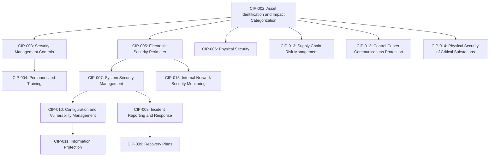

## NERC CIP Standards Framework Overview

### Overview

The NERC Critical Infrastructure Protection (CIP) standards are the mandatory, FERC-enforceable cybersecurity and physical security requirements governing entities that own or operate the North American Bulk Electric System (BES). The CIP framework establishes a risk-tiered set of controls — spanning asset identification, access control, system hardening, incident response, supply chain risk management, and physical security — designed to protect Bulk Electric System (BES) Cyber Systems from cyber and physical threats capable of impacting grid reliability.

### Regulatory Basis and Applicability

**Key Points:**

- CIP standards are mandatory for all Registered Entities that own or operate portions of the Bulk Electric System in the United States and Canada, enforced by FERC and equivalent Canadian provincial regulators, with violations carrying financial penalties historically up to approximately $1 million per violation per day.
- CIP standards were developed following the transition from voluntary to mandatory NERC reliability standards under the Energy Policy Act of 2005, and have been substantially revised over successive versions in response to evolving threat landscapes.
- CIP is distinct from — but often used alongside — voluntary international frameworks such as IEC 62443, which distributes cybersecurity responsibility across asset owners, integrators, and product suppliers, whereas NERC CIP places the compliance burden squarely on the asset owner (Registered Entity).

### Impact-Based Risk Tiering

The foundational structure of the CIP framework is impact-based categorization, established under CIP-002, which determines the scope and stringency of all subsequent requirements:

| Impact Category | Description | Compliance Burden |
| --- | --- | --- |
| High Impact | Large Control Centers and associated BES Cyber Systems with the greatest potential BES impact | Most stringent — full CIP-004 through CIP-011 and CIP-015 requirements |
| Medium Impact | Generation, transmission, and control center assets meeting defined capacity/voltage thresholds | Substantial requirements, generally scaled below High Impact |
| Low Impact | Assets containing BES Cyber Systems that do not meet Medium/High criteria | Streamlined but non-trivial requirements, notably expanded under CIP-003-9 |

**Key Points:**

- CIP-002 categorization is foundational: an incomplete asset inventory or unsupported categorization decision can affect the scope of every subsequent CIP control, making accurate initial categorization a critical first compliance step.
- Categorization must be periodically reviewed and updated as an entity's asset inventory, generation capacity, or grid topology changes over time.

### Standard-by-Standard Framework

| Standard | Title/Focus |
| --- | --- |
| CIP-002 | BES Cyber System Categorization — identifies and categorizes systems by impact rating, the foundation for all subsequent scope |
| CIP-003 | Security Management Controls — cybersecurity policies, senior management accountability, and security plans, including low-impact asset requirements |
| CIP-004 | Personnel and Training — access authorization, background checks, and cybersecurity training for personnel with BES Cyber System access |
| CIP-005 | Electronic Security Perimeters (ESP) — electronic access points, remote access controls, and network protections |
| CIP-006 | Physical Security of BES Cyber Systems — physical access controls and monitoring |
| CIP-007 | System Security Management — ports/services management, patch management, malicious code prevention, authentication |
| CIP-008 | Incident Reporting and Response Planning |
| CIP-009 | Recovery Plans for BES Cyber Systems |
| CIP-010 | Configuration Change Management and Vulnerability Assessments |
| CIP-011 | Information Protection — handling of BES Cyber System Information |
| CIP-012 | Communications between Control Centers — protecting real-time operational data exchanged between Control Centers |
| CIP-013 | Supply Chain Risk Management — vendor, product, and remote access risk management |
| CIP-014 | Physical Security — protection of critical transmission stations, substations, and associated primary control centers from physical attack |
| CIP-015 | Internal Network Security Monitoring (INSM) — monitoring within the Electronic Security Perimeter |

**Key Points:**

- The CIP family currently extends from CIP-002 through CIP-015, comprising fourteen standards, though not every listed standard or version is simultaneously enforceable — different versions can be mandatory, subject to future enforcement, pending regulatory action, or under development at the same time.
- Responsible entities should always verify the current effective version and implementation date for each standard directly against NERC's official Reliability Standards pages rather than relying on a static reference.

### Architecture and Control Flow

### Recent and Emerging Standard Developments (2026)

Three significant changes shape the 2026 CIP compliance landscape:

#### CIP-003-9 — Expanded Low-Impact Governance

CIP-003-9 extends vendor remote access controls to low-impact BES Cyber Systems, with enforcement beginning April 1, 2026, requiring applicable entities to implement methods for determining and disabling vendor electronic remote access and detecting known or suspected malicious communications associated with that access — closing a gap where low-impact sites previously had minimal oversight of vendor connectivity.

#### CIP-012-2 — Control Center Communications Protection

CIP-012-2 became effective July 1, 2026, strengthening requirements for entities to document plans mitigating risks of unauthorized disclosure, unauthorized modification, and loss of availability for real-time operational data exchanged between Control Centers.

#### CIP-015-1 — Internal Network Security Monitoring (INSM)

**Key Points:**

- CIP-015-1 was adopted in response to FERC Order No. 887/907, addressing the lack of internal visibility in existing CIP standards — a gap directly exposed by intrusion campaigns (publicly referenced as "Volt Typhoon") in which attackers reportedly operated inside network perimeters undetected.
- The standard requires electric utilities to monitor network traffic within Electronic Security Perimeters of High Impact BES Cyber Systems and Medium Impact systems with External Routable Connectivity (ERC), shifting the security model from purely perimeter-based defense toward continuous internal monitoring capable of detecting adversarial activity that has already breached the perimeter.
- Reported compliance/enforcement dates for CIP-015-1 vary across sources — some cite an initial 2025 effective date with phased compliance through 2030, while others cite a specific future enforcement date of October 1, 2028 for full applicability. [Unverified] Given this inconsistency across secondary sources, the authoritative compliance timeline for CIP-015-1 (and any subsequent CIP-015-2 modification addressing EACMS/PACS scope, reportedly due to NERC by September 2, 2026) should be confirmed directly against NERC's official published standard and implementation plan rather than any single secondary source.
- Procurement and deployment lead times for OT network monitoring platforms (reportedly up to 18 months for medium and large utilities) mean early evaluation, pilot deployment, and network infrastructure planning are recommended well ahead of any applicable compliance deadline.

#### CIP-002-8 and Virtualization-Related Standards

- CIP-002-8 has been adopted by NERC and filed with FERC, representing an update to the foundational asset categorization standard.
- FERC approved a set of virtualization-related CIP standard updates in March 2026, reflecting the framework's adaptation to virtualized and cloud-adjacent BES Cyber System architectures, an area of active standards development as utilities increasingly adopt virtualization technology within control system environments.

[Inference] Given the pace of CIP standard revision activity reflected across current sources, entities should treat any specific version number or date cited here as a snapshot subject to change, and should consult NERC's official Reliability Standards site for the current authoritative version and applicable implementation schedule before making compliance decisions.

### Compliance Enforcement Mechanics

**Key Points:**

- Each CIP standard contains multiple discrete Requirements, and each Requirement is assigned a Violation Risk Factor (VRF) and evaluated against Violation Severity Levels (VSL), consistent with the broader NERC compliance enforcement structure used across all Reliability Standard categories.
- NERC CIP audit evidence must demonstrate that controls operated as required over time, not simply that a policy or procedure document exists — a recurring theme in CIP compliance guidance is that most audit findings stem from an entity being unable to produce evidence for a control it was actually running, rather than a wholesale missing program.
- Common practical compliance sequencing prioritizes CIP-002 first (since every other control's scope depends on accurate asset categorization), followed by CIP-003 and CIP-005 vendor/access controls, then CIP-007 authentication controls and CIP-015 monitoring.

### Relationship to Broader OT/ICS Security Frameworks

| Framework | Nature | Scope |
| --- | --- | --- |
| NERC CIP | Mandatory, jurisdictional (US/Canada) | Bulk Electric System only; enforced by audit and financial penalty |
| IEC 62443 | Voluntary, international | All industrial sectors; responsibility distributed across the vendor/integrator/owner supply chain |
| NIST Cybersecurity Framework | Voluntary (mandatory for some federal contexts) | Cross-sector general cybersecurity risk management |
| Purdue Model | Reference architecture (not a compliance standard) | Common vocabulary for describing OT/ICS network segmentation layers |

**Key Points:**

- Many energy companies apply both frameworks in combination — NERC CIP for regulatory compliance obligations and IEC 62443 for deeper technical architecture guidance and vendor/supply-chain security management practices not explicitly prescribed by CIP.
- The Purdue Model remains a widely used reference architecture for describing where BES Cyber Systems, Electronic Security Perimeters, and Electronic Access Control or Monitoring Systems (EACMS) sit relative to corporate IT and field control layers, informing practical CIP-005/CIP-007 network segmentation design even though it is not itself a NERC standard.

### Example: CIP Scoping Workflow for a New Generation Facility

**Example:**

1. **CIP-002 Categorization:** A new 300 MW combined-cycle plant's control systems are evaluated against NERC's categorization criteria; given its capacity and grid role, it is designated a Medium Impact BES Cyber System.
2. **CIP-005 ESP Definition:** An Electronic Security Perimeter is defined around the plant's control network, with defined Electronic Access Points and associated CIP-007 authentication/patch management controls applied to systems within it.
3. **CIP-013 Supply Chain Review:** Vendor remote access arrangements for the plant's turbine control system OEM are evaluated and documented under supply chain risk management requirements.
4. **CIP-015 Applicability Check:** Because the facility has External Routable Connectivity and is Medium Impact, it falls within CIP-015's INSM applicability scope, triggering internal network monitoring deployment planning ahead of the applicable compliance date.
5. **CIP-008/CIP-009 Planning:** Incident response and recovery plans are developed and tested for the newly categorized BES Cyber Systems prior to commercial operation.

### Next Steps

- **BES Cyber System Categorization Methodology (CIP-002 Deep Dive)**
- **Electronic Security Perimeter (ESP) Design and CIP-005 Implementation**
- **Internal Network Security Monitoring (CIP-015) Architecture and Deployment**
- **Supply Chain Risk Management for OT/ICS Vendors (CIP-013)**
- **Physical Security of Critical Substations (CIP-014) Risk Assessment**
- **IEC 62443 and Purdue Model Reference Architecture**
- **Incident Reporting and Recovery Planning (CIP-008/CIP-009)**
- **Virtualization and Cloud Considerations in BES Cyber System Architecture**