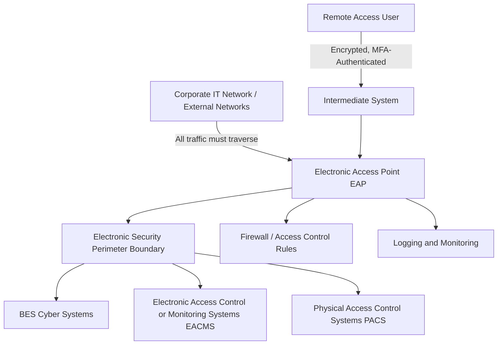

## Electronic Security Perimeters and Access Control

### Overview

Electronic Security Perimeters (ESPs) form the network-boundary security architecture at the core of NERC CIP protection for BES Cyber Systems, primarily governed by CIP-005. An ESP defines the logical boundary surrounding a group of BES Cyber Systems within which access is controlled, and all electronic access into or out of that boundary must pass through defined, monitored, and controlled Electronic Access Points (EAPs). Access control encompasses the broader set of authentication, authorization, and remote access management practices — spanning CIP-005 network boundary controls and CIP-004/CIP-007 personnel and system-level access requirements — that collectively govern who and what can reach BES Cyber Systems and under what conditions.

### Core ESP Architecture

**Key Points:**

- **BES Cyber System:** One or more BES Cyber Assets logically grouped to perform one or more reliability tasks; the protected asset that the ESP is designed to shield.
- **Electronic Security Perimeter (ESP):** The logical boundary surrounding a network to which BES Cyber Systems are connected, within which all electronic access is subject to defined controls.
- **Electronic Access Point (EAP):** A Cyber Asset interface on the ESP boundary that provides access to BES Cyber Systems and through which all external electronic communication must pass, typically implemented via a firewall or equivalent boundary-control device.
- **Electronic Access Control or Monitoring System (EACMS):** Cyber Assets that perform electronic access control or monitoring functions for the ESP (e.g., firewalls, intrusion detection systems, authentication servers) — these systems are themselves subject to CIP protections given their security-critical role.
- **Physical Access Control System (PACS):** Cyber Assets controlling, alerting, or logging physical access to BES Cyber System locations, coordinated with but distinct from electronic access controls.

### CIP-005 Core Requirements

#### Perimeter Definition and All-Access-Through-EAP Principle

- Every applicable BES Cyber System must reside within a defined ESP (or be identified as not having External Routable Connectivity, in which case a reduced control set applies).
- A foundational CIP-005 principle is that all external electronic access to BES Cyber Systems within an ESP must be routed through an identified, controlled Electronic Access Point — no direct, uncontrolled connections bypassing the EAP are permitted.
- Deny-by-default access control philosophy is standard practice: EAPs are configured to deny all traffic by default, with only explicitly required and documented communication permitted (a documented "permit list" rather than a "deny list" approach).

#### Remote Access Controls

**Key Points:**

- **Interactive Remote Access:** User-initiated remote access to BES Cyber Systems (as distinct from system-to-system machine communication) requires additional controls including encryption, multi-factor authentication, and routing through a defined Intermediate System rather than a direct connection to the BES Cyber System itself.
- **Intermediate System:** A Cyber Asset (or system of Cyber Assets) that serves as a proxy/jump-host for remote access, ensuring the remote user's device never establishes a direct network path to the protected BES Cyber System — reducing the attack surface exposed to potentially compromised remote endpoints.
- **Vendor Remote Access:** Given the elevated risk associated with third-party vendor connections (a common intrusion vector), CIP-005 and the CIP-013 supply chain standard both address requirements for vendor electronic remote access, including methods for determining active vendor connections and disabling them when not actively needed. CIP-003-9 extended equivalent vendor remote access control requirements to low-impact BES Cyber Systems, a category previously subject to minimal oversight in this area.
- **Encryption Requirements:** Interactive Remote Access sessions must be encrypted, protecting session content from interception as it traverses potentially untrusted intermediate networks (including the public internet in many practical deployments).

### Access Control Layers Beyond the Perimeter

#### CIP-004: Personnel Access Authorization

- Personnel requiring authorized electronic or physical access to BES Cyber Systems must undergo a Personnel Risk Assessment (background check) and role-based cybersecurity training before access is granted.
- Access authorization must be individually documented and tied to a specific, justified business need (principle of least privilege), with periodic (typically annual or more frequent, depending on version) access review to confirm continued need.
- Access revocation procedures require prompt removal of access upon personnel termination or role change no longer requiring access — timeliness requirements for revocation are a frequently cited audit focus area.

#### CIP-007: System-Level Security Management

**Key Points:**

- **Authentication:** Requires strong password/credential policies (or equivalent authentication mechanisms) for access to BES Cyber Systems, including restrictions on shared/generic accounts where individual accountability is feasible.
- **Ports and Services Management:** Requires that only necessary network ports and services be enabled on BES Cyber Assets, reducing the available attack surface.
- **Patch Management:** Requires a documented process for identifying, evaluating, and applying security patches to BES Cyber Systems within defined timeframes, balanced against operational stability testing requirements given the safety-critical nature of BES equipment.
- **Malicious Code Prevention:** Requires deployment of methods (antivirus, application whitelisting, or equivalent) to deter, detect, or prevent malicious code on BES Cyber Systems.

### Network Segmentation Reference: The Purdue Model

Electronic Security Perimeters in practical OT network architecture are commonly designed with reference to the Purdue Enterprise Reference Architecture, which provides a layered segmentation vocabulary widely used across industrial control system security:

| Purdue Level | Description | Typical CIP Relevance |
| --- | --- | --- |
| Level 5 | Enterprise/Corporate IT Network | Outside ESP; source of potential external threat |
| Level 4 | Business/Site IT Network | Outside ESP; DMZ boundary typically established here |
| Level 3.5 | Industrial DMZ | Common location for EAP/firewall boundary controls |
| Level 3 | Site Operations / Control Center Systems | Often within ESP; EACMS frequently reside here |
| Level 2 | Supervisory Control (SCADA/HMI) | Core BES Cyber Systems, within ESP |
| Level 1 | Basic Control (PLCs, RTUs, protective relays) | BES Cyber Assets, within ESP, tightly restricted access |
| Level 0 | Physical Process (breakers, transformers, generators) | Physical equipment; PACS-governed physical access |

**Key Points:**

- The Industrial DMZ (Level 3.5) is a widely adopted architectural pattern for implementing the EAP boundary, providing a buffered zone where data historians, patch management servers, and other systems requiring communication with both IT and OT networks can operate without granting direct IT-to-OT network paths.
- The Purdue Model is a reference architecture, not itself a NERC standard, but is commonly used in CIP-005 network design documentation to demonstrate defensible segmentation logic to auditors.

### Internal Network Security Monitoring (CIP-015) as an ESP Evolution

**Key Points:**

- Traditional ESP/EAP architecture is fundamentally perimeter-focused — it controls what crosses the boundary but historically provided limited visibility into activity occurring within the ESP once a device or credential is inside.
- CIP-015-1 addresses this gap by requiring internal network traffic monitoring within the ESP for High Impact BES Cyber Systems and Medium Impact systems with External Routable Connectivity, reflecting the recognition that perimeter controls alone cannot detect an attacker who has already gained access — a gap directly relevant to intrusion techniques where adversaries operate inside the perimeter undetected for extended periods.
- This represents an architectural shift from purely boundary-based ("castle-and-moat") security toward a defense-in-depth model incorporating continuous internal visibility, conceptually aligned with zero-trust security principles increasingly applied to OT environments.

### Common ESP Implementation Patterns

#### Firewall-Based EAP

- Dedicated firewall appliances configured with explicit allow-list rules define the EAP, typically supplemented by logging/alerting integrated with a Security Information and Event Management (SIEM) or EACMS platform for CIP-007/CIP-008 log retention and incident detection support.

#### Unidirectional Gateways (Data Diodes)

- For BES Cyber Systems requiring outbound data flow (e.g., historian data to business systems) but no inbound path, unidirectional gateway (data diode) hardware provides a physically enforced one-way communication path, eliminating the possibility of inbound compromise through that specific data flow while still enabling necessary business data access.

#### Jump Host / Bastion Architecture for Remote Access

- Interactive Remote Access is commonly implemented via a hardened jump host (Intermediate System) requiring multi-factor authentication, with all remote user sessions terminating at the jump host rather than establishing any direct path to BES Cyber Systems, and with session recording/logging supporting both security monitoring and compliance evidence requirements.

### Compliance Evidence and Audit Considerations

**Key Points:**

- Auditors typically require documented evidence that ESP/EAP controls operated as designed over time — firewall rule change logs, access review records, and remote access session logs — rather than accepting policy documentation alone as evidence of compliance.
- A frequently cited audit gap is inconsistency between documented ESP boundaries/EAP inventories and actual network configuration — periodic network architecture reviews and configuration audits help ensure documentation remains accurate as networks evolve.
- CIP-010 configuration change management requirements intersect directly with ESP/EAP controls, since any change to firewall rules or network architecture affecting the ESP boundary constitutes a controlled configuration change requiring documented authorization and testing.

### Example: Remote Vendor Access to a Substation Control System

**Example:**

1. A protective relay vendor requires periodic remote access to a Medium Impact substation's relay settings for firmware updates and diagnostics.
2. Under CIP-013 supply chain risk management, the vendor's remote access arrangement is documented and risk-assessed prior to authorization.
3. Access is provisioned through a dedicated Intermediate System (jump host) at the ESP boundary, requiring multi-factor authentication for the vendor's designated personnel.
4. The vendor's access is enabled only for the specific, scheduled maintenance window and explicitly disabled immediately afterward, consistent with vendor remote access control requirements extended under CIP-003-9/CIP-005.
5. All session activity is logged, and network traffic during the session is subject to internal monitoring consistent with CIP-015 requirements (where applicable based on impact rating and ERC status), providing visibility should the vendor connection be compromised or misused.
6. Access logs and configuration change records are retained as compliance evidence, demonstrating that the documented access control policy was actively enforced rather than merely written.

### Next Steps

- **NERC CIP Standards Framework Overview (CIP-002 through CIP-015)**
- **Internal Network Security Monitoring (CIP-015) Deployment Architecture**
- **Supply Chain Risk Management for Vendor Remote Access (CIP-013)**
- **Industrial DMZ Design and Purdue Model Network Segmentation**
- **CIP-007 System Security Management: Patch and Ports/Services Controls**
- **CIP-010 Configuration Change Management and Vulnerability Assessment**
- **Multi-Factor Authentication and Intermediate System (Jump Host) Design**
- **Incident Reporting and Response Planning (CIP-008)**