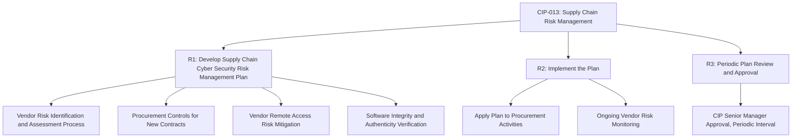
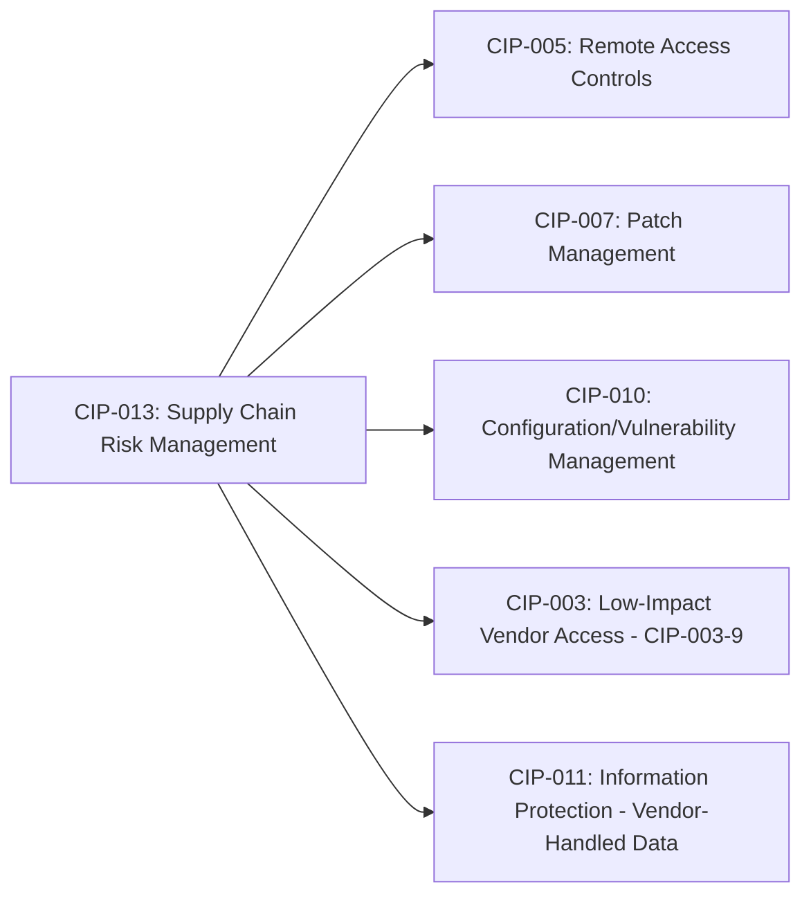

## Supply Chain Risk Management for Grid Vendors

### Overview

Supply chain risk management (SCRM) for grid vendors addresses the cybersecurity and operational risks introduced through third-party hardware, software, firmware, and services integrated into Bulk Electric System (BES) Cyber Systems. This domain has grown in prominence following documented incidents involving compromised vendor software updates, hardware tampering concerns, and vendor remote access as an intrusion vector, and is codified primarily through NERC CIP-013, with supporting requirements in CIP-005 and CIP-010.

### Why Supply Chain Risk Matters for Grid Infrastructure

**Key Points:**

- Grid Cyber Assets — protective relays, RTUs, SCADA/EMS platforms, firmware-controlled switchgear — are sourced from a global vendor ecosystem, creating dependency on third parties whose internal security practices are largely outside the asset owner's direct control.
- Supply chain compromise can occur at multiple points: malicious code embedded during manufacturing, compromised software updates/patches, counterfeit components, or exploitation of vendor remote access channels used for legitimate maintenance and support.
- Unlike a directly-operated network breach, supply chain compromise can affect many asset owners simultaneously if a shared vendor's product or update mechanism is compromised, creating systemic risk concentrated in widely-used vendor products.
- Publicly documented incidents involving nation-state actors leveraging legitimate vendor remote access and living-off-the-land techniques within critical infrastructure networks have specifically elevated regulatory attention on vendor access as a distinct risk category, separate from traditional external perimeter attacks.

### CIP-013: Supply Chain Risk Management Standard

#### Core Requirements Structure

**Key Points:**

- **R1 — Plan Development:** Requires Responsible Entities to develop a documented supply chain cyber security risk management plan addressing, at minimum: vendor risk identification/assessment processes for procurement, methods to mitigate risk from vendor remote access, methods to verify software integrity and authenticity, and coordination of vendor notification of known vulnerabilities.
- **R2 — Plan Implementation:** Requires the entity to implement the developed plan when procuring applicable BES Cyber Systems, meaning the risk management process must be embedded into actual procurement decisions, not merely documented as policy.
- **R3 — Periodic Review:** Requires the plan to be reviewed and approved by the CIP Senior Manager (or delegate) at a defined periodic interval, ensuring the plan remains current as the threat landscape and vendor relationships evolve.
- Notably, CIP-013 is a plan-based, process-oriented standard rather than a prescriptive technical control checklist — it requires the entity to demonstrate a sound risk management process, giving flexibility in specific implementation while requiring auditable evidence that the process was followed.

#### Procurement-Stage Risk Assessment

- **Vendor Risk Assessment:** Prior to executing new contracts (or renewing existing ones, per version-dependent requirements) for applicable BES Cyber Systems, entities must assess the cybersecurity risk posed by the vendor, considering factors such as the vendor's own security practices, incident history, and the criticality of the product/service being procured.
- **Software Integrity and Authenticity:** Procurement processes must address methods to verify that software and firmware provided by the vendor is authentic and has not been tampered with — commonly implemented via cryptographic hash verification, digital signature validation, or secure delivery channel requirements written into vendor contracts.
- **Contractual Risk Mitigation:** Many entities incorporate specific cybersecurity requirements directly into vendor contract language (notification obligations for known vulnerabilities, incident disclosure timelines, remote access control requirements) as a practical mechanism for operationalizing CIP-013 risk mitigation.

### Vendor Remote Access Risk Management

**Key Points:**

- Vendor remote access — used for legitimate diagnostics, firmware updates, and technical support — represents one of the most operationally significant supply chain risk vectors, since it establishes a recurring, often persistent, external connectivity pathway into BES Cyber Systems.
- CIP-013 requires methods to determine and disable vendor electronic remote access, meaning the entity must be able to identify when a vendor connection is active and terminate it when not actively needed for legitimate purposes, rather than maintaining always-on vendor access as a convenience.
- CIP-005 remote access controls (Intermediate Systems, multi-factor authentication, encryption) apply directly to vendor remote access sessions in addition to internal user remote access, layering supply-chain-specific risk mitigation onto the broader ESP access control framework.
- CIP-003-9 extended equivalent vendor remote access control requirements to low-impact BES Cyber Systems effective April 1, 2026, addressing a previously under-governed category where "low-impact" designation had often been assumed to mean minimal vendor access oversight was required.

### Software and Firmware Integrity Verification

#### Common Verification Mechanisms

| Method | Function |
| --- | --- |
| Cryptographic Hash Verification | Confirms downloaded/received software matches vendor-published hash, detecting tampering in transit |
| Digital Signature Validation | Confirms software originates from the claimed vendor and has not been modified since signing |
| Secure Delivery Channels | Contractually or technically enforced secure transfer mechanisms reducing interception/tampering opportunity |
| Vendor Security Attestation | Contractual requirement for vendor to attest to secure development practices (e.g., secure SDLC) |
| Software Bill of Materials (SBOM) | Vendor-provided inventory of software components, enabling identification of vulnerable third-party/open-source dependencies |

**Key Points:**

- Software Bill of Materials (SBOM) requirements have grown in prominence across critical infrastructure sectors generally, enabling asset owners to identify when a known-vulnerable third-party component (e.g., an open-source library with a newly disclosed CVE) is embedded within a vendor's product, even absent a vendor-specific vulnerability disclosure.
- Firmware integrity verification is particularly critical for field devices (protective relays, RTUs) where firmware updates are infrequent and devices may remain in service for many years, making supply chain compromise at the firmware level a long-persistence risk if not detected at update time.

### Vendor Vulnerability Notification and Coordination

**Key Points:**

- CIP-013 plans must address processes for the vendor to notify the entity of vulnerabilities related to procured products or services, and for the entity to have a defined process for evaluating and acting on such notifications.
- This creates a bidirectional expectation: entities must establish the contractual/procedural mechanism for receiving vendor vulnerability disclosures, and must have an internal process (often intersecting with CIP-007 patch management and CIP-010 vulnerability assessment) for evaluating and remediating disclosed vulnerabilities in a timely manner.
- Coordination with vendor Product Security Incident Response Teams (PSIRTs), where they exist, is a common practical mechanism for maintaining this notification channel, though PSIRT maturity varies significantly across the OT/ICS vendor landscape compared to mainstream IT vendors.

### Relationship to Other CIP Standards

**Key Points:**

- **CIP-005 intersection:** Vendor remote access sessions must comply with the same ESP/EAP and Intermediate System controls applicable to internal remote access, layering supply-chain-specific risk assessment on top of standard technical access controls.
- **CIP-007 intersection:** Vendor-supplied patches must still pass through the entity's own CIP-007 patch management evaluation and testing process, even where the vendor has attested to software integrity.
- **CIP-010 intersection:** Vendor-related configuration changes (e.g., a vendor technician modifying device configuration during a remote support session) fall under CIP-010 configuration change management documentation requirements.
- **CIP-011 intersection:** Where vendors are granted access to BES Cyber System Information (e.g., network diagrams, configuration details necessary for support), CIP-011 information protection requirements govern how that sensitive information is shared and protected.

### Practical Program Elements

**Key Points:**

- **Vendor Risk Tiering:** Many entities implement a tiered vendor risk classification (e.g., critical/high/moderate/low) based on the criticality of the product/service and the vendor's access level, allowing risk management effort to be proportionally scaled rather than applying identical scrutiny to every vendor relationship.
- **Procurement Language Templates:** Standardized cybersecurity contract clauses (covering remote access controls, vulnerability notification, software integrity, incident disclosure timelines) streamline consistent risk mitigation across new vendor contracts.
- **Vendor Access Inventory and Disablement Verification:** Maintaining an active inventory of all vendor remote access arrangements, with periodic verification that access is disabled when not in active use, directly supports CIP-013 R1/R2 compliance evidence.
- **Ongoing Vendor Monitoring:** Since CIP-013 requires implementation at the point of procurement (rather than continuous real-time vendor risk scoring), many mature programs voluntarily extend risk monitoring beyond the minimum requirement, periodically reassessing existing vendor relationships as vendor security posture or the threat landscape changes.

### Common Implementation Challenges

**Key Points:**

- **OEM Concentration Risk:** In specialized grid equipment categories (protective relays, specific SCADA/EMS platforms), the vendor market is often concentrated among a small number of OEMs, limiting the practical ability to "vote with the wallet" by switching vendors in response to security concerns, and increasing the criticality of managing risk within existing vendor relationships.
- **Legacy Equipment Gaps:** Older field devices procured before CIP-013's effective date, or from vendors no longer actively supporting cybersecurity attestation processes, create ongoing risk management gaps that are difficult to fully close without equipment replacement.
- **Vendor Security Maturity Variance:** OT/ICS-specific vendors historically have shown more variable cybersecurity program maturity compared to mainstream enterprise IT vendors, requiring entities to invest more heavily in their own assessment and verification processes rather than relying solely on vendor self-attestation.
- [Inference] The degree to which entities have closed legacy equipment and OEM concentration gaps varies substantially across the industry and is influenced by capital replacement cycles that can span decades for major grid assets; this remains an acknowledged, ongoing risk management challenge rather than a fully solved problem across the sector.

### Example: New SCADA Vendor Procurement Risk Assessment

**Example:**

1. A utility begins procurement of a new SCADA platform for a Medium Impact control center, triggering CIP-013 R1/R2 plan implementation.
2. The vendor risk assessment evaluates the vendor's documented secure development lifecycle practices, incident history, and proposed remote access/support model.
3. Contract negotiation incorporates cybersecurity clauses: mandatory vulnerability notification within a defined timeframe, software update integrity verification via digital signature, and a requirement that vendor remote access sessions use the utility's designated Intermediate System with time-bounded, explicitly-enabled access only.
4. Prior to deployment, the vendor provides a Software Bill of Materials for the platform, enabling the utility's security team to cross-check embedded third-party components against known vulnerability databases.
5. Post-deployment, the vendor's remote access arrangement is entered into the utility's vendor access inventory, with periodic verification confirming access remains disabled between authorized support sessions.
6. The overall risk assessment, contract terms, and verification evidence are retained as CIP-013 compliance documentation, subject to periodic CIP Senior Manager plan review.

### Next Steps

- **NERC CIP Standards Framework Overview**
- **Electronic Security Perimeters and Remote Access Control (CIP-005)**
- **Patch Management and Vulnerability Assessment (CIP-007/CIP-010)**
- **Software Bill of Materials (SBOM) Practices for OT/ICS Environments**
- **Vendor Risk Tiering and Procurement Security Frameworks**
- **Internal Network Security Monitoring (CIP-015) as a Compensating Control**
- **Incident Reporting and Response Planning (CIP-008)**
- **Firmware Integrity Verification for Field Devices (Relays, RTUs)**