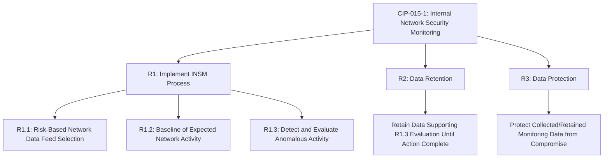
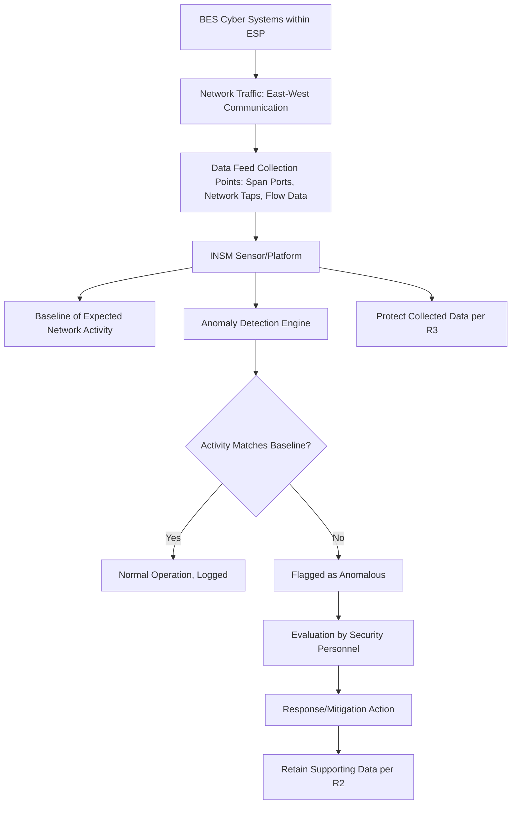

## Internal Network Security Monitoring

### Overview

Internal Network Security Monitoring (INSM) is the practice of continuously observing east-west network traffic — communication between devices within a trusted network zone — to detect anomalous or malicious activity that has already bypassed perimeter defenses. In the NERC CIP framework, INSM is codified through CIP-015-1, which mandates monitoring within Electronic Security Perimeters (ESPs) for the highest-risk BES Cyber Systems, representing a deliberate architectural shift from perimeter-only defense toward defense-in-depth visibility inside the trust boundary.

### Regulatory Origin and Approval Timeline

**Key Points:**

- On January 19, 2023, FERC issued Order No. 887 directing NERC to develop INSM requirements for all High Impact BES Cyber Systems and Medium Impact BES Cyber Systems with External Routable Connectivity (ERC), citing a gap in existing CIP standards' ability to address internal network vulnerabilities once perimeter defenses are bypassed.
- The NERC Board of Trustees adopted CIP-015-1 on May 9, 2024, and on June 26, 2025, FERC approved the standard, with the Commission's action effective September 2, 2025. [Federal Register](https://www.federalregister.gov/documents/2025/07/02/2025-12309/critical-infrastructure-protection-reliability-standard-cip-015-1-cyber-security-internal-network)
- FERC additionally directed NERC to develop modifications extending internal network security monitoring to include Electronic Access Control or Monitoring Systems (EACMS) and Physical Access Control Systems (PACS) located outside the ESP, with this expansion (commonly referred to as CIP-015-2) due from NERC by September 2, 2026. [Federal Register](https://www.federalregister.gov/documents/2025/07/02/2025-12309/critical-infrastructure-protection-reliability-standard-cip-015-1-cyber-security-internal-network)
- Compliance implementation dates are phased: High- and Medium-Impact BES Cyber Systems with ERC must implement INSM by October 1, 2028, while all other applicable BES Cyber Systems with ERC have until October 1, 2030. [Nozomi Networks](https://www.nozominetworks.com/blog/preparing-for-nerc-cip-015-1-internal-network-security-monitoring-for-electric-utilities)

[Unverified] Secondary industry sources show some variation in how the CIP-015-1 effective/compliance dates are characterized (e.g., "effective September 2, 2025" for the standard itself versus the later 2028/2030 implementation deadlines for actual control deployment); entities should confirm the precise applicable date for their specific asset category against NERC's official Implementation Plan for CIP-015-1 rather than relying on any single secondary summary.

### Why Perimeter Controls Alone Are Insufficient

**Key Points:**

- INSM provides ongoing visibility of communications within a trusted zone and detects malicious activity that bypasses perimeter controls, allowing for early detection of anomalous network activity that may indicate an attack in progress. [Industrialdefender](https://www.industrialdefender.com/resources/internal-network-security-monitoring-meeting-nerc-cip-015-1-requirements)
- While CIP Reliability Standards have traditionally protected the electronic security perimeter, FERC identified a gap in addressing internal network vulnerabilities — once an attacker or compromised credential/device is inside the ESP, traditional boundary-focused controls (firewalls, EAPs) provide no further visibility into that actor's movement or activity. [Industrialdefender](https://www.industrialdefender.com/resources/internal-network-security-monitoring-meeting-nerc-cip-015-1-requirements)
- Once inside a trusted zone, an attacker must communicate with targeted assets using the network's own protocols to execute commands or spread malware — INSM is designed to identify this internal traffic as anomalous and flag it, even when the traffic never crosses the ESP boundary and would therefore be invisible to EAP-based monitoring alone. [Nozomi Networks](https://www.nozominetworks.com/blog/preparing-for-nerc-cip-015-1-internal-network-security-monitoring-for-electric-utilities)
- This gap was directly relevant to documented intrusion campaigns in which threat actors operated inside compromised networks using legitimate credentials and native tools ("living off the land"), evading detection mechanisms built primarily around perimeter and signature-based defenses.

### CIP-015-1 Requirement Structure

#### Requirement 1 (R1): Implementation of Monitoring Process

Each Responsible Entity shall implement one or more documented processes for internal network security monitoring of networks protected by the Responsible Entity's Electronic Security Perimeter(s) of high impact BES Cyber Systems and medium impact BES Cyber Systems with External Routable Connectivity, to provide methods for detecting and evaluating anomalous network activity. [NERC](https://www.nerc.com/globalassets/standards/reliability-standards/cip/cip-015-1.pdf)

**Key Points:**

- R1.1 requires entities to implement, using a risk-based rationale, network data feeds to monitor network activity, including connections, devices, and network communications — the standard explicitly allows a risk-based approach to selecting collection points rather than mandating monitoring of every possible network segment uniformly. [Dragos](https://www.dragos.com/blog/nerc-cip-015-is-approved-what-asset-owners-need-to-do)
- Responsible Entities must evaluate their networks within ESPs and identify the collection location(s) and method(s) that would be most effective for detecting anomalous activity, reflecting the standard's process-oriented rather than prescriptive-technology design. [NERC](https://www.nerc.com/globalassets/standards/projects/2023-03/2023-03-technical-rationale-document-feb2024.pdf)
- Baseline development (establishing what "normal" east-west communication looks like for a given environment) is a foundational step, since anomaly detection is only meaningful relative to an understood baseline of expected device communication patterns, protocols, and timing.

#### Requirement 2 (R2): Data Retention

Each Responsible Entity shall implement, except during CIP Exceptional Circumstances, one or more documented processes to retain internal network security monitoring data associated with network activity determined to be anomalous by the Responsible Entity, at a minimum until the action is complete in support of Requirement R1, Part 1.3. [NERC](https://www.nerc.com/globalassets/standards/reliability-standards/cip/cip-015-1.pdf)

**Key Points:**

- Retention obligations are specifically tied to data associated with identified anomalous activity, rather than mandating indefinite retention of all raw network traffic — though many entities voluntarily retain broader monitoring data for a defined period to support forensic investigation and trend analysis.
- Retention duration is tied functionally to completion of the evaluation/response action, meaning the entity's own documented process for evaluating anomalies determines the operative retention timeline.

#### Requirement 3 (R3): Data Protection

- Requires documented processes to protect internal network security monitoring data collected and retained under R1/R2, recognizing that monitoring data itself (which can reveal network architecture, device inventories, and traffic patterns) is sensitive and could aid an attacker if compromised or disclosed.
- This requirement intersects with CIP-011 Information Protection requirements governing BES Cyber System Information more broadly.

### Scope: What Is (and Is Not) Currently Covered

**Key Points:**

- Current CIP-015-1 scope covers networks protected by an Electronic Security Perimeter (ESP), requiring collection of east-west network traffic within the ESP for detection of and response to anomalous activity, applicable to High Impact BES Cyber Systems and Medium Impact BES Cyber Systems with ERC. [Mro](https://www.mro.net/reliability-standard-cip-015-1-and-the-internal-network-security-monitoring-insm-journey/)
- Low Impact BES Cyber Systems and Medium Impact systems without ERC are not currently in scope under CIP-015-1's initial version.
- FERC directed NERC to modify CIP-015-1 within one year of approval to include EACMS and PACS located outside ESPs — systems that, while security-critical, may sit outside the ESP boundary itself and are therefore not covered by the initial version's ESP-scoped language. [Dragos](https://www.dragos.com/blog/prepare-to-implement-nerc-cip-015-internal-network-security-monitoring-insm-requirements)
- [Unverified] The specific technical requirements for this EACMS/PACS scope expansion (commonly referenced as CIP-015-2) were not yet finalized as of the most recent available information; entities should monitor NERC's standards development process directly for the finalized expanded scope and associated implementation timeline.

### Technical Implementation Architecture

**Key Points:**

- **Collection Methods:** Common technical approaches include network taps, switch port mirroring (SPAN ports), and flow-data collection (e.g., NetFlow/IPFIX-style metadata) positioned at strategic points within the ESP to capture east-west traffic without introducing additional risk to the monitored network itself (passive collection is generally preferred to avoid introducing new attack surface or availability risk to safety-critical OT networks).
- **Protocol-Aware Monitoring:** Given the prevalence of OT-specific industrial protocols (DNP3, Modbus, IEC 61850, etc.) within ESPs, effective INSM implementations typically require protocol-aware parsing capable of understanding legitimate versus anomalous command sequences within these protocols, rather than relying solely on generic IT-style network anomaly detection.
- **Baseline Establishment Challenge:** OT networks often exhibit highly deterministic, repetitive communication patterns (unlike variable IT network traffic), which can make baseline development more tractable in some respects but also means that even small deviations may be operationally significant and worth flagging.

### Recommended Implementation Approach

**Key Points:**

- Industry practitioner guidance emphasizes approaching INSM deployment as a project rather than a product purchase — taking a holistic approach with trusted vendors who understand the specific operational environment rather than simply installing a monitoring appliance without broader integration planning. [Dragos](https://www.dragos.com/blog/nerc-cip-015-is-approved-what-asset-owners-need-to-do)
- Entities are encouraged to integrate INSM planning into existing infrastructure lifecycle processes — for example, incorporating INSM collection requirements into planned EMS upgrades years in advance, and testing INSM data collection during Factory Acceptance Testing (FAT) and Site Acceptance Testing (SAT) phases of new equipment commissioning. [Mro](https://www.mro.net/reliability-standard-cip-015-1-and-the-internal-network-security-monitoring-insm-journey/)
- A recommended first step is reviewing the complete list of existing ESPs to ensure a clearly documented connection exists between each applicable BES Cyber System and the ESP protecting it, establishing accurate scope before selecting collection architecture. [Mro](https://www.mro.net/reliability-standard-cip-015-1-and-the-internal-network-security-monitoring-insm-journey/)
- Given multi-year procurement and deployment lead times reported for OT network monitoring platforms, early planning well ahead of the applicable 2028/2030 compliance deadlines is broadly recommended across industry guidance, rather than deferring implementation planning until closer to the deadline.

### Relationship to Broader Detection and Response Capability

| CIP Standard | Relationship to INSM |
| --- | --- |
| CIP-005 | Defines the ESP boundary within which INSM operates; INSM addresses the internal visibility gap left by ESP/EAP boundary controls |
| CIP-007 | System-level security controls (patching, malicious code prevention) complement INSM's network-level detection |
| CIP-008 | Incident Reporting and Response Planning processes consume INSM-generated anomaly detections as a trigger for formal incident response |
| CIP-010 | Configuration change management provides context distinguishing legitimate authorized changes from anomalous activity flagged by INSM |
| CIP-011 | Information protection requirements apply to sensitive INSM-collected data under R3 |

**Key Points:**

- INSM functions as a detection capability that feeds into, but does not replace, an entity's broader incident response program — anomalies detected via INSM require documented evaluation and response processes, typically integrated with existing CIP-008 incident response procedures.
- Because INSM specifically targets the internal, post-perimeter-breach visibility gap, it is best understood as one layer within a defense-in-depth architecture alongside ESP/EAP boundary controls (CIP-005), system hardening (CIP-007), and supply chain risk management (CIP-013) — not a standalone or substitute control for any of these.

### Example: INSM Detection of Anomalous Lateral Movement

**Example:**

1. A Medium Impact substation control network with ERC has deployed passive network taps at key switch points within its ESP, feeding an INSM platform configured with a protocol-aware baseline of normal SCADA/relay communication patterns.
2. A compromised vendor remote access credential (despite CIP-005/CIP-013 controls) is used by an attacker to access a jump host and pivot toward a protective relay's engineering interface — an action outside the vendor's normal, baselined communication pattern.
3. The INSM platform flags the unusual east-west connection attempt (an unexpected source device communicating with the relay via an engineering protocol/port not present in the established baseline) as anomalous.
4. Security personnel evaluate the alert per the entity's R1.3 documented evaluation process, confirm it as unauthorized activity, and initiate CIP-008 incident response procedures, isolating the compromised credential's access.
5. Supporting monitoring data is retained per R2 until the incident response action is complete, and the collected data itself is protected per R3 given its sensitivity (revealing network architecture and the specific detection method used).

### Next Steps

- **NERC CIP Standards Framework Overview**
- **Electronic Security Perimeters and Access Control (CIP-005)**
- **Supply Chain Risk Management for Grid Vendors (CIP-013)**
- **Incident Reporting and Response Planning (CIP-008)**
- **OT Protocol-Aware Network Monitoring (DNP3, Modbus, IEC 61850)**
- **Baseline Development for Deterministic OT Network Traffic**
- **CIP-015-2: EACMS/PACS Scope Expansion (Emerging Standard)**
- **Zero-Trust Architecture Principles Applied to OT/ICS Environments**