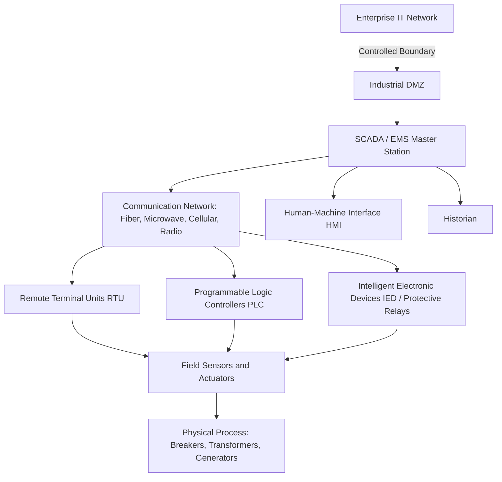
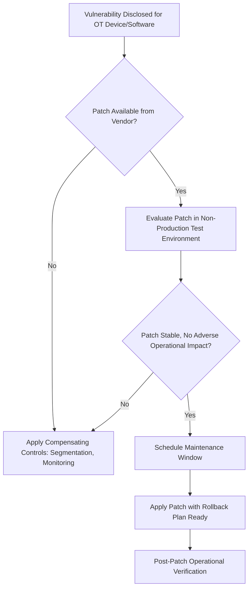

## ICS/SCADA and Operational Technology Security Principles

### Overview

Industrial Control Systems (ICS) and Supervisory Control and Data Acquisition (SCADA) systems form the operational technology (OT) backbone of grid monitoring and control — encompassing the hardware and software that sense, control, and automate physical grid processes such as protective relaying, substation automation, generation control, and distribution automation. OT security principles differ substantially from traditional IT security in priority ordering, threat model, and acceptable mitigation techniques, reflecting the safety-critical, real-time, and physically consequential nature of the systems being protected.

### ICS/SCADA Architecture Fundamentals

**Key Points:**

- **SCADA Master Station / EMS:** The centralized software platform providing operator visibility (via HMI displays) and supervisory control commands across the monitored system, typically incorporating state estimation, alarming, and data historian functions.
- **Remote Terminal Units (RTUs) / Programmable Logic Controllers (PLCs):** Field devices that interface directly with sensors and actuators, executing local control logic and relaying telemetry to and receiving commands from the master station.
- **Intelligent Electronic Devices (IEDs):** Microprocessor-based devices (protective relays, meters, controllers) with communication capability, increasingly networked for both protection and monitoring functions.
- **Communication Infrastructure:** The network layer (fiber, microwave, licensed radio, increasingly cellular/LTE for distribution automation) connecting field devices to the master station, itself a significant attack surface and reliability consideration.

### Foundational Difference: IT vs. OT Security Priority

| Priority Dimension | IT Security (Typical Ranking) | OT/ICS Security (Typical Ranking) |
| --- | --- | --- |
| Primary Goal | Confidentiality, then Integrity, then Availability (CIA) | Availability and Safety, then Integrity, then Confidentiality (often expressed as AIC) |
| Patch Cycle Tolerance | Frequent, often automated | Infrequent, requires extensive testing before deployment |
| System Lifespan | 3-7 years typical | 15-30+ years typical, some field devices exceed 40 years |
| Acceptable Downtime for Maintenance | Often flexible, scheduled windows common | Extremely limited; unplanned downtime can have physical safety consequences |
| Response to Detected Compromise | Isolate/quarantine immediately | Careful, often manual, evaluation before isolation given physical process risk |

**Key Points:**

- The inverted CIA priority (Availability first, Confidentiality often last) is the single most consequential difference driving divergent security practice between IT and OT — a control action interruption or unavailability in a SCADA system can have immediate physical safety and grid reliability consequences that a comparable IT system outage typically does not.
- Standard IT security practices — aggressive automated patching, active vulnerability scanning, endpoint agents that consume significant system resources — can themselves destabilize legacy OT devices with limited processing headroom or real-time timing constraints, requiring OT-specific adaptation of these practices rather than direct IT-tooling transplant.
- Extended asset lifespans mean OT environments routinely run legacy operating systems and protocols no longer supported by vendors, requiring compensating controls (network segmentation, monitoring) rather than the "patch and update" remediation path typical in IT.

### Core OT Security Principles

#### Network Segmentation and the Purdue Model

- Layered network segmentation, commonly organized per the Purdue Enterprise Reference Architecture (Levels 0 through 5), remains the foundational OT security architecture principle — isolating control system networks from corporate IT and external networks via clearly defined, monitored boundaries (Industrial DMZ), consistent with NERC CIP-005 Electronic Security Perimeter requirements.
- Defense-in-depth extends segmentation beyond a single perimeter boundary to multiple nested zones, limiting the blast radius of any single compromised segment and supporting the internal visibility goals now formalized under CIP-015 Internal Network Security Monitoring.

#### Least Functionality and Attack Surface Reduction

- Disabling unnecessary ports, services, and protocols on OT devices (a core CIP-007 requirement) directly reduces the exploitable attack surface, particularly important given that many legacy ICS protocols (Modbus, DNP3 in its base form) were designed without built-in authentication or encryption and assume a trusted network environment.
- Application whitelisting (allowing only pre-approved executables to run) is often preferred over traditional signature-based antivirus in OT environments, since OT systems typically run a small, well-defined set of applications, making whitelisting both more effective and less resource-intensive than continuously updated signature databases.

#### Protocol-Specific Security Considerations

**Key Points:**

- **Modbus:** A widely deployed legacy protocol with no native authentication or encryption in its base form; security is typically achieved through network segmentation and monitoring rather than protocol-native controls, since retrofitting authentication into the protocol itself is impractical for most deployed legacy devices.
- **DNP3:** Common in electric utility SCADA, with a Secure Authentication extension (DNP3-SA) providing challenge-response authentication, though adoption of the secure variant varies significantly across existing deployed infrastructure given the cost and complexity of upgrading legacy field devices.
- **IEC 61850:** A modern substation automation communication standard supporting more sophisticated data modeling and, in its associated security extensions (IEC 62351), authentication and encryption capabilities — increasingly adopted in new substation automation projects, though integration with legacy IEC 61850 deployments predating widespread security-extension adoption remains a practical consideration.
- Protocol-aware monitoring tools (increasingly relevant under CIP-015 INSM requirements) parse these industrial protocols to distinguish legitimate operational commands from anomalous or malicious command sequences, a capability generic IT network monitoring tools typically lack.

#### Physical and Environmental Security

- Physical access control to field devices, substations, and control centers (governed under CIP-006/CIP-014) remains a foundational OT security layer, since many legacy field devices lack robust electronic authentication and physical access alone may be sufficient to manipulate device configuration or operation.
- Environmental monitoring (temperature, humidity, intrusion detection) protects both device availability/reliability and serves as an early indicator of potential physical tampering.

### Patch Management Challenges in OT

**Key Points:**

- Unlike IT environments where patches are often deployed rapidly and broadly, OT patch management (CIP-007) requires extensive pre-deployment testing given the safety and reliability consequences of an unexpected side effect, and often necessitates scheduled maintenance windows tied to broader operational planning rather than immediate deployment.
- Where vendor patches are unavailable, delayed, or impractical to deploy on legacy equipment (a common OT scenario), compensating controls — enhanced network segmentation, specific monitoring rules, or temporary functionality restriction — serve as the primary risk mitigation path, a pattern explicitly anticipated within CIP-007's patch management requirement structure.
- Vendor support lifecycle mismatches (a vendor discontinuing support for a legacy platform that remains operationally necessary for 10-20 more years) represent an ongoing structural OT security challenge without a fully satisfying technical solution short of eventual equipment replacement.

### OT-Specific Threat Landscape

**Key Points:**

- **Living-off-the-Land Techniques:** Adversaries increasingly leverage legitimate administrative tools, valid credentials, and native protocol commands already present in the environment rather than deploying detectable custom malware, complicating detection via traditional signature-based methods and elevating the importance of behavioral/anomaly-based monitoring (a key driver behind CIP-015 INSM).
- **Purpose-Built ICS Malware:** Historical incidents have demonstrated malware specifically engineered to manipulate industrial protocols and physical processes (rather than generic IT malware repurposed against OT targets), reflecting a distinct and evolving threat category requiring OT-protocol-specific detection capability.
- **Convergence Risk:** As IT/OT network convergence increases (driven by demand for operational data analytics, remote access convenience, and IoT-enabled field devices), the traditional air-gap assumption underlying much legacy OT security design has eroded, elevating the importance of explicit, monitored segmentation (Industrial DMZ) over implicit isolation.
- **Ransomware Spillover:** While ransomware is typically an IT-targeted threat, IT/OT network interdependency has produced incidents where IT-focused ransomware forced precautionary OT shutdowns even absent direct OT system compromise, illustrating that IT security posture directly affects OT availability risk.

### Incident Response Considerations Specific to OT

**Key Points:**

- Standard IT incident response practice often favors immediate isolation/quarantine of a compromised system; in OT environments, immediate isolation of a device controlling an active physical process (e.g., a protective relay or breaker controller) can itself create safety or reliability risk, requiring careful, often manually judgment-based evaluation before isolation.
- OT incident response plans (intersecting with CIP-008) typically require close coordination between cybersecurity personnel and operations/engineering personnel who understand the physical process consequences of any proposed containment action — a cross-disciplinary requirement less pronounced in typical IT incident response.
- Recovery planning (CIP-009) for OT systems must account for the physical, safety-critical restoration sequencing considerations relevant to bringing control systems back online, which can be substantially more involved than restoring a typical IT application server from backup.

### Governing Standards and Frameworks Summary

| Framework/Standard | OT Security Relevance |
| --- | --- |
| NERC CIP-002 through CIP-015 | Mandatory electric BES-specific requirements across categorization, access control, monitoring, and supply chain |
| IEC 62443 | Voluntary, international, cross-sector ICS security standard series with detailed technical zone/conduit segmentation guidance |
| IEC 62351 | Security extensions for power system communication protocols (including IEC 61850) |
| NIST SP 800-82 | U.S. guidance document for ICS security, widely referenced (though not mandatory) across the sector |
| Purdue Enterprise Reference Architecture | Reference network segmentation model informing practical CIP-005 boundary design |

### Example: Applying OT Security Principles to a Substation Automation Upgrade

**Example:**

1. A utility upgrades a substation's protection and control system to IEC 61850-based digital substation architecture, replacing legacy hardwired connections with networked IEDs.
2. Network segmentation is designed per Purdue Model principles, placing the new IED network within a defined ESP with an Industrial DMZ separating it from the broader utility WAN.
3. Given IEC 61850's more modern protocol design, the deployment incorporates IEC 62351 security extensions (authentication, encryption) where supported by the selected IED hardware generation.
4. Application whitelisting is deployed on the substation's engineering workstation and HMI, restricting execution to the specific, well-defined set of applications required for substation operation and maintenance.
5. Patch management for the new IEDs follows a defined testing protocol in a non-production lab environment before any firmware update is applied to production devices, with rollback procedures documented in advance.
6. INSM sensors (per CIP-015 applicability) are incorporated into the network design from the outset, with baseline traffic patterns established during commissioning/Factory Acceptance Testing rather than retrofitted after deployment.
7. Incident response procedures for the upgraded substation explicitly involve both cybersecurity and protection engineering personnel, ensuring any containment action considers protective relaying and physical safety implications before execution.

### Next Steps

- **NERC CIP Standards Framework Overview**
- **Internal Network Security Monitoring (CIP-015) Architecture**
- **IEC 61850 Digital Substation Communication Standards**
- **Supply Chain Risk Management for Grid Vendors (CIP-013)**
- **Industrial DMZ and Purdue Model Network Segmentation Design**
- **Incident Reporting and Response Planning for OT Environments (CIP-008)**
- **Legacy Protocol Security: Modbus and DNP3 Compensating Controls**
- **IT/OT Convergence Risk and Zero-Trust Architecture for Grid Systems**