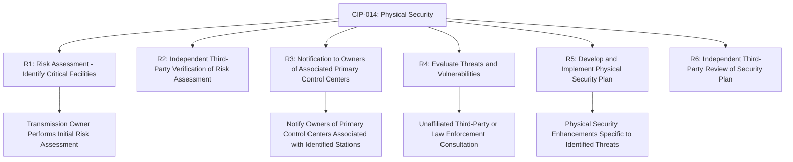
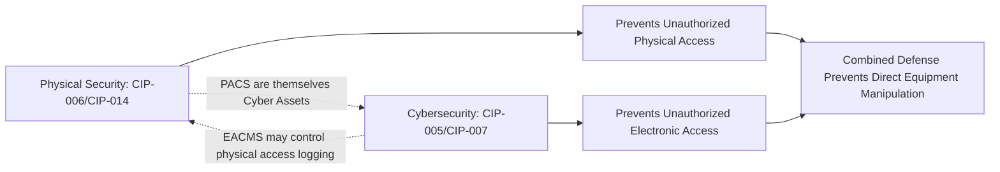

## Physical Security of Critical Facilities

### Overview

Physical security of critical facilities addresses the protective measures, risk assessment methodologies, and regulatory requirements governing the physical protection of transmission substations, generating stations, and control centers whose damage or destruction could have a critical impact on Bulk Electric System (BES) reliability. This domain is primarily codified through NERC CIP-014, developed specifically in response to demonstrated physical attack risk against critical transmission infrastructure, and is complemented by broader physical access control requirements under CIP-006.

### Regulatory Origin and Purpose

**Key Points:**

- CIP-014's development was substantially motivated by the April 2013 physical attack on PG&E's Metcalf transmission substation in California, in which attackers used firearms to damage multiple transformers, an event that heightened industry and regulatory attention on physical security risk to critical transmission assets beyond traditional perimeter fencing and access control.
- The standard's core objective is to identify and protect the specific critical transmission stations, substations, and their associated primary control centers whose loss, damage, or destruction could result in instability, uncontrolled separation, or cascading failure of the Bulk Electric System — a targeted, risk-based scope rather than a blanket requirement applied to all substations.
- CIP-014 reflects a distinct risk category from cybersecurity-focused CIP standards: physical attacks (ballistic, explosive, vehicular, or other kinetic means) that can cause direct equipment damage without requiring any network or system compromise.

### CIP-014 Core Requirements Structure

#### R1 — Risk Assessment for Critical Facility Identification

- Transmission Owners must perform an initial risk assessment (and subsequent periodic reassessments) to identify transmission stations and substations that, if rendered inoperable or damaged, could result in instability, uncontrolled separation, or cascading failures on the Bulk Electric System.
- The risk assessment methodology is generally left to the entity's engineering judgment, informed by system studies evaluating the consequence of loss of each candidate facility, rather than a single NERC-prescribed universal methodology — reflecting the significant variation in grid topology and criticality across different regions.

#### R2 — Independent Verification

- The initial risk assessment identifying critical facilities must be independently verified by an unaffiliated third party (which may include a Regional Entity, ISO/RTO, or other qualified independent reviewer), providing a check against an entity under-identifying its own critical facilities.

#### R3 — Notification of Associated Control Centers

- Where a Transmission Owner identifies a critical substation, it must notify the owner of the primary control center(s) associated with operation of that substation (which may be a different entity, particularly in RTO/ISO market structures), ensuring physical security planning accounts for control center criticality tied to the identified substation.

#### R4 — Threat and Vulnerability Evaluation

- For each identified critical facility, the responsible entity must conduct an evaluation of potential threats and vulnerabilities, typically incorporating consultation with law enforcement, government security agencies, or qualified unaffiliated third parties with relevant threat intelligence and physical security expertise.

#### R5 — Physical Security Plan Development

- Based on the threat/vulnerability evaluation, the entity must develop and implement a physical security plan incorporating resiliency and security measures specifically designed to protect against the identified threats — the standard is deliberately non-prescriptive regarding specific technologies, allowing entities to select measures appropriate to their specific risk profile.

#### R6 — Independent Plan Review

- The physical security plan itself, like the initial risk assessment, must undergo independent third-party review, providing an additional verification layer ensuring the selected protective measures reasonably address the identified threats.

### Common Physical Protection Measures

| Category | Example Measures |
| --- | --- |
| Perimeter Barriers | Ballistic-resistant walls or barriers, enhanced fencing, vegetation/sightline management to limit standoff attack positions |
| Detection Systems | Intrusion detection sensors, perimeter motion detection, acoustic gunshot detection systems |
| Surveillance | CCTV camera coverage with analytics (motion, object detection), integration with security operations centers |
| Access Control | Card/biometric access control, mantrap entries, vehicle barriers/bollards restricting vehicular approach |
| Lighting | Enhanced perimeter and yard lighting improving surveillance effectiveness and deterrence |
| Structural Hardening | Ballistic-resistant enclosures or shielding for the most critical, hard-to-replace equipment (e.g., large power transformers) |
| Redundancy/Spares | Spare equipment strategies (e.g., mobile substation/transformer programs) reducing consequence severity even if an attack succeeds |

**Key Points:**

- Given the long lead times and limited manufacturing capacity for large power transformers (often cited as 12+ months for custom high-voltage transformers), spare equipment and rapid-deployment mobile substation programs are an increasingly emphasized consequence-mitigation strategy — reducing the reliability impact of a successful attack even where prevention measures are imperfect.
- Physical hardening measures are generally applied in layers (deterrence, detection, delay, response) rather than relying on any single control, consistent with standard physical security design philosophy applied to critical infrastructure broadly.

### CIP-006: Physical Security of BES Cyber Systems (Broader Application)

**Key Points:**

- Distinct from CIP-014's narrow focus on the highest-consequence transmission facilities, CIP-006 applies more broadly to physical access control for BES Cyber Systems generally, requiring defined Physical Security Perimeters (PSPs) around applicable Cyber Assets with access controls, monitoring, and logging.
- CIP-006 requirements include maintaining an auditable log of physical access to BES Cyber System locations, alarming for unauthorized access attempts, and periodic testing of physical access control and monitoring systems to confirm continued effective operation.
- Physical Access Control Systems (PACS) — the systems that enforce and log physical access control (badge readers, biometric systems, associated servers) — are themselves categorized as security-critical Cyber Assets subject to relevant CIP protections, given their role in enforcing the physical security boundary.

### Interdependency with Cybersecurity Controls

**Key Points:**

- Physical and cybersecurity domains are interdependent rather than separable — an attacker with physical access to a substation could potentially bypass electronic access controls by directly interfacing with field devices, while a cyber-compromised Physical Access Control System could grant unauthorized physical entry.
- This interdependency is reflected in the CIP standard structure itself, where PACS and EACMS are both explicitly defined Cyber Asset categories subject to relevant electronic protection requirements even though their primary function relates to physical security enforcement.

### Risk Assessment Methodology Considerations

**Key Points:**

- Consequence-based risk assessment for CIP-014 typically relies on power flow and contingency analysis studies evaluating the system-wide impact of losing a specific facility (or combination of facilities) under various operating conditions, similar in analytical approach to the transmission planning contingency studies underlying TPL-001.
- Coordinated, simultaneous attacks against multiple facilities (a threat scenario beyond simple single-facility loss) have received increased industry study attention, given that a coordinated multi-site attack could produce cascading consequences exceeding what any single-facility risk assessment alone would capture.
- [Inference] The specific methodologies and consequence thresholds individual Transmission Owners use to identify "critical" facilities under CIP-014 R1 are generally treated as sensitive, non-public information (given the standard's own Critical Energy/Electric Infrastructure Information, CEII, protections), meaning publicly available detail on exact utility-specific risk assessment criteria is intentionally limited.

### Information Protection Considerations

**Key Points:**

- Information related to CIP-014 risk assessments, identified critical facilities, and physical security plans is typically treated as Critical Energy/Electric Infrastructure Information (CEII) under FERC regulations, subject to restricted disclosure even in response to public records requests, given the risk that public disclosure could itself provide attack planning information to malicious actors.
- This creates an inherent tension between transparency (useful for public accountability and academic/policy research on grid resilience) and security (limiting information that could facilitate attack planning) — a tension explicitly managed through CEII's restricted-but-not-fully-secret disclosure framework, allowing controlled access to vetted parties (e.g., researchers, other utilities, government personnel) under appropriate agreements.

### Coordination with Law Enforcement and Government Agencies

**Key Points:**

- CIP-014's threat/vulnerability evaluation (R4) explicitly contemplates consultation with law enforcement and government security agencies, reflecting recognition that utility security personnel alone may lack visibility into broader threat intelligence (e.g., extremist group targeting patterns, previous attack methodologies observed nationally) relevant to a comprehensive threat assessment.
- Sector-specific information sharing mechanisms (e.g., the Electricity Information Sharing and Analysis Center, E-ISAC) support the flow of physical and cyber threat intelligence across the industry, complementing individual entity CIP-014 evaluations with broader sector-level situational awareness.

### Example: Critical Substation Risk Assessment and Hardening

**Example:**

1. A Transmission Owner's CIP-014 R1 risk assessment, using contingency analysis studies, identifies a 500 kV substation as critical — its loss, combined with a credible second contingency, would result in cascading instability affecting a wide region.
2. An unaffiliated third-party engineering firm independently verifies this risk assessment finding under R2, confirming the consequence analysis methodology and results.
3. The Transmission Owner notifies the RTO operating the associated primary control center per R3, ensuring coordinated awareness of the substation's critical designation.
4. A threat/vulnerability evaluation under R4, conducted in consultation with local law enforcement and a security consulting firm, identifies standoff ballistic attack (similar to the historical Metcalf incident pattern) as a credible threat scenario given the substation's visibility and access characteristics.
5. A physical security plan under R5 is developed, incorporating ballistic-resistant barriers around the most critical transformer positions, enhanced perimeter detection with law-enforcement-integrated alarm response, and improved lighting/sightline management — alongside a complementary spare transformer strategy reducing restoration time in the event an attack nonetheless succeeds.
6. The physical security plan undergoes independent third-party review under R6, confirming the selected measures reasonably address the identified threat scenario before implementation is finalized.

### Next Steps

- **NERC CIP Standards Framework Overview**
- **Electronic Security Perimeters and Access Control (CIP-005)**
- **Transmission Planning Contingency Criteria (TPL-001) and Critical Facility Consequence Analysis**
- **Critical Energy/Electric Infrastructure Information (CEII) Disclosure Framework**
- **Spare Transformer and Mobile Substation Strategic Reserve Programs**
- **Electricity Information Sharing and Analysis Center (E-ISAC) Coordination**
- **Cascading Failure Mechanisms and Prevention**
- **Physical Access Control Systems (PACS) as Cyber Assets Under CIP**