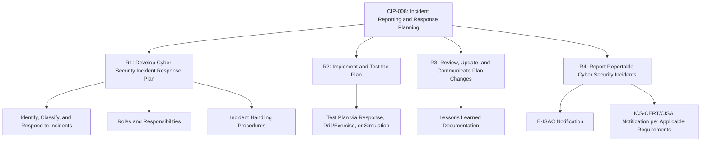
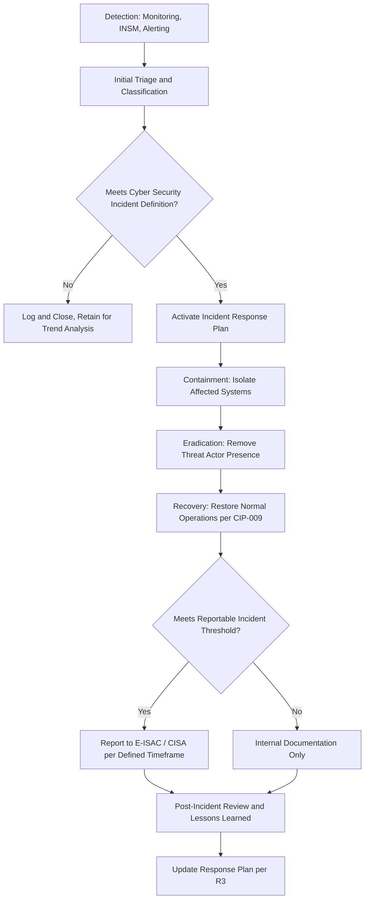

## Cybersecurity Incident Reporting and Response

### Overview

Cybersecurity incident reporting and response within the electric grid context encompasses the mandatory processes by which Registered Entities detect, classify, respond to, and report cybersecurity incidents affecting BES Cyber Systems. This domain is primarily governed by NERC CIP-008 (Incident Reporting and Response Planning), with additional federal reporting obligations arising from the Cyber Incident Reporting for Critical Infrastructure Act (CIRCIA) and DHS/CISA requirements applicable to critical infrastructure sectors broadly.

### CIP-008 Core Requirements Structure

#### R1 — Incident Response Plan Development

- Each Responsible Entity must develop one or more Cyber Security Incident response plan(s) addressing: processes to identify, classify, and respond to Cyber Security Incidents; defined roles and responsibilities for incident response personnel; and incident handling procedures for various incident types.
- The plan must define what constitutes a Cyber Security Incident and, more specifically, what constitutes a Reportable Cyber Security Incident — the subset of incidents triggering external reporting obligations under R4.

#### R2 — Plan Implementation and Testing

- Response plans must be tested at defined intervals, which can be satisfied through an actual Reportable Cyber Security Incident response, a paper drill/tabletop exercise, or a full operational exercise, ensuring the plan remains executable rather than existing only as static documentation.
- Testing requirements reflect the recognition that an untested incident response plan often fails to perform as expected during an actual incident, given the stress, time pressure, and interdisciplinary coordination genuine incidents typically require.

#### R3 — Plan Review, Update, and Lessons Learned

- Following an actual Reportable Cyber Security Incident or a plan test, the entity must document lessons learned and update the plan accordingly within defined timeframes, and must communicate relevant plan changes to personnel with defined incident response roles.
- This creates a continuous improvement cycle, ensuring response plans evolve based on both real-world experience and exercise findings rather than remaining static once initially developed.

#### R4 — Reporting Requirements

- Reportable Cyber Security Incidents must be reported to the Electricity Information Sharing and Analysis Center (E-ISAC) and, as applicable, to other governmental or sector-specific entities (historically including DHS/CISA's ICS-CERT function) within defined timeframes following determination that a reportable incident has occurred.
- Reporting timeframes and thresholds have been subject to periodic revision as CIP-008 versions have evolved, generally trending toward broader reporting scope (including reporting of attempts to compromise, not solely successful compromises, under more recent standard versions) and more defined reporting deadlines.

### Definitions: Cyber Security Incident vs. Reportable Cyber Security Incident

**Key Points:**

- **Cyber Security Incident:** A malicious act or suspicious event that compromises, or was an attempt to compromise, the Electronic Security Perimeter, Physical Security Perimeter, or a BES Cyber System, or disrupts, or was an attempt to disrupt, the operation of a BES Cyber System — a broad definitional category.
- **Reportable Cyber Security Incident:** The subset of Cyber Security Incidents meeting specific severity or impact criteria (e.g., compromising or disrupting one or more reliability tasks of a functional entity) that triggers mandatory external reporting under R4.
- This tiered definitional structure allows entities to maintain internal incident tracking and response for the full range of security events while reserving formal external reporting obligations for incidents meeting a defined materiality threshold — avoiding both under-reporting of significant events and impractical reporting burden from minor, non-impactful events.

### Incident Response Lifecycle

**Key Points:**

- **Detection:** Increasingly informed by Internal Network Security Monitoring (CIP-015) capability, in addition to traditional perimeter alerting (EACMS logs, IDS/IPS) and system-level logging (CIP-007).
- **Containment in OT Context:** As distinct from typical IT incident response, containment actions in an OT/ICS environment require careful evaluation of physical process consequences before isolating an affected device, given that abrupt isolation of an active control system component can itself create safety or reliability risk.
- **Recovery:** Coordinates directly with CIP-009 Recovery Plan requirements, ensuring restoration of BES Cyber Systems following an incident follows a tested, documented recovery process rather than ad hoc reconstruction.
- **Reporting Determination:** The classification decision (whether an incident meets the Reportable threshold) is itself a documented step within the response process, since misclassification (either direction) carries compliance risk — under-reporting risks a compliance violation, while over-reporting can create unnecessary regulatory and public disclosure burden.

### Broader Federal Reporting Landscape

**Key Points:**

- **Cyber Incident Reporting for Critical Infrastructure Act (CIRCIA):** Federal legislation directing CISA to develop mandatory cyber incident reporting requirements for critical infrastructure entities, including the electric sector, intended to improve federal government situational awareness of significant cyber incidents and ransomware payments across critical infrastructure broadly, in addition to (not necessarily replacing) existing NERC CIP-008 reporting obligations.
- **E-ISAC Role:** The Electricity Information Sharing and Analysis Center serves as the electric sector's primary information sharing hub, receiving CIP-008 Reportable Cyber Security Incident reports and facilitating anonymized, sector-wide threat intelligence sharing back to member entities — a mechanism intended to provide early warning of emerging threats observed at one entity to the broader sector before they propagate.
- [Inference] The precise interplay and potential overlap/harmonization between CIRCIA's evolving federal reporting rules and existing NERC CIP-008 reporting obligations has been, and may continue to be, subject to regulatory development; entities should verify current requirements directly against CISA's and NERC's official guidance rather than assuming a static, fully harmonized reporting framework.

### Interdependency with Other CIP Standards

| Standard | Relationship to Incident Reporting and Response |
| --- | --- |
| CIP-005 | ESP/EAP logs and Intermediate System session records provide incident detection and investigation evidence |
| CIP-007 | System-level logging (authentication events, malicious code detections) feeds incident detection |
| CIP-009 | Recovery Plans govern restoration of BES Cyber Systems following a contained/eradicated incident |
| CIP-010 | Configuration baselines assist in distinguishing legitimate changes from unauthorized/malicious modification during incident investigation |
| CIP-011 | Governs protection of sensitive information generated or handled during incident investigation and response |
| CIP-013 | Vendor notification of vulnerabilities may itself trigger incident evaluation processes under CIP-008 |
| CIP-015 | INSM-detected anomalies serve as a primary incident detection trigger for CIP-008 response activation |

### Roles and Responsibilities in Incident Response

**Key Points:**

- Effective OT incident response requires cross-disciplinary coordination beyond a traditional IT security team alone — cybersecurity personnel, operations/engineering staff familiar with the specific physical process, legal/compliance personnel (given mandatory reporting obligations), and often external law enforcement or E-ISAC liaison roles.
- CIP-008 response plans must define specific roles and responsibilities, ensuring personnel understand their function during an incident (who has authority to isolate a system, who makes the Reportable Incident determination, who communicates with E-ISAC/CISA, who coordinates with law enforcement if warranted) before an actual incident creates time pressure requiring these decisions to be made ad hoc.
- Given CIP-004 personnel training requirements, incident response plan familiarity is typically incorporated into required cybersecurity training for personnel holding defined incident response roles.

### Testing and Exercise Approaches

| Testing Method | Description |
| --- | --- |
| Tabletop Exercise | Discussion-based walkthrough of a hypothetical incident scenario, testing decision-making and coordination without live system interaction |
| Functional/Operational Exercise | More realistic simulation potentially involving actual system interaction in a non-production test environment |
| Actual Incident Response | A genuine Reportable Cyber Security Incident response itself satisfies CIP-008 R2 testing requirements, avoiding duplicate testing burden in the same compliance interval |
| Full-Scale/Live Exercise | Comprehensive exercise potentially coordinated across multiple entities or with government/law enforcement participation, testing the broadest range of response coordination |

**Key Points:**

- Regular exercising (tabletop at minimum, supplemented periodically by more realistic functional exercises) is broadly recognized as essential to actual incident response effectiveness, since plans that exist only on paper frequently reveal significant gaps (unclear authority, missing contact information, untested technical containment procedures) when first exercised under realistic conditions.
- Industry-wide exercises (such as periodic sector-coordinated grid security exercises) provide an opportunity to test not only individual entity response plans but also cross-entity and cross-sector coordination mechanisms relevant to a genuinely widescale incident affecting multiple utilities simultaneously.

### Example: Incident Response to a Detected Anomaly

**Example:**

1. **Detection:** A CIP-015 INSM platform flags anomalous east-west traffic within a Medium Impact substation's ESP, consistent with unauthorized lateral movement following compromised vendor remote access credentials.
2. **Triage and Classification:** The security operations team, per the documented CIP-008 R1 process, classifies the event as a Cyber Security Incident given the suspicious/attempted-compromise nature of the activity.
3. **Containment:** In coordination with substation operations engineering staff, the affected vendor remote access session is terminated and the associated credentials disabled, with careful evaluation confirming no active protective relay function is disrupted by the containment action.
4. **Eradication and Recovery:** The compromised credential is reset, affected systems are verified against known-good configuration baselines (CIP-010), and normal operation is confirmed restored per CIP-009 recovery procedures.
5. **Reportable Determination:** Given the confirmed unauthorized access attempt affecting a BES Cyber System's Electronic Security Perimeter, the incident is determined to meet the Reportable Cyber Security Incident threshold under the entity's R1-defined criteria.
6. **Reporting:** The incident is reported to the E-ISAC within the applicable CIP-008 R4 timeframe, and applicable CIRCIA federal reporting obligations are separately evaluated and satisfied.
7. **Lessons Learned:** Post-incident review identifies a gap in vendor access disablement verification frequency; the CIP-008 response plan and the entity's CIP-013 vendor access inventory process are both updated accordingly per R3.

### Next Steps

- **NERC CIP Standards Framework Overview**
- **Internal Network Security Monitoring (CIP-015) as an Incident Detection Trigger**
- **Recovery Plans for BES Cyber Systems (CIP-009)**
- **Supply Chain Risk Management for Grid Vendors (CIP-013)**
- **Electricity Information Sharing and Analysis Center (E-ISAC) Function**
- **Cyber Incident Reporting for Critical Infrastructure Act (CIRCIA) Requirements**
- **ICS/SCADA and Operational Technology Security Principles**
- **Tabletop and Functional Exercise Design for OT Incident Response**