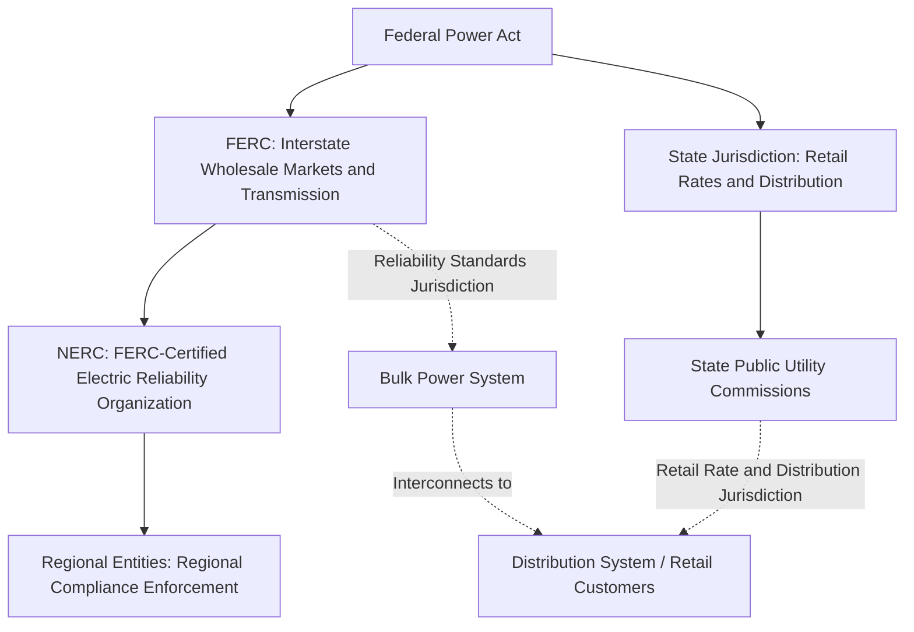
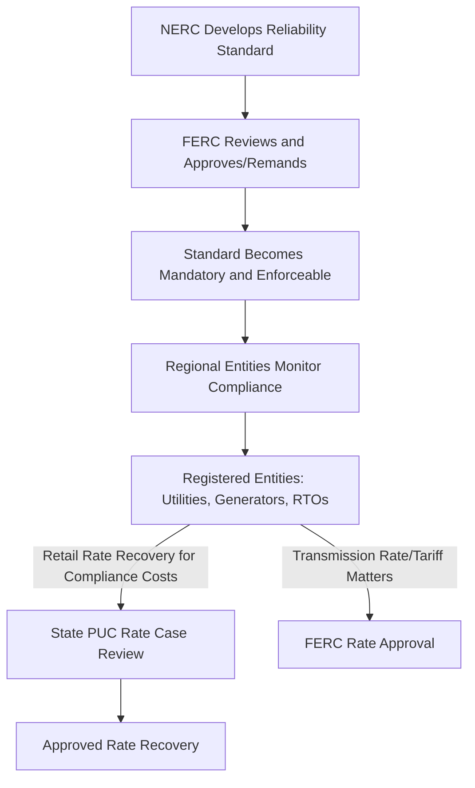

## Regulatory Bodies: FERC, NERC, and State Public Utility Commissions

### Overview

The regulatory oversight of the North American electric power industry is divided across federal and state jurisdictional lines, reflecting the historical and constitutional division of authority over interstate commerce versus local/retail matters. Understanding the distinct roles, authorities, and interactions of the Federal Energy Regulatory Commission (FERC), the North American Electric Reliability Corporation (NERC), and state Public Utility Commissions (PUCs) is foundational to understanding how the electric grid is planned, operated, priced, and regulated in the United States.

### Jurisdictional Framework Overview

### Federal Energy Regulatory Commission (FERC)

#### Authority and Jurisdiction

**Key Points:**

- FERC is an independent U.S. federal agency, established under the Department of Energy Organization Act of 1977 (building on earlier Federal Power Commission authority dating to 1920/1935), with jurisdiction over interstate transmission and wholesale sale of electricity, interstate natural gas transportation and wholesale sale, and oil pipeline transportation rates.
- FERC's electric authority derives primarily from the Federal Power Act, which grants jurisdiction over "the transmission of electric energy in interstate commerce" and "the sale of electric energy at wholesale in interstate commerce" — deliberately distinguishing federal wholesale/transmission jurisdiction from state retail jurisdiction.
- FERC is governed by up to five Commissioners appointed by the U.S. President and confirmed by the Senate, serving staggered terms, with no more than three Commissioners from the same political party at any time, and one Commissioner designated as Chairman.

#### Core Functions Relevant to Grid Reliability Engineering

- **Reliability Standards Approval:** Under the Energy Policy Act of 2005, FERC certifies the Electric Reliability Organization (NERC) and must approve any reliability standard before it becomes mandatory and enforceable — FERC can approve, remand for revision, or direct NERC to develop new standards addressing identified reliability gaps.
- **Transmission Rate Regulation:** FERC approves rates, terms, and conditions for interstate transmission service, including cost-of-service rates for regulated transmission owners and market-based rates where sufficient competition is demonstrated.
- **Wholesale Market Oversight:** FERC oversees the organized wholesale electricity markets operated by RTOs/ISOs (e.g., PJM, MISO, ERCOT operates largely outside FERC jurisdiction as an intrastate Texas entity, CAISO, ISO-NE, NYISO, SPP), approving market rules, tariffs, and rate design.
- **Interconnection Policy:** FERC establishes generator interconnection procedures and standards (e.g., pro forma interconnection agreements) governing how new generation resources connect to the transmission system.
- **Enforcement Authority:** FERC has civil penalty authority for violations of the Federal Power Act, FERC-approved tariffs, and NERC Reliability Standards, historically up to a statutory maximum per violation per day (subject to periodic inflation adjustment).

### North American Electric Reliability Corporation (NERC)

#### Structure and FERC Relationship

**Key Points:**

- NERC is the FERC-certified Electric Reliability Organization (ERO) for the United States (and operates under complementary arrangements with applicable Canadian provincial regulators and a Mexican regulatory body for the interconnected portions of the North American grid), holding delegated authority to develop and enforce mandatory Reliability Standards.
- NERC itself is not a government agency — it is a not-for-profit international regulatory authority whose standards, once approved by FERC (and by applicable Canadian/Mexican authorities for those jurisdictions), become mandatory and enforceable across its footprint.
- NERC's authority and structure were fundamentally established by the Energy Policy Act of 2005, which transformed reliability compliance from a voluntary industry self-regulation model (the pre-2005 NERC structure) into a mandatory, FERC-enforceable framework — a direct regulatory response to the August 2003 Northeast Blackout.

#### Core Functions

- **Standards Development:** NERC develops, through a stakeholder-driven process, the Reliability Standards (BAL, CIP, EOP, FAC, IRO, PRC, TOP, TPL, and other categories) that govern BES planning and operation.
- **Compliance Monitoring and Enforcement:** NERC oversees a compliance program implemented through Regional Entities, including audits, self-certifications, investigations, and penalty assessment for standard violations.
- **Reliability Assessments:** NERC produces periodic reliability assessments (Long-Term Reliability Assessment, seasonal Summer/Winter Reliability Assessments) evaluating resource adequacy and emerging reliability risks across North American regions.
- **Event Analysis:** NERC conducts or coordinates analysis of significant grid disturbances and disseminates lessons learned to inform standards development and industry practice.

#### Regional Entities

- NERC delegates day-to-day compliance monitoring and enforcement authority to Regional Entities (e.g., WECC covering the Western Interconnection, SERC, RF/ReliabilityFirst, Texas RE, NPCC, MRO), which conduct audits and investigations within their respective geographic footprints under NERC oversight.

### State Public Utility Commissions (PUCs)

#### Authority and Jurisdiction

**Key Points:**

- State Public Utility Commissions (variously titled Public Service Commissions, Public Utility Commissions, or similar depending on the state) regulate matters reserved to state jurisdiction under the Federal Power Act — primarily retail electricity rates, distribution system regulation, resource planning (in traditionally regulated states), and utility service quality standards for retail customers.
- PUC commissioners are typically either gubernatorially appointed or, in some states, elected, with authority and specific regulatory structure varying significantly by state statute — creating meaningful regulatory diversity across the 50 states rather than a single uniform state regulatory model.
- PUCs approve retail rate cases (the formal proceeding by which a utility's revenue requirement and rate design are set), oversee distribution system reliability metrics and service quality standards, and in vertically integrated (non-restructured) states, approve resource planning decisions including generation and major transmission investments serving retail load.

#### Core Functions Relevant to Grid Engineering

- **Rate Case Proceedings:** PUCs review and approve utility requests for rate changes, evaluating whether proposed capital investments (including storm hardening, grid modernization, and reliability improvement projects) are prudent and should be included in the utility's rate base for cost recovery.
- **Resource Planning Oversight:** In vertically integrated states, PUCs review Integrated Resource Plans (IRPs) detailing a utility's long-term generation and demand-side resource strategy; in restructured/deregulated states, this function is largely absent or significantly reduced for generation (though distribution planning oversight typically remains).
- **Distribution Reliability Standards:** PUCs commonly establish or approve minimum reliability performance standards (often referencing IEEE 1366 SAIDI/SAIFI metrics) and associated reporting requirements for utilities operating within their jurisdiction.
- **Resilience and Storm Hardening Plan Review:** Increasingly, PUCs require formal resilience or storm hardening plan filings, reviewing proposed investment against cost-effectiveness and risk-reduction justification before approving associated rate recovery.
- **Retail Market Structure:** In restructured states, PUCs oversee retail choice program rules, default service/provider-of-last-resort obligations, and consumer protection matters distinct from the wholesale market structure overseen by FERC.

### Comparative Summary

| Dimension | FERC | NERC | State PUCs |
| --- | --- | --- | --- |
| Governmental Status | Independent federal agency | Non-governmental ERO, FERC-certified | State government agency |
| Primary Jurisdiction | Interstate wholesale markets, transmission rates, reliability standard approval | Reliability standard development and compliance enforcement | Retail rates, distribution, resource planning (state-dependent) |
| Geographic Scope | United States (interstate) | US, Canada (complementary), Mexico (complementary) | Single state |
| Enforcement Mechanism | Civil penalties, tariff/standard approval authority | Compliance monitoring via Regional Entities, penalty recommendation to FERC | Rate case decisions, service quality enforcement |
| Key Grid Engineering Touchpoint | Interconnection procedures, transmission rate incentives, RTO/ISO market rules | Mandatory Reliability Standards (BAL, CIP, TPL, PRC, etc.) | Distribution reliability standards, storm hardening cost recovery, IRP approval |

### Interaction and Coordination Among the Three Levels

**Key Points:**

- Compliance costs incurred by a utility to meet NERC Reliability Standards (e.g., CIP cybersecurity investment, PRC protection system upgrades) are typically recovered through rates — for the transmission-related portion via FERC-jurisdictional transmission rates, and for the distribution-related portion via state PUC-approved retail rates, illustrating how the three regulatory bodies' authorities converge on a single underlying utility's cost recovery.
- The FERC/state jurisdictional boundary (transmission/wholesale versus distribution/retail) is not always perfectly clean in practice, and jurisdictional disputes over specific facilities or cost allocations (sometimes termed the "FERC/state jurisdictional line") periodically arise and are resolved through FERC orders, court proceedings, or negotiated settlements.
- Grid modernization and resilience investment (e.g., storm hardening, grid-enhancing technologies) frequently requires coordinated attention across both FERC-jurisdictional transmission matters and state PUC-jurisdictional distribution matters, since a comprehensive resilience strategy typically spans both categories of infrastructure.

### RTOs/ISOs as an Additional Structural Layer

**Key Points:**

- Regional Transmission Organizations and Independent System Operators (PJM, MISO, SPP, CAISO, ISO-NE, NYISO, and the Texas-specific ERCOT which operates largely outside FERC jurisdiction as a predominantly intrastate system) are FERC-regulated (except ERCOT) entities that administer organized wholesale markets and, in most cases, also serve as the Reliability Coordinator for their footprint.
- RTOs/ISOs represent a structural layer distinct from but interacting with all three regulatory bodies: FERC approves their market rules and tariffs, they operate as Registered Entities subject to NERC Reliability Standards compliance (often as the RC, TOP, and/or BA for their footprint), and their capacity market or resource adequacy outcomes can influence resource planning decisions that ultimately intersect with state PUC-jurisdictional generation and IRP matters.

### Example: Multi-Jurisdictional Coordination for a Transmission Hardening Project

**Example:**

1. A Transmission Owner identifies a need to harden a 230 kV transmission corridor against increasing wildfire risk, based on both CIP-014-informed physical risk assessment and climate-adaptation planning analysis.
2. The specific transmission-rate cost recovery mechanism for the project (given its interstate transmission classification) requires FERC approval of the associated transmission rate treatment, potentially under an RTO-administered formula rate or a FERC-approved incentive rate mechanism for reliability/resilience investment.
3. Concurrently, if the same utility also has distribution-level hardening needs feeding from that transmission corridor, those distribution-specific costs are reviewed and approved through a state PUC rate case, subject to state-specific prudence and cost-effectiveness review standards.
4. The transmission hardening design itself must independently satisfy applicable NERC Reliability Standards (TPL-001 planning criteria, FAC facility rating standards), with compliance verified through the Regional Entity's standard audit process — a requirement independent of, though informationally relevant to, both the FERC and state PUC rate proceedings.
5. The project thus requires coordinated engineering and regulatory strategy spanning all three regulatory bodies, despite each reviewing a distinct jurisdictional aspect of the same underlying infrastructure investment.

### Next Steps

- **NERC CIP Standards Framework Overview**
- **RTO/ISO Market Structure and Reliability Coordinator Functions**
- **Bulk Power System Reliability Standards**
- **Rate Case Proceedings and Cost Recovery Mechanisms**
- **Integrated Resource Planning (IRP) in Vertically Integrated States**
- **FERC Transmission Incentive Rate Policy**
- **Storm Hardening Cost Recovery and Regulatory Approval**
- **Critical Energy/Electric Infrastructure Information (CEII) Disclosure Framework**