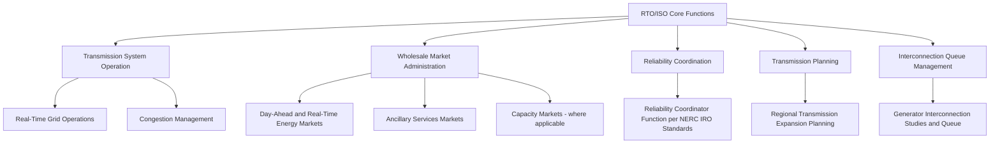
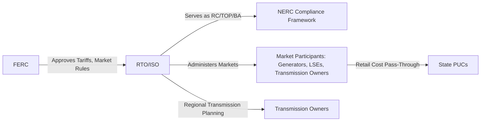

## Regional Transmission Organizations and Independent System Operators

### Overview

Regional Transmission Organizations (RTOs) and Independent System Operators (ISOs) are FERC-authorized entities that operate the transmission grid and administer organized wholesale electricity markets across defined geographic footprints in North America. These entities emerged from FERC's restructuring initiatives beginning in the 1990s, designed to separate transmission system operation from generation ownership interests, enabling non-discriminatory transmission access and competitive wholesale power markets.

### Origin and Regulatory Basis

**Key Points:**

- ISOs originated from FERC Order 888 (1996), which required transmission-owning utilities to provide open, non-discriminatory access to their transmission systems and encouraged the formation of independent entities to operate transmission on a non-discriminatory basis, separate from the commercial interests of transmission-owning utilities.
- RTOs were further formalized under FERC Order 2000 (1999), which established minimum characteristics and functions an entity must satisfy to be approved as an RTO, encouraging voluntary formation of larger, multi-utility regional entities beyond the initial single-utility-footprint ISO model.
- The distinction between "ISO" and "RTO" is now largely historical/naming convention rather than a strict functional difference — both operate under broadly similar FERC-approved functions, though RTOs were originally envisioned to meet somewhat more extensive regional governance and scope criteria than early ISOs.

### Major North American RTOs/ISOs

| Entity | Approximate Footprint | Notable Characteristics |
| --- | --- | --- |
| PJM Interconnection | Mid-Atlantic, parts of Midwest (13 states + DC) | Largest RTO by market size; serves as RC and BA for much of its footprint |
| MISO (Midcontinent ISO) | Upper Midwest through Gulf Coast | Spans multiple NERC regions; large footprint with north-south transmission challenges |
| SPP (Southwest Power Pool) | Central US (Great Plains) | Serves as RC for an expanded footprint beyond its market territory |
| ERCOT (Electric Reliability Council of Texas) | Most of Texas | Operates largely outside FERC jurisdiction as a predominantly intrastate system; distinct energy-only market design |
| CAISO (California ISO) | California, parts of neighboring states via EDAM/WEIM | Pioneering renewable integration experience; administers Western Energy Imbalance Market extensions |
| ISO-NE (ISO New England) | Six New England states | Smaller, more constrained footprint with distinct winter gas-electric interdependency challenges |
| NYISO (New York ISO) | New York State | Zonal market structure reflecting significant internal transmission constraints |

**Key Points:**

- Not all regions of North America are served by an RTO/ISO — substantial portions of the Southeast and parts of the West remain served by traditional vertically integrated utilities operating bilateral markets without a centralized RTO/ISO market structure, though Western market integration efforts (e.g., expanding day-ahead market participation) have grown over time.
- ERCOT's unique status as a predominantly intrastate grid (not synchronously interconnected with the Eastern or Western Interconnections, aside from limited DC ties) places it largely outside FERC jurisdiction, instead regulated primarily by the Public Utility Commission of Texas — a structural distinction with significant implications for its market design and reliability governance compared to FERC-jurisdictional RTOs.

### Core Functions

#### Transmission System Operation

- RTOs/ISOs operate (though typically do not own — transmission assets generally remain owned by member Transmission Owners) the transmission system within their footprint, managing real-time dispatch, congestion, and reliability coordination on a centralized, regional basis rather than utility-by-utility.
- Centralized operation over a large geographic footprint enables more efficient dispatch (least-cost generation commitment across the full region) and improved reliability coordination compared to the pre-restructuring model of many separately operated utility control areas.

#### Wholesale Market Administration

**Key Points:**

- **Day-Ahead and Real-Time Energy Markets:** Most RTOs/ISOs operate security-constrained economic dispatch markets clearing on a day-ahead and real-time basis, using Locational Marginal Pricing (LMP) to reflect the marginal cost of energy at each network location, capturing transmission congestion and losses.
- **Ancillary Services Markets:** Organized markets for regulation, spinning/non-spinning reserves, and other reliability services needed to maintain frequency and operating reserve requirements.
- **Capacity Markets:** Several RTOs (notably PJM, ISO-NE, and historically others with varying designs) operate forward capacity markets intended to ensure adequate future generation resource adequacy, distinct from the energy-only market design used by ERCOT, which relies on scarcity pricing rather than a separate capacity payment mechanism to incentivize resource adequacy.
- Market design (particularly capacity market structure, or its absence) is a significant point of structural variation across RTOs/ISOs, with ongoing policy debate regarding the relative merits of capacity market versus energy-only market approaches for ensuring long-term resource adequacy.

#### Reliability Coordinator Function

- Most major RTOs/ISOs also serve as the NERC-certified Reliability Coordinator for their footprint (or a footprint extending beyond their market territory, as with SPP's expanded RC service), integrating the wide-area situational awareness and directive authority functions of the RC role with their market and transmission operation functions.
- This dual role (market operator and Reliability Coordinator) creates operational efficiency through integrated situational awareness but also requires careful governance to ensure reliability decisions are not inappropriately influenced by market considerations, a structural safeguard addressed through RTO governance and FERC oversight.

#### Transmission Planning

- RTOs/ISOs conduct regional transmission expansion planning processes, evaluating the need for new transmission investment to relieve congestion, integrate new generation (particularly growing renewable resources), and maintain reliability under NERC TPL-001 planning criteria across their footprint.
- Regional planning processes typically involve stakeholder engagement, cost allocation methodology development (determining how the cost of regional transmission projects is allocated across beneficiary utilities/customers), and coordination with FERC on cost allocation approval.

#### Interconnection Queue Management

**Key Points:**

- RTOs/ISOs administer the generator interconnection study process (system impact studies, facility studies) governing how new generation resources — increasingly dominated by solar, wind, and battery storage projects — connect to the transmission system, following FERC's pro forma interconnection procedures and subsequent reform orders.
- Interconnection queue backlogs have become a significant industry challenge across most major RTOs/ISOs, driven by the surge in renewable and storage project interconnection requests substantially exceeding historical queue volumes, prompting FERC Order 2023 and related reforms aimed at improving queue processing efficiency (e.g., transitioning toward cluster study approaches rather than sequential first-come-first-served study processing).

### Governance Structure

**Key Points:**

- RTOs/ISOs are structured as independent, not-for-profit entities with governance mechanisms (typically an independent Board of Directors and various stakeholder committees) designed to insulate operational and market decisions from the commercial interests of any single market participant, including transmission-owning member utilities.
- Stakeholder processes (typically involving generation owners, transmission owners, load-serving entities, consumer advocates, and other market participants) provide input into market rule changes, tariff modifications, and planning decisions, which are ultimately subject to FERC approval for matters within FERC's jurisdiction.
- Independent Market Monitors (internal or external to the RTO/ISO) provide oversight of market behavior, identifying potential market power exercise or manipulation and reporting findings to FERC, functioning as a market integrity safeguard distinct from the RTO/ISO's own operational functions.

### RTO/ISO Relationship to Broader Regulatory Structure

**Key Points:**

- RTOs/ISOs sit structurally between FERC (which approves their tariffs and market rules) and the underlying Registered Entities (Transmission Owners, Generator Owners/Operators, Load-Serving Entities) that participate in their markets and are subject to their operational direction.
- Wholesale market outcomes administered by RTOs/ISOs flow through to retail rates via Load-Serving Entities, creating an indirect but significant connection between RTO/ISO market design decisions and the state PUC-jurisdictional retail rates ultimately paid by end-use customers.
- In states within an RTO/ISO footprint, state resource planning (where retained, as in some but not all restructured states) must account for the RTO/ISO's capacity market or resource adequacy construct, creating a layered planning relationship between state and RTO/ISO-level resource decisions.

### Market Structure Variation: Capacity Market vs. Energy-Only Design

| Approach | Representative Example | Mechanism |
| --- | --- | --- |
| Forward Capacity Market | PJM, ISO-NE | Separate capacity auction procures firm capacity commitments years ahead of the delivery period, providing an explicit revenue stream for resource adequacy beyond energy market revenue |
| Energy-Only with Scarcity Pricing | ERCOT | No separate capacity payment; resource adequacy incentivized through high energy prices during scarcity conditions (administratively set price adders/caps during tight supply conditions) |
| Resource Adequacy via State/Utility Requirement | CAISO (in part), various | Combination of RTO/ISO market mechanisms and state-mandated resource adequacy requirements placed on Load-Serving Entities |

[Inference] The relative effectiveness of capacity market versus energy-only market design in ensuring long-term resource adequacy, particularly amid growing renewable penetration and changing generation mix characteristics, remains a subject of ongoing industry, academic, and regulatory debate; this summary presents the structural mechanisms rather than asserting a conclusion on comparative merit.

### Example: Coordinated RTO Functions for a New Solar-Plus-Storage Project

**Example:**

1. A developer submits an interconnection request for a 200 MW solar-plus-storage project to the RTO's interconnection queue, entering a cluster study group alongside other nearby pending projects per current queue reform procedures.
2. The RTO conducts system impact and facility studies, identifying necessary transmission upgrades and assigning associated cost responsibility per the RTO's FERC-approved interconnection cost allocation methodology.
3. Upon commercial operation, the project participates in the RTO's day-ahead and real-time energy markets, receiving LMP-based compensation reflecting its specific network location, and may separately participate in the RTO's capacity market (where applicable) to earn resource adequacy revenue.
4. The RTO's reliability coordination function incorporates the new resource's output characteristics (including its energy storage dispatch flexibility) into ongoing real-time contingency analysis and operational planning.
5. The project's interconnection and any associated transmission upgrades are reflected in the RTO's regional transmission planning process, informing future planning studies evaluating cumulative renewable integration impact across the broader footprint.

### Next Steps

- **Regulatory Bodies: FERC, NERC, and State Public Utility Commissions**
- **Reliability Coordinator Functions**
- **Locational Marginal Pricing and Congestion Management**
- **Generator Interconnection Queue Reform (FERC Order 2023)**
- **Capacity Market Design and Resource Adequacy Mechanisms**
- **Regional Transmission Planning and Cost Allocation**
- **Loss-of-Load Probability and Loss-of-Load Expectation**
- **ERCOT's Unique Market and Regulatory Structure**