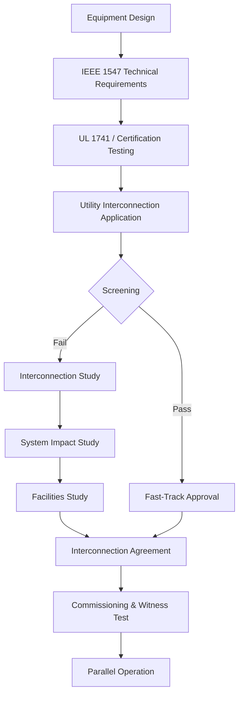
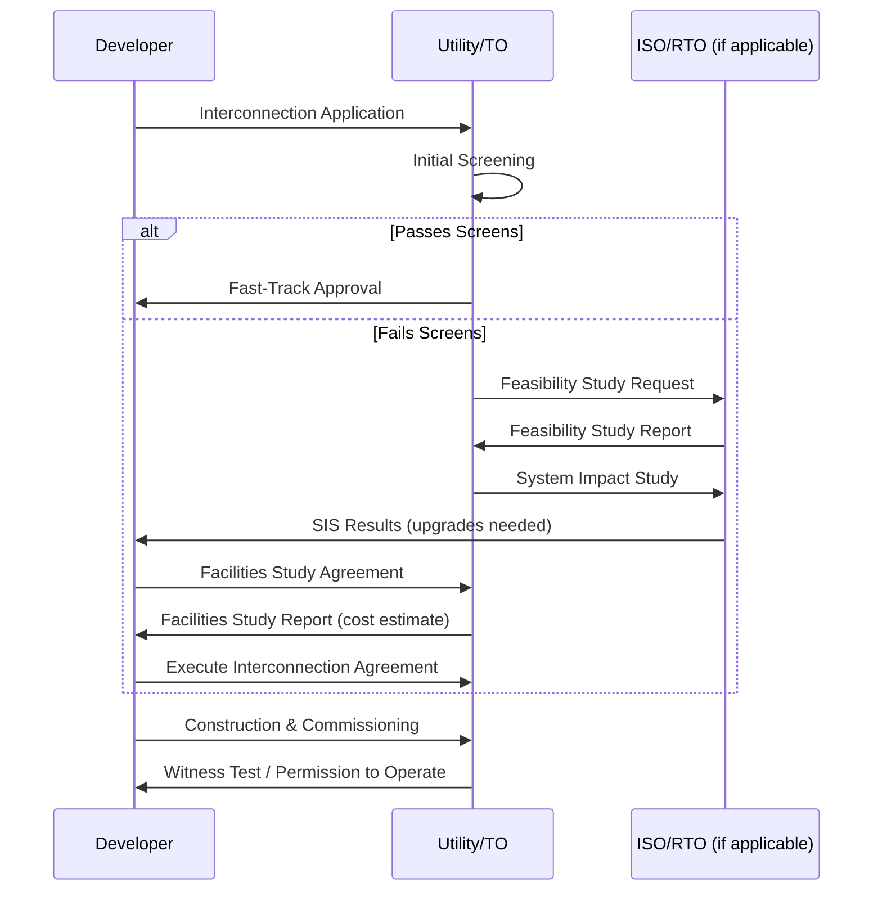

## Grid Interconnection Standards and Codes

### Overview

Grid interconnection standards and codes are the technical, procedural, and regulatory requirements governing how electrical equipment—generators, storage systems, loads, and conversion devices—connects to and interacts with the electric power grid. These standards ensure that interconnected equipment does not degrade power quality, compromise safety, or destabilize the grid, while providing a predictable, replicable process for utilities, developers, and equipment manufacturers.

Interconnection standards operate at the intersection of engineering and regulation: engineering standards (e.g., IEEE 1547) define technical performance requirements, while regulatory frameworks (e.g., FERC orders, state interconnection procedures) define the administrative process—application, screening, study, and agreement—through which a project achieves interconnection.

### Why Interconnection Standards Exist

**Key Points**

- Prevent unintentional islanding that endangers utility line workers
- Maintain voltage and frequency within safe operating bounds
- Limit harmonic injection and power quality degradation
- Coordinate protective relaying so faults are cleared correctly
- Provide a non-discriminatory, cost-causation-based process for connecting new resources
- Enable grid planners to predict aggregate impacts of distributed and bulk generation

### Layered Structure of Interconnection Requirements

Interconnection requirements are typically layered across four domains:

1. **National/international technical standards** — define required equipment behavior (e.g., IEEE 1547, IEC 61727)
2. **Product certification standards** — verify equipment conforms to the technical standard (e.g., UL 1741)
3. **Utility/ISO interconnection procedures** — define the application and study process (e.g., FERC Order 2003/845, state Small Generator Interconnection Procedures)
4. **Utility technical requirements/tariffs** — utility-specific addenda covering local equipment, metering, and protection practices

### Core Technical Standards

#### IEEE 1547 (and 1547.1)

IEEE 1547, "Standard for Interconnection and Interoperability of Distributed Energy Resources with Associated Electric Power Systems Interfaces," is the foundational U.S. technical standard for distributed energy resource (DER) interconnection at the distribution level.

**Key Points**

- The 2018 revision (IEEE 1547-2018) replaced the 2003 original and introduced mandatory **ride-through** requirements, replacing the older "trip immediately on abnormal voltage/frequency" default
- Defines four **performance categories** for voltage/frequency ride-through and reactive power capability: Category I, II, III (increasing capability), plus normal operating performance categories A and B (B allows active grid support functions like volt-var control)
- Specifies default and configurable **trip settings** for abnormal voltage and frequency
- Requires **anti-islanding protection**—DER must cease energizing within 2 seconds of forming an unintentional island
- IEEE 1547.1 defines the **conformance test procedures** used to verify equipment meets 1547 requirements
- IEEE 1547.1 and 1547-2018 are frequently referenced together in utility tariffs as "1547-2018 as modified by 1547.1-2020"

**Example**

Voltage ride-through requirement structure (Category III, illustrative):

| Voltage (% nominal) | Minimum Ride-Through Time |
| --- | --- |
| < 45% | Momentary cessation permitted |
| 45%–65% | 3 seconds |
| 65%–88% | 21 seconds |
| 110%–120% | 13 seconds |
| > 120% | Instantaneous trip |

[Unverified] Exact thresholds and durations vary by category and utility-adopted settings group (Group A/B/C); the table above illustrates the structure of ride-through curves rather than a universally fixed table.

#### IEC 61727 and IEC 62109

Outside the U.S., IEC 61727 (photovoltaic systems - characteristics of the utility interface) and IEC 62109 (safety of power converters) fill roles analogous to IEEE 1547 and UL 1741, respectively, though many countries maintain their own national interconnection codes (e.g., VDE-AR-N 4105 in Germany, G99 in the UK).

#### UL 1741 / UL 1741 SA / UL 1741 SB

UL 1741 is the product safety and functional certification standard that verifies inverters, converters, and controllers implement IEEE 1547 functions correctly.

- **UL 1741 (base)** — inverter safety and basic anti-islanding
- **UL 1741 SA** (Supplement A) — verifies smart inverter functions (volt-var, volt-watt, frequency-watt) required by California Rule 21 and similar tariffs
- **UL 1741 SB** — updated to test conformance with IEEE 1547-2018 performance categories and ride-through

Utilities generally require UL 1741-listed equipment as a prerequisite for interconnection; this is a certification gate, not a substitute for the interconnection application process itself.

### Regulatory and Procedural Frameworks (United States)

#### FERC Order 2003 and Order 845 (Large Generator Interconnection)

FERC Order 2003 established the **Large Generator Interconnection Procedures (LGIP)** and **Large Generator Interconnection Agreement (LGIA)** as pro forma documents for generators above 20 MW connecting to FERC-jurisdictional transmission systems.

**Key Points**

- FERC Order 845 (2018) reformed LGIP/LGIA to add: interconnection customer's option to build, capacity variance studies, provisions for adding storage to a generating facility, and clarified surplus interconnection service
- Studies proceed through a defined queue: Interconnection Request → Feasibility Study → System Impact Study (SIS) → Facilities Study → LGIA execution
- Cost allocation generally follows a **"cost causation"** principle—network upgrades directly caused by the interconnecting generator are typically borne by that generator, sometimes with reimbursement mechanisms if later generators benefit from the same upgrades

#### FERC Order 2222 and Small Generator Interconnection

FERC Order 2222 (2020) required RTOs/ISOs to allow aggregations of distributed energy resources to participate in wholesale markets, indirectly reshaping interconnection procedures for aggregated DER.

For smaller resources, FERC's **Small Generator Interconnection Procedures (SGIP)** and **Small Generator Interconnection Agreement (SGIA)** apply (generally ≤20 MW), with an expedited process including a **fast-track screen** for very small inverter-based resources meeting specific size and location criteria (commonly ≤2 MW on certain circuits, though thresholds are utility/state-specific).

**Example — Typical Screening Criteria for Fast-Track (illustrative structure)**

1. Facility capacity ≤ 15% of the line section's peak load
2. Aggregate DER on the circuit does not exceed 15% of peak load
3. No adverse short-circuit contribution beyond equipment ratings
4. No need for network upgrades or additional protective devices

[Unverified] Numeric thresholds vary by state and utility tariff; some jurisdictions use 15%, others use different penetration or capacity triggers.

#### State-Level Interconnection Procedures

Distribution-level interconnection (behind the FERC jurisdictional line) is governed by state public utility commissions. Many states model their rules on:

- **IREC Model Interconnection Procedures** (Interstate Renewable Energy Council) — a widely referenced template many states adapt
- **California Rule 21** — one of the most detailed state tariffs, incorporating smart inverter functional requirements, three-tier review (fast track expedited, fast track, independent study), and Rule 21's specific "Track" system for pre-application reports (PARs) and interconnection applications

### Interconnection Process Stages

**Key Points**

- **Feasibility Study**: high-level assessment of thermal, voltage, and short-circuit impacts; identifies obvious constraints early, non-binding cost estimates
- **System Impact Study (SIS)**: detailed power flow, short-circuit, stability, and protection coordination analysis; identifies specific required network upgrades
- **Facilities Study**: detailed design and binding cost estimate for utility-owned interconnection facilities and upgrades
- **Interconnection Agreement**: legally binding contract specifying technical requirements, cost responsibility, milestones, and operational obligations
- **Queue position** and **cluster/group studies** are increasingly used by ISOs (e.g., MISO, PJM, CAISO) to study multiple interconnection requests together, addressing "queue backlog" — a well-documented industry problem as DER and IBR (inverter-based resource) volumes have surged

### Protection and Safety Requirements

#### Anti-Islanding

Unintentional islanding occurs when a DER continues to energize a portion of the grid after it has been disconnected from the main utility source, creating a hazard for line workers performing maintenance.

$$t_{trip} \leq 2\ \text{s (per IEEE 1547 anti-islanding requirement)}$$

**Example**

Passive anti-islanding methods rely on detecting abnormal voltage/frequency deviations; active methods (e.g., frequency shift, impedance measurement) inject small perturbations to detect loss of grid reference. Modern smart inverters commonly combine both approaches per UL 1741 SB test procedures.

#### Protective Relaying Coordination

Interconnection studies verify that:

- Fault current contribution from DER does not exceed breaker interrupting ratings
- Protective relay settings (67, 50/51, 27/59, 81O/U in IEEE device numbering) correctly detect and clear faults without nuisance tripping DER
- Reverse power flow does not defeat existing protection schemes designed for radial, one-directional flow

**Example — Simplified Radial Feeder Protection Diagram (svg_diagram)**

<svg xmlns="http://www.w3.org/2000/svg" viewBox="0 0 720 260">
<text x="360" y="24" text-anchor="middle" font-size="16" font-weight="bold">Radial Feeder Protection with DER Interconnection (svg_diagram)</text>
<line x1="40" y1="130" x2="680" y2="130" stroke="#333" stroke-width="3" />
<rect x="20" y="105" width="50" height="50" fill="none" stroke="#333" stroke-width="2" />
<text x="45" y="180" text-anchor="middle" font-size="12">Substation</text>
<circle cx="200" cy="130" r="10" fill="#333" />
<text x="200" y="105" text-anchor="middle" font-size="11">Recloser (79)</text>
<circle cx="380" cy="130" r="10" fill="#333" />
<text x="380" y="105" text-anchor="middle" font-size="11">Fuse/Sectionalizer</text>
<line x1="450" y1="130" x2="450" y2="200" stroke="#333" stroke-width="2" />
<rect x="420" y="200" width="60" height="40" fill="none" stroke="#0066cc" stroke-width="2" />
<text x="450" y="255" text-anchor="middle" font-size="12">DER (PCC)</text>
<circle cx="450" cy="200" r="8" fill="#0066cc" />
<text x="500" y="195" font-size="11">Interconnect. relay (67/25)</text>
<circle cx="600" cy="130" r="10" fill="#333" />
<text x="600" y="105" text-anchor="middle" font-size="11">Load Tap</text>
<line x1="680" y1="130" x2="700" y2="130" stroke="#333" stroke-width="3" />
<text x="70" y="60" font-size="11" fill="#555">Fault current can now flow bidirectionally,</text>
<text x="70" y="76" font-size="11" fill="#555">requiring directional (67) relaying at PCC.</text>
</svg>

### Power Quality and Operational Requirements

**Key Points**

- **Harmonic distortion**: IEEE 1547 references IEEE 519 limits for total harmonic distortion (THD), typically capping individual DER injected current THD around 5% [Unverified — exact percentage is equipment-category and standard-revision dependent]
- **DC injection limits**: inverters must limit DC current injection into the AC grid, commonly to less than 0.5% of rated output current
- **Flicker**: rapid voltage fluctuations from variable generation (e.g., wind) must stay within flicker severity limits (Pst, Plt per IEC 61000-4-15)
- **Power factor / reactive power**: 1547-2018 Category II/III DER must provide reactive power support (volt-var, volt-watt, watt-var functions) rather than operating at unity power factor only

### Interconnection for Bulk Power System Resources vs. Distributed Resources

| Dimension | Bulk/Transmission (LGIP/LGIA) | Distribution (SGIP/Rule 21-type) |
| --- | --- | --- |
| Governing body | FERC (Order 2003/845) | State PUC |
| Typical size threshold | > 20 MW | ≤ 20 MW (varies) |
| Study rigor | Full SIS, stability, dynamic modeling | Screens; SIS if screens fail |
| Technical standard | NERC reliability standards + IEEE 1547 (where DER-relevant) | IEEE 1547, UL 1741 |
| Typical timeline | 1–3+ years | Weeks (fast track) to 1+ year (full study) |

### NERC Reliability Standards Interaction

While IEEE 1547 governs distribution-connected DER, bulk-system-connected generators must also comply with **NERC Reliability Standards** (e.g., PRC-024 for frequency/voltage ride-through of generators, FAC-001/002 for facility interconnection requirements, VAR-002 for voltage/reactive control). These are enforced through the NERC Reliability Standards compliance regime rather than a utility tariff.

**Key Points**

- PRC-024 defines "no-trip" voltage and frequency ride-through curves that bulk-connected generators must not trip within, distinct from but philosophically aligned with IEEE 1547 ride-through requirements
- FAC-001/002 require transmission owners to publish interconnection requirements and study new interconnection requests against them

### International Variation (Brief Comparative Note)

**Key Points**

- **Europe**: EU Network Code on Requirements for Generators (NC RfG) sets harmonized technical requirements across member states, categorizing generators by size (Type A–D) with escalating requirements
- **UK**: Engineering Recommendation G99 (generation) and G98 (small-scale, ≤16A/phase) govern connection to distribution networks
- **Australia**: AS/NZS 4777 series governs inverter-connected DER
- [Unverified] Specific numeric thresholds and category boundaries in these frameworks are subject to periodic revision and should be verified against the current in-force version for any compliance-critical application

### Common Interconnection Study Failure Modes

**Example**

A 5 MW solar project's System Impact Study may identify:

1. **Thermal overload** on an upstream conductor segment exceeding its rated ampacity under high-generation, low-load conditions
2. **Voltage rise** beyond ANSI C84.1 Range A limits during minimum load/maximum generation
3. **Short-circuit duty** on an existing breaker approaching its interrupting rating once fault contribution from the new inverter-based resource is added
4. **Protection miscoordination** where the DER's ride-through settings undermine existing reclosing schemes

Each finding typically becomes a required network upgrade allocated to the interconnecting customer under cost-causation principles, subject to the specific utility's cost allocation methodology. [Inference] The magnitude and allocation of these upgrade costs vary significantly by jurisdiction and are often the primary point of dispute in interconnection proceedings.

### Emerging Issues

**Key Points**

- **Interconnection queue backlogs**: Many U.S. ISOs report multi-year queues; FERC Order 2023 (2023) introduced first-ready, first-served cluster study reforms to address this [Unverified — confirm current implementation status per specific ISO, as rules are still being phased in]
- **IBR (inverter-based resource) performance standards**: Growing bulk-system share of inverter-based generation has driven new NERC standards work on IBR ride-through, frequency response, and modeling requirements following documented IBR-related disturbance events
- **Storage co-location and hybrid resources**: Interconnection procedures are evolving to handle hybrid solar+storage facilities, including "energy storage as transmission" classifications and export-limited configurations
- **Dynamic/flexible interconnection**: Some utilities are piloting limited or curtailable interconnection agreements to reduce required network upgrades in exchange for accepting periodic curtailment

**Next Steps**

- Distributed Energy Resource Management Systems (DERMS) and Aggregation
- Protection Coordination and Fault Current Analysis on Distribution Feeders
- NERC Reliability Standards Compliance Framework
- Inverter-Based Resource (IBR) Ride-Through and Grid-Forming Controls
- FERC Order 2222 Implementation and DER Wholesale Market Participation
- Hosting Capacity Analysis and Distribution Planning
- Smart Inverter Functions (Volt-Var, Volt-Watt, Frequency-Watt)
- Interconnection Cost Allocation Methodologies