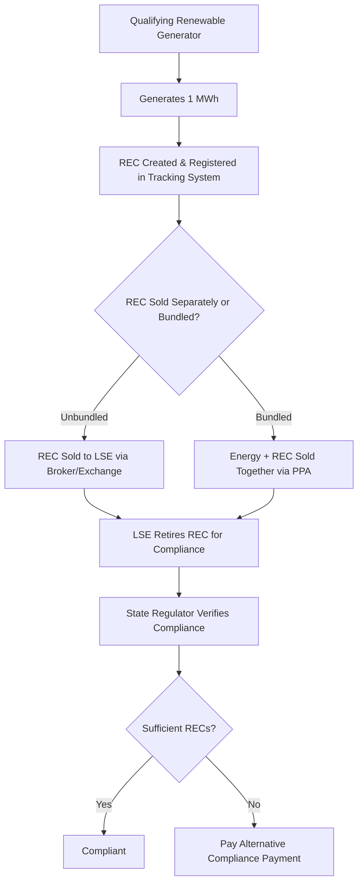

## Renewable Portfolio Standards and Clean Energy Policy

### Overview

Renewable Portfolio Standards (RPS), also called Clean Energy Standards (CES) or Renewable Energy Standards (RES), are state or national policy mechanisms requiring electricity providers to source a specified percentage or absolute quantity of their electricity from qualifying renewable or clean energy resources by a defined target date. RPS policies are the primary market-based instrument used in the U.S. (in the absence of a federal RPS) to drive renewable generation deployment, and analogous mechanisms exist internationally under different names (Renewable Obligation in the UK, feed-in tariffs and auction quotas in the EU, Renewable Energy Certificate schemes in India and Australia).

### Policy Design Fundamentals

**Key Points**

- RPS obligations are typically placed on **load-serving entities (LSEs)**—utilities and competitive retail suppliers—rather than generators directly
- Compliance is generally demonstrated through **Renewable Energy Certificates (RECs)**, tradable instruments representing the environmental attributes of one MWh of qualifying generation
- Targets are expressed either as a **percentage of retail sales** (e.g., "50% renewable by 2030") or as **absolute capacity/energy targets** (e.g., "10 GW of offshore wind by 2035")
- Most RPS programs include **carve-outs** or **set-asides** for specific technologies (commonly solar, sometimes offshore wind or distributed generation), each with its own compliance obligation and REC market
- **Alternative Compliance Payments (ACPs)** function as a price ceiling/penalty mechanism—an LSE unable to source sufficient RECs may pay a per-MWh penalty instead, which also caps REC market prices

### RPS Compliance Mechanism Structure

### Renewable Energy Certificates (RECs) in Detail

**Key Points**

- One REC = attributes of **1 MWh** of generation from a qualifying resource, tracked via regional tracking systems (e.g., NEPOOL-GIS, PJM-GATS, WREGIS, M-RETS, ERCOT REC tracking)
- RECs can be **bundled** (sold with the underlying energy, typically via Power Purchase Agreement) or **unbundled** (sold separately from the energy itself, allowing energy and environmental attribute markets to clear independently)
- **Vintage** requirements often restrict which compliance year a REC may be used in (commonly generation year plus one to three years)
- Double-counting is prevented through **serial number tracking** and retirement in a single registry; RECs are retired (permanently removed from circulation) upon compliance use
- A generator selling unbundled RECs while selling the underlying energy on the wholesale market effectively receives two separate revenue streams

$$\text{Total Generator Revenue} = (\text{Energy Price} \times \text{MWh}) + (\text{REC Price} \times \text{MWh})$$

### Qualifying Resource Definitions

**Example — Illustrative Resource Eligibility Table**

| Resource | Commonly Eligible | Frequently Excluded/Contested |
| --- | --- | --- |
| Wind (onshore/offshore) | Yes | — |
| Solar PV/thermal | Yes | — |
| Biomass | Often, with sustainability criteria | Non-sustainable harvest practices |
| Geothermal | Yes | — |
| Small hydro | Often, below a capacity threshold | Large hydro (>30 MW in many states) |
| Landfill gas | Often | — |
| Municipal solid waste | State-dependent | Sometimes excluded on emissions grounds |
| Nuclear | Rarely under "renewable," sometimes under "clean" | Excluded from most true RPS; included in some CES |
| Large hydro | State-dependent | Frequently excluded from RPS, included in some CES |

[Unverified] Exact eligibility criteria, capacity thresholds, and vintage rules are jurisdiction-specific and change through legislative and regulatory amendment; the table above illustrates common structural distinctions rather than a specific state's current rules.

### RPS vs. Clean Energy Standard (CES)

**Key Points**

- **RPS** traditionally restricts eligibility to renewable resources (wind, solar, biomass, geothermal, qualifying hydro)
- **CES** broadens eligibility to any resource meeting a defined low- or zero-carbon-emissions threshold, which can include nuclear, large hydro, and increasingly carbon capture-equipped fossil generation
- The distinction matters materially for **REC market size and pricing**—broadening eligibility (RPS → CES) generally increases supply and can depress REC prices unless the target percentage is raised correspondingly
- Some states operate **tiered systems**, e.g., a Tier I (new renewables) and Tier II (existing renewables, often capped or declining) structure with separate compliance obligations and price dynamics

### Interaction with Wholesale and Retail Electricity Markets

**Key Points**

- RPS/CES obligations interact with **wholesale capacity and energy markets** run by ISOs/RTOs; renewable resources compete in energy markets on marginal cost (often near zero for wind/solar) while their revenue is supplemented by REC sales and, in some markets, capacity payments
- In restructured/competitive retail markets, **each competitive supplier** typically bears its own proportional RPS obligation based on retail sales
- In vertically integrated (regulated monopoly) states, the **utility itself** bears the obligation and recovers compliance costs through rates, subject to regulatory prudence review
- RPS-driven demand for RECs and associated PPAs has historically been a primary driver of utility-scale wind and solar financing, particularly before standalone tax-equity and merchant markets matured

### Federal Policy Context (United States)

Unlike many countries, the U.S. has no binding federal RPS; federal support instead operates primarily through tax incentives and, more recently, direct-pay/transferability mechanisms.

**Key Points**

- **Investment Tax Credit (ITC)** and **Production Tax Credit (PTC)** under Internal Revenue Code Sections 48/48E and 45/45Y provide federal tax incentives for qualifying renewable generation, historically the dominant federal lever alongside state RPS policies
- The Inflation Reduction Act (2022) extended and restructured these credits into **technology-neutral** Section 45Y (PTC) and 48E (ITC) credits effective for projects placed in service after 2024, and introduced **transferability** (selling credits directly) and **direct pay** (for tax-exempt entities) [Unverified — confirm current IRS guidance and any subsequent legislative amendments, as clean energy tax credit provisions have been subject to ongoing legislative revision]
- Federal RPS proposals (e.g., a national Clean Electricity Standard) have been introduced repeatedly in Congress but have not been enacted as of the standard's last confirmed status; state RPS/CES programs remain the primary binding mandates
- The EPA's greenhouse gas regulations for power plants (under varying legal authorities and subject to ongoing litigation) function as an indirect complement to RPS by regulating the emissions side rather than mandating renewable procurement directly

### Comparative State Policy Design (Illustrative Structural Patterns)

**Example**

Three common RPS/CES architectures found across U.S. states:

1. **Percentage-of-sales with escalating schedule**: e.g., 20% by 2025, rising in defined increments to 50%+ by a target year, with technology carve-outs for solar
2. **100% clean energy by target year**: broader CES structure allowing nuclear/large hydro/emerging technologies, often paired with interim milestones (e.g., 80% by 2030, 100% by 2045)
3. **Voluntary/goal-based**: non-binding targets without ACP enforcement, relying on utility integrated resource planning (IRP) processes rather than certificate compliance

[Unverified] Specific state targets, technology inclusions, and enforcement mechanisms change frequently through legislative action; verify against the specific state's current statute and implementing regulations for any compliance-critical determination.

### Cost Recovery and Ratepayer Impact

**Key Points**

- Utility compliance costs (REC purchases, ACPs, above-market PPA costs) are typically recovered through a **rider or surcharge** on retail rates, subject to regulatory review for prudence and cost-effectiveness
- Some states impose a **cost cap** limiting the ratepayer impact of RPS compliance, which can create tension with escalating targets if compliance costs approach the cap
- **Net metering** and **community solar** programs are policy-adjacent mechanisms often bundled with RPS carve-outs to expand distributed renewable participation, though they operate through different compensation mechanisms (bill credits) rather than REC compliance

### Relationship to Grid Engineering and Interconnection

**Key Points**

- RPS-driven deployment volumes directly influence **interconnection queue volumes**, as developers respond to policy-created demand signals (see: Grid Interconnection Standards and Codes)
- Aggressive RPS/CES targets increase the pace at which utilities must integrate **variable renewable generation**, driving investment in flexibility resources (storage, demand response, transmission) and updated planning methodologies (effective load carrying capability, hosting capacity analysis)
- REC market design is generally **separate from** but **policy-linked to** wholesale market design; a resource can be dispatched based on wholesale market economics while its REC is sold independently to satisfy a different jurisdiction's RPS obligation, creating cross-border REC flows

**Example**

A wind farm in a low-RPS-target state may sell its energy into the regional wholesale market while selling its RECs to a load-serving entity in a neighboring high-target state, provided the REC tracking systems are interoperable or have an established import/export relationship.

### International Analogues (Brief Comparative Note)

**Key Points**

- **United Kingdom**: transitioned from the Renewables Obligation (RO, a REC-like Renewables Obligation Certificate scheme) to **Contracts for Difference (CfD)** competitive auctions as the primary support mechanism
- **European Union**: relies primarily on **auction-based feed-in premiums** and national renewable energy targets under the Renewable Energy Directive (RED), rather than a REC-based portfolio standard model
- **India**: operates a Renewable Purchase Obligation (RPO) system structurally similar to a U.S. RPS, with Renewable Energy Certificates traded on power exchanges
- [Unverified] Mechanism details and current targets in each jurisdiction are subject to periodic legislative revision

### Common Analytical Considerations

**Key Points**

- **Additionality**: whether RPS-driven REC demand causes genuinely new renewable construction versus simply monetizing existing/planned generation—an ongoing policy design debate, particularly for voluntary green power markets that overlap with compliance markets
- **REC price volatility**: driven by supply/demand imbalances, ACP price ceilings, and the relationship between escalating targets and actual project development timelines
- **Resource adequacy interaction**: variable renewables typically receive lower **capacity credit** in resource adequacy accounting than their nameplate capacity, meaning RPS energy targets do not automatically ensure reliability targets are met—a distinction addressed separately through capacity market or IRP planning processes

**Next Steps**

- Federal Tax Incentives for Clean Energy (ITC/PTC, Direct Pay, Transferability)
- Power Purchase Agreement (PPA) Structures for Renewable Projects
- Resource Adequacy and Capacity Market Design
- Integrated Resource Planning (IRP) Processes
- Net Metering and Distributed Generation Compensation Design
- Grid Interconnection Standards and Codes
- Emissions Trading and Carbon Pricing Mechanisms
- Utility Ratemaking and Cost Recovery Mechanisms