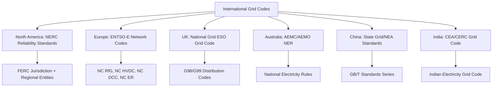

## International Grid Codes and Regulatory Frameworks

### Overview

Grid codes are the technical rulebooks issued by system operators, regulators, or standards bodies that define the mandatory requirements for connecting to and operating on an electric power system—covering generator performance, protection, control, planning, and operational procedures. Unlike a single global standard, grid codes are fragmented by region, reflecting differences in system size, generation mix, market structure, and regulatory philosophy. Understanding the comparative landscape is essential for equipment manufacturers, developers, and engineers working across jurisdictions.

### Structural Components Common to Most Grid Codes

**Key Points**

- **Connection Code**: technical requirements for connecting new generation, demand, or storage (voltage ride-through, frequency response, reactive power capability)
- **Operating Code**: rules for day-to-day system operation, including scheduling, dispatch, and frequency/voltage control obligations
- **Planning Code**: requirements for network planning studies, data submission, and long-term capacity assessments
- **Balancing/Ancillary Services Code**: defines procurement and technical requirements for frequency response, reserves, and voltage support services
- **Metering Code**: standards for revenue and settlement metering accuracy and data exchange
- **Emergency/Defence Code**: procedures for system restoration, load shedding, and blackstart following major disturbances

### Comparative Overview by Region

### North America: NERC and FERC Framework

**Key Points**

- The **North American Electric Reliability Corporation (NERC)** develops mandatory Reliability Standards enforceable across the U.S., Canada, and parts of Mexico under authority delegated by FERC (in the U.S.) and provincial/federal regulators (in Canada)
- Standards are organized by functional category: **BAL** (balancing), **FAC** (facilities connection), **PRC** (protection and control), **TOP** (transmission operations), **VAR** (voltage and reactive), **IRO** (interconnection reliability operations), **CIP** (cybersecurity)
- NERC operates through **Regional Entities** (e.g., WECC, SERC, RF, MRO, Texas RE) that enforce standards within their footprints, reflecting the historically fragmented development of the North American grid into three major interconnections (Eastern, Western, ERCOT/Texas)
- Unlike Europe's single synchronous continental grid, North America has **three asynchronous interconnections** (Eastern, Western, ERCOT), connected only via HVDC ties, meaning grid code harmonization needs differ fundamentally from Europe's single synchronous area challenges
- FERC-jurisdictional generator interconnection (LGIP/LGIA under Orders 2003/845/2023) functions as the connection-code equivalent for bulk transmission (see: Grid Interconnection Standards and Codes)

### Europe: ENTSO-E Network Codes

**Key Points**

- The **European Network of Transmission System Operators for Electricity (ENTSO-E)** coordinates grid code development across EU member states (and associated non-EU states), operating under the EU's legally binding **Network Codes and Guidelines** framework established through EU regulations
- Key network codes include:
  - **NC RfG** (Requirements for Generators) — connection requirements categorized by generator "Type A–D" based on capacity and voltage level, with escalating technical obligations
  - **NC DCC** (Demand Connection Code) — requirements for demand facilities and distribution networks
  - **NC HVDC** — requirements for HVDC systems and DC-connected power park modules
  - **NC ER** (Emergency and Restoration) — system defense and blackstart coordination
  - Operational codes covering **load-frequency control**, **operational security**, and **operational planning and scheduling**
- Because continental Europe operates as a **single large synchronous area**, harmonized frequency response and ride-through requirements are critical to preventing cascading disturbances across borders—a structurally different problem than North America's asynchronous interconnections
- Individual **Transmission System Operators (TSOs)**—e.g., RTE (France), 50Hertz/TenneT/Amprion/TransnetBW (Germany), Terna (Italy)—implement the harmonized EU network codes through national grid codes, retaining some national-specific technical parameters within EU-set bounds

**Example — NC RfG Generator Type Classification (illustrative structure)**

| Type | Typical Threshold | Requirement Intensity |
| --- | --- | --- |
| Type A | Smallest (e.g., >0.8 kW, connection-voltage dependent) | Basic frequency ride-through |
| Type B | Small-to-medium | Adds active power control, fault ride-through |
| Type C | Medium-to-large | Adds reactive power, voltage control capability |
| Type D | Largest / transmission-connected | Full requirements including dynamic stability studies |

[Unverified] Exact capacity thresholds for each Type category are set nationally within ranges specified by the EU regulation and vary by member state; the table illustrates the classification logic rather than fixed universal thresholds.

### United Kingdom: National Grid ESO Grid Code and Distribution Codes

**Key Points**

- Post-Brexit, the UK retains its own **Grid Code**, administered by the National Grid Electricity System Operator (ESO), separate from but historically aligned with EU network codes
- **G99** governs connection of generation (and increasingly storage) to distribution networks; **G98** covers small-scale generation (typically ≤16A per phase) under a simplified process
- The UK Grid Code includes distinct **Connection Conditions (CC)**, **Operating Codes (OC)**, and **Balancing Codes (BC)** sections
- The UK's ongoing **Review of Electricity Market Arrangements (REMA)** and related reforms illustrate how grid codes evolve alongside broader market design changes [Unverified — confirm current status, as UK electricity market reform has been an active, evolving policy area]

### Australia: National Electricity Rules (NER)

**Key Points**

- The **National Electricity Rules**, made under the National Electricity Law and administered by the Australian Energy Market Commission (AEMC), govern the National Electricity Market (NEM), with the Australian Energy Market Operator (AEMO) as system operator
- **Chapter 5 (Network Connection)** of the NER functions as the grid code, specifying **Generator Performance Standards (GPS)** with negotiated ranges between minimum, automatic access, and negotiated levels for parameters like voltage ride-through and frequency response
- AEMO has published specific technical guidance addressing high penetrations of **inverter-based resources**, reflecting Australia's globally notable rate of distributed rooftop solar penetration, which has driven grid code innovation in areas like minimum system strength requirements and system security services

### Asia-Pacific: China and India

**Key Points**

- **China**: State Grid Corporation of China (SGCC) and China Southern Power Grid, together with the National Energy Administration (NEA), issue GB/T national standards covering grid connection (e.g., GB/T 19964 for PV, GB/T 19963 for wind), reflecting the world's largest installed renewable capacity and correspondingly large-scale grid code requirements for curtailment management and long-distance UHV (ultra-high-voltage) transmission integration
- **India**: The **Central Electricity Authority (CEA)** and **Central Electricity Regulatory Commission (CERC)** jointly administer the **Indian Electricity Grid Code (IEGC)**, covering connection standards, scheduling and dispatch, and ancillary services across India's unified national grid (achieved through synchronous interconnection of previously separate regional grids)

### Cross-Cutting Technical Themes in Modern Grid Codes

**Key Points**

- **Fault Ride-Through (FRT) / Low Voltage Ride-Through (LVRT)**: virtually all modern grid codes now mandate that generators remain connected through defined voltage sags rather than tripping, to prevent cascading generation loss during faults
- **Frequency Response**: grid codes increasingly require generators (particularly inverter-based resources) to provide **primary frequency response**, and some now mandate **synthetic inertia** or **fast frequency response** to compensate for declining system inertia as synchronous generation is displaced
- **Grid-Forming vs. Grid-Following Requirements**: an emerging area where grid codes (notably in Australia, GB, and parts of the EU) are beginning to specify or incentivize grid-forming inverter capability to maintain system strength in low-inertia conditions [Unverified — this is an actively developing area of grid code revision across multiple jurisdictions]
- **Minimum System Strength / Short-Circuit Ratio requirements**: increasingly specified in grid codes with high inverter-based resource penetration to ensure adequate fault current for protection coordination

$$\text{SCR} = \frac{S_{sc}}{P_{rated}}$$

where $S_{sc}$ is the short-circuit level at the point of connection and $P_{rated}$ is the rated capacity of the connecting facility; low SCR values indicate a "weak" grid connection requiring additional technical mitigation.

### Harmonization Efforts and Challenges

**Key Points**

- The **International Electrotechnical Commission (IEC)** and **CIGRE** publish international technical standards and guidelines (e.g., IEC 61400-21 for wind turbine grid interaction measurement) that inform but do not supersede national/regional grid codes
- The **International Renewable Energy Agency (IRENA)** and **International Energy Agency (IEA)** publish comparative grid code studies used by policymakers in developing and harmonizing frameworks, particularly in regions building out new regulatory frameworks (e.g., ASEAN grid interconnection initiatives, African Power Pools)
- Full international harmonization remains limited because grid codes are tightly coupled to each system's specific inertia, short-circuit levels, generation mix, and historical protection philosophy—a grid code cannot be transplanted wholesale between systems without re-validation against local system characteristics
- Regional power pools (e.g., **Southern African Power Pool (SAPP)**, **West African Power Pool (WAPP)**, **ASEAN Power Grid**) are developing harmonized grid codes to enable cross-border trading, illustrating an intermediate harmonization model between fully national and fully international standards

### Practical Implications for Engineers and Developers

**Key Points**

- Equipment certified to one region's grid code (e.g., IEC 61400-21 wind turbine testing in Europe) often requires **re-certification or re-validation** against a different jurisdiction's grid code before deployment, since ride-through curves, frequency ranges, and reactive power obligations differ
- Multinational equipment manufacturers commonly design **configurable firmware/settings** allowing a single hardware platform to meet multiple grid codes through parameter changes rather than redesign
- **Grid code compliance testing** is typically conducted by accredited independent test laboratories, with results submitted to the relevant TSO/regulator as part of the connection application—paralleling the UL 1741/IEEE 1547.1 relationship in the U.S. at a much larger scale for transmission-connected plant

**Next Steps**

- Grid Interconnection Standards and Codes
- NERC Reliability Standards Framework in Detail
- Inverter-Based Resource (IBR) Ride-Through and Grid-Forming Controls
- System Strength, Inertia, and Short-Circuit Ratio Analysis
- Cross-Border Power Trading and Regional Power Pools
- HVDC Interconnection and Asynchronous Grid Ties
- Renewable Portfolio Standards and Clean Energy Policy