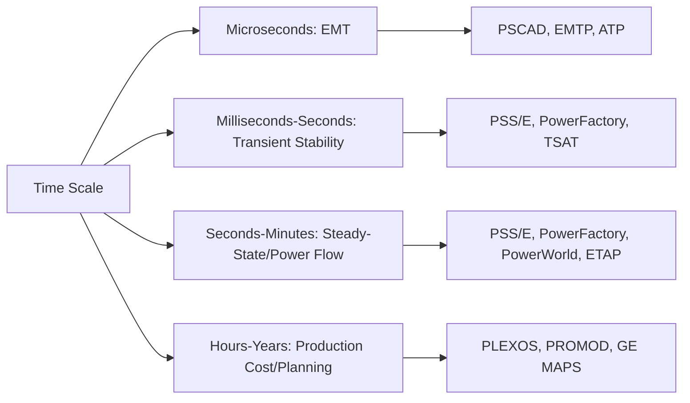

## Power System Simulation Software Landscape

### Overview

Power system simulation software encompasses the specialized engineering tools used to model, analyze, and validate the behavior of electrical power networks across different time scales—from microsecond electromagnetic transients to multi-year planning horizons. No single tool spans this entire spectrum; the landscape is organized around distinct analysis domains (steady-state, transient stability, electromagnetic transients, distribution analysis, market/production cost) each served by purpose-built platforms with different numerical methods, modeling philosophies, and industry adoption patterns.

### Analysis Domain Taxonomy

**Key Points**

- **Steady-state analysis**: power flow (load flow), short-circuit/fault analysis, contingency analysis (N-1)
- **Transient stability (RMS/phasor domain)**: electromechanical dynamics over seconds to tens of seconds, using positive-sequence phasor approximations
- **Electromagnetic transients (EMT)**: full three-phase instantaneous waveform simulation over microseconds to milliseconds, capturing switching transients, lightning, and harmonics
- **Distribution system analysis**: unbalanced three-phase radial/meshed network analysis, often incorporating DER hosting capacity
- **Production cost modeling / market simulation**: economic dispatch and unit commitment over hours to years, for planning and market studies
- **Real-time simulation**: hardware-in-the-loop (HIL) testing at true time-step for protection relay and controller validation

### Steady-State and Transient Stability Platforms

#### Siemens PSS/E

**Key Points**

- Industry-standard tool for **transmission planning, power flow, and dynamic stability studies**, widely used by North American ISOs/RTOs, utilities, and NERC compliance studies
- Uses a scripted **Python-based automation interface (PSSPY/PSSE Python API)** for batch studies, and supports both a legacy raw/dyr file format and modern interfaces
- Dominant in North American **interconnection-wide planning models** (WECC, ERCOT base cases are commonly distributed in PSS/E format)
- Dynamic simulation relies on standard generator, exciter, governor, and stabilizer model libraries (e.g., GENROU, IEEEG1, IEEET1) conforming to industry-standard model structures used across NERC-region base cases

#### DIgSILENT PowerFactory

**Key Points**

- Widely adopted internationally (Europe, Asia-Pacific, Australia, Middle East), offering an integrated environment spanning **power flow, short-circuit (IEC 60909 and ANSI/IEEE methods), transient stability, harmonics, protection coordination, and reliability analysis** within a single data model
- Distinguished by a **unified database architecture**—the same network model can be used across multiple analysis types without re-import, reducing model-consistency errors between studies
- Supports **DSL (DIgSILENT Simulation Language)** for custom dynamic model development, useful for representing novel inverter control schemes not available in standard libraries
- Increasingly used for **DER integration and hosting capacity studies** at distribution level due to its unbalanced network modeling capability

#### PowerWorld Simulator

**Key Points**

- Known for a strong **visualization-first interface** (one-line diagrams with live animated power flow) and is heavily used in North American transmission planning, market operations, and academic instruction
- Includes **Optimal Power Flow (OPF)**, contingency analysis, and available transfer capability (ATC) calculation modules
- Popular in **educational settings** due to its approachable interface, while also maintaining utility-grade planning capability

#### ETAP

**Key Points**

- Widely used for **industrial power systems, plant electrical engineering, and distribution-level studies**, with strength in arc-flash analysis, protective device coordination, and cable sizing in addition to standard power flow/short-circuit
- Popular in oil & gas, marine, data center, and industrial facility contexts where NEC/IEEE compliance documentation (e.g., arc-flash labeling per NFPA 70E) is a primary deliverable
- [Unverified] Comparative accuracy and feature completeness versus PSS/E and PowerFactory vary by specific study type per independent academic comparisons; no single tool is universally superior across all analysis types

### Electromagnetic Transient (EMT) Simulation Tools

#### PSCAD/EMTDC

**Key Points**

- The leading tool for **electromagnetic transient simulation**—switching transients, lightning surge analysis, HVDC and FACTS controller design, and detailed power electronics modeling
- Uses the **EMTDC solver**, a fixed-time-step nodal analysis engine, with PSCAD providing the graphical schematic front-end
- Essential for **HVDC converter station design**, wind/solar inverter controller validation, and insulation coordination studies where phasor-domain tools cannot capture the relevant physics
- [Inference] Based on the search results above, PSCAD's ease-of-use is commonly noted by users as requiring significant training investment relative to steady-state tools, consistent with the inherent complexity of EMT modeling

#### EMTP (EMTP-RV) and ATP (Alternative Transients Program)

**Key Points**

- **EMTP** (originally developed at BPA, now commercialized as EMTP-RV/EMTP Works) and its open/legacy derivative **ATP** are alternative EMT solvers with strong adoption in Europe and parts of Asia, historically significant in insulation coordination and lightning studies
- Functionally overlaps with PSCAD but differs in solver architecture, licensing model, and regional adoption patterns

#### Real-Time Digital Simulators (RTDS, OPAL-RT, Typhoon HIL)

**Key Points**

- **RTDS Technologies' RSCAD** and **OPAL-RT's HYPERSIM/ePHASORSIM** run EMT or hybrid EMT/phasor simulations on dedicated real-time hardware, enabling **hardware-in-the-loop (HIL)** testing where physical relays, controllers, or inverters are connected to a simulated grid in real time
- **Typhoon HIL** has gained traction specifically for **power electronics and microgrid controller testing** at lower cost points than traditional RTDS/OPAL-RT hardware
- Critical for **protective relay commissioning**, inverter grid-code compliance testing (see: Grid Interconnection Standards and Codes), and control system validation before field deployment

### Distribution System Analysis Tools

**Key Points**

- **OpenDSS** (EPRI, open-source): the de facto standard for **unbalanced distribution system analysis**, widely used in DER hosting capacity studies, academic research, and increasingly integrated into commercial DERMS platforms via its COM interface
- **CYME** (commercial, Eaton): distribution planning tool with strong protection coordination and unbalanced load flow capability, common among North American distribution utilities
- **Synergi Electric** (DNV): distribution planning and reliability analysis platform used by utilities for capital planning and DER integration studies
- **GridLAB-D** (PNNL, open-source): agent-based distribution simulation supporting detailed demand response, DER control, and time-series co-simulation, often used in research contexts

### Production Cost Modeling and Market Simulation

**Key Points**

- **PLEXOS** (Energy Exemplar): dominant commercial tool for **capacity expansion planning, production cost modeling, and market simulation**, used extensively by ISOs, utilities, and consultancies for resource planning and RPS/CES policy impact studies (see: Renewable Portfolio Standards and Clean Energy Policy)
- **PROMOD IV** (Hitachi Energy/formerly ABB): long-standing production cost modeling tool used in North American transmission and generation planning
- **GE MAPS**: another established production cost simulation tool with significant North American utility and ISO adoption
- These tools solve **unit commitment and economic dispatch optimization** (mixed-integer linear/nonlinear programming) rather than electrical network physics per se, though many now incorporate DC or AC power flow constraints for transmission-aware market simulation

### Programming Environments and Open-Source Tools

**Key Points**

- **MATLAB/Simulink** with **Simscape Electrical** (formerly SimPowerSystems): widely used in academia and R&D for custom control system modeling, algorithm prototyping, and co-simulation with EMT solvers
- **PYPOWER / PandaPower**: open-source Python-based power flow and optimal power flow tools, increasingly used in research, data science-adjacent grid analytics, and machine learning integration due to Python's ecosystem advantages
- **MATPOWER**: MATLAB/Octave-based open-source power flow and OPF solver widely used in academic research and algorithm development
- **PowerModels.jl** (Julia): research-oriented tool supporting multiple power flow formulations (AC, DC, SOC relaxations) for optimization research

### Tool Selection Considerations

**Example**

A utility planning department evaluating a new transmission interconnection would typically:

1. Use **PSS/E or PowerFactory** for steady-state power flow and N-1 contingency screening
2. Use the same or a companion tool for **transient stability** to verify dynamic performance following the interconnection
3. Escalate to **PSCAD** if the study involves HVDC, detailed inverter controls, or switching transient concerns identified in the stability study
4. Use **PLEXOS or PROMOD** separately for the economic/production cost implications of the new resource
5. Potentially use **RTDS/OPAL-RT** for final controller hardware validation before commissioning

[Inference] This layered workflow—steady-state screening, followed by targeted EMT investigation only where stability studies flag a concern—reflects standard industry practice for managing computational cost, since EMT simulation of large networks is substantially more computationally intensive than phasor-domain analysis.

### Licensing and Access Models

**Key Points**

- Most professional-grade tools (PSS/E, PowerFactory, PSCAD, ETAP, PLEXOS) use **commercial perpetual or subscription licensing**, often with significant cost, reflecting their specialized enterprise/utility customer base rather than mass-market pricing
- **Academic licensing** is commonly available at reduced cost for universities, a significant channel for tool adoption among new engineers entering the workforce
- **Open-source alternatives** (OpenDSS, GridLAB-D, PYPOWER, PandaPower, MATPOWER) have grown significantly in research and increasingly in production use, particularly where budget constraints or algorithmic customization needs favor open architectures over commercial black-box solvers
- [Unverified] Specific current pricing for commercial tools is not consistently published and varies by license tier, module selection, and negotiated enterprise agreements; contact vendors directly for current pricing

### Interoperability and Data Exchange Standards

**Key Points**

- **CIM (Common Information Model, IEC 61970/61968)**: the primary standard for exchanging power system network models between different software platforms and between utility enterprise systems (GIS, SCADA, planning tools)
- **PSS/E raw/dyr format** and **PowerFactory's proprietary format** remain de facto interchange formats within their respective tool ecosystems despite not being open standards, given their dominant installed base
- **COMTRADE** (IEEE C37.111) is the standard format for exchanging transient waveform data (e.g., between EMT simulators, real-time simulators, and protective relay test sets)
- Model translation between tools (e.g., PSS/E to PowerFactory) is a recurring practical challenge in multinational engineering projects, often requiring dedicated conversion utilities or manual reconciliation of modeling conventions

**Next Steps**

- Load Flow and Power Flow Analysis Methods
- Transient Stability Analysis and Dynamic Modeling
- Electromagnetic Transient (EMT) Simulation Fundamentals
- Hardware-in-the-Loop Testing and Real-Time Simulation
- Production Cost Modeling and Resource Planning
- DER Hosting Capacity Analysis
- Common Information Model (CIM) and Grid Data Standards