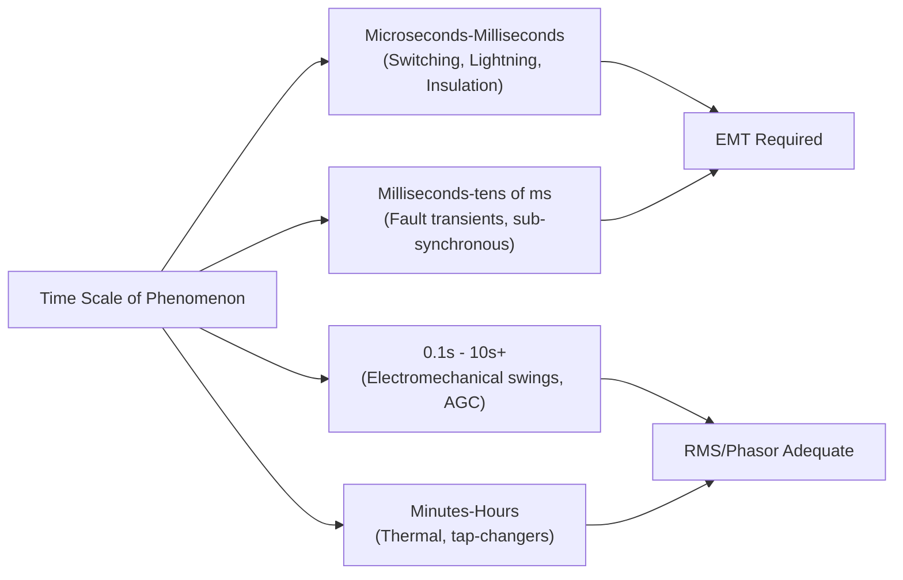
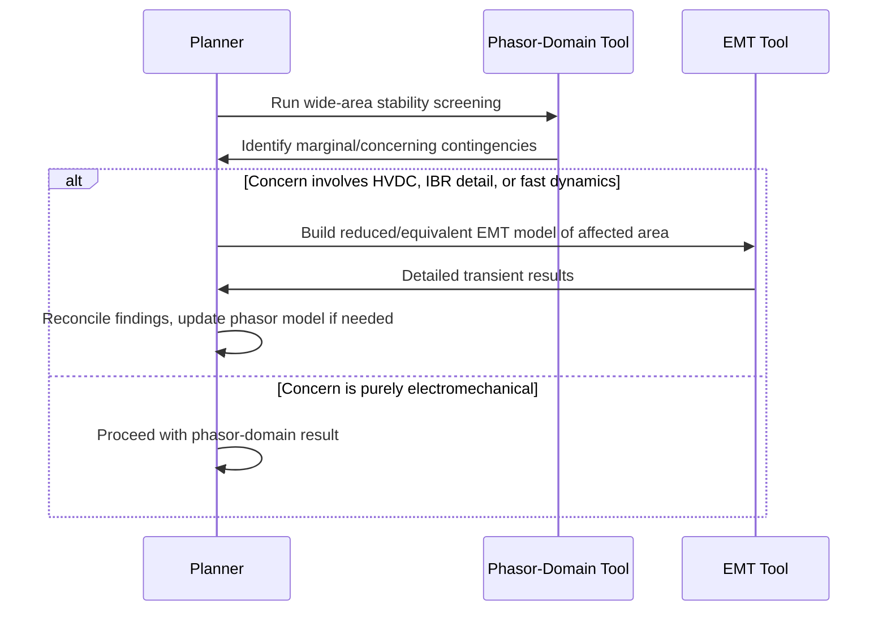

## Electromagnetic Transient versus RMS/Phasor-Domain Simulation

### Overview

Electromagnetic Transient (EMT) simulation and RMS/Phasor-domain simulation represent two fundamentally different mathematical approaches to modeling power system behavior over time. The choice between them determines what physical phenomena can be captured, how fast the simulation runs, and what scale of network can practically be studied. Understanding when each is appropriate—and their limitations—is foundational to power system dynamic analysis, particularly as inverter-based resources introduce dynamics that stress the assumptions underlying phasor-domain methods.

### Fundamental Conceptual Distinction

**Key Points**

- **RMS/Phasor-domain (also called "transient stability" or "electromechanical") simulation** represents voltages and currents as **slowly-varying phasors**—magnitude and angle at fundamental frequency—assuming the waveform remains sinusoidal and that transients within a single AC cycle are not of interest
- **EMT simulation** solves the full **instantaneous three-phase differential equations** of the network, capturing actual waveform shape, harmonics, and sub-cycle switching behavior
- The phasor assumption is a **mathematical simplification** that trades physical fidelity for enormous computational speedup, valid specifically for phenomena that evolve slowly relative to the 50/60 Hz fundamental period

$$v(t) = \sqrt{2}\,|V|\cos(\omega t + \theta) \quad \xrightarrow{\text{phasor domain}} \quad \bar{V} = |V|\angle\theta$$

In phasor domain, the network is solved algebraically at each time step using this fixed-frequency representation; in EMT domain, $v(t)$ itself is integrated numerically.

### Time-Scale Separation

### Mathematical Foundations

#### RMS/Phasor-Domain Approach

**Key Points**

- The network is represented by its **admittance matrix (Ybus)** solved algebraically at the fundamental frequency at each simulation time step (typically 1/4 to 1 cycle, e.g., 4–10 ms)
- Generator dynamics are modeled via **reduced-order differential-algebraic equations (DAEs)**—swing equation for rotor dynamics coupled with algebraic network equations
- The classical **swing equation** governs generator rotor angle dynamics:

$$\frac{2H}{\omega_s}\frac{d^2\delta}{dt^2} = P_m - P_e - D\frac{d\delta}{dt}$$

where $H$ is inertia constant, $\delta$ is rotor angle, $P_m$/$P_e$ are mechanical/electrical power, $\omega_s$ is synchronous speed, and $D$ is damping coefficient.

- Network transients (line/transformer electromagnetic dynamics) are assumed to **settle instantaneously** relative to the electromechanical time scale—a valid approximation because network time constants (milliseconds) are much shorter than rotor dynamics (seconds)

#### EMT Approach

**Key Points**

- Solves the full set of **nodal differential equations** representing inductances, capacitances, and resistances as discretized circuit elements, typically using the **trapezoidal integration rule** (Dommel's method, the basis of EMTP-family solvers)
- Time steps are typically **microseconds** (commonly 10–50 μs), dictated by the need to resolve switching events and the shortest relevant time constant in the network, not by accuracy requirements on the fundamental waveform alone
- Represents **three-phase unbalance, harmonics, and non-sinusoidal waveforms natively**, since no fundamental-frequency assumption is imposed
- Captures device-level switching behavior (e.g., IGBT/thyristor commutation in power electronics) essential for HVDC, FACTS, and inverter controller design

### Comparative Table

| Attribute | RMS/Phasor-Domain | EMT |
| --- | --- | --- |
| Time step | ~4–10 ms (fraction of a cycle) | ~10–50 μs |
| Waveform representation | Phasor (magnitude/angle) | Instantaneous three-phase |
| Typical simulated duration | Seconds to minutes | Milliseconds to seconds |
| Network size (practical) | Thousands of buses (full interconnection) | Tens to low hundreds of buses (localized) |
| Captures harmonics | No | Yes |
| Captures switching transients | No | Yes |
| Captures sub-synchronous resonance | Limited/no | Yes |
| Captures electromechanical swings | Yes (primary purpose) | Yes, but computationally expensive |
| Typical software | PSS/E, PowerFactory, TSAT, PowerWorld | PSCAD/EMTDC, EMTP-RV, ATP |
| Typical use case | Transmission planning, stability screening | HVDC/FACTS design, insulation coordination, inverter controller validation |

### Phenomena Requiring EMT Simulation

**Key Points**

- **Lightning and switching surge analysis**: insulation coordination studies require sub-microsecond resolution of traveling wave phenomena
- **HVDC converter station design**: thyristor/IGBT commutation, DC-side harmonics, and control system interaction with AC network impedance
- **FACTS device design** (STATCOM, SVC, series compensation): fast power electronic switching dynamics
- **Sub-synchronous resonance (SSR) and sub-synchronous control interaction (SSCI)**: torsional interactions between series-compensated lines and turbine-generator shafts, or between wind/solar inverter controls and network resonances, occurring at frequencies below the fundamental that phasor models cannot represent
- **Detailed inverter/converter control validation**: verifying grid-code ride-through behavior (see: Grid Interconnection Standards and Codes), fault current contribution shape, and control loop stability margins
- **Ferroresonance and transformer inrush**: nonlinear magnetic saturation effects requiring instantaneous flux representation

### Phenomena Adequately Served by RMS/Phasor-Domain Simulation

**Key Points**

- **Transmission planning power flow and N-1 contingency screening**
- **Electromechanical transient stability**: first-swing and multi-swing rotor angle stability following faults, generation/load trips
- **Automatic Generation Control (AGC) and frequency response** over seconds to minutes
- **Voltage stability studies**: long-term voltage collapse phenomena, tap-changer and load recovery dynamics over tens of seconds to minutes
- **Wide-area interconnection-scale studies**: full WECC, Eastern Interconnection, or ENTSO-E-scale models with thousands of buses, computationally infeasible in EMT domain at that scale

### The Growing Gray Zone: Inverter-Based Resources

**Key Points**

- As synchronous generation is displaced by **inverter-based resources (IBR)**—wind, solar, battery storage—the electromechanical assumptions underlying phasor-domain stability tools become less universally valid, since IBR control loops (current control, phase-locked loops, DC-link voltage regulation) operate on time scales of **milliseconds**, overlapping the boundary between "network transient" and "electromechanical" time scales
- This has driven development of **"average value" or "detailed" phasor-domain IBR models** that attempt to capture fast controller dynamics within the phasor-domain framework, with varying fidelity depending on model detail
- Documented grid disturbance events involving IBR (e.g., unexpected mass tripping or oscillatory behavior during faults) have highlighted cases where phasor-domain models failed to predict behavior later confirmed via EMT simulation or field measurement, motivating NERC and other reliability bodies to increasingly recommend or require **EMT-based studies for high-IBR-penetration interconnection requests** [Unverified — specific study requirement thresholds and current NERC/regional guidance should be verified against the applicable current standard, as this area has been actively evolving]
- **Grid-forming inverter** control schemes, an active area of standards development, introduce dynamics (virtual inertia, synthetic impedance behavior) that some argue require EMT validation even for phenomena traditionally considered "electromechanical," since the underlying physical mechanism (power electronics control loops rather than rotating machine physics) differs fundamentally from synchronous generator behavior

### Hybrid and Bridging Approaches

**Key Points**

- **EMT-to-phasor interfacing / hybrid simulation**: some tools allow a small EMT-represented subnetwork (e.g., an HVDC terminal or wind plant) to be embedded within a larger phasor-domain network, exchanging boundary conditions at each phasor time step—balancing detail where needed against computational tractability for the wider system
- **Dynamic phasors / shifted-frequency analysis**: an intermediate mathematical technique representing time-varying phasors (rather than fixed-frequency phasors) to capture some sub-cycle dynamics without full EMT computational cost [Unverified — this remains a more specialized/research-oriented technique with more limited commercial tool support compared to standard phasor or EMT methods]
- **Real-time simulation with hardware-in-the-loop (HIL)**: RTDS/OPAL-RT platforms run EMT-domain models in real time specifically to allow physical controllers/relays to be tested against realistic instantaneous waveforms, bridging simulation and physical validation

### Computational Cost Comparison

**Example**

For a representative comparison (illustrative, not benchmarked figures):

| Study | Network Size | Simulated Duration | Approach | Relative Computational Cost |
| --- | --- | --- | --- | --- |
| WECC-wide stability screening | ~20,000+ buses | 20 seconds | RMS/Phasor | Baseline (fast, minutes to run) |
| Single HVDC terminal design | ~50 buses | 0.5 seconds | EMT | Orders of magnitude higher per simulated second |
| Wind plant fault ride-through validation | ~200 buses | 2–5 seconds | EMT | High, often requiring reduced/equivalent networks |

[Inference] The multi-order-of-magnitude cost differential between EMT and phasor-domain simulation at comparable network scale is why engineering practice generally uses phasor-domain tools for wide-area screening and reserves EMT for targeted, localized investigation of specific equipment or phenomena flagged by that screening—rather than running EMT simulations across full interconnection-scale models as a matter of course.

### Practical Workflow Integration

### Common Misconceptions and Clarifications

**Key Points**

- EMT simulation is **not simply "more accurate"** in a universal sense—it is more physically complete for phenomena within its time-scale resolution, but running an EMT simulation for hours of simulated time to observe long-term voltage stability is impractical and unnecessary, since the phasor-domain approximation is not the limiting error source for that class of phenomena
- Phasor-domain tools are **not inherently invalidated** by increasing IBR penetration; rather, the **fidelity of the IBR models used within** the phasor-domain framework is the critical factor—poorly validated average-value models can produce misleading results regardless of solver architecture
- The terms "RMS simulation," "transient stability simulation," and "phasor-domain simulation" are frequently used interchangeably in industry practice, though "RMS" technically refers to the root-mean-square magnitude representation convention rather than the phasor concept itself

**Next Steps**

- Power System Simulation Software Landscape
- Transient Stability Analysis and Swing Equation Dynamics
- Sub-Synchronous Resonance and Control Interaction
- Inverter-Based Resource Modeling for Dynamic Studies
- HVDC Converter Station Design and Control
- Grid-Forming Inverter Control and System Strength