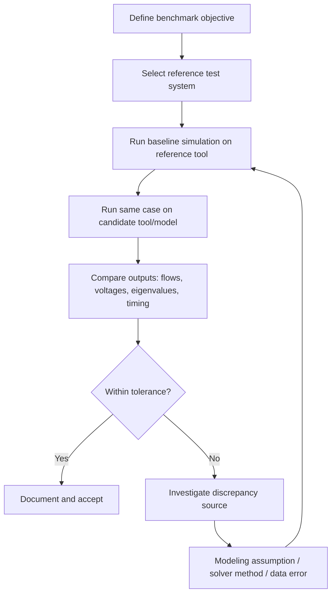

## Model Validation and Benchmarking Practices

### Overview

Model validation and benchmarking are the disciplined processes by which power system models — load flow, transient stability, electromagnetic transient (EMT), protection coordination, and dynamic load models — are confirmed to represent real grid behavior within acceptable tolerances. Validation compares model output against field measurements or higher-fidelity reference results; benchmarking compares model performance against standardized test systems or industry-accepted reference cases. Together they underpin regulatory compliance (e.g., NERC MOD standards in North America), planning credibility, and operational reliability.

### Why Validation Matters

**Key Points**

- Unvalidated models can produce planning studies that understate or overstate transfer capability, leading to either unnecessary curtailment or undetected reliability risk.
- Post-disturbance events (e.g., the 2016 Blue Cut Fire disturbance in California) have historically revealed that simulated dynamic response diverged materially from actual generator and inverter behavior, prompting regulatory model-validation mandates.
- Validation is not a one-time activity; models drift from reality as equipment ages, control firmware updates, plant configurations change, or new inverter-based resources are added.

### Types of Model Validation

#### Steady-State (Load Flow) Validation

- **State estimator cross-validation**: Compare model-predicted bus voltages, angles, and flows against SCADA/state estimator snapshots for known operating points.
- **Metrics**: Voltage magnitude error typically targeted within 0.5–1.0% and angle error within a few degrees, though thresholds vary by utility/RTO practice. [Inference — exact tolerance bands are utility- and standard-specific and not universally fixed]
- **Topology validation**: Confirm breaker/switch status, transformer tap positions, and line ratings match as-built records.

#### Dynamic (Transient Stability) Validation

- Governed in North America primarily by **NERC MOD-026** (generator excitation control system or plant volt/var control function models) and **MOD-027** (generator turbine/governor and load control or active power/frequency control function models).
- Requires either staged testing (injecting controlled disturbances) or disturbance-based validation (using actual system events as the stimulus) and comparing simulated response to recorded PMU/DFR data.
- Validation criteria commonly assess: initial swing magnitude, damping ratio, settling time, and steady-state deviation.

#### Electromagnetic Transient (EMT) Validation

- Used for inverter-based resources (IBR), HVDC, FACTS devices, and sub-synchronous phenomena.
- Vendor-supplied EMT models (often black-box or encrypted) are validated against manufacturer type-test data and, where possible, site commissioning tests.
- Growing importance due to IBR proliferation; NERC and WECC have issued specific IBR modeling and validation guidance following inverter-related disturbances.

#### Protection Coordination Validation

- Relay settings and coordination models validated against actual fault records, time-current curve verification, and periodic relay testing (secondary injection, end-to-end testing).

### Benchmarking Practices

**Key Points**

- Benchmarking uses standardized test systems to compare solver performance, algorithm accuracy, or tool-to-tool consistency — distinct from validating against physical reality.
- Common benchmark systems: IEEE 9-bus, IEEE 14-bus, IEEE 30-bus, IEEE 39-bus (New England), IEEE 118-bus, and the Reduced WECC 240-bus system.
- Benchmarking is used when procuring new simulation software, verifying model translation between platforms (e.g., PSS/E to PowerFactory), or validating a new solver algorithm against an established one.

#### Benchmark Workflow

### Validation Metrics and Statistical Measures

For time-domain dynamic response comparison between simulated and measured signals:

$$\text{RMSE} = \sqrt{\frac{1}{N}\sum_{i=1}^{N}(y_{sim,i} - y_{meas,i})^2}$$

Where $y_{sim,i}$ is the simulated value and $y_{meas,i}$ is the measured value at sample $i$, over $N$ samples.

A normalized performance index, adapted from PRC/MOD validation practice, is often expressed as:

$$VI = 1 - \frac{\sum |y_{sim} - y_{meas}|}{\sum |y_{meas} - \bar{y}_{meas}|}$$

Where $VI$ closer to 1 indicates better fit. [Inference — specific validation index formulations vary by standard/vendor; this is a representative form, not a single universally codified equation]

Other common metrics:

- **Frequency nadir error** (Hz) — comparing simulated vs. measured post-contingency frequency minimum.
- **Damping ratio deviation** — from modal (Prony or eigenvalue) analysis of oscillatory response.
- **Peak overshoot and settling time error** for voltage/power swing curves.

### Example: Governor Model Validation Workflow

1. Select a recent disturbance event with a measurable frequency deviation, captured via PMU or DFR at the generator terminal.
2. Extract the actual system frequency trace and generator MW output from the event record.
3. Reproduce the same disturbance (loss of generation/load magnitude and location) in the stability simulation using the plant's registered governor/turbine model (e.g., GGOV1, IEEEG1).
4. Overlay simulated vs. actual MW/frequency response.
5. Compute RMSE and visually inspect for phase lag, magnitude mismatch, or missing nonlinearities (e.g., deadbands, rate limits).
6. If deviation exceeds threshold, iteratively tune parameters (droop, time constants) within physically justified bounds — not arbitrary curve-fitting — or flag for on-site staged testing.

**Output**

A validated governor model that reproduces the recorded frequency/power trajectory within the utility's or NERC's specified tolerance band, with a documented comparison plot and parameter set submitted for MOD-027 compliance.

### Model-to-Model Consistency Checks

- **Cross-platform translation validation**: When migrating a case between tools (PSS/E ↔ PSLF ↔ PowerFactory ↔ PowerWorld), re-run identical contingencies and confirm flows/voltages match within numerical tolerance (typically <0.1% for steady-state).
- **Version regression testing**: After a simulation software upgrade, re-run a fixed benchmark suite to detect solver or default-parameter changes that silently alter results.

### Illustration: Validation Feedback Loop (svg_diagram)

<svg xmlns="http://www.w3.org/2000/svg" viewBox="0 0 760 360">
\<style\>
.box{fill:#eef3fb;stroke:#2c4a72;stroke-width:2;}
.lbl{font-family:sans-serif;font-size:14px;fill:#1a2a3a;}
.arrow{stroke:#2c4a72;stroke-width:2;marker-end:url(#arrow);fill:none;}
.title{font-family:sans-serif;font-size:16px;font-weight:bold;fill:#1a2a3a;}
\</style\>
<text x="20" y="28" class="title">Model Validation Feedback Loop (svg_diagram)</text>
<rect x="30" y="60" width="160" height="60" rx="8" class="box" />
<text x="45" y="95" class="lbl">Field Measurement</text>
<rect x="300" y="60" width="160" height="60" rx="8" class="box" />
<text x="320" y="95" class="lbl">Model Output</text>
<rect x="570" y="60" width="160" height="60" rx="8" class="box" />
<text x="595" y="85" class="lbl">Compare /</text>
<text x="605" y="103" class="lbl">Compute Error</text>
<path d="M190,90 L300,90" class="arrow" />
<path d="M460,90 L570,90" class="arrow" />
<rect x="300" y="220" width="160" height="60" rx="8" class="box" />
<text x="320" y="245" class="lbl">Adjust</text>
<text x="320" y="263" class="lbl">Parameters</text>
<path d="M650,120 L650,250 L460,250" class="arrow" />
<path d="M300,250 L190,250 L190,120" class="arrow" />
<rect x="30" y="220" width="160" height="60" rx="8" class="box" />
<text x="55" y="245" class="lbl">Re-run</text>
<text x="55" y="263" class="lbl">Simulation</text>
<path d="M190,250 L300,250" class="arrow" transform="translate(0,-100) scale(0,0)" opacity="0" />
<path d="M110,220 L110,120" class="arrow" />

<text x="500" y="330" class="lbl">Loop continues until error within tolerance</text>

</svg>

### Regulatory and Industry Frameworks

- **NERC MOD-025**: Verification of generator gross and net real/reactive power capability.
- **NERC MOD-026 / MOD-027**: Verification of generator excitation and turbine/governor dynamic models, requiring periodic (typically 5-year cycle) re-validation.
- **NERC MOD-032**: Data reporting requirements for planning models submitted to Planning Coordinators/Transmission Planners.
- **WECC/ERCOT IBR modeling guides**: Supplemental requirements for inverter-based resource model validation given documented discrepancies between vendor models and field response.
- **IEEE/CIGRE benchmark task forces**: Publish standardized test systems and validation methodologies (e.g., CIGRE HVDC benchmark models, IEEE Task Force on Load Representation for Dynamic Performance).

### Common Sources of Model-Reality Mismatch

- **Load model inaccuracy**: Static ZIP load approximations failing to capture motor stalling, air-conditioning cycling, or distributed PV behind-the-meter effects.
- **Protection/control model simplification**: Vendor models omitting proprietary ride-through logic or anti-islanding behavior.
- **Parameter drift**: As-commissioned settings not updated in the model database after field retuning.
- **Numerical integration method mismatch**: Different solvers (implicit vs. explicit, fixed vs. variable time-step) producing divergent transient results even from identical model equations. [Note: behavior may vary by solver implementation and version]
- **Missing network detail**: Aggregated/equivalenced portions of the network masking local voltage or oscillatory behavior.

### Best Practices

- Maintain a **model validation log** documenting date, event/test used, metrics achieved, and responsible engineer — required for NERC audit trail.
- Prioritize validation of models with high system impact (large generators, critical interfaces) before lower-impact assets.
- Use **staged testing** (controlled step changes in setpoints) when disturbance-based data is unavailable or insufficiently rich in dynamic content.
- Re-validate after any firmware update, control system replacement, or significant plant reconfiguration.
- Automate benchmark regression suites in CI-style pipelines so that software/tool updates are checked against a fixed reference set before production use. [Inference — this reflects emerging best practice in utility engineering pipelines; adoption maturity varies by organization]

**Related Topics**

- NERC MOD Standards Suite (MOD-025, MOD-026, MOD-027, MOD-032)
- Dynamic Load Modeling (ZIP, CMPLDW, Motor D)
- Inverter-Based Resource (IBR) Dynamic Modeling and Ride-Through
- PMU-Based Disturbance Analysis and Model Validation
- IEEE and CIGRE Standard Test Systems
- Sub-Synchronous Resonance and EMT Model Validation
- Simulation Tool Cross-Platform Case Translation (PSS/E, PowerFactory, PSLF)