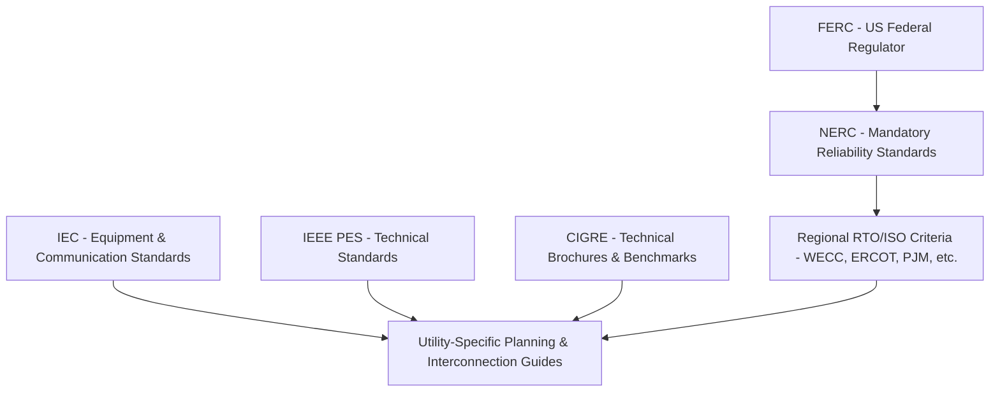

## Standards Bodies and Codes of Practice

### Overview

Power system engineering operates within a layered framework of international, national, and regional standards bodies whose output governs equipment design, interconnection requirements, modeling obligations, reliability performance, and professional conduct. Understanding this landscape is essential for any engineer producing models, studies, or designs intended for regulatory submission, utility approval, or cross-border interoperability.

### International Standards Bodies

#### IEC (International Electrotechnical Commission)

- Publishes globally referenced standards for equipment design, testing, and terminology: e.g., **IEC 60909** (short-circuit current calculation), **IEC 61850** (substation automation communication), **IEC 62271** (high-voltage switchgear), **IEC 61400** (wind turbine systems).
- Organized into Technical Committees (TCs); e.g., TC 8 (System aspects of electrical energy supply), TC 57 (Power system management and associated information exchange).
- IEC standards are voluntary internationally but are frequently adopted or referenced directly into national regulation (e.g., in the EU via CENELEC harmonization).

#### CIGRÉ (International Council on Large Electric Systems)

- Not a formal standards-issuing body but a highly influential technical association producing **Technical Brochures**, working group reports, and benchmark models (e.g., CIGRÉ HVDC benchmark, CIGRÉ low-voltage distribution network benchmarks) widely used as de facto references in simulation and planning studies.
- Structured into Study Committees (e.g., SC B4 – DC systems and power electronics, SC C4 – System technical performance).

#### IEEE (Institute of Electrical and Electronics Engineers)

- Primarily US-rooted but globally adopted; **IEEE Power & Energy Society (PES)** issues standards central to power system engineering: **IEEE 519** (harmonic control), **IEEE 1547** (interconnection of distributed energy resources), **IEEE C37 series** (protection relaying), **IEEE 1159** (power quality monitoring).
- IEEE standards are developed through consensus-based working groups and are often incorporated by reference into national codes and utility interconnection requirements.

### North American Standards and Regulatory Bodies

#### NERC (North American Electric Reliability Corporation)

- The Electric Reliability Organization (ERO) for North America, certified by FERC (Federal Energy Regulatory Commission) in the U.S. and by applicable authorities in Canada, with a compliance-monitoring role also extending into parts of Mexico's grid interconnected with the U.S.
- Issues mandatory, enforceable **Reliability Standards** organized by category prefix: **PRC** (Protection and Control), **MOD** (Modeling), **TOP** (Transmission Operations), **IRO** (Interconnection Reliability Operations), **CIP** (Critical Infrastructure Protection/cybersecurity), **FAC** (Facilities Design, Connections, and Maintenance).
- Non-compliance carries financial penalties; NERC standards are the most operationally binding framework for U.S./Canadian bulk power system engineers.

#### Regional Reliability and Market Entities

- **WECC** (Western Electricity Coordinating Council), **ERCOT** (Electric Reliability Council of Texas), **PJM**, **MISO**, **ISO-NE**, **NYISO**, **SPP** — each publishes supplemental planning criteria, modeling data requirements, and interconnection procedures layered on top of NERC baseline standards.
- ERCOT operates largely outside FERC jurisdiction as an intrastate grid, giving it distinct standards-setting autonomy within Texas.

#### FERC (Federal Energy Regulatory Commission)

- U.S. federal regulator overseeing wholesale electricity markets, transmission tariffs, and approving NERC Reliability Standards; issues **Orders** (e.g., Order 2222 on distributed energy resource market participation, Order 841 on energy storage) that reshape technical and modeling requirements.

### Codes of Practice — Design and Safety

- **National Electrical Safety Code (NESC, IEEE C2)**: Governs overhead/underground line clearances, grounding, and worker safety practices in the U.S.
- **National Electrical Code (NEC, NFPA 70)**: Governs premises wiring, not bulk transmission, but relevant at distribution/interconnection boundary.
- **IEC 61936 / EN 50522**: European equivalents for substation and earthing design.
- **Grid Codes** (national/regional): e.g., **ENTSO-E Network Codes** in Europe, **UK Grid Code**, **AEMO National Electricity Rules** in Australia — define technical requirements for connecting generation and demand facilities to the transmission network, including fault ride-through, frequency response, and reactive power capability.

### Standards Body Relationship Map

### Professional Codes of Practice

**Key Points**

- **PE (Professional Engineer) licensure** in the U.S./Canada, governed by state/provincial boards under model rules from **NCEES** (National Council of Examiners for Engineering and Surveying), imposes a legal and ethical duty of competence, public safety priority, and honest representation of qualifications.
- **IEEE Code of Ethics** and national equivalents (e.g., Engineers Canada's code) obligate engineers to hold paramount the safety, health, and welfare of the public — directly relevant when engineers sign off on studies affecting grid reliability.
- Stamped/sealed engineering drawings and study reports carry personal legal liability, distinct from organizational standards compliance.

### Example: Standards Applicable to a Wind Farm Interconnection Study

| Standard/Code | Applicability |
| --- | --- |
| IEEE 1547 | Distributed/inverter-based resource interconnection technical requirements |
| NERC MOD-026/027 (or IBR-specific guidance) | Dynamic model submission and validation |
| IEC 61400-21 | Wind turbine power quality measurement methodology |
| Regional ISO/RTO interconnection procedure (e.g., PJM Manual 14) | Study process, data submission format, timelines |
| Utility grid code / interconnection agreement | Site-specific technical performance requirements |

**Output**

A compliant interconnection study package cites the applicable NERC standard for dynamic model format, IEEE/IEC standards for equipment performance characterization, and the regional RTO's manual for process and submission requirements — with the engineer of record accountable under their jurisdiction's PE licensure code.

### Illustration: Standards Hierarchy for a U.S. Grid-Connected Project (svg_diagram)

<svg xmlns="http://www.w3.org/2000/svg" viewBox="0 0 700 380">
\<style\>
.box{fill:#eef3fb;stroke:#2c4a72;stroke-width:2;}
.lbl{font-family:sans-serif;font-size:13px;fill:#1a2a3a;}
.title{font-family:sans-serif;font-size:16px;font-weight:bold;fill:#1a2a3a;}
.arrow{stroke:#2c4a72;stroke-width:2;marker-end:url(#arrow2);fill:none;}
\</style\>
<text x="20" y="28" class="title">Standards Hierarchy, U.S. Example (svg_diagram)</text>
<rect x="250" y="50" width="200" height="50" rx="8" class="box" />
<text x="290" y="80" class="lbl">FERC (Federal)</text>
<rect x="250" y="130" width="200" height="50" rx="8" class="box" />
<text x="300" y="160" class="lbl">NERC (ERO)</text>
<rect x="80" y="210" width="220" height="50" rx="8" class="box" />
<text x="100" y="240" class="lbl">Regional Entity / RTO-ISO</text>
<rect x="400" y="210" width="220" height="50" rx="8" class="box" />
<text x="430" y="240" class="lbl">IEEE / IEC Standards</text>
<rect x="230" y="300" width="240" height="50" rx="8" class="box" />
<text x="250" y="330" class="lbl">Utility Interconnection Requirements</text>
<path d="M350,100 L350,130" class="arrow" />
<path d="M300,180 L190,210" class="arrow" />
<path d="M400,180 L510,210" class="arrow" />
<path d="M190,260 L320,300" class="arrow" />
<path d="M510,260 L380,300" class="arrow" />
</svg>

**Related Topics**

- NERC Reliability Standards Deep Dive (PRC, MOD, TOP, FAC series)
- IEEE 1547 and Distributed Energy Resource Interconnection
- Grid Codes: ENTSO-E, UK Grid Code, AEMO NER Comparison
- Professional Engineering Licensure and Ethical Obligations in Power Engineering
- CIGRÉ Benchmark Models and Technical Brochures
- FERC Order 2222 and Market Participation Rules for DERs
- Critical Infrastructure Protection (NERC CIP) Standards