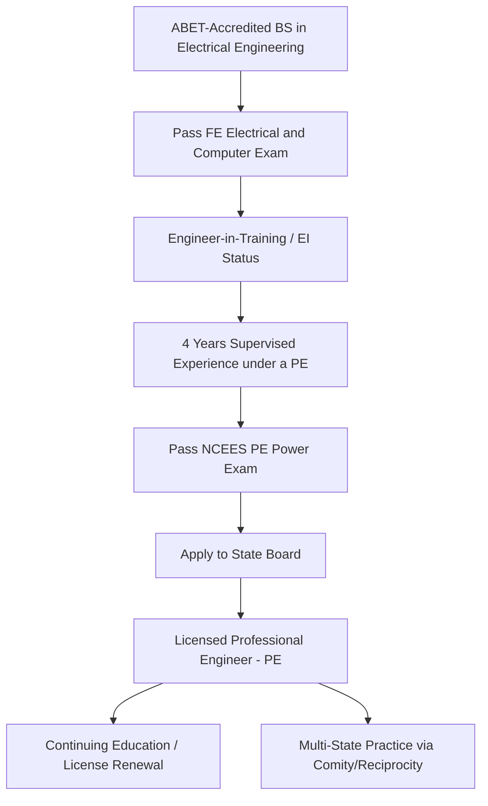

## Professional Licensure Pathways for Power Engineers

### Overview

Professional licensure establishes the legal authority for an engineer to practice independently, offer services to the public, and stamp/seal engineering documents — including power system studies, protection settings, and interconnection designs that carry public safety and grid reliability implications. Pathways differ by jurisdiction but share a common structure: accredited education, supervised experience, examination, and ongoing ethical/competency obligations.

### United States Pathway (PE Licensure)

#### Core Stages

1. **Education**: Bachelor's degree in electrical engineering (or related) from an **ABET**-accredited program (Accreditation Board for Engineering and Technology).
2. **Fundamentals of Engineering (FE) Exam**: Typically taken near graduation; the **FE Electrical and Computer** exam covers circuits, power systems basics, signal processing, and controls. Passing confers **Engineer-in-Training (EIT)** or **Engineer Intern (EI)** status.
3. **Qualifying Experience**: Generally **4 years** of progressive engineering experience under the supervision of a licensed PE, though some states allow credit for graduate degrees to reduce this period.
4. **Principles and Practice of Engineering (PE) Exam**: The **PE Electrical and Computer — Power** exam, administered by **NCEES** (National Council of Examiners for Engineering and Surveying), covers generation, transmission and distribution, protection, and power system analysis at a professional practice level.
5. **State Licensure**: Each U.S. state Board of Engineering issues the actual license; NCEES exams are standardized nationally, but licensing authority remains state-based, requiring separate application (and often fees/renewal) per state, with **reciprocity/comity** provisions easing multi-state practice.

#### PE Power Exam Content Areas (NCEES Blueprint, Representative)

| Area | Approximate Weight |
| --- | --- |
| General Power Engineering (analysis techniques, codes/standards) | ~15% |
| Circuit Analysis (Power) | ~12% |
| Rotating Machines and Electromagnetic Devices | ~13% |
| Transmission and Distribution | ~18% |
| Protection | ~14% |
| Power System Analysis | ~19% |
| Engineering Economics | ~9% |

*(Percentages are representative of NCEES's published PE Power exam specification; exact weightings are periodically revised by NCEES.)* [Unverified — candidates should confirm current weightings directly against the live NCEES exam specification before exam preparation]

### Canadian Pathway (P.Eng.)

- Governed by **Engineers Canada** at the national coordination level, with actual licensure issued by 12 provincial/territorial regulators (e.g., **PEO** – Professional Engineers Ontario, **APEGA** – Alberta).
- Pathway: accredited degree (CEAB-accredited) → National Professional Practice Examination (NPPE, covering ethics and law) → typically **4 years** of supervised engineering experience → provincial licensure as **P.Eng.**
- No standardized technical licensing exam equivalent to the U.S. PE Power exam in most provinces; technical competency is assessed via experience record review rather than a single high-stakes exam. [Inference — practice can vary somewhat by province; some provinces have supplementary technical exam requirements for certain pathways]

### Licensure Pathway Flow (U.S. Example)

### Why Licensure Matters for Power System Engineers Specifically

**Key Points**

- Many jurisdictions legally require a PE stamp on interconnection studies, protection coordination reports, and transmission line design submitted to utilities or regulators.
- NERC compliance documentation and FERC-regulated filings often expect (or the utility internally requires) that responsible engineers hold active licensure, tying professional accountability directly to grid reliability standards discussed in Standards Bodies and Codes of Practice.
- The PE title also carries legal liability: a licensed engineer personally attests to the technical adequacy of stamped work, distinct from organizational or corporate liability.
- Not all power engineering roles require a PE — many utility and consulting staff engineers work under a licensed PE's supervision (particularly in industry, versus consulting, where the "industrial exemption" in many U.S. states allows engineers employed directly by a utility/company to practice without individual licensure for internal work products).

### Example: Typical Career Timeline for a U.S. Transmission Planning Engineer

1. **Year 0**: Graduate with ABET-accredited BSEE; pass FE Electrical and Computer exam before or shortly after graduation.
2. **Years 1–4**: Work as an EIT/staff engineer under a licensed PE, performing load flow and contingency studies, gaining documented progressive responsibility.
3. **Year 4**: Sit for and pass the NCEES PE Power exam.
4. **Year 4–5**: Apply for state licensure; begin independently stamping planning study reports.
5. **Ongoing**: Maintain license via state-mandated **Continuing Education (CE/PDH)** requirements — commonly on the order of 15–30 professional development hours per renewal cycle, though exact requirements vary significantly by state. [Unverified — CE requirements differ by state; confirm with the specific state board]

**Output**

A licensed PE credential enabling the engineer to independently stamp transmission planning and interconnection study reports, sign off on NERC MOD-032 data submissions in a professional capacity, and expand into consulting or expert-witness work.

### International Variants

- **United Kingdom**: **Chartered Engineer (CEng)** status via the **Engineering Council**, administered through licensed bodies such as the **IET** (Institution of Engineering and Technology); requires accredited MEng/BEng plus documented competence against the UK-SPEC framework, reviewed via professional review interview rather than a written technical exam.
- **Australia**: **Chartered Professional Engineer (CPEng)** via **Engineers Australia**, assessed through competency-based peer review; registration is compulsory in some states (e.g., Queensland, Victoria) under Professional Engineers Registration Acts.
- **European Union**: Licensure is less centralized; professional titles and practice rights vary by member state, though the **FEANI EUR ING** title provides a cross-recognized (though not universally legally binding) credential.

### Illustration: Comparative Licensure Structures (svg_diagram)

<svg xmlns="http://www.w3.org/2000/svg" viewBox="0 0 760 320">
\<style\>
.box{fill:#eef3fb;stroke:#2c4a72;stroke-width:2;}
.lbl{font-family:sans-serif;font-size:12px;fill:#1a2a3a;}
.title{font-family:sans-serif;font-size:16px;font-weight:bold;fill:#1a2a3a;}
.hdr{font-family:sans-serif;font-size:13px;font-weight:bold;fill:#1a2a3a;}
\</style\>
<text x="20" y="26" class="title">Licensure Pathway Comparison (svg_diagram)</text>
<rect x="20" y="50" width="220" height="230" rx="8" class="box" />
<text x="30" y="72" class="hdr">United States (PE)</text>
<text x="30" y="96" class="lbl">ABET degree</text>
<text x="30" y="116" class="lbl">FE Exam</text>
<text x="30" y="136" class="lbl">4 yrs experience</text>
<text x="30" y="156" class="lbl">NCEES PE Power exam</text>
<text x="30" y="176" class="lbl">State board licensure</text>
<rect x="270" y="50" width="220" height="230" rx="8" class="box" />
<text x="280" y="72" class="hdr">Canada (P.Eng.)</text>
<text x="280" y="96" class="lbl">CEAB degree</text>
<text x="280" y="116" class="lbl">NPPE (ethics/law)</text>
<text x="280" y="136" class="lbl">4 yrs experience</text>
<text x="280" y="156" class="lbl">Experience record review</text>
<text x="280" y="176" class="lbl">Provincial licensure</text>
<rect x="520" y="50" width="220" height="230" rx="8" class="box" />
<text x="530" y="72" class="hdr">UK (CEng)</text>
<text x="530" y="96" class="lbl">Accredited MEng/BEng</text>
<text x="530" y="116" class="lbl">UK-SPEC competence</text>
<text x="530" y="136" class="lbl">Professional review</text>
<text x="530" y="156" class="lbl">Institution (e.g. IET)</text>
<text x="530" y="176" class="lbl">Engineering Council reg.</text>
</svg>

### Common Pitfalls and Practical Notes

- Confusing **industrial exemption** eligibility (working for a utility on internal projects) with full licensure requirements — engineers moving into consulting or multi-utility work often discover they need a PE they didn't previously require.
- Underestimating documentation requirements for the experience-verification stage; most boards require detailed, PE-signed reference letters describing specific engineering responsibility, not just employment duration.
- Letting continuing education lapse, resulting in license suspension — particularly relevant for engineers who move between states/provinces or take extended non-practicing roles.

**Related Topics**

- NCEES PE Power Exam Preparation and Reference Materials
- Industrial Exemption vs. Consulting Practice Requirements
- Continuing Education and License Renewal Requirements by State
- Engineering Ethics and Codes of Conduct in Power System Practice
- Stamped Document Liability and Errors & Omissions (E&O) Insurance
- Multi-Jurisdictional Practice via Reciprocity/Comity
- Chartered Engineer (CEng) and CPEng Competency Frameworks

メモリを更新しましたpower-system-modeling-professional-practice-learning-series.md