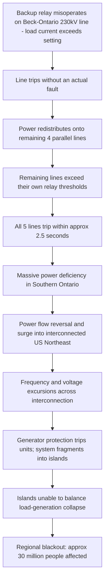

## Case Study: 1965 Northeast Blackout

### Overview

The Northeast Blackout of November 9, 1965 affected roughly 30 million people across Ontario, Canada and eight U.S. Northeastern states, leaving much of the region without power for up to 13 hours. It stands as the foundational event that catalyzed formal reliability coordination in North America, directly leading to the creation of the **National Electric Reliability Council (NERC)**, predecessor to today's NERC. The event remains a canonical teaching case for relay coordination, cascading failure dynamics, and the limits of protection system design margins.

### Sequence of Events

#### Initiating Fault

- At approximately 5:16 PM EST, a backup protective relay on one of five 230 kV transmission lines carrying power from the **Sir Adam Beck No. 2 generating station** (Niagara Falls, Ontario) to Southern Ontario tripped the line.
- The relay had been set with a **conservative margin too low** relative to actual system loading conditions during the pre-existing high power transfer on the corridor; a backup (Zone 3-type) relay operated on load current alone, without an actual fault present, because the current exceeded its set pickup threshold.

#### Cascading Overload

- With one line tripped, the power previously flowing on it (approximately 1500–1700 MW range across the corridor) redistributed instantaneously onto the remaining four parallel 230 kV lines, pushing them beyond their relay pickup thresholds.
- Within roughly **2.5 seconds**, all five lines from the Beck station cascaded open due to similarly set backup relays operating on the resulting overload.
- The abrupt loss of this major import path forced a sudden, massive power deficiency in Southern Ontario, and power that had been flowing north into Ontario from the U.S. reversed and surged northward, further loading interconnections and triggering cascading trips across Ontario Hydro's system and into the interconnected U.S. Northeast grid.

#### Grid Separation and Collapse

- The sudden, large power swings caused frequency and voltage excursions that tripped additional lines and generators across New York, New England, and adjoining systems in a rapid cascade.
- Automatic generator protection (particularly under-frequency and loss-of-synchronism protection) tripped numerous generating units as the interconnected system fragmented into isolated islands, most of which could not balance load and generation and collapsed entirely.
- New York City lost power within about 13 minutes of the initiating event; total cascade-to-blackout time across the full affected region was on that same short order. [Inference — precise minute-by-minute timing varies slightly across historical accounts; the core sequence (fault to regional blackout) is well documented as occurring within roughly 13 minutes]

### Root Cause Analysis

**Key Points**

- **Primary technical cause**: A backup relay (intended as protection of last resort) operated on legitimate but high load current, misinterpreting it as a fault condition, because its setting margin did not adequately account for realistic peak power-transfer scenarios on the corridor.
- **Systemic cause**: Lack of coordinated system-wide reliability planning and communication between the many separately operated utilities comprising the Northeast interconnection; no formal mechanism existed for utilities to jointly plan protection settings, loading limits, or emergency procedures across their interconnected boundary.
- **Contributing factor**: Absence of adequate real-time system monitoring and automatic controls to arrest a cascade once initiated — operators had limited visibility and no automated remedial action schemes (RAS) to islanding or load-shed proactively.
- **Contributing factor**: High pre-disturbance power transfer on the Beck corridor left minimal operating margin, meaning the loss of a single line pushed remaining parallel paths close to or beyond their protective thresholds almost immediately.

### Cascading Failure Sequence

### Technical Lessons and Engineering Response

#### Relay Coordination and Margin Practice

- The event exposed the danger of backup relays (particularly distance/impedance-based Zone 3 protection) operating on heavy load flow rather than actual faults — a phenomenon now explicitly addressed in modern relay coordination studies via **load-encroachment blinders** and more conservative apparent-impedance margin criteria.
- Reinforced the principle that protection settings must be periodically re-evaluated against evolving system loading conditions, not set once and left static — a precursor concept to today's NERC PRC standards on relay loadability (e.g., **PRC-023**, requiring transmission relay settings to be set above defined system loadability thresholds).

#### Formation of NERC

- In direct response, U.S. and Canadian utilities formed the **National Electric Reliability Council (NERC)** in 1968, establishing voluntary regional reliability councils to coordinate planning, share operating data, and develop common reliability criteria across interconnected systems.
- This voluntary structure persisted until the **2003 Northeast Blackout** exposed its enforcement limitations, ultimately leading to the **Energy Policy Act of 2005**, which empowered FERC to designate a mandatory, enforceable Electric Reliability Organization — resulting in the current **NERC** with binding Reliability Standards (see Standards Bodies and Codes of Practice).

### Comparative Note: 1965 vs. 2003 Northeast Blackouts

| Aspect | 1965 Blackout | 2003 Blackout |
| --- | --- | --- |
| Initiating cause | Backup relay misoperation on load current | Sagging line contacting vegetation (tree contact) plus software/alarm failure |
| Root systemic issue | No coordinated inter-utility reliability planning | Voluntary standards insufficiently enforced; inadequate situational awareness tools |
| Regulatory response | Formation of NERC (voluntary) | Energy Policy Act 2005; NERC becomes mandatory ERO with FERC oversight |
| Affected population | ~30 million | ~50 million |

### Example: Applying the Lesson to Modern Relay Loadability Studies

1. For a given 230 kV (or other) transmission line, determine maximum credible emergency loading (including N-1 contingency redistribution, as occurred at Beck in 1965).
2. Verify that all backup (Zone 2/Zone 3) distance relay impedance settings maintain adequate margin above this maximum loadability, consistent with NERC PRC-023 loadability criteria.
3. Apply load-encroachment logic (blinders in the R-X impedance plane) to prevent relay operation purely on heavy load current absent an actual fault signature.
4. Cross-check against N-1-1 (sequential contingency) scenarios to ensure no single additional line loss can replicate a 1965-style overload cascade.

**Output**

A relay coordination study confirming that backup protection margins remain above realistic post-contingency loading across the full range of credible system conditions, directly addressing the failure mode that initiated the 1965 event.

### Illustration: Beck Station Corridor Overload Timeline (svg_diagram)

<svg xmlns="http://www.w3.org/2000/svg" viewBox="0 0 760 320">
\<style\>
.box{fill:#eef3fb;stroke:#2c4a72;stroke-width:2;}
.lbl{font-family:sans-serif;font-size:12px;fill:#1a2a3a;}
.title{font-family:sans-serif;font-size:16px;font-weight:bold;fill:#1a2a3a;}
.arrow{stroke:#b3261e;stroke-width:2;marker-end:url(#arrowr);fill:none;}
\</style\>
<text x="20" y="26" class="title">1965 Blackout Overload Timeline (svg_diagram)</text>
<rect x="20" y="60" width="150" height="60" rx="8" class="box" />
<text x="30" y="85" class="lbl">t=0s</text>
<text x="30" y="103" class="lbl">Line 1 trips (relay)</text>
<rect x="210" y="60" width="150" height="60" rx="8" class="box" />
<text x="220" y="85" class="lbl">t~0-1s</text>
<text x="220" y="103" class="lbl">Lines 2-5 overload</text>
<rect x="400" y="60" width="150" height="60" rx="8" class="box" />
<text x="410" y="85" class="lbl">t~2.5s</text>
<text x="410" y="103" class="lbl">All 5 lines open</text>
<rect x="590" y="60" width="150" height="60" rx="8" class="box" />
<text x="600" y="85" class="lbl">t~seconds</text>
<text x="600" y="103" class="lbl">Power surge reversal</text>
<path d="M170,90 L210,90" class="arrow" />
<path d="M360,90 L400,90" class="arrow" />
<path d="M550,90 L590,90" class="arrow" />
<rect x="20" y="200" width="330" height="60" rx="8" class="box" />
<text x="30" y="225" class="lbl">t~minutes</text>
<text x="30" y="243" class="lbl">Cascading trips across NE US grid</text>
<rect x="400" y="200" width="330" height="60" rx="8" class="box" />
<text x="410" y="225" class="lbl">t~13 min</text>
<text x="410" y="243" class="lbl">Regional blackout, ~30 million affected</text>
<path d="M665,120 L185,200" class="arrow" />
<path d="M350,230 L400,230" class="arrow" />
</svg>

### Enduring Significance

- Frequently cited as the origin point of North American bulk power reliability governance; nearly every subsequent major blackout (1977 NYC, 1996 WSCC, 2003 Northeast) is analyzed against the institutional lessons first surfaced in 1965.
- Illustrates a recurring theme in power system engineering: individually "correct" local protection decisions (a relay operating exactly as set) can produce a systemically catastrophic outcome when settings are not coordinated against realistic system-wide operating conditions.

**Related Topics**

- Case Study: 2003 Northeast Blackout
- NERC PRC-023: Transmission Relay Loadability
- Cascading Failure Analysis and Remedial Action Schemes (RAS)
- Zone 3 Distance Relay Misoperation and Load Encroachment
- History and Formation of NERC as Mandatory ERO
- N-1 and N-1-1 Contingency Analysis in Transmission Planning
- Under-Frequency Load Shedding (UFLS) Scheme Design