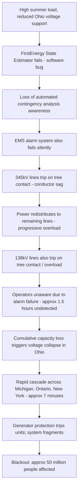

## Case Study: 2003 Northeast Blackout

### Overview

The Northeast Blackout of August 14, 2003 affected roughly 50 million people across the northeastern and midwestern United States and Ontario, Canada, making it one of the largest blackouts in North American history. Unlike the 1965 event, whose root cause was a single misoperating relay, the 2003 blackout stemmed from a combination of vegetation contact, software failure, inadequate situational awareness, and voluntary (unenforced) reliability standards — findings that directly produced the mandatory NERC compliance regime in place today.

### Sequence of Events (FirstEnergy / Ohio Origin)

#### Initial Conditions

- A hot August afternoon produced high electricity demand across the Midwest, with heavy east-west power transfers through Ohio.
- FirstEnergy Corporation's transmission system in northern Ohio was operating with reduced voltage support after several generating units, including the **Eastlake 5** generating unit, had tripped earlier in the day.

#### Software and Situational Awareness Failure

- At approximately 2:14 PM EDT, FirstEnergy's **State Estimator** (the software tool used to build a real-time model of system conditions) failed due to a race condition software bug and did not automatically restart or alert operators clearly to the failure.
- This meant FirstEnergy's control room lost automated contingency analysis capability for roughly the next hour without operators being fully aware their situational awareness tools were degraded.
- A separate **alarm system failure** in FirstEnergy's energy management system (EMS) meant operators did not receive audible or visual alerts as subsequent transmission line trips began occurring, leaving them effectively "blind" to the developing emergency.

#### Cascading Line Trips (Tree Contact)

- Beginning around 3:05 PM EDT, several FirstEnergy 345 kV transmission lines in northern Ohio tripped due to **contact with overgrown trees** that had not been adequately trimmed under vegetation management practices, as the lines sagged from thermal loading (conductor sag increases with current-carrying temperature).
- As each line tripped, power redistributed onto remaining parallel lines and lower-voltage (138 kV) lines, which became progressively overloaded and also tripped from tree contact or thermal/relay protection over the following approximately 1.5 hours — a slower-developing cascade than 1965's few-second collapse, but one that went undetected and uncorrected due to the situational awareness failures above.

#### Regional Cascade

- By approximately 4:05–4:13 PM EDT, the cumulative loss of transmission capacity in Ohio caused massive power swings and voltage collapse conditions that triggered a rapid cascading sequence across Michigan, into Ontario, and through New York and the broader Northeast interconnection within a span of about **7 minutes**.
- Numerous generating plants tripped via automatic protection (over/under-frequency, loss-of-excitation, out-of-step protection) as the system fragmented, ultimately leaving large portions of the Northeast and Ontario blacked out.

### Cascading Failure Sequence

### Root Cause Analysis

**Key Points**

- **Primary technical cause**: Untrimmed vegetation causing sagging transmission lines to contact trees under high thermal loading — a preventable maintenance/vegetation-management failure, not an equipment design flaw.
- **Primary systemic cause**: Loss of situational awareness due to concurrent state-estimator and alarm-system software failures, meaning operators had no accurate real-time picture and could not take corrective action (e.g., shedding load, adjusting flows) before the cascade became unstoppable.
- **Contributing cause**: FirstEnergy operators did not adequately communicate the developing conditions to neighboring reliability coordinators (MISO, PJM) in a timely manner, delaying any coordinated inter-utility response.
- **Contributing cause**: Inadequate tree-trimming practices reflected broader voluntary compliance culture around NERC reliability criteria — utilities were not legally obligated to maintain vegetation clearances to a binding enforceable standard at the time.
- The official U.S.-Canada Power System Outage Task Force report identified **violations of specific voluntary NERC operating policies and planning standards** by FirstEnergy and, to lesser extents, MISO and PJM, none of which carried legal penalty under the pre-2005 voluntary framework.

### Comparative Note: 1965 vs. 2003 Northeast Blackouts

| Aspect | 1965 Blackout | 2003 Blackout |
| --- | --- | --- |
| Initiating cause | Backup relay misoperation on load current | Vegetation (tree) contact on sagging 345kV lines |
| Cascade timescale | Seconds (Beck lines) to ~13 min (regional) | ~1.5 hrs undetected local cascade, then ~7 min regional cascade |
| Situational awareness | No formal inter-utility coordination existed yet | Coordination existed but tools (state estimator, alarms) failed |
| Root systemic issue | No coordinated inter-utility reliability planning | Voluntary standards insufficiently enforced; inadequate tools |
| Regulatory response | Formation of NERC (voluntary) | Energy Policy Act 2005; NERC becomes mandatory ERO with FERC oversight |
| Affected population | ~30 million | ~50 million |

### Engineering and Regulatory Response

#### Mandatory Reliability Standards

- The **Energy Policy Act of 2005** authorized FERC to designate an Electric Reliability Organization with legal authority to enforce mandatory Reliability Standards with financial penalties — NERC assumed this role, transforming from a voluntary council into the mandatory ERO structure described in Standards Bodies and Codes of Practice.
- Specific standards emerging from or reinforced by 2003 lessons include: **FAC-003** (vegetation management around transmission lines), **TOP** series (real-time operations and situational awareness requirements), **IRO** series (reliability coordinator responsibilities and communication), and requirements around EMS/state-estimator reliability and alarm processing.

#### Vegetation Management

- FAC-003 now mandates minimum clearance distances between transmission conductors and vegetation, calculated to prevent contact even under maximum design sag (accounting for thermal expansion at rated current and ambient temperature), with defined inspection cycles and enforceable penalties for non-compliance.

#### Situational Awareness Tools

- Post-2003 investment substantially expanded **wide-area monitoring systems (WAMS)** using synchrophasor (PMU) data, enabling reliability coordinators to observe real-time system dynamics across utility boundaries rather than relying solely on individual utilities' potentially degraded internal tools.

### Example: Applying the Lesson to Modern Vegetation Management Compliance

1. Calculate maximum conductor sag for a given transmission line under worst-case thermal loading (rated ampacity at maximum design ambient temperature), using standard sag-tension calculation methods.
2. Determine minimum vegetation clearance per FAC-003 methodology, incorporating conductor movement (wind-induced blowout) in addition to thermal sag.
3. Establish an inspection and trimming cycle (often LiDAR-based aerial survey combined with ground inspection) sufficient to maintain clearance between cycles given local vegetation growth rates.
4. Document compliance with auditable records, since FAC-003 non-compliance carries direct NERC enforcement penalties.

**Output**

A vegetation management compliance program producing auditable clearance records demonstrating that no transmission conductor can contact vegetation under worst-case sag and blowout conditions between inspection cycles — directly addressing the initiating cause of the 2003 cascade.

### Illustration: 2003 Blackout Timeline Compression (svg_diagram)

<svg xmlns="http://www.w3.org/2000/svg" viewBox="0 0 780 300">
\<style\>
.box{fill:#eef3fb;stroke:#2c4a72;stroke-width:2;}
.lbl{font-family:sans-serif;font-size:12px;fill:#1a2a3a;}
.title{font-family:sans-serif;font-size:16px;font-weight:bold;fill:#1a2a3a;}
.arrow{stroke:#b3261e;stroke-width:2;marker-end:url(#arrowr2);fill:none;}
\</style\>
<text x="20" y="26" class="title">2003 Blackout Timeline (svg_diagram)</text>
<rect x="20" y="60" width="170" height="60" rx="8" class="box" />
<text x="30" y="85" class="lbl">2:14 PM</text>
<text x="30" y="103" class="lbl">State estimator fails</text>
<rect x="230" y="60" width="170" height="60" rx="8" class="box" />
<text x="240" y="85" class="lbl">3:05 PM</text>
<text x="240" y="103" class="lbl">First 345kV tree contact</text>
<rect x="440" y="60" width="170" height="60" rx="8" class="box" />
<text x="450" y="85" class="lbl">3:05-4:05 PM</text>
<text x="450" y="103" class="lbl">Undetected local cascade</text>
<path d="M190,90 L230,90" class="arrow" />
<path d="M400,90 L440,90" class="arrow" />
<rect x="230" y="180" width="170" height="60" rx="8" class="box" />
<text x="240" y="205" class="lbl">4:05-4:13 PM</text>
<text x="240" y="223" class="lbl">Regional cascade (~7 min)</text>
<rect x="440" y="180" width="170" height="60" rx="8" class="box" />
<text x="450" y="205" class="lbl">~4:13 PM onward</text>
<text x="450" y="223" class="lbl">~50 million affected</text>
<path d="M525,120 L315,180" class="arrow" />
<path d="M400,210 L440,210" class="arrow" />
</svg>

### Enduring Significance

- Directly responsible for transforming NERC from a voluntary coordinating body into a mandatory, federally enforced Electric Reliability Organization — the single most consequential regulatory shift in modern North American grid governance.
- Established vegetation management, real-time situational awareness, and inter-utility communication as core enforceable reliability disciplines rather than best-practice recommendations.
- Frequently paired with the 1965 event in engineering education to illustrate that blackout causation has shifted from purely protection-engineering misoperation toward complex socio-technical failures involving software, human factors, and organizational coordination.

**Related Topics**

- Case Study: 1965 Northeast Blackout
- NERC FAC-003: Transmission Vegetation Management
- Wide-Area Monitoring Systems and Synchrophasor (PMU) Deployment
- NERC TOP and IRO Standards: Real-Time Operations and Reliability Coordination
- Energy Policy Act of 2005 and Mandatory ERO Enforcement
- State Estimator Design and Contingency Analysis Tools
- Cascading Failure Analysis and Remedial Action Schemes (RAS)