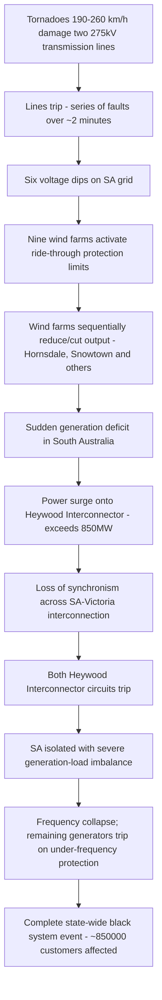

## Case Study: 2016 South Australia Blackout

### Overview

The South Australia state-wide blackout of September 28, 2016 was a "black system" event affecting the entire state (approximately 850,000 customers), triggered by an extreme storm and made systemically significant by the role of inverter-based wind generation protection settings. It is now the canonical case study for modern grid engineers studying the reliability challenges of high-penetration renewable, low-inertia power systems, and directly shaped subsequent Australian Energy Market Operator (AEMO) requirements around ride-through settings and system strength.

### Sequence of Events

#### Storm and Initiating Faults

- On the afternoon of September 28, 2016, severe tornadoes with wind speeds in the **190–260 km/h** range struck areas of South Australia, and within roughly 87 seconds before the system shutdown, two tornadoes almost simultaneously damaged a single-circuit 275 kV transmission line and a double-circuit 275 kV transmission line, located about 170 km apart. [AEMO](https://www.aemo.com.au/-/media/files/electricity/nem/market_notices_and_events/power_system_incident_reports/2017/integrated-final-report-sa-black-system-28-september-2016.pdf)
- The damage to these transmission lines caused them to trip, and a rapid sequence of faults resulted in six voltage dips on the South Australian grid over a roughly two-minute period around 4:16 PM. [AEMO](https://www.aemo.com.au/-/media/files/electricity/nem/market_notices_and_events/power_system_incident_reports/2017/integrated-final-report-sa-black-system-28-september-2016.pdf)

#### Wind Farm Ride-Through Protection Response

- As the number of network faults grew, nine wind farms in the mid-north of South Australia exhibited a sustained reduction in power output as a protection feature activated. [AEMO](https://www.aemo.com.au/-/media/files/electricity/nem/market_notices_and_events/power_system_incident_reports/2017/integrated-final-report-sa-black-system-28-september-2016.pdf)
- The repeated voltage dips stressed the low-voltage ride-through capability of most of the wind farm fleet, causing nine wind farms to reduce or cease output; within about one second, Hornsdale Wind Farm cut output by 86 MW and Snowtown Wind Farm cut output by 106 MW. [Wikipedia](https://en.wikipedia.org/wiki/2016_South_Australian_blackout)[Wikipedia](https://en.wikipedia.org/wiki/2016_South_Australian_blackout)
- The critical technical finding was that these wind turbines had been configured with a protection setting limiting the number of voltage-dip ride-through events they would tolerate before disconnecting — and several turbines exceeded that count during the rapid sequence of storm-induced dips, triggering unexpected mass disconnection rather than sustained ride-through. The report found that incorrectly configured control settings were triggered after the transmission towers were blown over, and that the unexpected operation of these control settings resulted in the sudden loss of generation from the wind farms. [Sustainabilitymatters](https://www.sustainabilitymatters.net.au/content/energy/news/aemo-releases-final-sa-blackout-report-1458921848)

#### Interconnector Overload and System Collapse

- The sudden loss of wind generation created an instantaneous power deficit in South Australia, which was compensated for by a surge of import power through the **Heywood Interconnector** linking South Australia to Victoria.
- Heywood interconnector flow increased to over 850 MW, and both of its circuits tripped due to imminent loss of synchronism across the network between South Australia and the eastern states — occurring before the interconnector's thermal load limits were even reached. [Wikipedia](https://en.wikipedia.org/wiki/2016_South_Australian_blackout)
- With the interconnector lost, South Australia was isolated with a massive remaining generation-load imbalance, causing frequency to collapse; automatic under-frequency protection across the remaining generation fleet tripped units in cascade, resulting in complete state-wide loss of supply (a full "black system" event) at 4:18 PM.

### Cascading Failure Sequence

### Root Cause Analysis

**Key Points**

- **Primary triggering cause**: Extreme weather (tornado-force winds) causing physical transmission infrastructure damage — an external event largely outside normal engineering design margins for that storm severity.
- **Primary technical amplifying cause**: Wind turbine ride-through protection settings configured with a limited tolerance for repeated voltage-dip events, causing unexpected, correlated mass disconnection of generation rather than sustained fault ride-through as intended by modern grid-code expectations. AEMO's final report found that overly sensitive protection mechanisms in the state's wind farms were to blame, with the report stating the unexpected operation of the control settings resulted in the sudden loss of generation from the wind farms. [Energymagazine](https://www.energymagazine.com.au/black-system-or-black-swan-learnings-from-south-australias-infamous-2016-blackout-part-2/)
- **Systemic/regulatory cause**: Several wind farm operators had applied protection settings that had not been through the formal approval process for the National Electricity Rules; a settlement found that AGL Energy's use of non-approved low-voltage protection settings on its Hallett Wind Farm without prior written approval meant AEMO was making critical system-security decisions based on incomplete information about how generation would actually respond during a disturbance. [Energymagazine](https://www.energymagazine.com.au/black-system-or-black-swan-learnings-from-south-australias-infamous-2016-blackout-part-2/)
- **Systemic cause — low system inertia**: The event is widely used to illustrate how a grid with a high proportion of non-synchronous, inverter-connected generation (low system inertia and reduced "system strength") is more vulnerable to rapid frequency and voltage excursions than a traditional grid dominated by large synchronous generators, since the deficit-to-collapse window is compressed.
- Root cause was **not** simply "too much wind power" — AEMO's investigation concluded the specific and correctable issue was ride-through protection configuration and approval process, not renewable penetration per se, though the broader changing generation mix was identified as a contributing structural factor requiring adapted operational practices. AEMO admitted there were challenges posed by the changing energy generation mix and that the network would need to adapt to an increasing reliance on renewable energy. [the Blackout report](https://www.theblackoutreport.co.uk/2021/09/28/south-australia-blackout-2016/)

### Regulatory and Compliance Findings

- The blackout was triggered by severe weather that damaged transmission and distribution assets, followed by reduced wind farm output and a loss of synchronism that caused the loss of the Heywood Interconnector, with the subsequent supply-demand imbalance causing the remaining South Australian generation to shut down; most supply was restored within 8 hours, though the SA wholesale electricity market was suspended for 13 days. [Australian Energy Regulator](https://www.aer.gov.au/publications/reports/compliance/investigation-report-south-australias-2016-state-wide-blackout)[Australian Energy Regulator](https://www.aer.gov.au/publications/reports/compliance/investigation-report-south-australias-2016-state-wide-blackout)
- The Australian Energy Regulator's investigation found a high level of compliance by AEMO and market participants overall, concluding AEMO had not breached any core obligations around operating the market or managing power system security, though non-compliance was found on five specific clauses of the National Electricity Rules. [Australian Energy Regulator](https://www.aer.gov.au/news-release/aer-releases-investigation-report-into-south-australias-2016-state-wide-blackout)
- The AER ultimately reached a settlement withdrawing formal allegations that the non-approved wind farm settings were a "contributing cause" of the blackout, while the presiding judge noted those non-approved settings still compromised AEMO's ability to make informed system-security decisions; AGL Energy agreed to a $3.5 million settlement in August 2021 over the unapproved low-voltage protection settings on its Hallett Wind Farm. [Energymagazine](https://www.energymagazine.com.au/black-system-or-black-swan-learnings-from-south-australias-infamous-2016-blackout-part-2/)[Energymagazine](https://www.energymagazine.com.au/black-system-or-black-swan-learnings-from-south-australias-infamous-2016-blackout-part-2/)

### Engineering Lessons and Response

**Key Points**

- **Ride-through setting governance**: AEMO subsequently tightened requirements that all generator protection and control settings affecting system security response — particularly voltage ride-through behavior — be formally reviewed and approved before commissioning, closing the gap that allowed unapproved wind farm settings to go undetected until the event exposed them.
- **System strength and inertia**: the investigation advised that it was not viable to rely solely on traditional generation sources such as coal and gas to keep the network balanced, and recommended adding capacity to improve inertia, frequency, and voltage control — directly motivating South Australia's subsequent large-scale battery storage deployments (e.g., the Hornsdale Power Reserve) partly for fast frequency response and system-strength support. [Energymagazine](https://www.energymagazine.com.au/black-system-or-black-swan-learnings-from-south-australias-infamous-2016-blackout-part-2/)
- **Broader resilience review**: the event, along with a subsequent 2018 Queensland-South Australia separation event and a 2019 UK load-shedding event, informed a broader Australian Energy Market Commission review into mechanisms to enhance power system resilience. [AEMC](https://www.aemc.gov.au/sites/default/files/documents/aemc_-_sa_black_system_review_-_final_report.pdf)

### Comparative Note: 2016 SA vs. 1965/2003 North American Blackouts

| Aspect | 2016 South Australia | 1965/2003 Northeast (US/Canada) |
| --- | --- | --- |
| Initiating cause | Extreme weather (tornado) damaging transmission | Relay misoperation (1965) / vegetation contact (2003) |
| Key amplifying factor | Wind farm ride-through protection settings, low system inertia | Cascading overload (1965); software/situational awareness failure (2003) |
| Generation mix relevance | High renewable, low-inertia system exposed new failure mode | Conventional synchronous generation fleet |
| Regulatory legacy | Tightened protection-setting approval, inertia/system-strength requirements | Formation of NERC (1965); mandatory NERC ERO (2003) |

### Example: Applying the Lesson to Modern Inverter-Based Resource (IBR) Interconnection Studies

1. Require all wind/solar/inverter-connected generator protection and ride-through settings to be submitted for formal approval before energization, explicitly including multi-event voltage-dip tolerance behavior, not just single-fault ride-through capability.
2. Model correlated multi-contingency disturbance sequences (not just single N-1 events) in dynamic studies, since the 2016 event's severity arose from *repeated* dips within a short window rather than one isolated fault.
3. Assess system inertia and short-circuit strength at high renewable-penetration operating points, applying supplementary fast-frequency-response or synthetic inertia resources (e.g., grid-forming battery storage) where traditional synchronous inertia margins are insufficient.
4. Cross-reference approved settings against actual as-commissioned relay/controller configuration during commissioning tests and periodically thereafter, closing the settings-verification gap identified in the 2016 event.

**Output**

An IBR interconnection and system-security study package that verifies approved ride-through settings match as-commissioned configuration, models multi-event disturbance sequences, and confirms adequate inertia/system-strength margins — directly addressing the amplifying causes of the 2016 South Australia black system event.

### Illustration: 2016 SA Blackout Timeline (svg_diagram)

<svg xmlns="http://www.w3.org/2000/svg" viewBox="0 0 780 300">
\<style\>
.box{fill:#eef3fb;stroke:#2c4a72;stroke-width:2;}
.lbl{font-family:sans-serif;font-size:12px;fill:#1a2a3a;}
.title{font-family:sans-serif;font-size:16px;font-weight:bold;fill:#1a2a3a;}
.arrow{stroke:#b3261e;stroke-width:2;marker-end:url(#arrowr3);fill:none;}
\</style\>
<text x="20" y="26" class="title">2016 South Australia Blackout Timeline (svg_diagram)</text>
<rect x="20" y="60" width="170" height="60" rx="8" class="box" />
<text x="30" y="85" class="lbl">t=0s</text>
<text x="30" y="103" class="lbl">Tornadoes damage 275kV lines</text>
<rect x="230" y="60" width="170" height="60" rx="8" class="box" />
<text x="240" y="85" class="lbl">t~0-120s</text>
<text x="240" y="103" class="lbl">Six voltage dips on SA grid</text>
<rect x="440" y="60" width="170" height="60" rx="8" class="box" />
<text x="450" y="85" class="lbl">t~87s mark</text>
<text x="450" y="103" class="lbl">9 wind farms activate protection</text>
<path d="M190,90 L230,90" class="arrow" />
<path d="M400,90 L440,90" class="arrow" />
<rect x="230" y="180" width="170" height="60" rx="8" class="box" />
<text x="240" y="205" class="lbl">within ~1s</text>
<text x="240" y="223" class="lbl">Heywood flow surges past 850MW</text>
<rect x="440" y="180" width="170" height="60" rx="8" class="box" />
<text x="450" y="205" class="lbl">4:18 PM</text>
<text x="450" y="223" class="lbl">Statewide black system</text>
<path d="M525,120 L315,180" class="arrow" />
<path d="M400,210 L440,210" class="arrow" />
</svg>

### Enduring Significance

- Recognized as one of the first major "black system" events in a developed-world grid substantially attributable to inverter-based generation protection behavior rather than purely conventional generator or transmission failure, making it a foundational case in modern IBR interconnection standards worldwide.
- Directly motivated large-scale grid-forming battery storage deployment in South Australia and influenced international grid codes' treatment of ride-through settings, system strength, and minimum synchronous generation requirements.
- Demonstrates that in low-inertia, high-renewable-penetration systems, the time window between an initiating disturbance and irreversible cascading collapse can be dramatically shorter than in traditional synchronous-generation-dominated grids, elevating the importance of automated, pre-engineered protection responses over operator intervention.

**Related Topics**

- Case Study: 1965 Northeast Blackout
- Case Study: 2003 Northeast Blackout
- Low-Voltage Ride-Through (LVRT) Requirements for Inverter-Based Resources
- System Inertia, System Strength, and Grid-Forming Inverter Technology
- Grid-Scale Battery Storage for Frequency Response (Hornsdale Power Reserve)
- AEMO and Australian National Electricity Rules (NER) Framework
- Multi-Contingency and Correlated-Event Dynamic Stability Studies