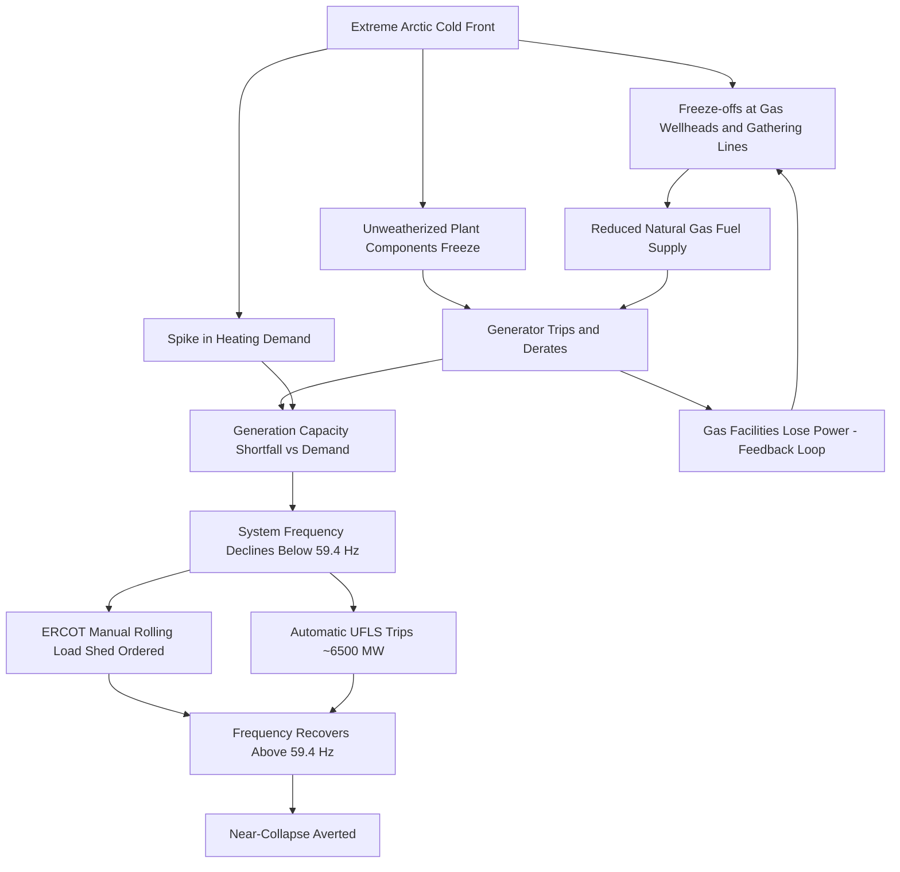

## Case Study: 2021 Texas Winter Storm Uri

### Overview

Winter Storm Uri (February 13–17, 2021) triggered the most significant electricity reliability failure in modern U.S. history within the footprint of the Electric Reliability Council of Texas (ERCOT). ERCOT ordered a total of 20,000 MW of rolling blackouts in an effort to prevent grid collapse, representing the largest manually controlled load shedding event in U.S. history. Nearly half of ERCOT's generation capacity — 52.3 GW — was forced offline at the peak of the storm. The event is a canonical teaching case in power system engineering because it simultaneously exposed weaknesses in generation winterization, frequency control, market design, natural gas–electric interdependency, and emergency operating procedures. [Federal Energy Regulatory Commission](https://www.ferc.gov/news-events/news/final-report-february-2021-freeze-underscores-winterization-recommendations)[S&P Global Commodity Insights](https://spglobal.com/commodityinsights/en/market-insights/latest-news/electric-power/022421-ercot-lost-almost-half-of-generation-capacity-in-storm-causing-20-gw-load-shed)

This case study frames Uri as a system-level cascading-failure near-miss: the ERCOT Interconnection came within minutes of an uncontrolled, systemwide blackout that could have required a black-start restoration process lasting weeks.

### System Background: Why ERCOT Is a Special Case

**Key Points**

- ERCOT is one of three major North American interconnections (Eastern, Western, and Texas/ERCOT), and it is the only one operating almost entirely within a single U.S. state.
- Because ERCOT's AC transmission system has only limited, small-capacity DC ties to the Eastern and Western Interconnections (e.g., at the Oklaunion, Eagle Pass, and Laredo DC ties), it cannot import large amounts of emergency power the way most U.S. utilities can from neighboring balancing authorities.
- This electrical isolation was deliberate — it was historically pursued to avoid interstate commerce that would trigger direct federal (FERC) jurisdiction over Texas retail electricity, since the ERCOT independent system operator administers a grid located solely within the state of Texas and not synchronously interconnected to the rest of the U.S. [National Hydropower Association](https://hydro.org/powerhouse/article/winter-2021-storm-event-in-texas-an-assessment-of-the-energy-system-reliability-failures/)
- ERCOT operates a predominantly energy-only market (as opposed to a capacity market), which affected generator investment incentives in weatherization prior to 2021.

**Implication for reliability**: with minimal external tie capacity, any large simultaneous loss of in-state generation cannot be backstopped by imports — internal frequency and load-shed response is the only defense.

### Timeline of the Event

| Date/Time (CT) | Event |
| --- | --- |
| Feb 8–13, 2021 | Arctic air mass and winter weather advisories issued; ERCOT and generators warned of extreme cold |
| Feb 14, 2021 (evening) | Temperatures fall rapidly across Texas; demand rises sharply as heating load increases |
| Feb 14–15, overnight | Generating units begin tripping offline or derating due to frozen instrumentation, sensing lines, and fuel supply issues; natural gas wellhead freeze-offs begin reducing gas supply |
| Feb 15, ~01:00–01:20 | ERCOT orders load shedding at 1:20 a.m. CT to prevent risk of a systemwide blackout as demand climbs and generation continues to fail. |
| Feb 15, ~01:43–01:51 | Grid frequency falls to dangerous levels; at about 1:51 a.m., frequency drops below 59.4 Hz. |
| Feb 15, 01:51–01:52 | Successive generation-tripping events drive frequency to its lowest recorded point, 59.302 Hz, at 01:52. |
| Feb 15, ~01:52 | Under-Frequency Load Shed (UFLS) protection automatically activates, shedding roughly 6,500 MW of load. |
| Feb 15, 01:51–02:14/02:15 | Frequency remains below 59.4 Hz for 4 minutes and 23 seconds before recovering. Had it stayed below 59.4 Hz for a further 4 minutes and 37 seconds (9 minutes total), automatic generator under-frequency ride-through protection would have tripped remaining units, collapsing the entire ERCOT grid. |
| Feb 15, ~02:03 | Grid frequency recovers to at or above 60 Hz. |
| Feb 15–18 | Rolling/rotating outages continue; many customers remain without power far longer than intended because so much load had to be shed that utilities could not safely cycle circuits back on |
| Feb 18, 00:42 | ERCOT cancels the load-shed order. |
| Feb 19, ~10:30 | ERCOT ends the Energy Emergency Alert. |

**Duration contrast**: the 2021 event produced outages lasting 70.5 hours, versus only 7.5 hours during the comparable February 2011 Texas freeze event, and required a far larger total load shed than in 2011, which is why many customers stayed offline for days rather than being cycled on and off. [S&P Global Commodity Insights](https://spglobal.com/commodityinsights/en/market-insights/latest-news/electric-power/022421-ercot-lost-almost-half-of-generation-capacity-in-storm-causing-20-gw-load-shed)

### The Physics of the Near-Collapse: Frequency Stability

**Key Points**

- Grid frequency in an AC power system is a real-time indicator of the balance between generation and load. Nominal frequency in North America is 60 Hz.
- When load exceeds available generation, the kinetic energy stored in the rotating mass of synchronous generators is drawn down to supply the deficit, causing system frequency to decline according to the swing equation:

$$M\frac{d^2\delta}{dt^2} = P_m - P_e$$

where $M$ is the inertia constant, $\delta$ is the rotor angle, $P_m$ is mechanical input power, and $P_e$ is electrical output power. At the system level, frequency deviation approximately tracks the generation-load imbalance normalized by system inertia and load-damping characteristics.

- **Design/protection thresholds relevant to Uri** (ERCOT-specific, as documented in ERCOT operating guides and board materials):
  - Generators are required to operate reliably without tripping for frequencies above 59.4 Hz; below 59.4 Hz there is risk of turbine blade damage. [ERCOT](https://www.ercot.com/files/docs/2022/02/16/226NOGRR-05%20Oncor%20Comments%20021622.doc)
  - A safely operating system sits around 60 Hz and cannot fall below 59.4 Hz for more than nine minutes without generation beginning to trip offline, risking a full system blackout. [Utility Dive](https://www.utilitydive.com/news/ercot-narrowly-avoided-much-more-devastating-impacts-as-nearly-half-of-ge/595701/)
  - If frequency remains below 59.4 Hz for nine minutes, or drops below 59.3 Hz instantaneously for any significant duration, generation units are designed to automatically disconnect to protect turbines and generators from vibrational-resonance damage. [CRV Science](https://www.crvscience.com/post/from-winter-storm-uri-2021-to-now-a-five-year-audit-of-the-texas-ercot-power-grid)

**[Inference]** The nine-minute figure and the 59.3 Hz instantaneous limit reflect turbine-vendor mechanical tolerance curves (blade natural-frequency resonance bands) rather than a single universal physical constant — exact trip settings vary by unit and are set in coordination with generator protective relaying, so real deployments may differ from the values cited for ERCOT.

- ERCOT's automatic Under-Frequency Load Shedding (UFLS) is staged (commonly at levels such as 59.3 Hz, 58.9 Hz, and 58.5 Hz in the broader NERC-standard scheme), each stage shedding a percentage of firm load to arrest further decline. In this event, the UFLS scheme dropped about 6,500 MW of load within a couple of minutes, which combined with ERCOT's manual load-shed instructions to reverse the frequency decline. [T&D World](https://www.tdworld.com/disaster-response/article/21156928/when-minutes-are-critical)

### Diagram: Frequency Response Timeline (svg_diagram)

<svg xmlns="http://www.w3.org/2000/svg" viewBox="0 0 900 420" font-family="Arial, sans-serif">
<text x="450" y="25" font-size="18" font-weight="bold" text-anchor="middle">ERCOT System Frequency, Feb 15 2021 (svg_diagram)</text>

<line x1="80" y1="360" x2="850" y2="360" stroke="#333" stroke-width="2" />
<line x1="80" y1="60" x2="80" y2="360" stroke="#333" stroke-width="2" />

<text x="70" y="365" font-size="12" text-anchor="end">59.2</text>

<text x="70" y="305" font-size="12" text-anchor="end">59.4</text>

<text x="70" y="245" font-size="12" text-anchor="end">59.6</text>

<text x="70" y="185" font-size="12" text-anchor="end">59.8</text>

<text x="70" y="125" font-size="12" text-anchor="end">60.0</text>

<text x="70" y="65" font-size="12" text-anchor="end">60.2</text>

<text x="35" y="210" font-size="13" transform="rotate(-90 35 210)" text-anchor="middle">Frequency (Hz)</text>

<text x="150" y="380" font-size="12" text-anchor="middle">01:20</text>

<text x="330" y="380" font-size="12" text-anchor="middle">01:43</text>

<text x="470" y="380" font-size="12" text-anchor="middle">01:51</text>

<text x="530" y="380" font-size="12" text-anchor="middle">01:52</text>

<text x="650" y="380" font-size="12" text-anchor="middle">02:03</text>

<text x="800" y="380" font-size="12" text-anchor="middle">02:15</text>

<text x="450" y="400" font-size="13" text-anchor="middle">Time (CT)</text>

<line x1="80" y1="305" x2="850" y2="305" stroke="#e67e22" stroke-width="1.5" stroke-dasharray="6,4" />
<text x="855" y="309" font-size="11" fill="#e67e22">59.4 Hz limit</text>
<line x1="80" y1="325" x2="850" y2="325" stroke="#c0392b" stroke-width="1.5" stroke-dasharray="6,4" />
<text x="855" y="329" font-size="11" fill="#c0392b">59.3 Hz (UFLS)</text>

<polyline fill="none" stroke="`#2980b9`" stroke-width="3" points="80,125 150,130 250,150 330,220 400,270 460,300 490,335 510,338 540,320 580,270 650,180 720,140 800,128 850,125" />

<circle cx="510" cy="338" r="6" fill="#c0392b" />
<text x="510" y="358" font-size="11" fill="#c0392b" text-anchor="middle">59.302 Hz (min)</text>

<rect x="470" y="305" width="70" height="33" fill="#c0392b" fill-opacity="0.15" />
<text x="505" y="298" font-size="10" fill="#c0392b" text-anchor="middle">4m23s below 59.4 Hz</text>

<rect x="620" y="70" width="14" height="14" fill="#2980b9" />
<text x="640" y="82" font-size="12">System frequency</text>
</svg>

### Root Causes: Generation-Side Failures

**Key Points**

- The final FERC/NERC report found that 58% of power generation failures during the event were due to issues with natural gas-fired units. [CBS News](https://www.cbsnews.com/dfw/news/federal-energy-regulatory-commission-final-report-texas-power-grid-failure/)
- The report partially rebuffed claims that wind and solar were primarily to blame for the outages. [CBS News](https://www.cbsnews.com/dfw/news/federal-energy-regulatory-commission-final-report-texas-power-grid-failure/)
- Among unplanned generation outages, 87% were attributable to natural gas production and processing issues, while the remaining 13% stemmed from other fuel sources such as oil and coal. [CBS News](https://www.cbsnews.com/dfw/news/federal-energy-regulatory-commission-final-report-texas-power-grid-failure/)
- Freezing was the dominant failure mechanism: 81% of freezing-related outages occurred at temperatures above the affected units' own stated ambient design temperature — meaning equipment failed even within its nominal rated operating range because it had not been properly weatherized (insulated, heat-traced, or wind-sheltered) to actually perform down to that rating. [CBS News](https://www.cbsnews.com/dfw/news/federal-energy-regulatory-commission-final-report-texas-power-grid-failure/)
- The report calculated that protecting just four types of power plant components from icing and freezing could have reduced outages in the ERCOT region by 67%. [CBS News](https://www.cbsnews.com/dfw/news/federal-energy-regulatory-commission-final-report-texas-power-grid-failure/)

**Typical failure modes documented across the industry for this event class**:

- Frozen sensing lines, transmitters, and instrument air lines causing false trips or loss of control signal
- Ice accumulation on wind turbine blades (a contributing but secondary factor, since wind was already a smaller fraction of expected winter capacity)
- Frozen water intakes and cooling systems
- Natural gas wellhead and gathering-line "freeze-offs," reducing fuel supply to gas-fired generators
- Electrical outages at natural gas production/compression/processing facilities themselves, since those facilities were not universally classified as "critical infrastructure" exempt from rolling blackouts — creating a **feedback loop**: power plants tripped due to lack of gas fuel, and gas facilities lost power because they were not shielded from the very blackouts caused by gas shortages.

### Root Causes: Regulatory and Structural Gaps

**Key Points**

- Generation owners and operators were not required to implement any minimum weatherization standard or perform an exhaustive review of cold-weather vulnerability, and no entity — including the Public Utility Commission of Texas (PUCT) or ERCOT — had rules to enforce compliance with weatherization plans or minimum weatherization standards. [National Hydropower Association](https://hydro.org/powerhouse/article/winter-2021-storm-event-in-texas-an-assessment-of-the-energy-system-reliability-failures/)
- ERCOT's spot-check inspection regime covered only a small fraction of the fleet: of roughly 710+ generating units in ERCOT, approximately 80 units — slightly more than 10% — could be spot-checked annually. [National Hydropower Association](https://hydro.org/powerhouse/article/winter-2021-storm-event-in-texas-an-assessment-of-the-energy-system-reliability-failures/)
- This gap existed despite the fact that FERC and NERC had issued winterization recommendations after a similar, smaller-scale freeze event in February 2011 — recommendations that were voluntary and were not broadly implemented.
- Because ERCOT's transmission grid lies solely within Texas and is not synchronously interconnected with the rest of the U.S., electric energy transmitted wholly within ERCOT is not subject to the same FERC jurisdiction that applies to interstate transmission elsewhere, which historically limited direct federal enforcement authority over Texas generator winterization. [National Hydropower Association](https://hydro.org/powerhouse/article/winter-2021-storm-event-in-texas-an-assessment-of-the-energy-system-reliability-failures/)
- Real-time energy prices spiked to the systemwide offer cap: prices hovered at or near the $9,000/MWh offer cap for most of February 15 and virtually all of February 16 through mid-morning February 19, producing enormous, in some cases catastrophic, financial exposure for retail electric providers, cooperatives, and consumers on wholesale-indexed plans. [S&P Global Commodity Insights](https://spglobal.com/commodityinsights/en/market-insights/latest-news/electric-power/022421-ercot-lost-almost-half-of-generation-capacity-in-storm-causing-20-gw-load-shed)

### FERC/NERC Final Report: Findings and Recommendations

**Key Points**

- FERC and NERC, together with NERC's regional entities, issued a 300-page final report (November 16, 2021) examining the impact of the February 2021 freeze on the bulk electric system in Texas and the South Central U.S. [Federal Energy Regulatory Commission](https://www.ferc.gov/news-events/news/final-report-february-2021-freeze-underscores-winterization-recommendations)
- The report issued 28 formal recommendations aimed at preventing recurrence, including revisions to NERC Reliability Standards on generator winterization and gas-electric coordination. [CBS News](https://www.cbsnews.com/dfw/news/federal-energy-regulatory-commission-final-report-texas-power-grid-failure/)
- Preliminary key recommendations directed NERC to revise reliability standards so that generation owners must identify and protect critical components from cold weather, and build new or retrofit existing generators to operate reliably given extreme temperature, precipitation, and wind data — with target implementation by winter 2023/24 for major protective measures and winter 2022/23 for annual winterization training. [Morgan Lewis](https://www.morganlewis.com/pubs/2021/09/ferc-nerc-report-on-winter-storm-uri-recommends-enhanced-cold-weather-preparation)
- Recommendations also called for protecting critical natural gas infrastructure from load shedding and prohibiting the use of critical natural gas infrastructure loads for demand-response programs, targeted for winter 2022/23. [Morgan Lewis](https://www.morganlewis.com/pubs/2021/09/ferc-nerc-report-on-winter-storm-uri-recommends-enhanced-cold-weather-preparation)
- Five areas were flagged for further study: black-start unit reliability, the need for additional transmission ties into ERCOT, measures addressing natural gas supply shortages, the effects of low-frequency events on generators, and guidelines for identifying critical natural gas infrastructure loads. [Morgan Lewis](https://www.morganlewis.com/pubs/2021/09/ferc-nerc-report-on-winter-storm-uri-recommends-enhanced-cold-weather-preparation)

### Black-Start Reliability: A Longer-Term Concern

**Key Points**

- Black-start resources are generating units capable of starting without drawing power from the grid, used to bootstrap system restoration after a blackout.
- During Uri, ERCOT had 28 black-start resources, all of which used natural gas as a primary fuel. [E&E News](https://www.eenews.net/articles/texas-grid-has-gone-3-years-without-a-crisis-will-it-last/)
- A University of Texas study found that at least five black-start plants reported fuel-supply issues during the storm — meaning that even the last line of defense for grid restoration was exposed to the same gas-supply vulnerability that caused the broader crisis. [E&E News](https://www.eenews.net/articles/texas-grid-has-gone-3-years-without-a-crisis-will-it-last/)
- A subsequent FERC/NERC report treated this as a warning: since a hypothetical future full blackout scenario would be more widespread and costlier than Uri, diversifying black-start fuel sources and better aligning gas-industry and electric-industry restoration planning were identified as priorities — an issue also noted as a national problem following Winter Storm Elliott in the Northeast. [E&E News](https://www.eenews.net/articles/texas-grid-has-gone-3-years-without-a-crisis-will-it-last/)

**[Inference]** The reliance on a single-fuel-type black-start fleet represents a common-mode failure risk: an extreme cold event that disables gas supply could simultaneously disable the very resources needed to restart the grid, though the actual probability and severity of this scenario depend on future weatherization compliance, which is not something that can be verified in advance.

### Human and Economic Impact

**Key Points**

- Approximately 70% of ERCOT customers lost power for at least part of the event. [ieee](https://r4.ieee.org/chicago-pes/calendar/2020-2021/2021-05-12/)
- Millions of people were without heat or power for nearly four days. [Troutmanenergyreport](https://www.troutmanenergyreport.com/2021/11/ferc-and-nerc-issued-final-report-on-the-2021-winter-freeze/)
- The loss of electricity caused the deaths of numerous Texans (independent post-event mortality studies by state and academic bodies have produced varying estimates of storm-attributable deaths, generally substantially higher than the state's initial official count; consult current state health department and peer-reviewed sources for updated figures). [Federal Energy Regulatory Commission](https://www.ferc.gov/news-events/news/final-report-february-2021-freeze-underscores-winterization-recommendations)
- Widespread collateral damage included burst water pipes, municipal water system failures (boil-water notices affecting millions), and significant property damage, in addition to direct cold-exposure fatalities.
- Financial fallout included retail electric provider insolvencies, cooperative bankruptcies (e.g., Brazos Electric Power Cooperative), and multi-billion-dollar wholesale market true-up charges that were ultimately securitized and passed through to Texas ratepayers over subsequent years.

### Engineering and Policy Lessons

**Key Points**

1. **Weatherization is a reliability-standard problem, not just a best-practice recommendation.** Voluntary winterization guidance proved insufficient; mandatory, audited, and enforceable standards with meaningful penalties are necessary to change fleet-wide behavior.
2. **Fuel-supply and electric-supply interdependency must be modeled jointly.** Traditional generation adequacy studies that treat natural gas fuel availability as a given input break down precisely during the correlated extreme-weather events that matter most for reliability.
3. **Frequency response margins can be extremely thin during simultaneous, correlated multi-unit outages.** A 9-minute rule and a 59.3 Hz instantaneous limit gave ERCOT a narrow but real margin; robust UFLS design and fast manual operator response were what prevented a full collapse.
4. **Critical infrastructure designation lists must be dynamic and coordinated across sectors.** Gas facilities that were not exempted from rolling blackouts contributed to the very gas shortages driving the blackouts.
5. **Isolated interconnections (like ERCOT) carry a structural resilience trade-off.** Limited tie capacity to neighboring interconnections removes one of the standard mitigations (emergency import) available to most U.S. utilities during regional extreme-weather events.
6. **Energy-only markets need explicit resource-adequacy and reliability mechanisms for tail-risk events**, since scarcity pricing alone does not guarantee physical winterization investment ahead of a rare but catastrophic event.

### Simplified Event Causal Chain

### Related Topics / Next Steps

- **Under-Frequency Load Shedding (UFLS) scheme design and NERC standard PRC-006**
- **Swing equation and system inertia in low-inertia, high-renewable grids**
- **Black-start restoration planning and sequencing**
- **Gas-electric coordination standards (NERC EOP and FERC Order 787 follow-ons)**
- **ERCOT market design: energy-only market vs. capacity markets**
- **Winter Storm Elliott (December 2022) as a comparative case study**
- **Resource adequacy modeling under correlated extreme-weather scenarios**
- **Cold-weather generator design standards (IEEE, NERC cold weather standards post-2021)**
- **Cascading failure analysis and N-1/N-2 contingency planning**