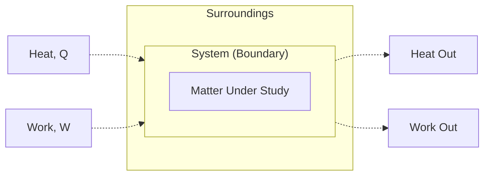
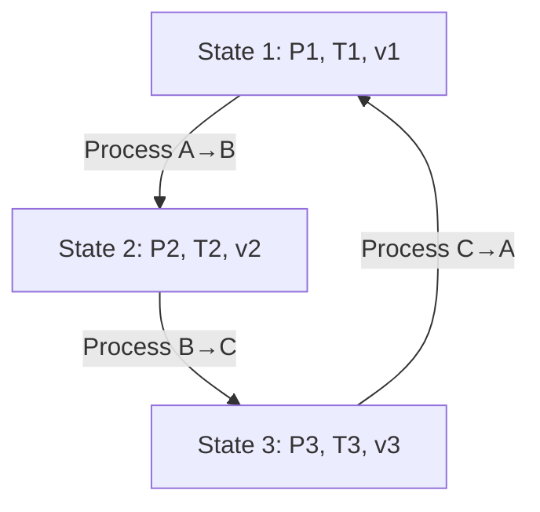
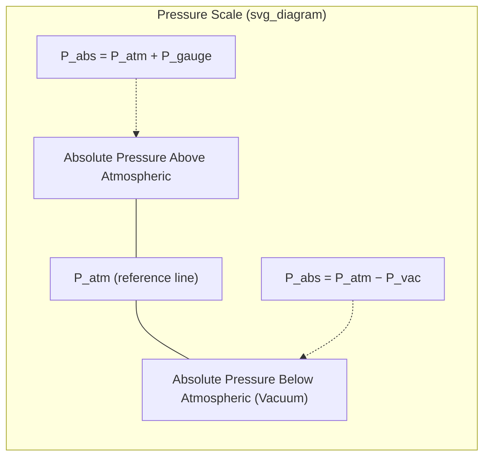

## Basic Concepts: Systems, Properties, and States

### Thermodynamic System

A **system** is the specific quantity of matter or region of space selected for analysis. Everything external to it is the **surroundings**, and the real or imaginary surface separating the two is the **boundary**.

**Types of Systems**

- **Closed System (Control Mass)**: Fixed mass; no mass crosses the boundary, but energy (heat, work) may.
  - Example: Gas being compressed in a piston-cylinder assembly with sealed ends.
- **Open System (Control Volume)**: Both mass and energy cross the boundary.
  - Example: A turbine, compressor, or nozzle with continuous flow in and out.
- **Isolated System**: Neither mass nor energy crosses the boundary.
  - Example: An idealized rigid, perfectly insulated thermos flask.

**Boundary Characteristics**

| Boundary Type | Description |
| --- | --- |
| Fixed | Does not move (e.g., rigid tank walls) |
| Movable | Deforms with the system (e.g., piston face) |
| Real | Physical surface (e.g., cylinder wall) |
| Imaginary | Conceptual surface (e.g., an arbitrary control volume in a duct) |
| Adiabatic | Permits no heat transfer |
| Diathermal | Permits heat transfer |

### Thermodynamic Properties

A **property** is any observable, macroscopic characteristic of a system used to describe its condition — e.g., pressure, temperature, volume, density, internal energy.

**Intensive vs. Extensive Properties**

- **Intensive properties**: Independent of the mass/size of the system.
  - Examples: temperature ($T$), pressure ($P$), density ($\rho$), specific volume ($v$).
- **Extensive properties**: Depend on the mass/extent of the system; they are additive.
  - Examples: total volume ($V$), total mass ($m$), total internal energy ($U$), enthalpy ($H$).

A useful test: cut the system in half. Intensive properties remain the same in each half; extensive properties are halved.

**Specific Properties**

An extensive property divided by mass gives a **specific property** (intensive):

$$v = \frac{V}{m}, \quad u = \frac{U}{m}, \quad h = \frac{H}{m}$$

**Property Relationships**

- **Density**: $\rho = \dfrac{m}{V}$ (kg/m³)
- **Specific Volume**: $v = \dfrac{V}{m} = \dfrac{1}{\rho}$ (m³/kg)
- **Specific Weight**: $\gamma = \rho g$ (N/m³)

### State, Equilibrium, and the State Postulate

**State** refers to the condition of a system as identified by the values of its properties at a given instant. Two states are identical if all corresponding properties are identical, regardless of the process history.

**Equilibrium**

A system is in **thermodynamic equilibrium** when it is simultaneously in:

- **Thermal equilibrium**: No temperature gradients (uniform $T$ throughout).
- **Mechanical equilibrium**: No unbalanced forces (uniform $P$, no net acceleration).
- **Chemical equilibrium**: No net chemical reactions or diffusion (constant chemical composition).
- **Phase equilibrium**: No net mass transfer between phases (if multiple phases coexist).

Only when all these conditions hold is a system fully in thermodynamic equilibrium, and its state is well-defined.

**State Postulate**

The **state postulate** specifies the minimum number of independent, intensive properties needed to fix the state of a **simple compressible system** (negligible electrical, magnetic, gravitational, motion, and surface tension effects):

> The state of a simple compressible system is completely specified by **two independent intensive properties**.

- "Independent" means one property can be varied while the other is held fixed (e.g., $T$ and $v$ are independent; $T$ and $P$ are *not* independent during a phase-change process at constant pressure, since $T$ is fixed by $P$ there — saturation temperature).
- Example: Specifying $P = 200\ \text{kPa}$ and $T = 150^\circ\text{C}$ for superheated steam fixes all other properties (specific volume, internal energy, enthalpy, entropy) via property tables.

For systems with additional relevant work modes (e.g., compressible flow with significant kinetic/potential energy, or systems under electric/magnetic fields), more than two independent properties may be required — one additional property per additional relevant work mode.

### Processes and Paths

A **process** is any change a system undergoes from one equilibrium state to another. The series of states through which the system passes is the **path**.

**Quasi-Equilibrium (Quasi-Static) Process**

A process conducted so slowly that the system remains infinitesimally close to equilibrium at every point — an idealization that allows the process path to be traced on property diagrams (e.g., $P$–$v$ diagrams) and enables reversible-work calculations.

**Common Named Processes**

| Process | Constant Property |
| --- | --- |
| Isobaric | Pressure ($P$) |
| Isothermal | Temperature ($T$) |
| Isochoric (Isometric) | Volume ($V$) |
| Isentropic | Entropy ($s$) |
| Adiabatic | No heat transfer ($Q = 0$) |
| Polytropic | $PV^n = \text{constant}$ |

**Cycle**

A **thermodynamic cycle** is a sequence of processes that begins and ends at the same state, so all properties return to their initial values. Power plant and refrigeration cycles (Rankine, Brayton, Otto, vapor-compression) are built from sequences of such processes.

### Steady-Flow Process

A **steady-flow process** is one in which fluid properties within a control volume may vary with position but not with time. This is the standard idealization for analyzing turbines, compressors, boilers, condensers, and nozzles in continuous operation.

**Requirements for the steady-flow assumption:**

- Mass flow rate into and out of the control volume are equal and constant.
- Properties at any fixed point in the control volume do not change with time.
- Heat and work interactions with the surroundings are constant.

### Dimensions and Units

Thermodynamic analysis requires strict consistency of units. The two common systems:

- **SI (International System)**: base units — kilogram (kg), meter (m), second (s), Kelvin (K).
- **English (USCS)**: pound-mass (lbm), foot (ft), second (s), Rankine (R).

**Key derived units relevant to this topic:**

| Quantity | SI Unit | Formula |
| --- | --- | --- |
| Force | Newton (N) | $1\ \text{N} = 1\ \text{kg}\cdot\text{m/s}^2$ |
| Pressure | Pascal (Pa) | $1\ \text{Pa} = 1\ \text{N/m}^2$ |
| Energy | Joule (J) | $1\ \text{J} = 1\ \text{N}\cdot\text{m}$ |
| Specific Volume | m³/kg | — |

In SI, the dimensional constant $g_c$ is numerically 1 and dimensionless in practice (unlike USCS, where $g_c = 32.174\ \text{lbm}\cdot\text{ft}/(\text{lbf}\cdot\text{s}^2)$ is required to reconcile lbm and lbf).

### Pressure: Absolute, Gauge, and Vacuum

Since pressure measurement instruments typically reference atmospheric pressure, three related quantities are used:

$$P_{abs} = P_{atm} + P_{gauge} \quad \text{(above atmospheric)}$$

$$P_{abs} = P_{atm} - P_{vac} \quad \text{(below atmospheric)}$$

Thermodynamic property tables and equations of state require **absolute pressure**, not gauge pressure.

### Temperature and the Zeroth Law

**Temperature** is a measure of the average kinetic energy of molecular motion and determines the direction of spontaneous heat transfer (from higher to lower temperature).

The **Zeroth Law of Thermodynamics** states: if two bodies are each in thermal equilibrium with a third body, they are in thermal equilibrium with each other. This principle underlies the validity of using thermometers, since the thermometer is the "third body" reaching equilibrium with the system being measured.

**Temperature Scales**

| Scale | Relation |
| --- | --- |
| Celsius to Kelvin | $T(K) = T(^\circ C) + 273.15$ |
| Fahrenheit to Rankine | $T(R) = T(^\circ F) + 459.67$ |
| Celsius to Fahrenheit | $T(^\circ F) = 1.8\, T(^\circ C) + 32$ |
| Kelvin to Rankine | $T(R) = 1.8\, T(K)$ |

Kelvin and Rankine are absolute (thermodynamic) scales, required for all thermodynamic property relations, especially gas laws and cycle efficiency calculations.

### Worked Example

**Problem**: A rigid tank contains 2 kg of a gas. The gauge pressure reads 250 kPa, and the local atmospheric pressure is 98 kPa. The tank has a volume of 0.4 m³. Determine the absolute pressure and the specific volume.

**Solution**:

$$P_{abs} = P_{gauge} + P_{atm} = 250 + 98 = 348\ \text{kPa}$$

$$v = \frac{V}{m} = \frac{0.4\ \text{m}^3}{2\ \text{kg}} = 0.2\ \text{m}^3/\text{kg}$$

This tank is a **closed system** (fixed mass of gas, rigid boundary — no mass crosses, though heat may). The state is fixed here by $P_{abs} = 348\ \text{kPa}$ and $v = 0.2\ \text{m}^3/\text{kg}$, consistent with the state postulate for a simple compressible substance.

### Key Points

- Systems are classified as closed, open, or isolated based on mass and energy transfer across the boundary.
- Properties are intensive (mass-independent) or extensive (mass-dependent, additive); specific properties normalize extensive properties by mass.
- A state is fully defined only under thermodynamic equilibrium (thermal, mechanical, chemical, phase).
- The state postulate: two independent intensive properties fix the state of a simple compressible system. [Inference: additional properties are required if extra work modes are significant — this is a standard extension but worth flagging as a boundary case.]
- Absolute pressure, not gauge pressure, must be used in thermodynamic relations and property tables.
- Kelvin/Rankine (absolute scales) are mandatory for gas-law and cycle calculations.

**Next Steps**

- Pure Substances: Phase Behavior and $P$–$v$–$T$ Surfaces
- Property Tables and Diagrams for Steam ($T$–$s$, $h$–$s$ Charts)
- Ideal Gas Law and Compressibility Factor
- Work and Heat as Path Functions vs. Point Functions
- First Law of Thermodynamics for Closed and Open Systems
- Energy Balance in Steady-Flow Devices (Turbines, Compressors, Nozzles)