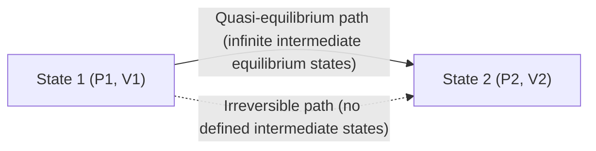
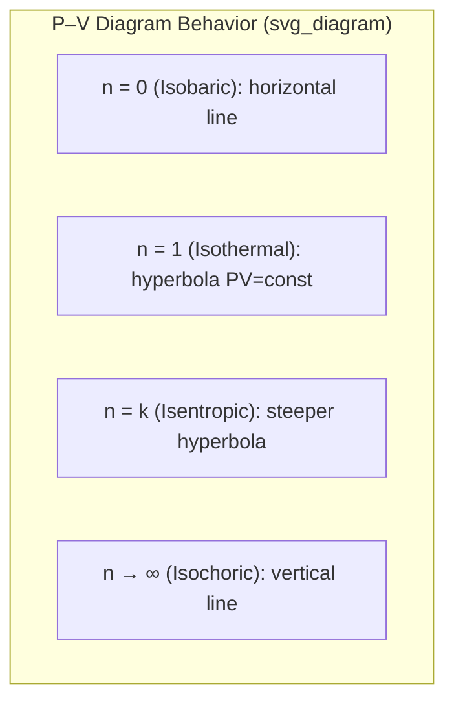

## Processes, Paths, and Cycles

### Definitions

**Process**: A change a system undergoes from one equilibrium state to another, driven by an imbalance of some potential (pressure, temperature, chemical potential) between the system and surroundings.

**Path**: The complete series of intermediate states through which a system passes during a process, from initial state 1 to final state 2. Two different paths can connect the same two end states.

**Cycle**: A sequence of processes that returns the system to its original state, such that every property has the same value at the end as at the beginning. Because properties are point functions, the net change in any property over a complete cycle is zero:

$$\oint dP = 0, \quad \oint dV = 0, \quad \oint dU = 0$$

However, path functions like heat and work do **not** vanish over a cycle:

$$\oint \delta Q \neq 0, \quad \oint \delta W \neq 0$$

This distinction — properties returning to their original values while net heat and work are nonzero — is what makes a cycle capable of net energy conversion (the basis of all heat engines).

### Point Functions vs. Path Functions

| Aspect | Point Function (Property) | Path Function |
| --- | --- | --- |
| Depends on | Only the state | The path taken |
| Differential | Exact differential ($dV$, $dU$) | Inexact differential ($\delta Q$, $\delta W$) |
| Cyclic integral | Zero | Generally nonzero |
| Examples | $P$, $T$, $V$, $U$, $H$, $S$ | Heat ($Q$), Work ($W$) |

Mathematically, an exact differential $dz = M\,dx + N\,dy$ satisfies the reciprocity condition:

$$\left(\frac{\partial M}{\partial y}\right)_x = \left(\frac{\partial N}{\partial x}\right)_y$$

Work and heat fail this test — hence the notation $\delta W$ and $\delta Q$ rather than $dW$ and $dQ$, signaling that they are not state functions and must be evaluated as line integrals along the specific path.

### Quasi-Equilibrium (Quasi-Static) Processes

A **quasi-equilibrium process** proceeds so slowly that the system remains essentially in internal equilibrium at every instant, allowing the process to be represented as a well-defined path on a property diagram (e.g., $P$–$v$).

- **Idealization**: Real processes always involve some finite driving force (friction, temperature gradient), so true quasi-equilibrium is never fully achieved — but it is closely approximated by sufficiently slow processes.
- **Significance**: Boundary work for a quasi-equilibrium process can be computed directly as:

$$W_b = \int_1^2 P\, dV$$

This integral is only valid when $P$ is well-defined throughout the process — i.e., under the quasi-equilibrium assumption. For rapid, irreversible processes (e.g., free expansion), $P$ is not uniform, and this simple integral does not apply.

### Common Named Processes (Simple Compressible Substance)

| Process | Held Constant | Governing Relation (ideal gas) |
| --- | --- | --- |
| Isobaric | Pressure | $V/T = \text{const}$ |
| Isochoric (Isometric) | Volume | $P/T = \text{const}$ |
| Isothermal | Temperature | $PV = \text{const}$ |
| Adiabatic | $Q = 0$ | $PV^k = \text{const}$ ($k = c_p/c_v$) |
| Isentropic | Entropy | Reversible + adiabatic; $PV^k = \text{const}$ |
| Polytropic | — | $PV^n = \text{const}$ |

**Polytropic Process**

The polytropic relation $PV^n = \text{constant}$ generalizes many processes by varying the exponent $n$:

- $n = 0$: Isobaric ($P = \text{const}$)
- $n = 1$: Isothermal (for ideal gas)
- $n = k$: Isentropic (reversible adiabatic, ideal gas)
- $n \to \infty$: Isochoric

Boundary work for a polytropic process ($n \neq 1$):

$$W_b = \int_1^2 P\, dV = \frac{P_2 V_2 - P_1 V_1}{1 - n}$$

For the special isothermal case ($n = 1$, ideal gas):

$$W_b = P_1 V_1 \ln\left(\frac{V_2}{V_1}\right)$$

### Reversible vs. Irreversible Processes

- **Reversible process**: Can be reversed without leaving any trace on the system or surroundings; both system and surroundings can be restored to their original states exactly. Purely a theoretical idealization — no real process is truly reversible.
- **Irreversibility factors**: Friction, unrestrained expansion, heat transfer across a finite temperature difference, mixing, inelastic deformation, and chemical reactions.
- **Internally reversible**: No irreversibilities occur *within* the system boundary (the system passes through a series of equilibrium states), though irreversibilities may still exist in the surroundings.
- **Externally reversible**: No irreversibilities occur *outside* the system boundary (e.g., heat transfer with surroundings occurs across an infinitesimal temperature difference).
- **Totally reversible**: Both internally and externally reversible.

Reversible processes serve as idealized benchmarks — they define the maximum possible work output (or minimum required input) for a given process, against which real, irreversible processes are measured via **isentropic** or **second-law efficiency**.

### Thermodynamic Cycles

A cycle is built from a sequence of processes returning to the initial state. Cycles are broadly categorized by function:

**Power Cycles** (convert heat input into net work output)

- **Carnot Cycle**: Idealized fully reversible cycle — 2 isothermal + 2 isentropic processes; sets the theoretical maximum efficiency between two thermal reservoirs.
- **Rankine Cycle**: Vapor power cycle (steam plants) — isentropic compression (pump), isobaric heat addition (boiler), isentropic expansion (turbine), isobaric heat rejection (condenser).
- **Brayton Cycle**: Gas turbine cycle — isentropic compression, isobaric heat addition, isentropic expansion, isobaric heat rejection.
- **Otto Cycle**: Spark-ignition internal combustion engine idealization — isentropic compression, isochoric heat addition, isentropic expansion, isochoric heat rejection.
- **Diesel Cycle**: Compression-ignition engine idealization — isentropic compression, isobaric heat addition, isentropic expansion, isochoric heat rejection.

**Refrigeration/Heat Pump Cycles** (consume work to move heat from low to high temperature)

- **Reversed Carnot Cycle**
- **Vapor-Compression Refrigeration Cycle**

### Cyclic Integral and the First Law over a Cycle

Applying the First Law of Thermodynamics to a complete cycle, since $\oint dU = 0$:

$$\oint \delta Q = \oint \delta W$$

This states that, over one full cycle, the net heat transfer into the system equals the net work done by the system — the foundational balance underlying all heat engine analysis and thermal efficiency calculations.

**Thermal efficiency** of a power cycle:

$$\eta_{th} = \frac{W_{net}}{Q_{in}} = 1 - \frac{Q_{out}}{Q_{in}}$$

### Worked Example

**Problem**: A gas in a piston-cylinder assembly undergoes a polytropic process from State 1 ($P_1 = 100\ \text{kPa}$, $V_1 = 0.5\ \text{m}^3$) to State 2 ($V_2 = 0.2\ \text{m}^3$) with $n = 1.3$. Find $P_2$ and the boundary work.

**Solution**:

Using $P_1 V_1^n = P_2 V_2^n$:

$$P_2 = P_1 \left(\frac{V_1}{V_2}\right)^n = 100 \left(\frac{0.5}{0.2}\right)^{1.3} = 100 \times (2.5)^{1.3} \approx 341.6\ \text{kPa}$$

Boundary work:

$$W_b = \frac{P_2 V_2 - P_1 V_1}{1 - n} = \frac{(341.6)(0.2) - (100)(0.5)}{1 - 1.3} = \frac{68.32 - 50}{-0.3} \approx -61.1\ \text{kJ}$$

The negative sign indicates work is done **on** the gas (compression), consistent with the volume decrease from 0.5 m³ to 0.2 m³.

### Key Points

- A process changes a system between states; a path is the specific sequence of intermediate states; a cycle returns the system to its starting state.
- Properties are point functions (exact differentials, zero net change over a cycle); heat and work are path functions (inexact differentials, generally nonzero over a cycle).
- Quasi-equilibrium processes allow boundary work to be computed as $\int P\,dV$; this fails for non-quasi-equilibrium (rapid/irreversible) processes.
- The polytropic relation $PV^n = \text{const}$ unifies isobaric, isothermal, isentropic, and isochoric processes as special cases of $n$.
- Reversibility (internal, external, total) defines idealized limiting-case processes used as benchmarks for real cycle performance.
- Over a full cycle, $\oint \delta Q = \oint \delta W$ — the basis of power cycle and refrigeration cycle analysis.

**Next Steps**

- The First Law of Thermodynamics: Closed System Energy Balance
- Boundary Work and Other Forms of Mechanical Work
- Ideal Gas Law and Equations of State for Real Gases
- Carnot Cycle and the Second Law of Thermodynamics
- Entropy and the Principle of Increase of Entropy
- Rankine and Brayton Cycle Performance Analysis