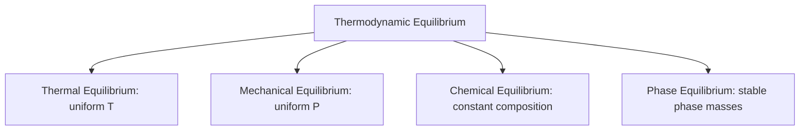
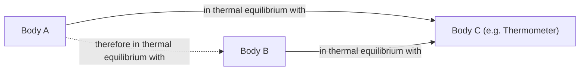

## Thermodynamic Equilibrium and the Zeroth Law

### Thermodynamic Equilibrium

A system is said to be in **thermodynamic equilibrium** if it is simultaneously in thermal, mechanical, chemical, and (where applicable) phase equilibrium. Under equilibrium, no unbalanced potentials (temperature, pressure, chemical, or phase-related driving forces) exist within the system or between the system and its surroundings, so the system exhibits no tendency to spontaneously change state.

**Component Equilibria**

- **Thermal Equilibrium**: Temperature is uniform throughout the system, and no temperature difference exists between the system and its surroundings (if a boundary allows heat transfer). No net heat flow occurs.
- **Mechanical Equilibrium**: Pressure is uniform throughout the system with no unbalanced forces at any point. If the boundary is movable, the pressure inside equals the pressure outside (accounting for any restraining forces).
- **Chemical Equilibrium**: The chemical composition does not change with time — no net diffusion, dissolution, or chemical reaction is occurring.
- **Phase Equilibrium**: When two or more phases (solid, liquid, vapor) are present, the mass of each phase reaches a stable, unchanging value — the rate of phase change in one direction equals the rate in the reverse direction.

A system satisfying all applicable conditions is in **complete thermodynamic equilibrium**, and only then are its properties uniquely defined and consistent throughout — this underlies the validity of the state postulate discussed in system/property/state fundamentals.

### Equilibrium vs. Steady State

These two concepts are often confused but are distinct:

| Concept | Definition | Property Gradients |
| --- | --- | --- |
| Equilibrium | No driving forces at all; properties uniform and unchanging | None (spatially uniform) |
| Steady State | Properties at any fixed point don't change with time | May exist (spatial gradients allowed) |

Example: A metal rod with one end held at 100°C and the other at 20°C, insulated along its length, reaches a **steady state** (temperature distribution is fixed in time) but is **not in thermal equilibrium** (a temperature gradient exists along the rod, and heat continuously flows through it).

### The Zeroth Law of Thermodynamics

**Statement**: If two bodies are each in thermal equilibrium with a third body, then they are in thermal equilibrium with each other.

Formally, if body A is in thermal equilibrium with body C, and body B is in thermal equilibrium with body C, then A and B are in thermal equilibrium with each other — without A and B ever being brought into direct contact.

**Historical Note**: This law was recognized as fundamental only after the First and Second Laws had already been named and numbered. Because it logically precedes them (it must hold for temperature itself to be a meaningful, measurable property), it was designated the "Zeroth" Law rather than renumbering the others. [Unverified: exact attribution of naming is disputed in historical accounts, though R. H. Fowler is commonly credited with formalizing it in the 1930s.]

**Significance**

- It establishes **temperature** as a valid property that can be used to determine whether two systems are in thermal equilibrium, without requiring them to be brought into direct contact.
- It provides the theoretical justification for using a **thermometer**: the thermometer is the "third body" (C). When a thermometer reaches thermal equilibrium with a system, the reading it provides can be compared against a thermometer that has reached equilibrium with a different system, allowing an equilibrium determination between the two systems indirectly.

### Thermometric Properties and Temperature Measurement

A **thermometric property** is a measurable physical characteristic that varies monotonically and reproducibly with temperature, enabling its use as the basis for a thermometer.

| Thermometer Type | Thermometric Property |
| --- | --- |
| Liquid-in-glass (mercury) | Volume/length of liquid column |
| Constant-volume gas thermometer | Pressure of a fixed-volume gas |
| Resistance thermometer (RTD) | Electrical resistance |
| Thermocouple | Thermoelectric EMF (Seebeck effect) |
| Radiation (pyrometer) | Emitted thermal radiation intensity |

**Constant-Volume Gas Thermometer**: Historically significant as the standard against which other thermometers were calibrated, since it can be shown that in the limit of low gas pressure, all gases yield the same temperature reading regardless of the gas used — this limiting behavior underlies the definition of the **ideal-gas temperature scale**, which coincides with the thermodynamic (Kelvin) temperature scale.

### Temperature Scales

Temperature scales are established using fixed, reproducible reference points.

- **Celsius scale**: Historically fixed by the freezing point (0°C) and boiling point (100°C) of water at 1 atm; the modern definition ties it directly to the Kelvin scale by $T(^\circ C) = T(K) - 273.15$.
- **Kelvin scale**: The absolute, thermodynamic temperature scale, with $0\ \text{K}$ defined as absolute zero. [Note: since 2019, the kelvin is defined by fixing the Boltzmann constant, $k = 1.380649 \times 10^{-23}\ \text{J/K}$, rather than by the triple point of water, though the triple point of water remains extremely close to 273.16 K by design.]
- **Fahrenheit and Rankine scales**: Used mainly in the USCS system; Rankine is the absolute counterpart to Fahrenheit, analogous to Kelvin for Celsius.

**Conversion relations:**

$$T(K) = T(^\circ C) + 273.15$$

$$T(R) = T(^\circ F) + 459.67$$

$$T(^\circ F) = 1.8\, T(^\circ C) + 32$$

**Temperature difference conversions** (used when computing $\Delta T$ rather than absolute temperature):

$$\Delta T(K) = \Delta T(^\circ C)$$

$$\Delta T(R) = \Delta T(^\circ F)$$

$$\Delta T(^\circ F) = 1.8\, \Delta T(^\circ C)$$

Note that a temperature *difference* of 1°C equals a difference of 1 K, but this is **not** the same as saying the absolute temperatures are numerically equal — a common source of calculation error.

### Absolute Zero

**Absolute zero** ($0\ \text{K} = -273.15^\circ\text{C}$) is the theoretical temperature at which molecular translational kinetic energy reaches its minimum possible value, and is the zero-point of the thermodynamic temperature scale. Absolute zero is approached but never exactly reached in physical systems — a consequence connected to the Third Law of Thermodynamics [Unverified: exact unattainability is a Third Law implication, formally outside the scope of the Zeroth Law itself, included here for context].

### Worked Example

**Problem**: Three metal blocks, A, B, and C, are tested for thermal equilibrium. Block A is placed in contact with Block C and, after some time, no further heat transfer occurs. Block B is separately placed in contact with Block C, and likewise no further heat transfer occurs. If Block A is at 45°C, what can be concluded about the temperature of Block B, and what is this reasoning called?

**Solution**:

Since A is in thermal equilibrium with C, and B is in thermal equilibrium with C, the Zeroth Law states that A and B must be in thermal equilibrium with each other. Therefore, Block B must also be at $45^\circ\text{C} = 318.15\ \text{K}$, without A and B ever being placed in direct contact. This reasoning — inferring equilibrium indirectly through a common reference body — is precisely the **Zeroth Law of Thermodynamics**, and is the physical principle that validates the practice of using a calibrated thermometer (as body C) to compare temperatures across different systems.

### Key Points

- Thermodynamic equilibrium requires simultaneous thermal, mechanical, chemical, and phase equilibrium.
- Equilibrium (no gradients) is distinct from steady state (time-invariant but possibly spatially non-uniform properties).
- The Zeroth Law establishes that thermal equilibrium is transitive across three bodies, which validates temperature as a measurable, comparable property.
- The Zeroth Law is the theoretical basis for the use of thermometers and thermometric properties.
- Kelvin and Rankine are absolute scales required for thermodynamic calculations; Celsius/Fahrenheit differences equal Kelvin/Rankine differences, but absolute values are offset.

**Related Topics**

- Basic Concepts: Systems, Properties, and States
- Pressure Measurement: Manometers and Barometers
- The First Law of Thermodynamics and Internal Energy
- Ideal Gas Temperature Scale and Equation of State
- The Third Law of Thermodynamics and Absolute Zero
- Temperature Measurement Instrumentation and Calibration Standards