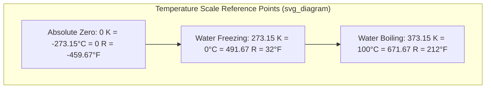
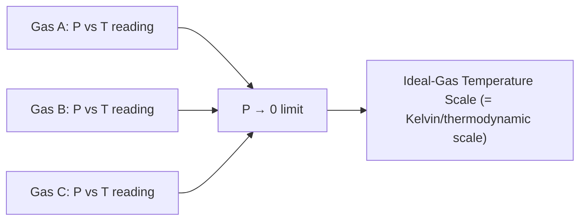

## Temperature Scales and Thermometry

### Temperature as a Physical Quantity

**Temperature** is a macroscopic property that quantifies the average translational kinetic energy of molecular motion within a substance and determines the direction of spontaneous heat transfer — heat flows from a region of higher temperature to one of lower temperature until thermal equilibrium is reached. Temperature is validated as a measurable, comparable property by the Zeroth Law of Thermodynamics, which enables indirect equilibrium comparisons through a common reference body (a thermometer).

### Empirical Temperature Scales

Historically, temperature scales were established by assigning numerical values to two easily reproducible fixed points and dividing the interval between them.

**Celsius Scale**

- Historically defined by the freezing point of water (0°C) and boiling point of water (100°C) at standard atmospheric pressure, divided into 100 equal intervals.
- Modern definition ties it directly to the Kelvin scale: $T(^\circ C) = T(K) - 273.15$.

**Fahrenheit Scale**

- Used primarily in the United States; historically based on a brine mixture (0°F) and human body temperature (originally ~96°F, later refined), now standardized relative to the Rankine scale.
- Water freezes at 32°F and boils at 212°F at standard atmospheric pressure.

### Absolute (Thermodynamic) Temperature Scales

Absolute scales are anchored at **absolute zero** — the theoretical point at which molecular translational kinetic energy is at its minimum — rather than at arbitrary reference substances.

**Kelvin Scale**

- The SI base unit of thermodynamic temperature.
- Historically defined via the triple point of water (273.16 K); as of the 2019 SI redefinition, the kelvin is defined by fixing the Boltzmann constant, $k = 1.380649 \times 10^{-23}\ \text{J/K}$, exactly.
- $0\ \text{K}$ corresponds to absolute zero, $-273.15^\circ\text{C}$.

**Rankine Scale**

- The absolute counterpart to Fahrenheit, used in the USCS system.
- $0\ \text{R}$ corresponds to absolute zero, $-459.67^\circ\text{F}$.

**Why Absolute Scales Matter**: All thermodynamic property relations — the ideal gas law, Carnot efficiency, entropy relations — require absolute temperature. Using Celsius or Fahrenheit directly in these formulas produces incorrect (and sometimes physically nonsensical, e.g., negative absolute values) results.

### Conversion Relations

**Absolute value conversions:**

$$T(K) = T(^\circ C) + 273.15$$

$$T(R) = T(^\circ F) + 459.67$$

$$T(R) = 1.8\, T(K)$$

$$T(^\circ F) = 1.8\, T(^\circ C) + 32$$

**Temperature difference conversions** (used for $\Delta T$, not absolute values):

$$\Delta T(K) = \Delta T(^\circ C)$$

$$\Delta T(R) = \Delta T(^\circ F)$$

$$\Delta T(^\circ F) = 1.8\, \Delta T(^\circ C)$$

A common calculation pitfall: a temperature change of $10^\circ\text{C}$ equals a change of $10\ \text{K}$ — **not** $283.15\ \text{K}$. Always distinguish between converting an absolute temperature and converting a temperature interval.

### Thermometry: Principles and Instruments

**Thermometry** is the science and practice of temperature measurement, relying on a **thermometric property** — a physical characteristic that varies monotonically, reproducibly, and measurably with temperature.

**Common Thermometric Properties and Devices**

| Device | Thermometric Property | Typical Range | Notes |
| --- | --- | --- | --- |
| Liquid-in-glass (mercury/alcohol) | Volume expansion of liquid | −40°C to 350°C (Hg) | Simple, direct reading; limited precision |
| Constant-volume gas thermometer | Pressure of fixed-volume gas | Very wide, used for calibration standards | Basis of the ideal-gas temperature scale |
| Resistance Temperature Detector (RTD) | Electrical resistance of a metal (commonly platinum) | −200°C to 850°C | High accuracy, used in industrial/lab standards |
| Thermistor | Electrical resistance of a semiconductor | −90°C to 130°C | High sensitivity over narrow range, nonlinear response |
| Thermocouple | Thermoelectric EMF (Seebeck effect) at a junction of two dissimilar metals | −270°C to 2300°C (type-dependent) | Fast response, wide range, common in industrial/power plant systems |
| Radiation pyrometer / infrared thermometer | Emitted thermal (blackbody) radiation intensity | Very high temperatures, non-contact | Used where contact is impractical (furnaces, molten metal) |

**Constant-Volume Gas Thermometer and the Ideal-Gas Temperature Scale**

This device measures the pressure of a fixed amount of gas held at constant volume. As the amount of gas is reduced toward zero (the low-pressure limit), the temperature readings obtained using different gases converge to the same value — this convergence defines the **ideal-gas temperature scale**, which is shown to be identical to the thermodynamic (Kelvin) scale independent of any particular gas's properties. This equivalence is a key reason the constant-volume gas thermometer historically served as the calibration reference for other thermometer types.

**Thermocouples in Power and Energy Systems**

Thermocouples are especially prevalent in power plant and energy-conversion instrumentation due to their wide range, ruggedness, and fast response:

- **Type K** (Chromel–Alumel): general-purpose, −200°C to 1260°C, widely used in boiler and flue-gas monitoring.
- **Type J** (Iron–Constantan): −40°C to 750°C, common in older industrial equipment.
- **Type T** (Copper–Constantan): −200°C to 350°C, used for lower-temperature, high-accuracy applications.
- **Type S/R/B** (Platinum–Rhodium alloys): used for very high temperatures (up to ~1700–1800°C), such as in furnace or gas turbine combustor monitoring. [Behavior may vary by manufacturer tolerance class and calibration standard — consult the applicable ASTM E230/IEC 60584 reference tables for precise values.]

### International Temperature Scale (ITS)

To ensure practical measurements are traceable and consistent worldwide without requiring every laboratory to rely on a primary gas thermometer, the **International Temperature Scale of 1990 (ITS-90)** defines a set of fixed, reproducible calibration points (e.g., triple point of water, freezing points of specific metals) and standard interpolating instruments (platinum resistance thermometers, radiation thermometers) to approximate the thermodynamic temperature scale as closely as practicable. [Unverified: revisions or successor scales beyond ITS-90 may exist depending on current metrology standards; verify against the latest BIPM (Bureau International des Poids et Mesures) publications if precision metrology is the objective.]

### Worked Example

**Problem**: A boiler feedwater temperature is measured at 185°F using a thermocouple. Convert this reading to Celsius, Kelvin, and Rankine, and determine the temperature rise in each scale if the water is subsequently heated to 250°F.

**Solution**:

**Convert 185°F:**

$$T(^\circ C) = \frac{185 - 32}{1.8} = 85^\circ\text{C}$$

$$T(K) = 85 + 273.15 = 358.15\ \text{K}$$

$$T(R) = 185 + 459.67 = 644.67\ \text{R}$$

**Temperature rise (185°F → 250°F):**

$$\Delta T(^\circ F) = 250 - 185 = 65^\circ\text{F}$$

$$\Delta T(^\circ C) = \frac{65}{1.8} = 36.1^\circ\text{C} = 36.1\ \text{K}$$

$$\Delta T(R) = 65\ \text{R}$$

Note that the *rise* converts directly using the interval relations ($\Delta T(R) = \Delta T(^\circ F)$), while the *absolute* readings required the full offset conversion — illustrating the distinction highlighted earlier between absolute and interval conversions.

### Key Points

- Temperature scales are either empirical (Celsius, Fahrenheit — tied to specific reference substances) or absolute/thermodynamic (Kelvin, Rankine — anchored at absolute zero).
- All thermodynamic property relations require absolute temperature (K or R).
- Absolute-value conversions include an offset; temperature-difference conversions do not — this distinction is a frequent source of calculation errors.
- The constant-volume gas thermometer, in the low-pressure limit, defines the ideal-gas temperature scale, which coincides with the thermodynamic (Kelvin) scale.
- Thermocouples, RTDs, and thermistors are the dominant practical thermometry devices in power and energy-conversion instrumentation, selected based on range, accuracy, and response-time requirements.
- The ITS-90 (or successor standards) provides practical, reproducible calibration points to approximate the thermodynamic scale in real-world measurement.

**Next Steps**

- Pressure Measurement: Manometers, Barometers, and Pressure Transducers
- The Zeroth Law of Thermodynamics and Thermal Equilibrium
- Ideal Gas Law and Equations of State
- Sensor Selection and Instrumentation for Power Plant Monitoring
- Uncertainty and Calibration in Engineering Measurements