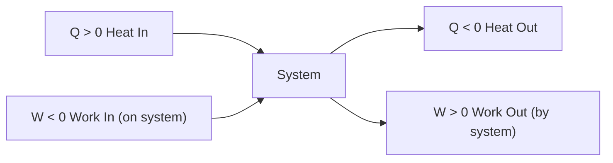
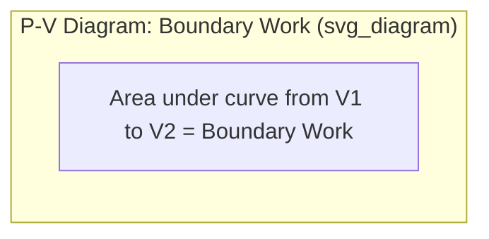

## Work and Heat as Modes of Energy Transfer

### Energy Transfer Across a System Boundary

Energy can cross the boundary of a closed system in exactly two forms: **heat** and **work**. Both are **path functions** (not properties), meaning their values depend on the process undergone, not merely on the initial and final states. Neither heat nor work is a property "contained" within a system — a system possesses energy (internal, kinetic, potential), but heat and work exist only as transient interactions occurring during a process.

**Sign Convention** (thermodynamic convention commonly used in engineering texts):

- $Q > 0$: heat transferred **to** the system (heat input)
- $Q < 0$: heat transferred **from** the system (heat rejected)
- $W > 0$: work done **by** the system (work output)
- $W < 0$: work done **on** the system (work input)

[Note: Some references, particularly in physics and certain modern engineering texts, use the opposite convention for work ($W>0$ for work done on the system). Always confirm the convention in use before applying the First Law equation $\Delta U = Q - W$ vs. $\Delta U = Q + W$.]

### Heat as a Mode of Energy Transfer

**Heat** ($Q$) is energy transferred between a system and its surroundings due solely to a **temperature difference**. Heat transfer occurs spontaneously from a higher-temperature region to a lower-temperature region, and ceases once thermal equilibrium is reached.

**Key Characteristics**

- Heat is not a property; it exists only during a process, at the boundary — it is a **boundary phenomenon**.
- A system does not "contain" heat; it contains internal energy. Referring to "heat in a system" is a common but technically imprecise usage.
- Heat transfer occurs by three mechanisms: **conduction** (through a stationary medium via molecular/electron interaction), **convection** (via bulk fluid motion combined with conduction), and **radiation** (via electromagnetic waves, requiring no medium).
- A process during which no heat crosses the boundary is called **adiabatic** ($Q = 0$), achieved either through perfect insulation or by the process occurring so rapidly that negligible heat transfer has time to occur.

**Heat Transfer Rate**

$$\dot{Q} = \frac{\delta Q}{dt}, \qquad Q = \int_1^2 \dot{Q}\, dt$$

For a constant heat transfer rate over time interval $\Delta t$:

$$Q = \dot{Q} \cdot \Delta t$$

### Work as a Mode of Energy Transfer

**Work** ($W$) is energy transfer associated with a force acting through a displacement — more generally, any energy interaction between a system and surroundings that is **not** caused by a temperature difference and can, in principle, be entirely converted to the raising of a weight (a standard mechanical definition used to unambiguously distinguish work from heat).

**Key Characteristics**

- Like heat, work is a boundary phenomenon and a path function, not a property.
- Work done during a process depends on the details of the path, not just the end states — hence the differential notation $\delta W$ (inexact differential) rather than $dW$.

**Quasi-Equilibrium Boundary (Moving Boundary) Work**

The most common work mode in piston-cylinder devices, resulting from expansion or compression of the system boundary against a resisting pressure:

$$W_b = \int_1^2 P\, dV$$

This integral requires the process to be quasi-equilibrium (so that $P$ is a well-defined, uniform property throughout the system at every instant); it represents the area under the process curve on a $P$–$V$ diagram.

**Boundary Work for Common Processes**

| Process | Boundary Work Formula |
| --- | --- |
| Isobaric ($P = $ const) | $W_b = P(V_2 - V_1)$ |
| Isothermal, ideal gas ($T=$ const) | $W_b = P_1 V_1 \ln\left(\dfrac{V_2}{V_1}\right)$ |
| Polytropic ($PV^n = $ const, $n \neq 1$) | $W_b = \dfrac{P_2 V_2 - P_1 V_1}{1-n}$ |
| Isochoric ($V = $ const) | $W_b = 0$ |

**Other Common Work Modes**

| Work Mode | Formula | Application Context |
| --- | --- | --- |
| Shaft work | $W_{sh} = 2\pi n T_{torque}$ | Rotating shafts (turbines, pumps, compressors); $n$ = revolutions, $T_{torque}$ = torque |
| Spring work | $W_{spring} = \tfrac{1}{2}k(x_2^2 - x_1^2)$ | Linear elastic springs; $k$ = spring constant |
| Electrical work | $W_e = VI\,\Delta t$ | Resistive heating, electrical generators/motors |
| Work of a stretched wire/surface tension | $W = \sigma_s\, dA$ (surface); $W = \mathfrak{F}\, dx$ (wire) | Specialized/negligible in most power-cycle analysis |

**Power** (rate of work):

$$\dot{W} = \frac{\delta W}{dt}$$

For shaft power specifically:

$$\dot{W}_{sh} = 2\pi \dot{n} T_{torque} = \omega T_{torque}$$

where $\dot{n}$ is rotational speed (rev/s) and $\omega$ is angular velocity (rad/s).

### Comparing Heat and Work

| Aspect | Heat ($Q$) | Work ($W$) |
| --- | --- | --- |
| Driving mechanism | Temperature difference | Force/displacement, or any non-thermal interaction |
| Nature | Path function | Path function |
| Differential | Inexact ($\delta Q$) | Inexact ($\delta W$) |
| Special case (zero interaction) | Adiabatic process | Rigid boundary, no shaft/electrical work |
| Directionality | Spontaneously flows high T → low T | Direction set by the applied force/process |

Both heat and work are **energy in transit** — once transferred, the energy becomes indistinguishable as part of the system's or surroundings' internal energy, kinetic energy, or potential energy. This is a central conceptual point: after a process, one cannot look at the resulting system and determine "how much was transferred as heat" versus "how much as work" — only the net energy change is a system property.

### Energy Transfer in the First Law Context

The two path functions combine with the (property) change in total energy to give the closed-system energy balance (First Law), covered comprehensively in the corresponding chapter topic:

$$\Delta E = Q - W$$

(using the convention: $Q$ positive in, $W$ positive out). For a stationary closed system where internal energy is the only relevant energy form:

$$\Delta U = Q - W$$

This relation is the quantitative expression of energy conservation applied to the two transfer modes discussed here.

### Worked Example

**Problem**: A piston-cylinder device contains gas that expands from $V_1 = 0.1\ \text{m}^3$ to $V_2 = 0.3\ \text{m}^3$ at a constant pressure of 200 kPa. During this process, 15 kJ of heat is added to the gas. Determine the boundary work done and the change in internal energy.

**Solution**:

**Boundary work** (isobaric process):

$$W_b = P(V_2 - V_1) = 200\ \text{kPa} \times (0.3 - 0.1)\ \text{m}^3 = 40\ \text{kJ}$$

**Change in internal energy** (First Law, stationary closed system, $W = W_b = 40\ \text{kJ}$ done by the system):

$$\Delta U = Q - W = 15 - 40 = -25\ \text{kJ}$$

The internal energy decreases by 25 kJ — physically, the gas does more boundary work during expansion than the heat supplied to it, so the deficit is drawn from the gas's own internal energy (resulting in a temperature drop, consistent with ideal gas behavior at constant pressure).

### Key Points

- Heat and work are both path-dependent, boundary-phenomena modes of energy transfer — neither is a property of the system.
- Heat transfer is driven exclusively by a temperature difference; work encompasses all other energy transfer interactions (mechanical, electrical, shaft, spring, etc.).
- Boundary (moving-boundary) work, $W_b = \int P\,dV$, applies only under the quasi-equilibrium assumption and represents the area under the process curve on a $P$–$V$ diagram.
- Sign conventions vary between texts; always verify whether $W>0$ denotes work done by or on the system before applying energy balance equations.
- Once transferred, heat and work become indistinguishable as stored energy within the system — only the net energy change, not the "history" of how it arrived, is a property.

**Next Steps**

- The First Law of Thermodynamics for Closed Systems
- Specific Heats and Internal Energy of Ideal Gases
- Energy Balance for Control Volumes (Open Systems)
- Enthalpy and Flow Work
- Second Law of Thermodynamics and the Limits on Heat-to-Work Conversion
- Heat Transfer Mechanisms: Conduction, Convection, and Radiation