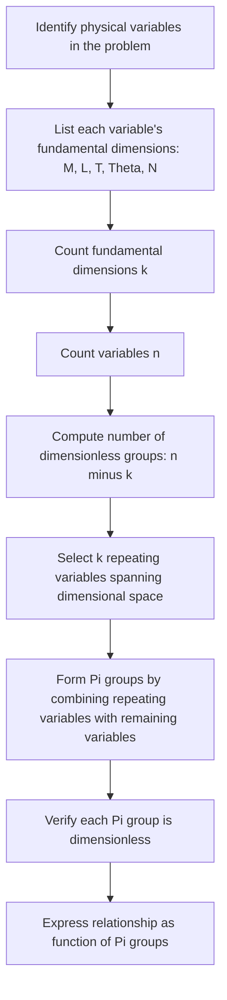

## Units and Dimensional Analysis in Thermodynamics

### Introduction

Thermodynamics relies on precise, consistent quantification of energy, mass, temperature, and their derived properties. Units and dimensional analysis provide the mathematical scaffolding that ensures physical equations remain valid regardless of the measurement system used, and they serve as a built-in error-checking mechanism for engineering calculations involving power generation, heat transfer, and energy conversion.

### Fundamental Dimensions

Every physical quantity in thermodynamics can be expressed in terms of a small set of base dimensions:

| Dimension | Symbol | SI Base Unit |
| --- | --- | --- |
| Mass | $M$ | kilogram (kg) |
| Length | $L$ | meter (m) |
| Time | $T$ | second (s) |
| Temperature | $\Theta$ | kelvin (K) |
| Amount of substance | $N$ | mole (mol) |
| Electric current | $I$ | ampere (A) |

Derived thermodynamic quantities are combinations of these base dimensions. For example, energy has dimension $[M L^2 T^{-2}]$, regardless of whether it is expressed in joules, calories, or BTUs.

### Common Unit Systems

**SI (International System)**

The standard system for engineering thermodynamics globally.

- Energy: joule (J) = $\text{kg·m}^2/\text{s}^2$
- Power: watt (W) = J/s
- Pressure: pascal (Pa) = N/m²
- Temperature: kelvin (K)

**English Engineering System (USCS)**

Still common in US industry, particularly power plant and HVAC engineering.

- Energy: British Thermal Unit (BTU)
- Power: horsepower (hp) or BTU/hr
- Pressure: pounds-force per square inch (psi)
- Temperature: Rankine (R) or Fahrenheit (°F)

**CGS (Centimeter-Gram-Second)**

Occasionally seen in older physical chemistry and physics literature.

- Energy: erg
- Pressure: barye

### Key Thermodynamic Quantities and Their Dimensions

**Energy**

$$[E] = M L^2 T^{-2}$$

SI unit: joule (J). 1 J = 1 kg·m²/s²

**Power**

$$[P] = M L^2 T^{-3}$$

SI unit: watt (W). 1 W = 1 J/s

**Pressure**

$$[p] = M L^{-1} T^{-2}$$

SI unit: pascal (Pa). 1 Pa = 1 N/m²

**Specific Energy (per unit mass)**

$$[e] = L^2 T^{-2}$$

SI unit: J/kg

**Specific Heat Capacity**

$$[c] = L^2 T^{-2} \Theta^{-1}$$

SI unit: J/(kg·K)

**Entropy**

$$[S] = M L^2 T^{-2} \Theta^{-1}$$

SI unit: J/K

**Specific Entropy**

$$[s] = L^2 T^{-2} \Theta^{-1}$$

SI unit: J/(kg·K)

**Molar Quantities**

Divide the extensive quantity by amount of substance $N$ (mol). Molar energy: J/mol; molar entropy: J/(mol·K)

### Temperature Scales and Conversion

Temperature is unique among thermodynamic quantities because two scale types exist: relative (Celsius, Fahrenheit) and absolute (Kelvin, Rankine). Absolute scales are required in thermodynamic equations involving ratios (e.g., ideal gas law, Carnot efficiency) because they originate at absolute zero.

**Conversion relationships:**

$$T_K = T_{°C} + 273.15$$

$$T_R = T_{°F} + 459.67$$

$$T_R = 1.8 \, T_K$$

$$T_{°F} = 1.8 \, T_{°C} + 32$$

**Critical distinction — magnitude vs. reading:**

A temperature *difference* converts differently from an absolute temperature *reading*.

$$\Delta T_{°C} = \Delta T_K \quad \text{(a 1 K change equals a 1°C change)}$$

$$\Delta T_{°F} = 1.8 \, \Delta T_{°C}$$

This distinction is a frequent source of calculation error: specific heat capacity in kJ/(kg·°C) is numerically identical to kJ/(kg·K), but converting an absolute temperature in a formula like the ideal gas law must always use K or R, never °C or °F.

### Pressure: Absolute vs. Gauge

Pressure measurements in thermodynamics require careful distinction between reference points:

$$p_{abs} = p_{gauge} + p_{atm}$$

Most thermodynamic property tables (steam tables, refrigerant tables) tabulate **absolute pressure**. Field instruments (pressure gauges, manometers) typically read **gauge pressure**. Using gauge pressure directly in an equation of state produces significant errors, particularly at low pressures where the atmospheric contribution is proportionally large.

**Common pressure unit conversions:**

| Unit | Pa equivalent |
| --- | --- |
| 1 bar | $10^5$ Pa |
| 1 atm | 101,325 Pa |
| 1 psi | 6,894.76 Pa |
| 1 mmHg (torr) | 133.322 Pa |
| 1 kPa | 1,000 Pa |

### Dimensional Homogeneity Principle

Every valid physical equation must be **dimensionally homogeneous**: all additive terms on both sides must share identical dimensions. This principle underlies dimensional analysis as a verification tool.

**Example — first law of thermodynamics (closed system):**

$$\Delta U = Q - W$$

Checking dimensions: $[\Delta U] = [Q] = [W] = M L^2 T^{-2}$ (energy). The equation is dimensionally consistent.

**Example — ideal gas law:**

$$pV = nRT$$

Dimensional check:

- $[p][V] = (M L^{-1} T^{-2})(L^3) = M L^2 T^{-2}$ (energy)
- $[n][R][T] = (N)(M L^2 T^{-2} \Theta^{-1} N^{-1})(\Theta) = M L^2 T^{-2}$ (energy)

Both sides reduce to energy dimensions, confirming consistency. This is also why the universal gas constant $R$ has units of J/(mol·K) — it is precisely the conversion factor that reconciles pressure-volume terms with amount-temperature terms.

### The Buckingham Pi Theorem

For more complex dimensional analysis problems — such as deriving dimensionless groups in heat transfer or fluid-thermal systems — the **Buckingham Pi theorem** provides a systematic method.

**Statement:** If a physical problem involves $n$ variables and $k$ independent fundamental dimensions, the relationship between variables can be expressed using $n - k$ independent dimensionless groups (Π groups).

**Procedure:**

1. List all relevant variables and their dimensions
2. Determine the number of fundamental dimensions $k$ involved
3. Select $k$ repeating variables that span the dimensional space
4. Form $n-k$ dimensionless Π groups by combining repeating variables with each remaining variable
5. Express the physical relationship as $f(\Pi_1, \Pi_2, \ldots) = 0$

**Example — Nusselt number derivation (convective heat transfer):**

Variables: convection coefficient $h$, characteristic length $L$, thermal conductivity $k$, velocity $v$, density $\rho$, viscosity $\mu$, specific heat $c_p$

This yields three classical dimensionless groups used throughout thermodynamics and heat transfer:

$$Nu = \frac{hL}{k} \quad \text{(Nusselt number — convective vs. conductive heat transfer)}$$

$$Re = \frac{\rho v L}{\mu} \quad \text{(Reynolds number — inertial vs. viscous forces)}$$

$$Pr = \frac{\mu c_p}{k} \quad \text{(Prandtl number — momentum vs. thermal diffusivity)}$$

These groups let engineers correlate heat transfer behavior (e.g., $Nu = f(Re, Pr)$) independent of the unit system or the physical scale of the apparatus, which is essential for scaling laboratory results to full-size power plant components like condensers and boilers.

### Dimensionless Numbers Relevant to Power/Energy Systems

| Dimensionless Group | Formula | Physical Meaning |
| --- | --- | --- |
| Reynolds number | $Re = \rho v L / \mu$ | Flow regime (laminar/turbulent) |
| Prandtl number | $Pr = \mu c_p / k$ | Ratio of momentum to thermal diffusivity |
| Nusselt number | $Nu = hL/k$ | Enhancement of heat transfer by convection |
| Mach number | $Ma = v/c$ | Compressibility effects (turbines, nozzles) |
| Biot number | $Bi = hL_c/k_s$ | Internal vs. surface thermal resistance |
| Fourier number | $Fo = \alpha t / L_c^2$ | Dimensionless time in transient conduction |
| Carnot efficiency ratio | $\eta_{Carnot} = 1 - T_C/T_H$ | Theoretical max efficiency (absolute T required) |

### Worked Example: Unit Consistency in Power Cycle Calculation

**Problem:** A steam turbine receives steam with specific enthalpy $h_1 = 3,200 \text{ kJ/kg}$ at a mass flow rate $\dot{m} = 15 \text{ kg/s}$, and exits at $h_2 = 2,300 \text{ kJ/kg}$. Determine the power output.

**Governing equation (steady-flow energy equation, work term):**

$$\dot{W} = \dot{m}(h_1 - h_2)$$

**Dimensional check:**

$$[\dot{m}][h] = \left(\frac{kg}{s}\right)\left(\frac{kJ}{kg}\right) = \frac{kJ}{s} = kW$$

This confirms the result will emerge in kilowatts without additional conversion factors, since kJ/kg and kg/s are dimensionally compatible for direct multiplication.

**Calculation:**

$$\dot{W} = (15 \text{ kg/s})(3200 - 2300 \text{ kJ/kg}) = (15)(900) = 13{,}500 \text{ kW} = 13.5 \text{ MW}$$

**Note:** Had the enthalpy been provided in BTU/lbm and mass flow in kg/s, a unit conversion would be mandatory before multiplication — mixing unit systems within a single equation is a common source of order-of-magnitude errors in practice. [Unverified: the specific enthalpy values here are illustrative, not from an actual steam table lookup.]

### Common Sources of Dimensional Error in Practice

**Key Points**

- Mixing absolute and gauge pressure in equations of state (ideal gas law requires absolute pressure)
- Using Celsius/Fahrenheit instead of Kelvin/Rankine in ratio-based formulas (Carnot efficiency, ideal gas law)
- Confusing mass-basis and mole-basis properties (specific heat in J/(kg·K) vs. molar heat capacity in J/(mol·K))
- Overlooking the distinction between $g_c$ (gravitational conversion constant) in USCS systems, where Newton's second law requires $F = ma/g_c$ with $g_c = 32.174 \text{ lbm·ft/(lbf·s}^2)$
- Failing to convert energy units consistently within an equation (e.g., mixing BTU and ft·lbf without a conversion factor)
- Treating specific and extensive properties interchangeably without accounting for mass or mole basis

### The Gravitational Conversion Constant ($g_c$)

In USCS units, mass (lbm) and force (lbf) are defined such that a proportionality constant is needed in Newton's second law:

$$F = \frac{m a}{g_c}, \quad g_c = 32.174 \; \frac{\text{lbm·ft}}{\text{lbf·s}^2}$$

This constant is dimensionally necessary because lbm and lbf are independently defined units (1 lbf is defined as the force that accelerates 1 lbm at standard gravity, 32.174 ft/s²), unlike SI where the newton is derived directly from kg, m, and s. Thermodynamic property tables in USCS units (e.g., specific volume, enthalpy) implicitly embed this constant, so engineers working in mixed unit environments must track it explicitly to avoid an error on the order of the numeric value of standard gravity.

### Illustration: Dimensional Analysis Workflow

### Diagram: Dimension Hierarchy in Thermodynamic Quantities (svg_diagram)

<svg xmlns="http://www.w3.org/2000/svg" viewBox="0 0 780 460" font-family="Arial, sans-serif">
<text x="390" y="30" text-anchor="middle" font-size="18" font-weight="bold" fill="#1a1a1a">Dimension Hierarchy in Thermodynamic Quantities (svg_diagram)</text>
<rect x="300" y="55" width="180" height="45" rx="6" fill="#2c5f8a" />
<text x="390" y="83" text-anchor="middle" font-size="14" fill="white" font-weight="bold">Base Dimensions</text>
<rect x="60" y="140" width="100" height="40" rx="6" fill="#4a7fa8" />
<text x="110" y="165" text-anchor="middle" font-size="12" fill="white">M (mass)</text>
<rect x="180" y="140" width="100" height="40" rx="6" fill="#4a7fa8" />
<text x="230" y="165" text-anchor="middle" font-size="12" fill="white">L (length)</text>
<rect x="300" y="140" width="100" height="40" rx="6" fill="#4a7fa8" />
<text x="350" y="165" text-anchor="middle" font-size="12" fill="white">T (time)</text>
<rect x="420" y="140" width="120" height="40" rx="6" fill="#4a7fa8" />
<text x="480" y="165" text-anchor="middle" font-size="12" fill="white">Θ (temperature)</text>
<rect x="560" y="140" width="100" height="40" rx="6" fill="#4a7fa8" />
<text x="610" y="165" text-anchor="middle" font-size="12" fill="white">N (amount)</text>
<line x1="390" y1="100" x2="110" y2="140" stroke="#888" stroke-width="1.5" />
<line x1="390" y1="100" x2="230" y2="140" stroke="#888" stroke-width="1.5" />
<line x1="390" y1="100" x2="350" y2="140" stroke="#888" stroke-width="1.5" />
<line x1="390" y1="100" x2="480" y2="140" stroke="#888" stroke-width="1.5" />
<line x1="390" y1="100" x2="610" y2="140" stroke="#888" stroke-width="1.5" />
<rect x="250" y="230" width="140" height="45" rx="6" fill="#c0392b" />
<text x="320" y="253" text-anchor="middle" font-size="13" fill="white" font-weight="bold">Energy</text>
<text x="320" y="268" text-anchor="middle" font-size="10" fill="white">M L² T⁻²</text>
<rect x="410" y="230" width="140" height="45" rx="6" fill="#c0392b" />
<text x="480" y="253" text-anchor="middle" font-size="13" fill="white" font-weight="bold">Power</text>
<text x="480" y="268" text-anchor="middle" font-size="10" fill="white">M L² T⁻³</text>
<line x1="110" y1="180" x2="320" y2="230" stroke="#888" stroke-width="1" />
<line x1="230" y1="180" x2="320" y2="230" stroke="#888" stroke-width="1" />
<line x1="350" y1="180" x2="320" y2="230" stroke="#888" stroke-width="1" />
<line x1="350" y1="180" x2="480" y2="230" stroke="#888" stroke-width="1" />
<rect x="80" y="320" width="150" height="50" rx="6" fill="#27ae60" />
<text x="155" y="341" text-anchor="middle" font-size="12" fill="white" font-weight="bold">Specific Energy</text>
<text x="155" y="357" text-anchor="middle" font-size="10" fill="white">L² T⁻² (J/kg)</text>
<rect x="250" y="320" width="150" height="50" rx="6" fill="#27ae60" />
<text x="325" y="341" text-anchor="middle" font-size="12" fill="white" font-weight="bold">Entropy</text>
<text x="325" y="357" text-anchor="middle" font-size="10" fill="white">M L² T⁻² Θ⁻¹ (J/K)</text>
<rect x="420" y="320" width="150" height="50" rx="6" fill="#27ae60" />
<text x="495" y="341" text-anchor="middle" font-size="12" fill="white" font-weight="bold">Specific Heat</text>
<text x="495" y="357" text-anchor="middle" font-size="10" fill="white">L² T⁻² Θ⁻¹</text>
<rect x="590" y="320" width="150" height="50" rx="6" fill="#27ae60" />
<text x="665" y="341" text-anchor="middle" font-size="12" fill="white" font-weight="bold">Pressure</text>
<text x="665" y="357" text-anchor="middle" font-size="10" fill="white">M L⁻¹ T⁻² (Pa)</text>
<line x1="320" y1="275" x2="155" y2="320" stroke="#888" stroke-width="1" />
<line x1="320" y1="275" x2="325" y2="320" stroke="#888" stroke-width="1" />
<line x1="320" y1="275" x2="495" y2="320" stroke="#888" stroke-width="1" />
<line x1="230" y1="180" x2="665" y2="320" stroke="#888" stroke-width="1" />
<rect x="20" y="400" width="740" height="40" rx="6" fill="#f4f4f4" stroke="#ccc" />
<text x="390" y="425" text-anchor="middle" font-size="11" fill="#444">All derived quantities reduce to combinations of the five base dimensions above</text>
</svg>

### Related Topics

- Zeroth Law of Thermodynamics and Temperature Scale Definition
- Ideal Gas Law and Equations of State
- First Law of Thermodynamics for Closed and Open Systems
- Steam Tables and Property Interpolation
- Heat Transfer Correlations and Dimensionless Groups
- Second Law of Thermodynamics and Entropy
- Carnot Cycle and Theoretical Efficiency Limits
- Fluid Mechanics Fundamentals for Thermal Systems (Reynolds, Mach number regimes)