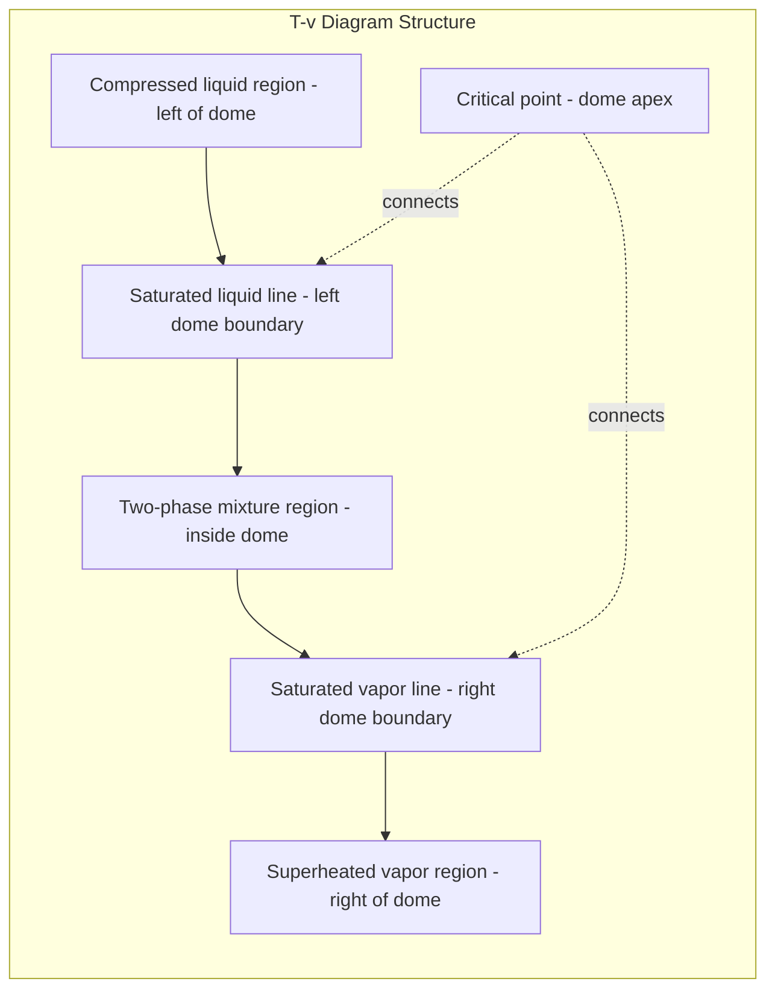
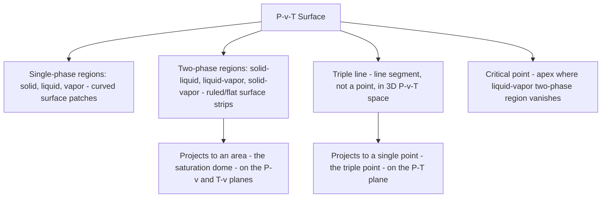

## Phase Behavior and P-v-T Surfaces

### Introduction

A pure substance's thermodynamic state can exist in solid, liquid, or vapor phases, and the relationships among pressure, specific volume, and temperature during these phases and their transitions form the foundation for analyzing power cycles, refrigeration systems, and heat exchangers. The P-v-T surface is a three-dimensional representation that captures all possible equilibrium states of a pure substance in a single geometric construct.

### Pure Substance Definition

A **pure substance** has a fixed, homogeneous chemical composition throughout, regardless of phase. Water (as liquid, ice, or steam) is a pure substance; a mixture of liquid air and gaseous air is not, because the composition of each phase differs due to different condensation temperatures of nitrogen and oxygen. Most power cycle working fluids (water/steam, refrigerants) are treated as pure substances.

### Phases of a Pure Substance

**Key Points**

- **Solid phase**: Molecules arranged in a rigid lattice with strong intermolecular bonds; minimal molecular motion (vibration only)
- **Liquid phase**: Molecules retain close spacing but can move relative to one another; intermediate intermolecular forces
- **Vapor phase**: Molecules widely spaced with negligible intermolecular forces except during collisions; molecules move freely

Within the liquid and vapor regions, additional subdivisions are critical for engineering analysis:

- **Compressed (subcooled) liquid**: Liquid at a temperature below the saturation temperature for its pressure
- **Saturated liquid**: Liquid at the point of imminent vaporization
- **Saturated liquid-vapor mixture**: Both phases coexist in equilibrium (the "wet region" or "dome")
- **Saturated vapor**: Vapor at the point of imminent condensation
- **Superheated vapor**: Vapor at a temperature above the saturation temperature for its pressure

### Phase-Change Terminology at Constant Pressure

Consider heating liquid water at 1 atm from 20°C:

1. **Compressed liquid heating** (20°C → 100°C): Temperature rises, volume increases slightly
2. **Saturated liquid state** (100°C, 1 atm): First bubble of vapor forms
3. **Vaporization** (100°C, constant): Temperature remains fixed while quality (vapor fraction) increases from 0 to 1; volume increases dramatically
4. **Saturated vapor state** (100°C, 1 atm): Last drop of liquid vaporizes
5. **Superheated vapor heating** (100°C → higher T): Temperature rises again at constant pressure

This behavior — constant temperature during phase change at fixed pressure — is a defining characteristic of a pure substance and the basis for the flat portions of T-v and P-v diagrams within the two-phase dome.

### Saturation Temperature and Saturation Pressure

**Saturation temperature** ($T_{sat}$): the temperature at which a pure substance changes phase at a given pressure.

**Saturation pressure** ($P_{sat}$): the pressure at which a pure substance changes phase at a given temperature.

These are not independent — for a pure substance, $T_{sat}$ and $P_{sat}$ are uniquely paired along the saturation curve. This is why steam tables list saturation pressure as a function of saturation temperature (or vice versa) rather than treating them as independent variables. This dependency is the reason pressure cookers work: raising pressure raises $T_{sat}$, allowing water to boil (and cook food) at temperatures above 100°C.

### Quality (Vapor Mass Fraction)

Within the saturated liquid-vapor mixture region, an additional property called **quality** ($x$) is needed to fully specify the state, since temperature and pressure alone are not independent there.

$$x = \frac{m_{vapor}}{m_{total}} = \frac{m_g}{m_f + m_g}$$

Quality ranges from 0 (saturated liquid) to 1 (saturated vapor) and has no meaning outside the two-phase region.

**Property averaging using quality** (for any specific property $y$ — specific volume, enthalpy, internal energy, entropy):

$$y = y_f + x (y_g - y_f) = y_f + x \, y_{fg}$$

where subscript $f$ denotes saturated liquid, $g$ denotes saturated vapor, and $y_{fg} = y_g - y_f$ denotes the difference (e.g., $h_{fg}$ is the latent heat of vaporization).

**Example:** Steam at 200 kPa has $v_f = 0.001061 \text{ m}^3/\text{kg}$ and $v_g = 0.8857 \text{ m}^3/\text{kg}$. At quality $x = 0.6$:

$$v = 0.001061 + 0.6(0.8857 - 0.001061) = 0.001061 + 0.531 = 0.532 \text{ m}^3/\text{kg}$$

### Critical Point

The **critical point** is the state at which the saturated liquid and saturated vapor states become identical — the distinction between liquid and vapor phases disappears. Beyond the critical point, no amount of pressure will cause a distinct liquid phase to form upon cooling; the substance transitions smoothly between liquid-like and vapor-like states.

**Water's critical point:** $T_{cr} = 373.95°C$ (647.10 K), $P_{cr} = 22.06 \text{ MPa}$, $v_{cr} = 0.003106 \text{ m}^3/\text{kg}$

**Key Points**

- Above $P_{cr}$ and $T_{cr}$ simultaneously, the substance is called **supercritical fluid**
- At the critical point, $h_{fg} = 0$ and $v_{fg} = 0$ (saturated liquid and vapor properties converge)
- Supercritical steam cycles (used in advanced coal and some Rankine power plants) operate above water's critical point to improve thermal efficiency, avoiding the two-phase region entirely during boiler heat addition

### Triple Point

The **triple point** is the unique state at which solid, liquid, and vapor phases coexist simultaneously in equilibrium. For water, this occurs at $T_{tp} = 0.01°C$ (273.16 K), $P_{tp} = 0.6117 \text{ kPa}$.

The triple point is a single, fixed point (not a line), unlike the saturation curves which are lines in P-T space. This precision made the triple point of water the basis for defining the kelvin in earlier SI conventions [Unverified: the 2019 SI redefinition base the kelvin on the Boltzmann constant instead, so the triple point's role as a fixed reference has since changed].

### T-v Diagram

The temperature–specific volume diagram plots isobars (constant-pressure lines) and reveals the saturation dome shape.

As pressure increases, isobars shift such that the flat (constant-T) segment within the dome shrinks, converging to a single point at the critical pressure — this is the geometric origin of the dome shape.

### P-v Diagram

The pressure–specific volume diagram is structurally similar to the T-v diagram but plots isotherms (constant-temperature lines) instead of isobars. Unlike isobars on a T-v diagram, isotherms on a P-v diagram *slope downward* through the two-phase region (since increasing volume at constant T during vaporization requires decreasing pressure only outside the dome — within the dome itself at fixed T, pressure is also fixed at $P_{sat}(T)$, so the isotherm is flat inside the dome and curves outside it).

### P-T Diagram (Phase Diagram)

The pressure–temperature diagram collapses the two-phase regions (which are areas in P-v and T-v space) into single lines, because $T_{sat}$ and $P_{sat}$ are paired for a pure substance.

**Key Points**

- **Sublimation line**: separates solid and vapor regions
- **Vaporization line**: separates liquid and vapor regions (this is the curve tabulated in saturation steam tables)
- **Fusion (melting) line**: separates solid and liquid regions
- **Triple point**: the single point where all three lines meet
- **Critical point**: the terminal point of the vaporization line, beyond which liquid and vapor are indistinguishable

**Notable exception:** For most substances, the fusion line has a positive slope on the P-T diagram (melting point increases with pressure). Water is a well-known exception — its fusion line has a *negative* slope, meaning ice melts under increased pressure at constant temperature. This anomaly arises because ice is less dense than liquid water, unlike most solids relative to their liquids.

### The P-v-T Surface

The **P-v-T surface** combines all three properties into a single three-dimensional surface, of which the T-v and P-v diagrams are two-dimensional projections (viewed along the P-axis and T-axis respectively), and the P-T diagram is the projection along the v-axis.

**Structure for a substance that contracts on freezing** (most substances):

**Important distinction:** The triple *point* seen on a P-T diagram is actually a triple *line* on the full P-v-T surface, because at the fixed triple-point temperature and pressure, the specific volume can vary continuously between that of the solid, liquid, and vapor phases depending on the relative proportions of each phase present.

### Diagram: P-v-T Surface Structure (svg_diagram)

<svg xmlns="http://www.w3.org/2000/svg" viewBox="0 0 780 480" font-family="Arial, sans-serif">
<text x="390" y="28" text-anchor="middle" font-size="17" font-weight="bold" fill="#1a1a1a">P-v-T Surface Regions and Projections (svg_diagram)</text>

<line x1="80" y1="420" x2="720" y2="420" stroke="#333" stroke-width="1.5" />
<line x1="80" y1="420" x2="80" y2="60" stroke="#333" stroke-width="1.5" />
<text x="700" y="440" font-size="12" fill="#333">specific volume, v</text>
<text x="30" y="70" font-size="12" fill="#333">P</text>

<rect x="100" y="200" width="90" height="200" fill="#8e9aab" opacity="0.7" />
<text x="145" y="305" text-anchor="middle" font-size="11" fill="white" font-weight="bold">Solid</text>

<polygon points="190,200 230,180 230,380 190,400" fill="#b0bec9" opacity="0.7" />
<text x="205" y="295" text-anchor="middle" font-size="9" fill="#222" transform="rotate(-80 205 295)">Solid+Liquid</text>

<polygon points="230,180 330,120 330,340 230,380" fill="#5f8fc7" opacity="0.75" />
<text x="280" y="255" text-anchor="middle" font-size="11" fill="white" font-weight="bold">Liquid</text>

<path d="M 330,120 Q 420,90 520,120 Q 470,260 420,340 Q 370,300 330,340 Z" fill="#e8b04b" opacity="0.8" />
<text x="420" y="230" text-anchor="middle" font-size="11" fill="#222" font-weight="bold">Liquid + Vapor</text>
<circle cx="420" cy="112" r="4" fill="#c0392b" />
<text x="420" y="98" text-anchor="middle" font-size="10" fill="#c0392b" font-weight="bold">Critical Point</text>

<polygon points="520,120 650,140 620,400 470,260" fill="#7fb8d4" opacity="0.7" />
<text x="560" y="280" text-anchor="middle" font-size="11" fill="white" font-weight="bold">Vapor</text>

<polygon points="190,400 230,380 330,340 420,340 320,410 190,410" fill="#c9d4de" opacity="0.7" />
<text x="260" y="400" text-anchor="middle" font-size="10" fill="#222">Solid + Vapor</text>

<line x1="230" y1="380" x2="420" y2="340" stroke="#c0392b" stroke-width="3" />
<text x="300" y="368" text-anchor="middle" font-size="10" fill="#c0392b" font-weight="bold">Triple Line</text>

<rect x="560" y="60" width="200" height="130" fill="#f7f7f7" stroke="#ccc" rx="4" />
<text x="575" y="80" font-size="10" fill="#333" font-weight="bold">Legend</text>
<rect x="575" y="88" width="14" height="14" fill="#8e9aab" />
<text x="595" y="99" font-size="9" fill="#333">Solid (single phase)</text>
<rect x="575" y="106" width="14" height="14" fill="#5f8fc7" />
<text x="595" y="117" font-size="9" fill="#333">Liquid (single phase)</text>
<rect x="575" y="124" width="14" height="14" fill="#7fb8d4" />
<text x="595" y="135" font-size="9" fill="#333">Vapor (single phase)</text>
<rect x="575" y="142" width="14" height="14" fill="#e8b04b" />
<text x="595" y="153" font-size="9" fill="#333">Liquid+Vapor dome</text>
<line x1="575" y1="168" x2="589" y2="168" stroke="#c0392b" stroke-width="3" />
<text x="595" y="171" font-size="9" fill="#333">Triple line (3-phase)</text>
</svg>

### Property Tables and Their Structure

Steam and refrigerant property tables are organized to reflect this phase structure:

**Key Points**

- **Saturated tables** (temperature-based or pressure-based): List $v_f, v_g, u_f, u_g, h_f, h_g, s_f, s_g$ at each saturation state — used whenever the state falls on or within the saturation dome
- **Superheated tables**: List properties as functions of independent $P$ and $T$ — used only when $T > T_{sat}(P)$, confirming the state is single-phase vapor
- **Compressed liquid tables**: List properties for $T < T_{sat}(P)$; when unavailable, compressed liquid properties are commonly approximated using saturated liquid properties at the same temperature (since liquid properties are only weakly pressure-dependent): $v \approx v_f(T), \; u \approx u_f(T), \; h \approx h_f(T) + v_f(P - P_{sat})$

**Determining which table to use** given $P$ and $T$:

1. Look up $T_{sat}$ at the given $P$ (or $P_{sat}$ at the given $T$)
2. If $T < T_{sat}$: compressed liquid
3. If $T = T_{sat}$: saturated mixture (need additional information, such as $v$ or $x$, to fix the state)
4. If $T > T_{sat}$: superheated vapor

### Worked Example: State Determination

**Problem:** Determine the phase and relevant properties of water at $P = 500 \text{ kPa}$, $v = 0.1 \text{ m}^3/\text{kg}$.

**Solution:**

From saturated water tables at 500 kPa: $T_{sat} = 151.83°C$, $v_f = 0.001093 \text{ m}^3/\text{kg}$, $v_g = 0.3749 \text{ m}^3/\text{kg}$.

Since $v_f < v < v_g$ ($0.001093 < 0.1 < 0.3749$), the state lies within the two-phase mixture region.

Quality:

$$x = \frac{v - v_f}{v_g - v_f} = \frac{0.1 - 0.001093}{0.3749 - 0.001093} = \frac{0.0989}{0.3738} = 0.2646$$

The mixture is approximately 26.5% vapor by mass at $T = T_{sat} = 151.83°C$.

### Practical Relevance to Power Systems

**Key Points**

- **Rankine cycle boilers**: Operate by heating compressed liquid, through the saturation dome, into superheated vapor — accurate phase-boundary data is essential for boiler sizing and turbine inlet condition specification
- **Turbine expansion**: Steam expanding through a turbine often crosses back into the two-phase (wet) region; excessive moisture (low quality, typically below $x \approx 0.88-0.90$) causes blade erosion, making quality tracking essential for turbine design and reheat cycle decisions
- **Condensers**: Operate at the saturation dome boundary, converting saturated/wet vapor to saturated (or slightly subcooled) liquid at low pressure to maximize cycle efficiency
- **Supercritical and ultra-supercritical plants**: Deliberately operate above the critical point to eliminate the two-phase transition in the boiler, improving efficiency and eliminating certain thermal stress issues associated with phase-change heat transfer

### Related Topics

- Ideal Gas Equation of State and Compressibility Factor
- Steam Tables: Structure, Interpolation, and Usage
- The Rankine Cycle and Its Variations (Reheat, Regeneration, Supercritical)
- Real Gas Behavior and Generalized Compressibility Charts
- First and Second Law Analysis of Two-Phase Systems
- Refrigeration Cycles and P-h Diagrams